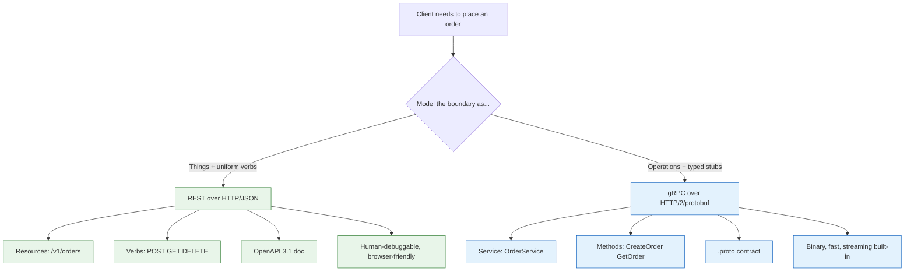

**TL;DR:** API design is the craft of writing the *contract* between a client and a server — what resources exist, what each call means, and what it returns — so that the two can evolve independently. We'll design a real "orders" REST API (resources, cursor pagination, idempotent POST, an OpenAPI doc) and contrast it with a gRPC service for the same domain. The traps that sink an API are breaking changes, missing idempotency, over/under-fetching, and version sprawl.

## 1. What API design is (and what it isn't)

An **API** is an application programming interface — the boundary a program crosses to ask another program to do something. **API design** is the work of defining that boundary as a *contract*: the named things you can act on, the operations allowed on each, the request and response shapes, the errors, and the rules for change. Get the contract right and clients and servers can ship on independent schedules; get it wrong and every server change breaks someone.

It is not "pick a framework." Whether you serve JSON over HTTP or binary over HTTP/2, the design questions are the same: what is a resource, what is an operation, what is safe to retry, and how do we change it later without breaking the world. The two dominant styles we'll use are **REST** (resource-oriented, HTTP) and **gRPC** (operation-oriented, RPC), both grounded in real, published specs.

## 2. A real example: designing an "orders" API

Say we run a store and need an API so clients can create orders, list a customer's orders, and fetch one. We'll design it as REST first, then as gRPC.

**Resources and the uniform interface.** The core resource is an order, addressed under a collection:

- `POST /v1/orders` — create an order (not idempotent by default).
- `GET /v1/orders/{id}` — fetch one order (safe, cacheable).
- `GET /v1/orders?customer_id=42&cursor=...` — list orders (safe, paginated).
- `DELETE /v1/orders/{id}` — cancel an order (idempotent).

**Cursor pagination.** Deep offset pagination (`?offset=10000`) forces the database to scan and discard ten thousand rows and drifts if rows are inserted mid-walk. We use a cursor instead — an opaque token encoding the last seen `(created_at, id)` sort key:

```http
GET /v1/orders?customer_id=42&limit=20&cursor=eyJjcmVhdGVkX2F0IjoiMjAyNi0wOC0xMCJ9
```

The server returns the page plus a `next_cursor` the client passes to get the following page. Inserts no longer shift the window, and lookup stays an index seek at any depth.

**Idempotent POST via a client key.** Networks drop requests, so a client that retries `POST /v1/orders` after a timeout can create two orders. We let the client send an idempotency key:

```http
POST /v1/orders
Idempotency-Key: 9f1c2b3a-7e4d-4a8b-9c6e-1f2a3b4c5d6e
Content-Type: application/json

{ "customer_id": 42, "items": [ { "sku": "ABC", "qty": 2 } ] }
```

The server stores the key with the result; a replay with the same key returns the original `201 Created` response instead of making a second order. This is the mechanism that makes an otherwise non-idempotent method safe to retry.

**The OpenAPI contract.** The whole thing is captured in an OpenAPI 3.1 document (the format maintained at OAI/OpenAPI-Specification), which is the single source of truth both sides code against:

```yaml
openapi: 3.1.0
info:
  title: Orders API
  version: 1.0.0
paths:
  /v1/orders:
    post:
      operationId: createOrder
      parameters:
        - name: Idempotency-Key
          in: header
          required: true
          schema: { type: string, format: uuid }
      requestBody:
        required: true
        content:
          application/json:
            schema:
              $ref: '#/components/schemas/OrderCreate'
      responses:
        '201':
          description: Order created
          content:
            application/json:
              schema: { $ref: '#/components/schemas/Order' }
        '409':
          description: Idempotency key reused with different body
components:
  schemas:
    OrderCreate:
      type: object
      required: [customer_id, items]
      properties:
        customer_id: { type: integer }
        items:
          type: array
          items:
            type: object
            required: [sku, qty]
            properties:
              sku: { type: string }
              qty: { type: integer, minimum: 1 }
    Order:
      type: object
      required: [id, customer_id, status, created_at]
      properties:
        id: { type: string }
        customer_id: { type: integer }
        status: { type: string, enum: [pending, shipped, cancelled] }
        created_at: { type: string, format: date-time }
```

From this one file, tooling generates server stubs, typed client SDKs, and mock servers — and contract tests can verify the running service still matches it.

**The same domain as gRPC.** With gRPC (from grpc/grpc), we describe the service in a `.proto` and let `protoc` generate the stubs. Note the shape is operation-oriented, not resource-oriented:

```protobuf
syntax = "proto3";

package orders.v1;

service OrderService {
  rpc CreateOrder(CreateOrderRequest) returns (Order);
  rpc GetOrder(GetOrderRequest) returns (Order);
  rpc ListOrders(ListOrdersRequest) returns (stream Order);
}

message CreateOrderRequest {
  string idempotency_key = 1;
  int64  customer_id = 2;
  repeated OrderItem items = 3;
}

message OrderItem { string sku = 1; int32 qty = 2; }

message GetOrderRequest { string id = 1; }

message ListOrdersRequest {
  int64  customer_id = 1;
  int32  limit = 2;
  string cursor = 3;
}

message Order {
  string id = 1;
  int64  customer_id = 2;
  string status = 3;
  string created_at = 4;
}
```

The `ListOrders` RPC returns `stream Order` — this is **server-streaming**, meaning the client sends a single request and receives a stream of `Order` responses back (one per page), not bidirectional streaming. The server pushes pages over one HTTP/2 stream, which is the gRPC-native answer to pagination and long-polling.

## 3. How REST and gRPC differ

The orders example already shows the fork in the road. REST models **things** you act on with a small uniform set of verbs; gRPC models **operations** you call directly. That difference drives everything else:



- **Contract shape.** REST's contract is the URL space plus an OpenAPI doc; gRPC's contract *is* the `.proto`. Both are machine-readable, but gRPC's is enforced at compile time by generated code.
- **Transport and payload.** REST usually rides HTTP/1.1 with JSON; gRPC rides HTTP/2 with protobuf — smaller, faster, and multiplexed, with deadlines and cancellation as first-class.
- **Streaming.** gRPC gives server/client/bidirectional streaming from the schema; REST needs SSE, websockets, or webhooks bolted on.
- **Ecosystem.** REST wins on debuggability and universal client support (any HTTP tool works); gRPC wins inside a backend where typed stubs and performance matter. Google's API Design Guide recommends gRPC for internal service-to-service and a REST/OpenAPI facade for external clients — many systems do both.

## 3b. Authentication and authorization

No API ships without locking the door. Production APIs need an auth story — who is the caller, what are they allowed to do — and the OpenAPI contract is where you declare it. The three dominant mechanisms are **API keys** (a static secret for service-to-service identity), **JWTs** (signed tokens carrying user identity and claims, verified statelessly), and **OAuth2** (a delegation framework where the user authorizes a third-party client to act on their behalf via access tokens).

```yaml
components:
  securitySchemes:
    bearerAuth:
      type: http
      scheme: bearer
      bearerFormat: JWT
security:
  - bearerAuth: []
```

This snippet tells every client that a valid `Authorization: Bearer <token>` header is required — tooling and SDK generators enforce it automatically. API keys are simplest for server-to-server calls where the caller is a known service; JWTs carry rich, self-contained claims so the API stays stateless; OAuth2 adds a consent and delegation layer for third-party access without sharing passwords.

## 4. What breaks: the traps that sink an API

This is the part to internalize before you publish anything.

**Breaking changes hide in "harmless" edits.** Removing a JSON field, renaming it, tightening a type from `string` to `integer`, or changing a `200` to a `201` all break clients that were coded against the old shape. Because the OpenAPI schema *is* the contract, a change there should be reviewed as a compatibility decision, not a free edit. The safe move is additive-only on a live version and a new version for anything subtractive.

**Structured error responses** make failures debuggable. When an order fails because the account is short on funds, returning a free-text string like `"Insufficient funds"` is useless to tooling. RFC 7807 Problem Details defines a standard shape for this:

```json
{
  "type": "https://api.example.com/errors/insufficient-funds",
  "title": "Insufficient Funds",
  "status": 422,
  "detail": "Account balance is $42.00, order total is $97.00",
  "instance": "/orders/abc-123"
}
```

The `type` URI is a stable, machine-readable identifier the client can branch on; `status` mirrors the HTTP code; `detail` carries the human explanation. Adopting this format replaces a dozen ad-hoc error shapes with one contract.

**Missing idempotency turns retries into duplicates.** Without an idempotency key or an idempotent method, a client that times out and retries `POST` creates a second order, a second charge, a second shipment. This is the single most common correctness bug in payment and order APIs, and it only appears under real network failure, never in a happy-path test.

**Over-fetching and under-fetching waste the contract.** A "get customer" endpoint that returns the full order history for every profile view is over-fetching — the client downloads megabytes it ignores. An endpoint that returns only an ID, forcing the client to call `GET /order` per item, is under-fetching — the infamous N+1 call explosion. Good design lets the client ask for the shape it needs (field selection or a GraphQL-style projection) or at least scopes collections sensibly.

**Version sprawl kills maintainability.** Versioning in the URL (`/v1`, `/v2`, `/v3`...) is easy to start and hard to end: every version is code you must keep running, testing, and securing forever. Without a deprecation policy (a `Sunset` header, a notice window), versions pile up. The discipline is: version only on a real breaking change, deprecate aggressively, and delete old versions on a schedule.

## 5. What to care about when designing APIs

If you take one thing from this post: **treat the contract as a published promise, design for the failure case first, and version only when you actually break something.**

- **Model resources before verbs** for external APIs; reach for gRPC operations when you need typed, high-throughput internal calls (Google's API Design Guide is the reference for both).
- **Make writes safe to retry** with idempotency keys or idempotent methods; assume the network drops things.
- **Paginate with cursors** for any collection that grows, and let clients filter and sort server-side.
- **Write the OpenAPI (or `.proto`) first** and generate from it — the doc is the contract, not an afterthought.
- **Define a deprecation policy** with `Sunset` headers and a minimum notice window so versions don't sprawl.
- **Watch the payload shape** to avoid over- and under-fetching; scope collections and consider field selection.

## Review checklist

- [ ] Resources are named as nouns under collections; operations use the right HTTP verb (safe vs idempotent vs neither).
- [ ] Every state-changing call is safe to retry (idempotency key or idempotent method).
- [ ] Collections paginate with cursors and support server-side filtering/sorting.
- [ ] An OpenAPI 3.1 (or `.proto`) document is the source of truth and is generated from, not written by hand after the fact.
- [ ] Changes are reviewed for backward compatibility; breaking changes get a new version plus a deprecation plan.
- [ ] Payload shapes avoid both over-fetching and N+1 under-fetching.

## FAQ

**Should I use REST or gRPC?** For external, browser-facing, or partner APIs, REST with OpenAPI is the pragmatic default — universal tooling and debuggability. For internal service-to-service calls where performance, streaming, and typed stubs matter, gRPC shines. Many systems expose gRPC internally and a REST/OpenAPI gateway externally, following Google's API Design Guide.

**Is adding a new optional JSON field really safe?** Yes, if clients ignore unknown fields (the JSON norm) and you don't change an existing field's type or meaning. That additive-only rule is the backbone of backward compatibility — but a new *required* field or a renamed field is breaking.

**Why not just put the version in a header instead of the URL?** You can (header or media-type versioning both exist), and media-type versioning is the most REST-pure. URL versioning wins on simplicity and debuggability — you can see and share the version in the path, and browser/dev-tools testing just works. Pick one and apply it consistently.

**Where do I go next?** The deeper posts take each concern one at a time — start with the shared vocabulary in [API Design Key Terms]({{ '/api-design/api-design-key-terms/' | relative_url }}).

## Source

Specs and repositories this post is grounded in: the [OpenAPI Specification](https://github.com/OAI/OpenAPI-Specification) (OAI/OpenAPI-Specification, currently 3.1) for the REST contract format; Google's [API Design Guide](https://cloud.google.com/apis/design) for resource-vs-RPC modeling and versioning guidance; and [grpc/grpc](https://github.com/grpc/grpc) with Protocol Buffers for the RPC and `.proto` contract. The orders example is a composite illustration built to match these real specifications.

## Next in the series

→ [API Design Key Terms: REST, gRPC, and the Contract Vocabulary]({{ '/api-design/api-design-key-terms/' | relative_url }})
