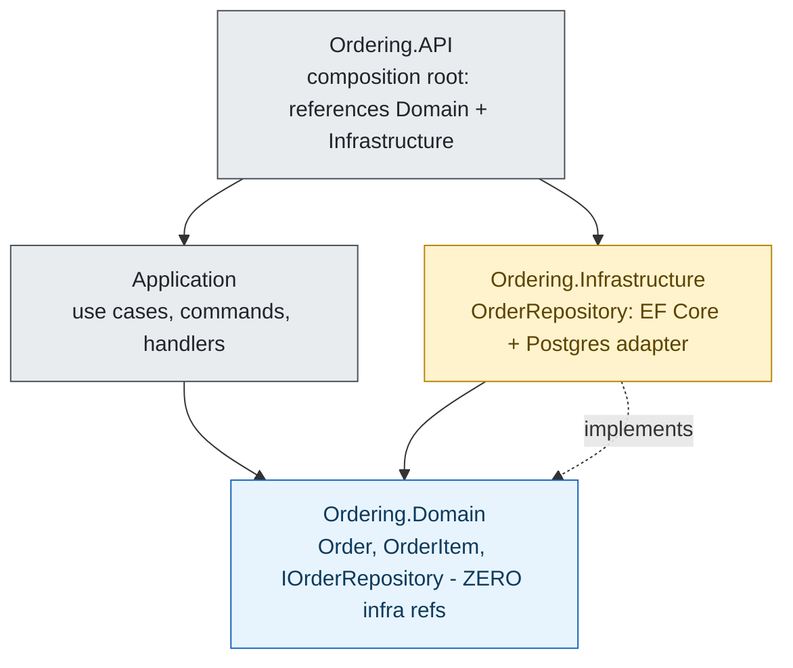

**TL;DR:** Architecture is not the boxes-and-arrows picture you draw — it's the *direction* your compile-time dependencies point and *where* you let them cross a boundary. Microsoft's real **dotnet/eShop** Ordering service proves it: three projects where `Ordering.Domain` references nothing else, `Ordering.Infrastructure` references `Domain`, and the API wires them — so the database can be swapped without touching business logic.
> **In plain English (30 sec):** Think of this like concepts you already use, but in a production system at scale.


## 1. What "architecture" actually means

A diagram is a *view* of a system; the architecture is the set of rules that make the system hold together when someone edits it six months from now. The single rule that matters more than any other:

> **Dependencies point inward, toward business logic — never outward, toward frameworks or infrastructure.**

If you remember nothing else, remember that. "Layered," "hexagonal," and "clean" are just three different stories about *how far inward* the dependencies point and *how hard* the boundary is enforced. They are not competing religions; they are the same dependency rule at different strengths.

A diagram can show arrows in any direction you like. The compiler, however, only lets an arrow exist if a project or package reference exists. So the real architecture is what the `<ProjectReference>` (or `import`, or `require`) lines in your build files actually say — not what your whiteboard claims.

## 2. A real example: dotnet/eShop's Ordering service

[dotnet/eShop](https://github.com/dotnet/eShop) is Microsoft's actively maintained .NET microservices reference app. Its **Ordering** service is split into three projects. This is the real, current compiled dependency graph — not a stylized picture:



Read the arrows as "depends on at compile time." Two facts jump out:

- **`Ordering.Domain` has no arrow leaving it.** It references nothing else in the solution — no EF Core, no Postgres, no API. That is the literal proof that business logic cannot reach out to infrastructure even by accident.
- **`Ordering.Infrastructure` points *at* `Domain`, not the reverse.** The runtime call flows Domain → persistence, but the *compiled* reference points the other way. That inversion is the whole trick.

The seam is a single interface, declared in the domain and implemented in infrastructure:

```csharp
// Ordering.Domain — the contract lives HERE, with the business logic that needs it
public interface IOrderRepository
{
    Order Add(Order order);
    Task<Order> GetAsync(int orderId);
}

// Ordering.Infrastructure — the only project that knows HOW persistence works
public class OrderRepository : IOrderRepository
{
    public async Task<Order> GetAsync(int id) => await _context.Orders.FindAsync(id);
}
```

The API project is the **composition root**: it references both and wires the concrete type to the interface in one place (`services.AddScoped<IOrderRepository, OrderRepository>()`). That single line is the only spot in the entire system that knows both "what the domain needs" and "which database satisfies it."

## 3. Layered vs hexagonal vs clean — same rule, different enforcement

These three styles are often taught as if they were unrelated. They are one idea with tightening boundaries.

**Layered (N-tier):** Presentation → Application → Domain → Infrastructure, each talking to the one below. The textbook version says Domain depends on Infrastructure — which is *wrong*, because then your core business logic gets a compile reference to the database. The fix is to let Domain *declare* the interface it needs and Infrastructure implement it, so the compiled arrow points inward. (Deep dive in the next post.)

**Hexagonal (ports & adapters):** Same inward rule, but the boundary is enforced by a *project/assembly wall*, not a folder name. The domain project's `.csproj` simply has no reference to the infrastructure package, so `using Microsoft.EntityFrameworkCore;` inside domain code fails to compile. The interface is a **port** (domain's vocabulary); the implementation is an **adapter** (the technology).

**Clean:** The dependency rule of hexagonal, plus a layout decision — business logic is organized by *use case* (a command + handler + validator together) rather than by technical folder (`Controllers/`, `Services/`). Its sharpest rule: the Application layer may reference a base, provider-agnostic ORM package to describe `DbSet<T>`, but never a concrete *provider* package — so swapping Postgres for SQL Server touches only Infrastructure.

The through-line: **all three keep business logic free of framework and database knowledge by pointing dependencies inward.** Hexagonal and Clean just make the boundary mechanically checkable instead of a code-review hope.

## 4. Why it's about dependencies and boundaries, not diagrams

A diagram of eShop's Ordering service could be drawn with Infrastructure at the bottom and Domain on top, arrows flowing "down." That picture is *conceptually* true but *mechanically* misleading: the compiled reference from Infrastructure to Domain points "up." If you architect from the picture alone, you'll believe Domain depends on the database and you'll let someone import EF Core into a domain class "because the diagram says Infrastructure is below."

The boundary is what stops that. A boundary is real only when something *enforces* it:

- A **project/package reference list** that omits the infrastructure package (compiler-enforced — the strongest).
- An **architecture test** (e.g. ArchUnit) that fails the build if a layer rule is broken.
- At minimum, a **convention** documented and reviewed — the weakest, and the first to break under deadline pressure.

This is why "architecture" and "diagram" diverge: the diagram is what you *intend*; the dependency graph is what you *built*. Architecture is the discipline of making the second match the first.

## 5. What breaks / what to care about

- **Dependency cycles.** If Domain references Infrastructure and Infrastructure references Domain, nothing is at the center — change one and you must change the other. The inward rule exists to prevent exactly this.
- **Business logic leaking into controllers.** When an `Order` validation rule lives in the API controller instead of the domain, you can't reuse or unit-test that rule without an HTTP stack. Logic belongs with the model that owns it.
- **Frameworks dictating structure.** Letting ASP.NET, EF Core, or a messaging library shape your namespaces and layering bakes the framework into your core. The composition root should be the *only* place that knows about them.
- **The "interface in the wrong project" trap.** An interface living in a project that *also* references the database package still lets infrastructure types leak into domain code next to it. The interface must live in the project that has no infrastructure reference at all.

## Review checklist

- [ ] Dependencies point inward toward the domain; no project at the center references a framework or database package.
- [ ] The interface a capability needs is declared by its *consumer* (the domain), not its provider.
- [ ] The composition root is the only place that knows both the abstraction and its concrete implementation.
- [ ] The boundary is enforced by the build (a restricted reference list or an architecture test), not only by review.
- [ ] Business logic runs and is unit-testable with zero infrastructure in its dependency graph.

## FAQ

**Isn't "layered" enough — why do I need hexagonal or clean?** Layered is enough *conceptually*; it fails *mechanically* because a folder named `Domain` can still reference a database package and compile. Hexagonal and Clean move the boundary from a naming hope to a project/assembly wall the compiler enforces. Use the stricter style when you actually need to swap adapters or test core logic without infrastructure.

**How do I know if my architecture is real or just a diagram?** Open the build files. If the central project's reference list is empty of frameworks and databases, the architecture is real. If the only thing enforcing the boundary is a README or a review comment, it's a picture waiting to be violated.

**Where do I start reading next?** The series takes this one rule and applies it to each style — begin with the limits of the simplest one: [Layered (N-Tier) Architecture]({{ '/architecture/layered-n-tier-architecture-and-its-limits/' | relative_url }}).

## Source

Example project graph and `IOrderRepository` seam from Microsoft's real [dotnet/eShop](https://github.com/dotnet/eShop) reference application — specifically `src/Ordering.Domain/Ordering.Domain.csproj` (zero infrastructure references), `src/Ordering.Infrastructure/Ordering.Infrastructure.csproj` (references Domain), and `src/Ordering.Domain/AggregatesModel/OrderAggregate/IOrderRepository.cs` (the contract declared at the domain layer).

## Next in the series

→ [Layered (N-Tier) Architecture]({{ '/architecture/layered-n-tier-architecture-and-its-limits/' | relative_url }})


