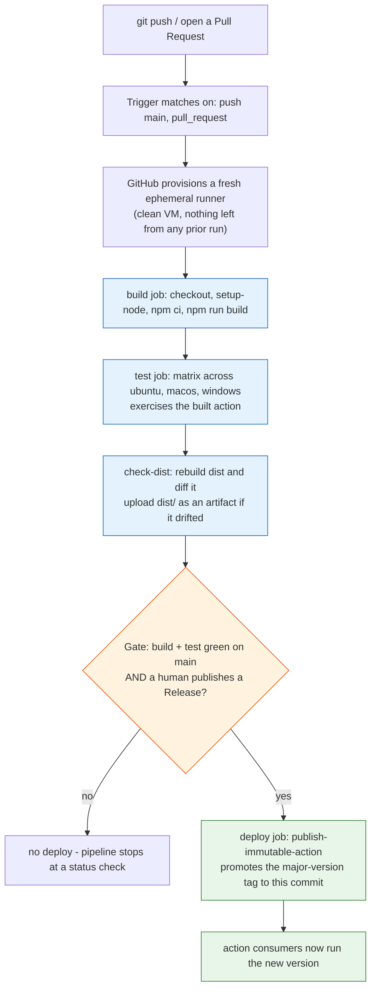

**TL;DR:** CI/CD is automation that turns "someone built and tested it on their laptop" into "a clean machine built, tested, and shipped it the same way for every change." GitHub's own [`actions/checkout`](https://github.com/actions/checkout) is a perfect worked example — three real workflows that *build*, *test*, and *deploy* (publish) the action, and together they show exactly what a trigger, runner, job, step, cache, artifact, and deploy gate each do.

## 1. What CI/CD is (and what it isn't)

**CI** (Continuous Integration) is the rule that every change gets built and tested automatically, in a clean environment, before it can merge. **CD** (Continuous Delivery/Deployment) extends that: once the build and tests are green, the same automation can *ship* the result — to a registry, a host, or a release — without a human repeating the steps by hand.

The thing it replaces is manual, inconsistent, and forgettable:

- Build on your machine, copy the binary somewhere, hope the version of the SDK matches what's on the server.
- "Run the tests" means "whoever remembers to." A broken change lands on `main` and is only found when the *next* person pulls.
- Deploy means a person clicking through a console or pasting a command, at 5pm, slightly differently than last time.

CI/CD isn't a product you buy; it's a pipeline — a declared sequence of steps that runs on every change. The win is that the *machine* runs the same gate every time, so "it's green" means something a local "it built for me" never can.

## 2. A real example: actions/checkout

[`actions/checkout`](https://github.com/actions/checkout) is the action nearly every workflow uses to clone a repo. It is itself a TypeScript project built, tested, and published through GitHub Actions — so it's a real, public, and simple pipeline to learn from. Three workflows do the three jobs:

- **`test.yml`** → the **build** and **test** gate (runs on every PR and push to `main`).
- **`check-dist.yml`** → rebuilds the compiled `dist/` and, on drift, **uploads it as an artifact**.
- **`publish-immutable-actions.yml`** → the **deploy**: publishes the immutable major-version tag when a human cuts a Release.

Here is the shape of the whole thing, with the gate made explicit:



Read the flow top to bottom: a commit triggers a clean runner, which builds, tests across three OSes, double-checks the committed build output, and then *only* deploys when a human publishes a release. The gate is the whole point — automation does the work, but a human still owns the "ship it" decision.

## 3. How the pieces actually work

**Trigger (`on:`).** This decides *when* the pipeline runs. In `test.yml` it's `pull_request:` plus `push: branches: [main, releases/*]` — the PR is the pre-merge gate; the push-to-main re-validates after merge, catching two individually-fine PRs that combine into a broken `main`. The deploy workflow triggers on `release: [published]`, which is what makes it a gate rather than a firehose.

**Runner (`runs-on: ubuntu-latest`).** The ephemeral VM GitHub spins up for a job. It starts from a known-clean image every single run — that clean slate is what makes "passed CI" trustworthy. `test.yml` runs the `test` job as a matrix across `ubuntu-latest`, `macos-latest`, and `windows-latest`, because an action that clones a repo must behave identically on all three.

**Job vs step.** A **job** is a unit of isolation: it gets its own runner, its own filesystem, and runs (by default) in parallel with other jobs. A **step** is one command or action inside a job — `npm ci`, `npm test`, or `uses: actions/checkout@v7`. Steps in one job share a runner; jobs do not share anything, which is exactly why artifacts and job outputs exist (covered later in the series).

Here is the real `build` job, trimmed:

```yaml
# .github/workflows/test.yml  (actions/checkout) - real, trimmed
name: Build and Test
on:
  pull_request:
  push:
    branches: [main, releases/*]

jobs:
  build:
    runs-on: ubuntu-latest
    steps:
      - uses: actions/setup-node@v6
        with:
          node-version: 24.x
      - uses: actions/checkout@v7
      - run: npm ci
      - run: npm run build
      - run: npm run format-check
      - run: npm run lint
      - run: npm test
```

**Why you cache.** `npm ci` reinstalls from the lockfile every run, which is *reproducible* but re-downloads dependencies each time. Caching restores the dependency store keyed on a hash of the lockfile, so an unchanged `package-lock.json` skips the download entirely:


```yaml
# Companion to npm ci: restore the npm store from a lockfile-keyed cache
- uses: actions/cache@v4
  with:
    path: ~/.npm
    key: npm-${{ hashFiles('package-lock.json') }}
    restore-keys: |
      npm-
```


The primary key changes exactly when dependencies change; the `restore-keys` fallback restores the closest older cache so the first run after a dependency bump is still incremental, not a cold miss.

**Why you artifact.** Job outputs only carry small strings — a version, a flag. They cannot carry a real file like the compiled `dist/`. `actions/upload-artifact` ships actual files to GitHub's storage so a later job (or a human debugging a failure) can fetch them. `check-dist.yml` does exactly this — it rebuilds `dist/`, diffs it against what's committed, and on drift uploads the expected `dist/` for inspection:


```yaml
# .github/workflows/check-dist.yml  (actions/checkout) - real
      - name: Rebuild the index.js file
        run: npm run build
      - name: Compare the expected and actual dist/ directories
        run: |
          if [ "$(git diff --ignore-space-at-eol dist/ | wc -l)" -gt "0" ]; then
            echo "Detected uncommitted changes after build."
            exit 1
          fi
      - uses: actions/upload-artifact@v7
        if: ${{ failure() && steps.diff.conclusion == 'failure' }}
        with:
          name: dist
          path: dist/
```


**The deploy stage.** An action's users run the compiled `dist/index.js`, not the TypeScript source — so "deploying" the action means promoting its major-version pointer (`v4`, `v5`, …) to the released commit. That's what `publish-immutable-actions.yml` does, and it only fires on `release: published`:

```yaml
# .github/workflows/publish-immutable-actions.yml  (actions/checkout) - real
name: Publish Immutable Action Version
on:
  release:
    types: [published]

jobs:
  publish:
    runs-on: ubuntu-latest
    permissions:
      contents: read
      id-token: write
      packages: write
    steps:
      - uses: actions/checkout@v7
      - name: Publish
        uses: actions/publish-immutable-action@v0.0.4
```

Note `permissions:` scopes the token to the minimum the job needs — principle of least privilege, and the `id-token: write` is there for the OIDC federation the publish action uses to authenticate without a long-lived secret.

## 4. Why CI/CD exists: fast, repeatable, safe

- **Fast.** Every commit gets the same build and test in minutes, with no human in the loop acting as gatekeeper. The slow, error-prone manual handoff disappears.
- **Repeatable.** The steps run in an identical clean environment for everyone, on every change — so "green on my machine" stops being the unit of truth and "green in CI" becomes it.
- **Safe.** A red build or a failed test *blocks the merge or the deploy* by policy (branch protection, required status checks), and the deploy itself is gated behind that green state plus an explicit human release. Bad changes stop early, and a bad deploy is a traffic-shift away from rollback, not a reinstall.

## 5. What breaks: the failure modes to watch

**Flaky tests blocking releases.** A test that fails 1-in-20 runs for reasons unrelated to the code turns the pipeline into noise — engineers start "re-running until green," which quietly lets real failures through. Quarantine or fix flaky tests; never train the team to ignore them.

**Secrets in logs.** A `run:` step that prints an env var, or a tool that echoes a token in verbose mode, leaks credentials into logs anyone with repo read access can see. Use masked secrets, avoid `-v`/debug on secret-bearing steps, and rotate anything that ever touched a log.

**Unpinned actions.** `uses: actions/checkout@main` (or a moving tag) means a third-party change can alter your pipeline without a PR on *your* repo. The `v7`/`v6` major tags here are semi-pinned; full hardening pins to a commit SHA so the code can't drift under you.

**No rollback.** If the only path forward is "deploy the next fix," a bad release is an outage until you write one. A deploy stage should assume rollback from day one — whether that's a previous immutable tag, a previous Cloud Run revision, or a redeploy of the last-known-good artifact.

## 6. What to care about when designing a pipeline

- **Scope triggers** so docs-only or out-of-scope changes don't burn a runner on a gate they can't fail.
- **Keep jobs isolated and parallel** where they don't share state; use artifacts only to pass real files across the job boundary.
- **Cache by a lockfile hash**, not a fixed key, so restores are exact when deps are stable and incremental when they change.
- **Gate the deploy** behind green tests *and* an explicit human signal (a release, an environment approval) — automation does the work, a person owns the ship.
- **Pin actions and scope `permissions:`** to the minimum; treat the workflow as code that can be abused, not trusted by default.

## Review checklist

- [ ] A trigger fires on PR (pre-merge gate) and on push to `main` (post-merge re-validation).
- [ ] Build and test run on a clean, ephemeral runner — no leftover state from prior runs.
- [ ] Dependencies are cached by lockfile hash; real build outputs cross job boundaries as artifacts, not job outputs.
- [ ] The deploy stage runs only behind a green gate plus an explicit human release/approval.
- [ ] Actions are pinned (SHA ideally) and the deploy job's `permissions:` are least-privilege.

## FAQ

**Is CI/CD only for big teams or cloud deploys?** No. A single-person repo benefits just as much: the pipeline is your tireless reviewer that builds and tests on every push, and "deploy" can be publishing a library, pushing a container, or updating a static site. The mechanics are identical at any scale.

**Why is the deploy in a separate workflow, not the same file as build/test?** Because they should fail independently and trigger on different events. Build/test must run on every PR; deploy must run only on a deliberate release. Putting them in one file blurs that gate and tempts "deploy on every push," which is how bad changes reach users automatically.

**What's the difference between an artifact and a cache?** A cache is a speed optimization — restored dependency stores you'd otherwise re-download, and it can miss safely. An artifact is a *deliverable* — the built `dist/`, a binary, a coverage report — uploaded so a later job or a human can retrieve the exact file the build produced. One saves time; the other carries product.

## Source

Pipelines and terminology grounded in the real, currently-active GitHub Actions workflows of [`actions/checkout`](https://github.com/actions/checkout):
- [`test.yml`](https://github.com/actions/checkout/blob/main/.github/workflows/test.yml) — build + test matrix (the CI gate).
- [`check-dist.yml`](https://github.com/actions/checkout/blob/main/.github/workflows/check-dist.yml) — rebuild `dist/` and upload it as an artifact on drift.
- [`publish-immutable-actions.yml`](https://github.com/actions/checkout/blob/main/.github/workflows/publish-immutable-actions.yml) — publish the immutable action version on Release (the CD/deploy stage).

## Next in the series

→ [CI Fundamentals: What Happens Between git push and a Green Check]({{ '/cicd/ci-fundamentals-from-manual-builds-to-pipelines/' | relative_url }})


