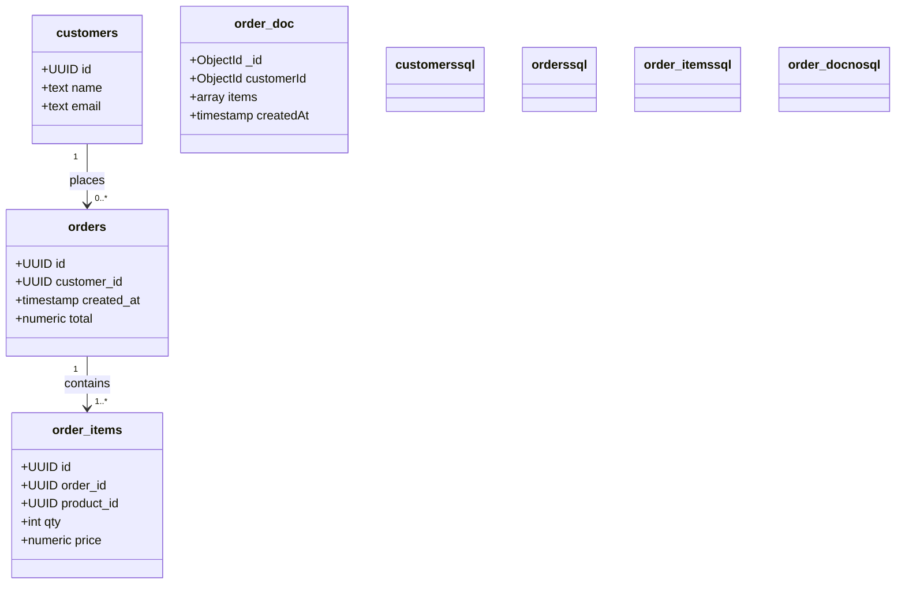
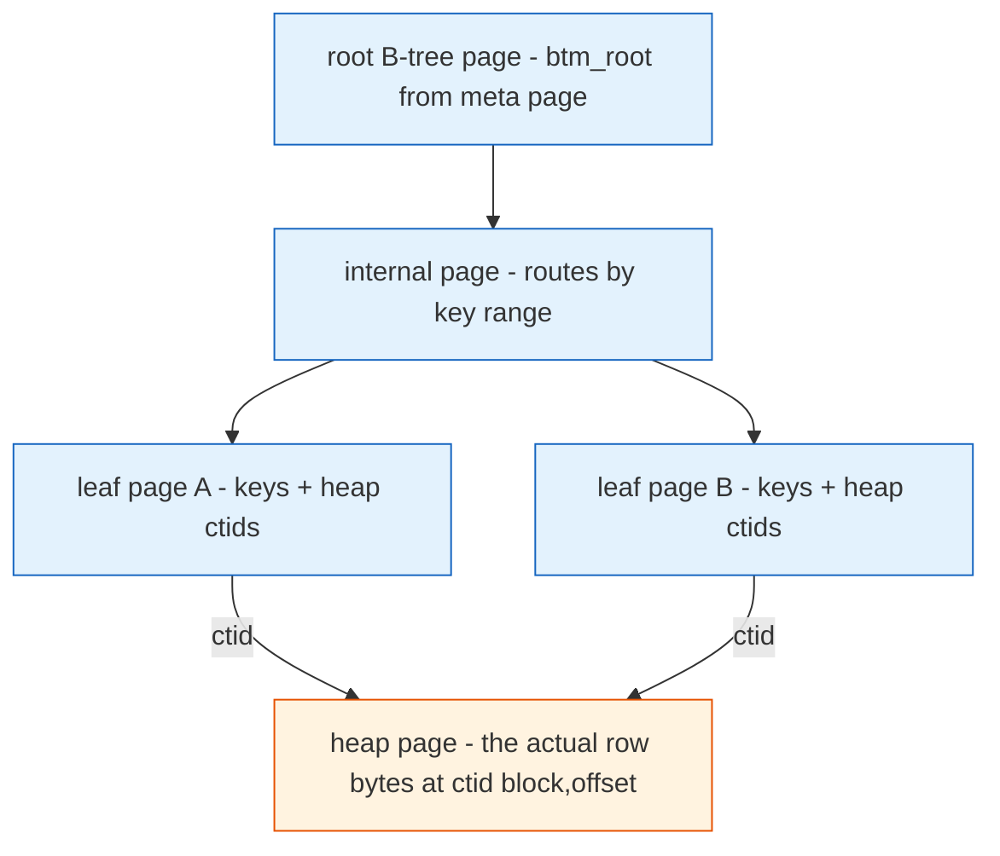

**TL;DR:** A database is a storage engine that decides how your data sits on disk and how you find it again — and that one decision drives every other choice. Build an e-commerce order schema in Postgres (normalized, joined) versus MongoDB (embedded document), see that an index is a **B-tree of pages** mapping a key to a row's physical address, and watch why two concurrent writers without a transaction produce a **lost update**. The storage engine is the floor everything else stands on.

## 1. What is a database (and what it isn't)

A **database** is not "a place to put data." It is a specific engine that decides three things: how a record is physically laid out on disk, how it is found again without scanning everything, and what happens when two people write at the same time. Pick the engine and you have already picked your query shape, your scalability ceiling, and your failure modes.

The two families people actually mean by "SQL vs NoSQL" are:

- **Relational (SQL)** — Postgres, MySQL: data split into small **normalized** tables connected by foreign keys; the engine reassembles the full picture with **JOIN**s at query time. Strong, well-defined guarantees about concurrent writes (ACID).
- **Document / NoSQL** — MongoDB: data stored as self-contained **documents** that embed related data; reads of one object are fast and single-shot, but cross-document relationships are your problem to assemble, often in application code.

The mistake is thinking this is a *syntax* difference. It is a *physical layout and distribution* difference, and it shows up the moment you model real data.

## 2. A real example: an e-commerce order

Imagine a shop where a customer places orders, and each order has line items. Here is the shape of the data, modeled both ways:



**SQL (Postgres)** splits the data into three tables and reconnects them with foreign keys. The same order is three physical writes, but any question — "all items in order X," "every order for customer Y" — is a declarative `JOIN`:

```sql
CREATE TABLE customers (id UUID PRIMARY KEY, name text, email text);
CREATE TABLE orders (
    id UUID PRIMARY KEY,
    customer_id UUID REFERENCES customers(id),
    created_at timestamptz,
    total numeric
);
CREATE TABLE order_items (
    id UUID PRIMARY KEY,
    order_id UUID REFERENCES orders(id),
    product_id UUID,
    qty int,
    price numeric
);
```

**NoSQL (MongoDB)** embeds the items inside the order document and declares a shard key so the engine knows which physical node owns it:

```javascript
db.orders.insertOne({
    _id: "order-123",
    customerId: "buyer-42",
    createdAt: new Date(),
    items: [ { productId: "p-9", qty: 2, price: 19.99 } ]
});
sh.shardCollection("shop.orders", { customerId: 1 }); // customerId drives chunk placement
```

Both store the same business fact. They differ in *what a read costs* and *what the engine guarantees when two writes collide*.

## 3. What an index actually does (it's a B-tree, not magic)

Without an index, finding a customer's orders means reading **every row** of the `orders` table off disk and discarding the ones that don't match — a sequential scan. That is fine at 100 rows and unusable at 100 million.

An index fixes this by being a **B-tree** — the exact same 8KB slotted-page format Postgres uses for the table itself, but storing `(key, heap ctid)` entries instead of full rows. Each leaf page holds sorted keys plus the **ctid** (`block, offset`) that points back at the actual row in the heap. A search starts at a fixed root page and descends sibling-linked pages in `O(log n)` steps instead of scanning `O(n)` rows. When a leaf page fills, `_bt_insertonpg` checks `PageGetFreeSpace(page) < itemsz` and runs `_bt_split` to make a new right sibling — synchronously, inside your `INSERT`.



The practical point: an index is only as good as its key. An unindexed `WHERE customer_id = ...` still scans the whole table; an index on `customer_id` turns that into a handful of page reads. Wide index keys eat the same fixed page-size budget as any tuple, so fewer fit per leaf page and the tree grows taller for the same row count.

## 4. Why transactions and isolation matter (the lost-update trap)

ACID is not marketing — it is the mechanism that lets two writers not destroy each other's work. Postgres enforces this with **MVCC**: every row version carries the transaction ID that created it, and a query checks that ID against a **snapshot** taken at a specific moment. Under `REPEATABLE READ`, one snapshot is frozen for the whole transaction, so a row another session committed mid-transaction stays invisible to you — that is *how* non-repeatable reads are prevented. Durability is a real, separate `fsync` of the WAL before the client is told "committed" (`synchronous_commit` gates it).

Watch the trap without a transaction. Two sessions both read a customer's balance, each adds an amount, each writes back:

```
Session A: balance = 100        Session B: balance = 100
Session A: write balance = 150  (adds 50)
Session B: write balance = 120  (adds 20)  <- A's update is GONE
```

That is a **lost update**: B overwrote A's write because neither read-then-wrote atomically. The fix is a transaction that either holds a row lock (`SELECT ... FOR UPDATE`) or runs at `REPEATABLE READ`, where Postgres detects the serialization conflict and aborts one writer so you can retry — rather than silently merging two writes into garbage.

## 5. What breaks: the beginner gotchas

This is the section to internalize before you pick a database.

**N+1 queries.** An ORM makes `order.Customer` look like a field read, but with lazy loading it quietly runs a separate `SELECT` the first time you touch it. Loop over 100 orders and access `.Customer` on each, and you fire 1 query for the orders plus 100 more — one per order — all invisible in the source. Real cause: EF Core's lazy-loading proxy intercepts the `get_Customer` getter and loads the navigation on demand (`dotnet/efcore`). Fix with eager loading / a single `JOIN`.

**Missing indexes.** Any filter or sort on a column with no index becomes a full sequential scan of the table. The database does not warn you; it just gets slower linearly as the table grows. `EXPLAIN` shows a `Seq Scan` where you expected an `Index Scan`.

**Lost updates under concurrency.** Two writers without a transaction or a row lock clobber each other (section 4). At low traffic you never see it; under real concurrency your balances, stock counts, and counters drift silently.

**Picking NoSQL, then needing joins.** Embedding items in one document is fast for "show this order." But "every order for customer Y, with item details" now requires either application-side assembly or MongoDB's `$lookup` aggregation — you traded declarative, planner-optimized `JOIN`s for code you maintain. Choose the model for your dominant read shape, not for fashion.

## 6. What to care about when choosing a database

If you take one thing from this post: **the storage engine's layout and concurrency model are the floor; every query, join, and scaling trick stands on them.**

- **Model for your dominant read, not your writes.** If you mostly fetch one whole object, embed (document). If you ask many cross-cutting questions, normalize (relational).
- **Treat the index as the query plan.** No index on a filtered column means a scan; choose index keys by the queries you actually run.
- **Wrap concurrent reads-and-writes in a transaction** with an isolation level you understand, or accept lost updates.
- **Know your engine's durability knob.** "Committed" is not always "on disk" — Postgres's `synchronous_commit = off` trades guaranteed durability for latency; know which you have.

## Review checklist

- [ ] The data model (normalized tables vs embedded documents) matches the dominant read pattern, not a trend.
- [ ] Every column/field you filter or sort on in hot queries has a real index behind it.
- [ ] Any code that reads-then-writes shared state (balances, counts) runs inside a transaction or takes a row lock.
- [ ] Queries that loop over N rows don't each trigger a hidden extra query (N+1).
- [ ] You know whether "committed" in your config means "durable on disk" or "will be, eventually."

## FAQ

**Is NoSQL faster than SQL?** Not categorically. A document read of one embedded object avoids a JOIN and can be faster for that shape; but relational engines with proper indexes and the query planner are faster for ad-hoc, multi-way questions. The speed difference comes from the data model matching the access pattern, not the label.

**If indexes make lookups fast, why not index everything?** Every index is a B-tree that must be updated on every `INSERT`/`UPDATE`/`DELETE`, and it consumes page space (wider keys mean fewer entries per leaf page and a taller tree). More indexes = slower writes and more disk. Index the queries you run, not the columns that exist.

**Does a transaction always prevent lost updates?** Only if it actually scopes the read-modify-write. `READ COMMITTED` without a lock can still lose an update between your read and write; `REPEATABLE READ` or `SELECT ... FOR UPDATE` is what makes the race safe by either serializing the conflict or locking the row.

## Source

- **SQL storage engine, B-tree index pages, ctid addressing, MVCC visibility, and the `synchronous_commit` durability gate:** [postgres/postgres](https://github.com/postgres/postgres) — `src/include/storage/bufpage.h`, `src/backend/access/nbtree/nbtinsert.c`, `src/backend/access/transam/xact.c`, and the MVCC visibility path in `heapam.c`.
- **Document model and shard-key-driven physical placement:** [mongodb/mongo](https://github.com/mongodb/mongo) — `extractShardKeyFromDoc` and the `config.chunks` `{min, max, shard}` format.
- **N+1 queries via lazy-loading interception:** [dotnet/efcore](https://github.com/dotnet/efcore) — `LazyLoadingInterceptor`.

## Next in the series

→ [Database Storage Engine: How Postgres Turns a Row Into a Page, a Line Pointer, and a B-Tree Entry]({{ '/databases/database-storage-engine-page-heap-btree-layout/' | relative_url }})


