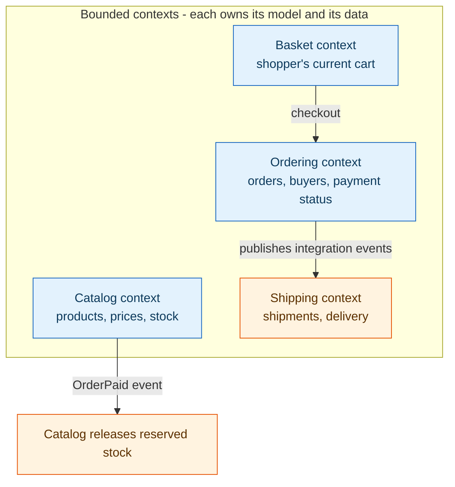
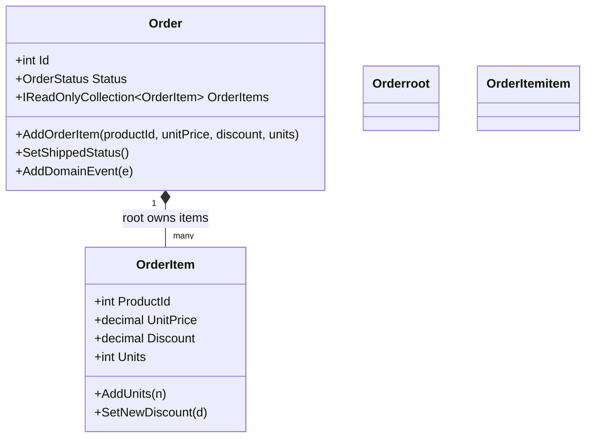

**TL;DR:** DDD is a set of patterns for writing software whose structure mirrors the business's own language and boundaries — `Order.AddOrderItem()` instead of `UPDATE order_items`. Microsoft's real **dotnet/eShop** reference app is the perfect worked example: it splits an e-commerce system into bounded contexts (Catalog, Ordering, Shipping…), each owning its own model and data, and it enforces business rules inside aggregates rather than in scattered service code. The hard part isn't the patterns; it's resisting the pull to model the database tables and let the domain logic leak everywhere.

> **In plain English (30 sec):** Code you already write — Map, function, API call, just bigger.

## 1. What is Domain-Driven Design (and what it isn't)

A **data-driven** design starts from the schema: tables, columns, and foreign keys, with logic sprinkled across services and controllers that read and write those tables. A **domain-driven** design starts from the business: the words people in the company actually use, the rules an order must obey, and the boundaries between distinct areas of the business — then shapes the code so those things are explicit and enforceable.

The win is a model that *speaks the business's language* and refuses invalid states at the only place that matters — inside the objects that own them. The cost is that you have to think about the domain up front, name things carefully, and accept that "just add a column and a controller" is no longer the default move.

DDD is usually described in two layers:

- **Strategic DDD** — drawing the boundaries: what is a *bounded context*, who owns what, and how contexts talk. This is the part that prevents one giant, tangled model.
- **Tactical DDD** — the building blocks inside a context: entities, value objects, aggregates, repositories, domain events, and domain services.

## 2. A real example: the e-commerce domain in dotnet/eShop

[dotnet/eShop](https://github.com/dotnet/eShop) is Microsoft's actively maintained, production-shaped reference application for exactly this style of modeling — a storefront with a catalog, shopping cart, ordering, and shipping, split into separate services, each modeled with DDD building blocks. Here is the strategic shape of the system, as bounded contexts:



Look at what this tells you about DDD in practice:

- **Each context has its own model and its own data.** `Catalog` knows about products and stock; `Ordering` knows about orders and buyers. There is no single shared "e-commerce" database that both pile into.
- **Contexts communicate by explicit contracts, not shared tables.** When an order is paid, `Ordering` publishes an event; `Catalog` consumes *its own copy* of that event to release reserved stock. They don't read each other's tables.
- **The boundaries follow the business, not the tech stack.** Catalog, Ordering, and Shipping are different concerns owned by different parts of the business, so they are different models — even though a relational schema would happily jam them all into one database.

## 3. The Aggregate: where the business rules live

Within the `Ordering` context, an **aggregate** is a cluster of objects treated as one consistency unit — here, an `Order` and its `OrderItem`s. The **aggregate root** — `Order` — is the *only* object in that cluster reachable from outside it. Its item collection is a private list exposed only as read-only, so every mutation goes through `Order`'s own methods, which is what lets the root enforce the business rules.



The invariants are enforced *inside* `AddOrderItem`:

- If the product is already on the order, it **merges** the line — keeps the *higher* discount and adds the units — instead of creating a duplicate.
- `SetShippedStatus()` checks the current state first: it refuses to ship an order that isn't `Paid`, throwing rather than trusting every caller to have checked.

This is the heart of "model the business, not the tables": the rule "an order can't have two lines for the same product" lives in exactly one place — the root — instead of being re-implemented at every call site that touches order items.

## 4. The Repository: the persistence boundary mirrors the domain boundary

A **repository** is the object the rest of the code talks to for loading and saving an aggregate. `IOrderRepository` only ever speaks in terms of `Order` — `Add(Order)`, `Update(Order)`, `GetAsync(int orderId) → Order`. There is no `OrderItemRepository` and no method that returns an item on its own; the only way to reach an item is through an `Order` that's already loaded. `GetAsync` eagerly loads the items as part of the same call, so a caller never receives a half-loaded aggregate.

```csharp
public interface IOrderRepository {
    Order Add(Order order);
    void Update(Order order);
    Task<Order> GetAsync(int orderId);   // returns the WHOLE aggregate, never a partial one
}
```

This mirrors the aggregate boundary at the persistence layer: if `OrderItem` had its own repository, nothing would stop code from loading and saving items independently of the `Order` that's supposed to govern their consistency. The *absence* of those extra repositories is the enforcement mechanism.

## 5. The Domain Event: "this happened," decoupled from who reacts

When an `Order` is shipped, other code legitimately needs to react — but `Order` shouldn't know who reacts or call into their code directly. A **domain event** records "this meaningful thing happened" as a fact. In eShop, `SetShippedStatus()` calls `AddDomainEvent(new OrderShippedDomainEvent(this))`; the event is buffered on the entity and dispatched right before the database commit, *in the same transaction* as the state change.

```csharp
public void SetShippedStatus() {
    if (OrderStatus != OrderStatus.Paid)
        StatusChangeException(OrderStatus.Shipped);   // refuse invalid transition
    OrderStatus = OrderStatus.Shipped;
    AddDomainEvent(new OrderShippedDomainEvent(this)); // buffered, not yet dispatched
}
```

The consequence: if a handler fails, `SaveChanges` never runs and the order's own status change is rolled back too, because both live in one transaction. This keeps the reaction consistent with the state that triggered it — the domain announces facts; the infrastructure decides what to do about them.

## 6. What breaks: the traps to avoid

This is the section to internalize before you adopt DDD.

**The anemic domain model.** This is the most common failure: entities become bare property bags (`{ get; set; }`) with no behavior, and all the rules live in services that read and write those properties. The class *looks* like a domain object but enforces nothing — `CatalogItem.RemoveStock()` may have a guard clause, yet `AvailableStock` is still publicly settable from an API endpoint, so stock can go negative without that guard ever running. A model is only rich if *every* mutation path goes through its behavior.

**One giant context.** Skipping strategic DDD produces a single `EcommerceContext` where Catalog, Ordering, and Shipping share one model and one database. The boundaries that should keep concepts clean collapse, names get overloaded, and a change to shipping ripples into catalog code. Decompose by bounded context first.

**Leaking persistence into the domain.** Putting `DbContext`, SQL, or `SaveChanges` calls inside entities turns the domain into a data layer. Aggregates should be plain objects that enforce rules; the repository and a unit-of-work handle persistence. Keep the domain free of infrastructure so it stays testable and the model stays about the business.

## What to care about when doing DDD

If you take one thing from this post: **name the boundaries and the rules explicitly, and put the rules where they can't be bypassed.**

- **Start with bounded contexts** — split the model along business boundaries, not technical layers, and let each context own its data.
- **Make aggregates the consistency boundary** — mutate through the root, keep cross-aggregate changes in separate transactions referenced only by ID.
- **Use repositories to mirror that boundary** — one repository per aggregate root, never per table.
- **Express reactions as domain events** — announce facts from the model, react to them at the persistence boundary.
- **Keep the domain free of infrastructure** — no `DbContext` in entities; persistence belongs to the repository.

## Review checklist

- [ ] The system is split into bounded contexts, each owning its own model and data (no shared mega-database).
- [ ] Each aggregate has a single root that is the only entry point to its internals.
- [ ] Business invariants (e.g. "no duplicate product lines") are enforced inside the root, not in services.
- [ ] A repository exists per aggregate root and returns the whole aggregate, never a partial graph.
- [ ] Domain events announce facts from the model and are dispatched at the persistence boundary, not called directly.

## FAQ

**Is DDD only for microservices?** No. Bounded contexts and aggregates pay off inside a single monolith or modular monolith too — DDD is about the model and its boundaries, not the deployment shape. The microservices post covers how those same contexts can become separate deployable services.

**Isn't an anemic model simpler to write?** It's faster to *type*, but the rules end up duplicated and easy to bypass, so invalid states slip in. A rich aggregate is more upfront work and pays back in consistency you can actually rely on.

**Where do I start next?** The deeper posts build each tactical and strategic piece one at a time — start with the shared language that makes all of this coherent: [Ubiquitous Language & Event Storming]({{ '/ddd/ubiquitous-language-and-event-storming/' | relative_url }}).

## Source

Example system, bounded-context split, and aggregate/repository/domain-event code from Microsoft's real [dotnet/eShop](https://github.com/dotnet/eShop) repository — an actively maintained, production-shaped reference application modeling an e-commerce domain with DDD building blocks across separate services (Catalog, Ordering, Shipping, Basket).

## Next in the series

→ [Ubiquitous Language & Event Storming]({{ '/ddd/ubiquitous-language-and-event-storming/' | relative_url }})


