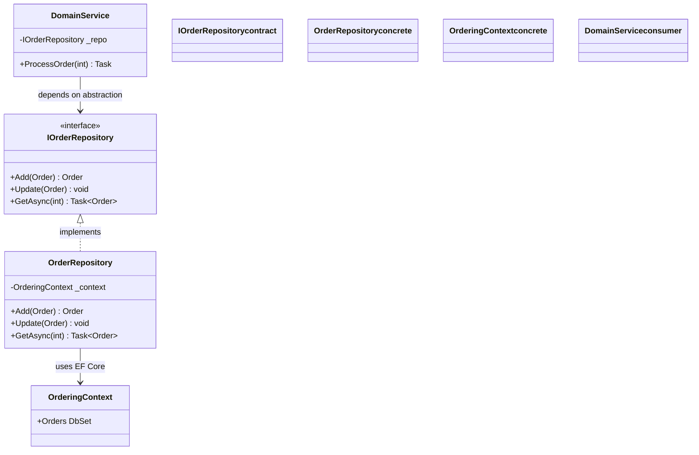

**TL;DR:** A design pattern is a *named, reusable solution to a recurring design problem* — not a piece of code you copy, and not a badge to earn. The proof is in a real codebase: dotnet/eShop puts `IOrderRepository` in the domain layer and keeps EF Core in the infrastructure layer, so business code never touches the database library. The skill is knowing when the problem is real — and when a single function is enough.
> **In plain English (30 sec):** Think of this like concepts you already use, but in a production system at scale.


## 1. What is a design pattern (and what it isn't)

A **design pattern** is a named, reusable solution to a recurring problem in software design. "Recurring" is the operative word: a pattern earns its name because the same shape of problem shows up across projects — loading an aggregate correctly, swapping one algorithm for another, supplying a class's dependencies from outside. A pattern is *described*, not inherited; you implement the idea in your own language and your own types.

What a pattern is **not**:

- Not a library or a class you import. `IOrderRepository` is *your* interface, written for *your* domain — the pattern is the idea of hiding data access behind a domain-shaped contract.
- Not a guarantee of good design. A pattern applied where the problem doesn't exist adds indirection with no payoff.
- Not a synonym for "more abstraction." Abstraction is a tool; a pattern is a *specific*, named application of it to a known problem.

The value of naming patterns (Strategy, Repository, Dependency Injection, Adapter…) is shared vocabulary: saying "wrap it in a Repository" communicates a whole design decision in two words.

## 2. A real example: Repository in dotnet/eShop

The cleanest "why a pattern helps" example in a real codebase is the **Repository** pattern in Microsoft's reference e-commerce app, [dotnet/eShop](https://github.com/dotnet/eShop). The `Order` aggregate has related `OrderItems`, and a naive load — `context.Orders.Find(id)` — returns an `Order` with its items silently unloaded. That is a technically-successful query that hands back an incomplete, buggy object, unless *every* caller independently remembers to eager-load the collection.

eShop solves this with a narrow, domain-shaped repository interface. The interface lives in the **domain** project; the EF Core–specific implementation lives in the **infrastructure** project. Business logic depends only on the interface, so it never references EF Core or `DbSet` directly:

```csharp
// src/Ordering.Domain/AggregatesModel/OrderAggregate/IOrderRepository.cs
public interface IOrderRepository : IRepository<Order>
{
    Order Add(Order order);
    void Update(Order order);
    Task<Order> GetAsync(int orderId);   // guarantees a COMPLETE aggregate
}

// src/Ordering.Infrastructure/Repositories/OrderRepository.cs
public class OrderRepository : IOrderRepository
{
    private readonly OrderingContext _context;

    public async Task<Order> GetAsync(int orderId)
    {
        var order = await _context.Orders.FindAsync(orderId);
        if (order != null)
            await _context.Entry(order)
                .Collection(i => i.OrderItems).LoadAsync();   // the rule, centralized
        return order;
    }
}
```

(EF Core doesn't lazy-load by default — navigation properties are null unless explicitly included.)

Two things this teaches that a definition can't:

- **The interface is a domain concept; the implementation is an infrastructure detail.** Because `IOrderRepository` sits in `Ordering.Domain` and the EF Core code sits in `Ordering.Infrastructure`, the domain project has zero reference to the ORM. You can unit-test order logic with a fake repository and no database.
- **The repository's real job is centralizing "the correct way to load this aggregate" in one place.** Every caller gets a complete `Order` automatically, because there is exactly one code path that does the loading. Miss the eager-load once in a raw `DbSet` call and you have a silent bug; here it is impossible by construction.

The same codebase shows **Dependency Injection** doing its job one layer out: `OrderRepository` is *given* its `OrderingContext` via the constructor rather than constructing it. A controller depends on `IOrderRepository`, never on the concrete `OrderRepository` or on EF Core — swap the database technology by writing a new implementation and changing one registration line, with zero edits to the controller. That decoupling is the entire point of the pattern; the container just automates the "supply the dependency" part.

## 3. How the pieces fit

The Repository pattern is a small set of roles. Here is the shape, using eShop's `Order` loading as the concrete instance:



Three roles, three colors: the **contract** (`IOrderRepository`, a domain concept), the **concrete** implementation that knows EF Core, and the **consumer** (domain/application code) that holds only the abstraction. The arrows point from high-level code toward the abstraction, never toward the database library — that direction is the pattern.

## 4. The trap: pattern-for-pattern's-sake

The most common failure mode is treating patterns as goals rather than tools. Signs you're pattern-matching instead of problem-solving:

- You add an interface with one implementation "because we might need another later." If there is no second implementation and no test seam you actually use, that interface is pure tax.
- You reach for the Strategy pattern to swap two behaviors when a single `if` or a function parameter would be clearer. Strategy pays off when the set of algorithms is open-ended and the caller must stay ignorant of which one runs — not when you have exactly two fixed cases.
- You wrap an ORM in a Repository for a trivial single-table CRUD entity where `DbSet<T>` already does the whole job. The Repository earns its keep when it encodes aggregate-loading rules or decouples the domain from the ORM for testing — not by default on every entity.

A pattern is justified when it removes a *real* recurring cost: duplicated loading logic, untestable database coupling, a caller that must know every algorithm. When there is no such cost, the pattern is the bug.

## 5. What breaks / what to care about

- **Over-engineering.** Every extra layer is code to read, name, and maintain. Ask "what problem does this remove that I actually have?" before adding a pattern.
- **Forcing a pattern where a function suffices.** A plain method or a local function is simpler and more honest than a five-class Visitor. Match the mechanism to the problem's real size.
- **Ignoring the problem the pattern solves.** A Repository you bypass with ad-hoc `DbContext` calls everywhere gives you the indirection without the decoupling — worse than not having it. A pattern only works if you actually honor its boundary.
- **Mislabeled abstractions.** Putting the interface in the infrastructure project (instead of the domain) inverts the dependency direction and defeats the testability win. Placement is part of the pattern.

## Review checklist

- [ ] Each pattern is tied to a specific recurring problem, not added "in case."
- [ ] Interfaces live in the layer that *consumes* them (e.g. repository contract in the domain), keeping high-level code free of infrastructure types.
- [ ] The consumer depends on an abstraction, never on a concrete implementation or a third-party library.
- [ ] There is at most one place that knows the "correct" way to do the thing the pattern centralizes (loading, algorithm selection, dependency wiring).
- [ ] A simpler function or direct call was considered and rejected with a reason.

## FAQ

**Isn't a Repository just redundant with an ORM's own `DbSet`?** For trivial single-table CRUD, often yes — a generic query API already does the job. It earns its keep when it encodes aggregate-shaped loading rules a generic API leaves to each caller, or when it decouples domain logic from the ORM so you can unit-test without a database. Whether to add one is conditional on what the object actually needs.

**How do I know when a pattern is overkill?** If you can't name the recurring cost it removes, it's overkill. One implementation and no test seam means the abstraction is tax. A pattern should make future change *cheaper*; if it only adds names, drop it.

**Where do Dependency Injection and Strategy fit relative to Repository?** They're adjacent patterns solving neighboring problems: DI supplies the repository (or any dependency) from outside, so the consumer stays decoupled; Strategy swaps an algorithm behind one interface the same way Repository swaps a data source. They compose — eShop's repository is both injected and backed by a swappable implementation.

The next posts in this series cover Strategy (swappable algorithms), Observer (event propagation), and Factory (object creation) — the three patterns most commonly tested in interviews alongside Repository and DI.

## Source

Example code and architecture from Microsoft's real [dotnet/eShop](https://github.com/dotnet/eShop) reference application — `IOrderRepository` in `src/Ordering.Domain/.../IOrderRepository.cs` and its EF Core implementation in `src/Ordering.Infrastructure/Repositories/OrderRepository.cs`, demonstrating the domain/infrastructure split that makes the Repository pattern meaningful.

## Next in the series

→ [Strategy Pattern: Swapping Retry, Circuit Breaker, and Timeout Behind One Execute() Call]({{ '/design-patterns/strategy-pattern-pluggable-behavior/' | relative_url }})


