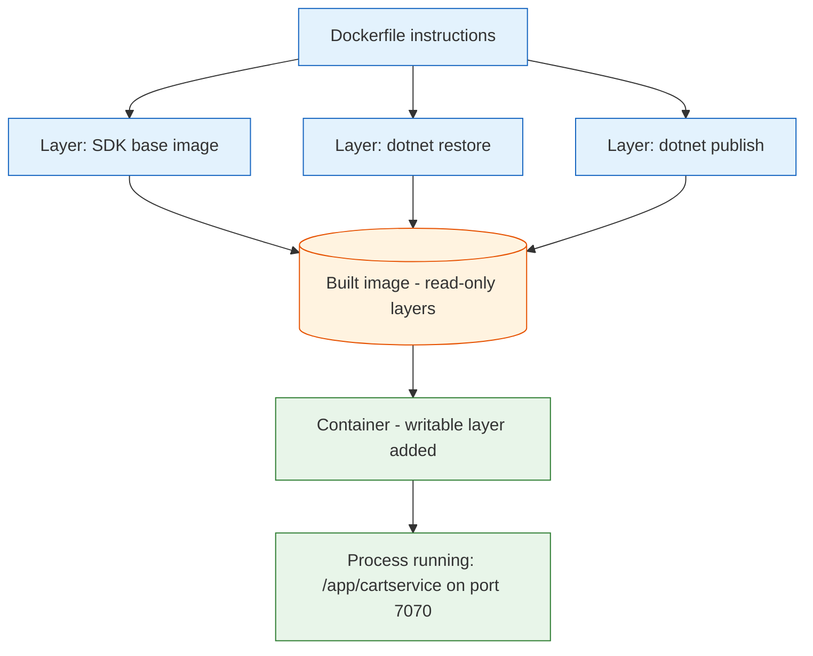

**TL;DR:** A container is a running process wrapped in an isolated, reproducible bundle of its own filesystem, built from a Dockerfile. The real **cartservice** Dockerfile from Google's Online Boutique is a perfect worked example — it shows layers, caching, a multi-stage build, a lean base image, and an explicit entrypoint, all of which explain *why* "it works on my machine" stops being a problem.

## 1. What a container is (and what it isn't)

A **container image** is a read-only, content-addressed stack of filesystem layers plus metadata about how to run it (what command to start, which port to expose, which user to become). It is a *template* — a frozen artifact you can ship and store. A **container** is what you get when the runtime (containerd, via runc) takes that image and adds one writable layer on top, then starts the process described in the image's metadata.

So the relationship is like class vs instance: the image is the blueprint, the container is the running, mutable thing. You can launch ten containers from one image, and they all share the same read-only layers underneath while each gets its own scratch space. None of this requires a VM — the isolation comes from Linux namespaces (its own PID, network, mount view) and cgroups (its own CPU/memory limits), not from emulating hardware.

## 2. A real example: cartservice's Dockerfile

Google's [Online Boutique](https://github.com/GoogleCloudPlatform/microservices-demo) is the same 11-service app from the microservices post, and `cartservice` (the cart, backed by Redis) is a **C# / .NET** service. Here is its actual `src/cartservice/src/Dockerfile`, trimmed to the parts that matter:

```dockerfile
# Define a default value so it's not empty if the builder fails to provide it
ARG BUILDPLATFORM=linux/amd64

# Stage 1: build with the full SDK
FROM --platform=$BUILDPLATFORM mcr.microsoft.com/dotnet/sdk:10.0.100-noble@sha256:c7445f14... AS builder
ARG TARGETARCH=amd64
WORKDIR /app
COPY cartservice.csproj .
RUN dotnet restore cartservice.csproj -a $TARGETARCH
COPY . .
RUN dotnet publish cartservice.csproj \
    -p:PublishSingleFile=true -a $TARGETARCH --self-contained true \
    -p:PublishTrimmed=true -p:TrimMode=full -c release -o /cartservice

# Stage 2: runtime only
FROM mcr.microsoft.com/dotnet/runtime-deps:10.0.0-noble-chiseled@sha256:b857c8cb...
WORKDIR /app
COPY --from=builder /cartservice .
EXPOSE 7070
ENV DOTNET_EnableDiagnostics=0 ASPNETCORE_HTTP_PORTS=7070
USER 1000
ENTRYPOINT ["/app/cartservice"]
```

Walk it instruction by instruction and you get the whole Docker mental model.

### Image vs container

Everything above the `ENTRYPOINT` only *describes an image*. `docker build` executes each instruction to produce a layer and stamps the finished stack as an image — nothing is running yet. Only `docker run <image>` turns that image into a container: the runtime adds a writable layer and execs `/app/cartservice`. The same image built here runs identically on your laptop, in CI, and on a GKE node, because the process carries its entire dependency closure (the trimmed .NET runtime) with it.

### Layers & caching

Each `FROM`, `COPY`, `RUN`, and `ENV` adds a layer — a diff against the previous one. Docker caches layers by content hash: if an instruction and its inputs are unchanged, the cached layer is reused. That is why the Dockerfile copies `cartservice.csproj` and runs `dotnet restore` *before* `COPY . .` and `dotnet publish`. The project file changes far less often than the source, so dependency restore is cached separately and a code change doesn't trigger a full NuGet restore. Get the ordering wrong and a single edited file invalidates everything below it.

### ENTRYPOINT vs CMD

`ENTRYPOINT` sets the binary that *is* the container (`/app/cartservice`). `CMD` supplies default arguments that get appended to the entrypoint and are easy to override at `docker run` time. This Dockerfile uses only `ENTRYPOINT` in exec form (`["/app/cartservice"]`) — no shell wrapper, so the process is PID 1 and receives signals (SIGTERM) directly, which matters for clean shutdowns. A common pattern is `ENTRYPOINT` for the program and `CMD` for its default flags; here there are no flags, so `CMD` is simply absent.

### Base images & distroless

Stage 1 starts from `dotnet/sdk` — a heavy image with compilers, NuGet, and a full OS, because you need all of that to *build*. Stage 2 starts from `dotnet/runtime-deps:...-chiseled` — a stripped, "distroless-style" image containing only the bare libraries .NET needs to *run*, not a shell or package manager. Chiseled/noble-chiseled images are the practical descendant of Google's original `distroless` idea: ship the minimum, shrink the attack surface.

### Multi-stage builds

The `AS builder` / `COPY --from=builder` pair is a multi-stage build. The SDK and all build tooling live only in the first stage; the final image is assembled from the second stage, which copies across *only* the published `/cartservice` output. The compiler, source code, and intermediate objects never reach the shipped image — so the artifact is small and contains nothing that could be exploited at runtime.

## 3. From Dockerfile to a running process

Here is the whole lifecycle in one picture — instructions become layers, layers become an image, the image becomes a container, and the container runs the entrypoint:



## 4. Why containers beat "it works on my machine"

The promise is reproducibility and isolation, and it's earned, not marketing:

- **Reproducibility:** the image pins the runtime (here, `.NET 10.0.100` via a digest `@sha256:...`), the OS userland, the env vars, and the exact binary. No more "but I have a different SDK version."
- **Isolation:** each container gets its own filesystem, network namespace, and process tree, bounded by cgroups — one container's crash or spike doesn't take down its neighbors on the same host.
- **Shipping:** the same artifact moves from a laptop to CI to a Kubernetes node unchanged, because the dependency closure travels inside the image.

That last point is the real reason containers won: the unit of deployment and the unit of execution became the same thing.

## 5. What breaks / what to care about

This is the section to internalize before you write your own Dockerfile.

**Layer-caching pitfalls.** Cache is keyed on an instruction plus its inputs. Put `COPY . .` *before* `RUN dotnet restore` and every code edit invalidates the restore — and rebuilds go from seconds to minutes. Also, deleting a file in a later layer doesn't shrink the image: the file still exists (deleted) in an earlier layer. Order dependencies first, source last.

**Image size.** A naive single-stage `FROM sdk` image can be 1+ GB; the multi-stage chiseled version is a fraction of that. Bigger images mean slower pulls, more attack surface, and more to scan. The `runtime-deps` + multi-stage pattern is the default fix.

**Running as root.** Images default to `USER root`. cartservice ends with `USER 1000` for a reason — a root process that escapes its container owns the host. Combined with dropping Linux capabilities and a read-only root filesystem (as Online Boutique's `cartservice.yaml` does), this is the baseline security posture, not an optional extra.

**Build context.** `COPY . .` sends the entire build context (the directory passed to `docker build`) to the daemon and layers it in. Without a `.dockerignore`, that can mean copying `.git`, local secrets, and build output into the image — bloating it and leaking credentials. Always ship a `.dockerignore`.

## 6. What to care about when writing Dockerfiles

If you take one thing from this post: **an image is a cacheable, reproducible filesystem; treat every instruction as a layer and order them by how often they change.**

- **Order by change frequency** — dependencies and static config before source code, so rebuilds stay fast.
- **Use multi-stage builds** — keep the SDK and toolchain out of the final image.
- **Pin a lean, ideally distroless/chiseled base** and pin it by digest, not just tag.
- **Prefer `ENTRYPOINT` in exec form** so your process is PID 1 and handles signals.
- **Run as a non-root user** and ship a `.dockerignore` so secrets never enter the build context.

## Review checklist

- [ ] Each `COPY`/`RUN` is ordered so the least-frequently-changed layers come first (deps before source).
- [ ] The final image is assembled from a multi-stage build, not the SDK image.
- [ ] The base image is lean (distroless/chiseled) and pinned by `@sha256` digest.
- [ ] The container runs as a non-root `USER` and `ENTRYPOINT` is in exec form.
- [ ] A `.dockerignore` excludes `.git`, local secrets, and build output from the build context.

## FAQ

**Is a container a lightweight VM?** No. A VM virtualizes hardware and runs a full guest OS; a container shares the host kernel and isolates via namespaces and cgroups. That's why containers start in milliseconds and VMs don't.

**Why does my Dockerfile copy the `.csproj` separately before the source?** To exploit layer caching: the project file (and its dependencies) changes far less often than your code, so restoring dependencies is cached and a code edit doesn't trigger a full restore.

**What's the difference between `ENTRYPOINT` and `CMD`?** `ENTRYPOINT` is the program that runs; `CMD` is its default arguments. `CMD` is trivially overridden at `docker run` time, `ENTRYPOINT` is not — so `ENTRYPOINT` names the binary and `CMD` supplies swappable defaults.

## Source

The worked example is the real `cartservice` Dockerfile from Google's [microservices-demo (Online Boutique)](https://github.com/GoogleCloudPlatform/microservices-demo) repository — a C#/.NET service built with a multi-stage Dockerfile on a chiseled `runtime-deps` base, deployed on Kubernetes. The same repo's `kubernetes-manifests/cartservice.yaml` shows the matching runtime hardening (`runAsNonRoot`, dropped capabilities, read-only root filesystem).

## Next in the series

→ [Docker Image Layers: Why Some Rebuilds Take Seconds and Others Take Minutes]({{ '/docker/docker-image-layers-and-build-cache/' | relative_url }})


