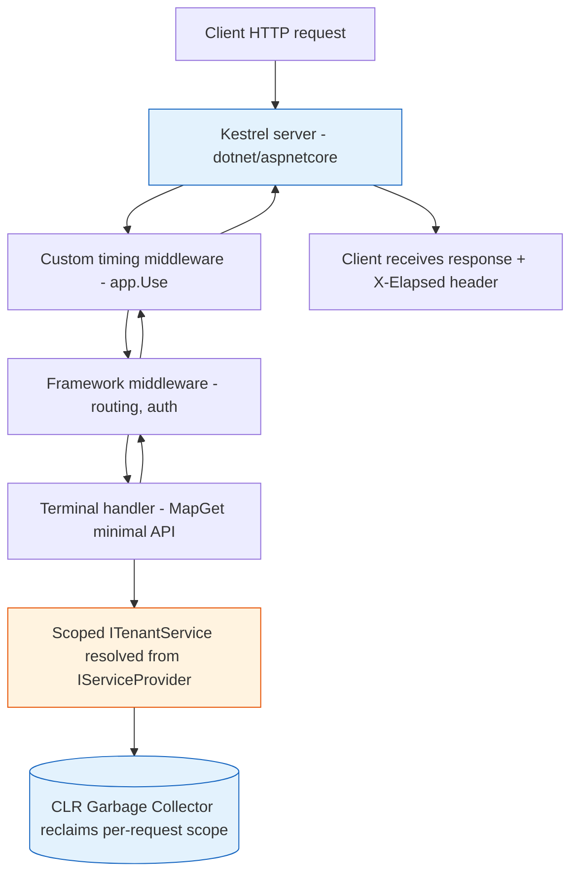

**TL;DR:** .NET is a runtime (the CLR) plus a class library; ASP.NET Core is the web framework that runs on it and pushes every HTTP request through a middleware pipeline backed by a dependency-injection container. The two real repos — `dotnet/runtime` (the CLR, GC, JIT, `Task`) and `dotnet/aspnetcore` (Kestrel, middleware, the host) — are where every mechanism in this post actually lives. The bugs that bite beginners are almost never logic; they are lifetime capture, middleware order, and blocking the async thread pool.

> **In plain English (30 sec):** Code you already write — Map, function, API call, just bigger.

## 1. What .NET and ASP.NET Core are (and what they aren't)

**.NET** is two things bundled together: a runtime — the **CLR** — that loads your IL, JIT-compiles it to native code, runs the **garbage collector**, and pools threads; and a giant class library (BCL) of types like `List<T>`, `Task`, `HttpClient`, and `ILogger`. The CLR and BCL are built in [`dotnet/runtime`](https://github.com/dotnet/runtime). When you "run a .NET app," the CLR is the process that executes your code.

**ASP.NET Core** is the web framework that sits *on top* of that runtime. It is a separate repo, [`dotnet/aspnetcore`](https://github.com/dotnet/aspnetcore), and it provides Kestrel (the web server), the middleware pipeline, the Generic Host, MVC/controllers, minimal APIs, and the DI container. It is **not** the runtime — it is a set of libraries the runtime executes, the same way your own code is.

The mental model that matters: an HTTP request arrives at Kestrel, walks through a chain of middleware built by the host, and is finally handled by your code, which receives its dependencies already constructed by the DI container. Everything else in this post is detail on those three boxes.

## 2. A real example: a minimal API with custom middleware and a Scoped service

Here is a small but real ASP.NET Core app. It registers a `Scoped` service, adds a custom middleware that logs each request, and exposes one minimal-API endpoint that uses the service. This is the shape every later post builds on.

```csharp
var builder = WebApplication.CreateBuilder(args);

// Register a Scoped service in the DI container (dotnet/aspnetcore Hosting)
builder.Services.AddScoped<ITenantService, TenantService>();

var app = builder.Build();

// Custom middleware: runs for EVERY request, sees it on the way in and out
app.Use(async (context, next) =>
{
    var started = DateTime.UtcNow;
    await next();                       // hand off to the rest of the pipeline
    var elapsed = DateTime.UtcNow - started;
    context.Response.Headers["X-Elapsed"] = elapsed.TotalMilliseconds.ToString();
});

// Terminal handler: a minimal API endpoint, injected with the Scoped service
app.MapGet("/tenant", (ITenantService svc, CancellationToken ct) =>
    Results.Ok(svc.GetTenantName(ct)));

app.Run();
```

```csharp
public interface ITenantService
{
    string GetTenantName(CancellationToken ct);
}

public class TenantService : ITenantService
{
    private readonly ILogger<TenantService> _log;
    public TenantService(ILogger<TenantService> log) => _log = log;

    public string GetTenantName(CancellationToken ct)
    {
        _log.LogInformation("Resolving tenant");
        return "acme";
    }
}
```

What is happening mechanically:

- `WebApplication.CreateBuilder` builds the **Generic Host**, which assembles configuration, logging, and the `IServiceCollection`.
- `AddScoped<ITenantService, TenantService>()` adds one registration to that collection; the container is built from it when `Build()` runs.
- `app.Use(...)` appends a middleware delegate to the pipeline; `await next()` is what lets the request continue downstream.
- `MapGet("/tenant", ...)` is the **terminal** middleware — it produces the response and there is no `next` after it.
- The handler's `ITenantService` and `ILogger<TenantService>` are resolved by the container *per request* because `TenantService` is `Scoped`.

## 3. How the pieces connect

The request's life is easiest to see as a flow. Note the middleware is a nested chain: the request goes in through the outer layers, hits the terminal handler, and the response unwinds back out through the same layers in reverse.



Three connections to internalize:

- **The host owns the container.** `WebApplication` *is* the Generic Host, so the same object that starts Kestrel also owns the `IServiceProvider`. That is why you register services before `Build()` and resolve them after.
- **The pipeline is built once, the scope is built per request.** At startup the middleware chain is compiled into a single `RequestDelegate`. For each request the host opens a new DI **scope** so every `Scoped` service is fresh and isolated — and is disposed when the response finishes, which is what lets the GC reclaim it.
- **async/await is what keeps the server fast.** While `TenantService` (or a real DB call) awaits I/O, the thread returns to the pool and Kestrel uses it for another request. The CLR's `Task` + thread pool is the reason a handful of threads serve thousands of concurrent connections.

## 4. What breaks: the traps that actually bite

This is the section to read before you write a line of production code.

**DI lifetime capture (the big one).** If you register `TenantService` as `Scoped` but inject it into a `Singleton` (say, a cached background service), the `Singleton` captures that *one* instance for the life of the app. Every later request silently shares the first request's tenant data, and the object is never collected — a cross-request data leak and a memory leak at once. The rule: a `Singleton` may only depend on other `Singleton`s; a `Scoped` or `Transient` may depend on anything. The container throws at build time for the obvious cases, but manual `GetService` calls inside a singleton can hide it.

**Middleware order is load-bearing.** Middleware run in registration order on the way in and reverse order on the way out. Put exception handling *outside* everything (so it catches downstream failures), authentication *before* authorization, and routing before endpoints. Swap two lines and suddenly unauthenticated requests reach a protected handler, or your timing middleware measures only part of the pipeline.

**Blocking the async thread pool.** Calling `.Result` or `.Wait()` on a `Task` inside a request holds a thread pool thread hostage while it waits, and a `SynchronizationContext` deadlock (the classic "why does this hang on ASP.NET Classic but not Core" bug) can freeze the server under load. The fix is `await` all the way down — never block on async code in a request path.

**GC pressure from per-request allocation.** Every request allocates a scope, a request object graph, and usually buffers/strings; the CLR's Gen 0 collector handles this cheaply *as long as those objects die young*. The trap is holding references (a captured `Scoped` service, a static cache of request data) so they promote into Gen 2, where collection is expensive and pauses are noticeable. This is the mechanism behind most "our p99 latency spikes" stories.

## 5. What to care about

If you take one thing from this post: **the framework gives you a pipeline and a container; your job is to respect their lifetimes and their async model, not fight them.**

- **Register by the right lifetime.** `Scoped` for anything tied to a request (DbContext, per-request state), `Singleton` for stateless shared services, `Transient` only when a fresh instance per resolve is genuinely needed.
- **Order middleware deliberately** — exception handling outermost, then auth, then routing, then endpoints.
- **Await everything** in the request path; never `.Result`/`.Wait()` on a `Task`.
- **Pass `CancellationToken`** (especially `HttpContext.RequestAborted`) into I/O so doomed work stops when the client disconnects.
- **Watch allocations** on hot paths; let per-request objects die in Gen 0 instead of promoting to Gen 2.

## Review checklist

- [ ] Services are registered with a lifetime that matches their usage (no Scoped captured by a Singleton).
- [ ] Middleware is ordered: exception handling outermost, auth before authorization, routing before endpoints.
- [ ] Every async call in the request path is `await`ed; no `.Result`/`.Wait()` blocking.
- [ ] `CancellationToken` is threaded into downstream I/O calls.
- [ ] Per-request objects are not retained in static/global state (GC Gen 2 pressure).
- [ ] The app runs on the Generic Host (`WebApplication`/`Host.CreateBuilder`), not a hand-rolled loop.

## FAQ

**Is ASP.NET Core the same as .NET?** No. .NET is the runtime plus class library (`dotnet/runtime`); ASP.NET Core is the web framework that runs on top of it (`dotnet/aspnetcore`). You can use .NET without ASP.NET Core (worker services, console apps, gRPC clients), but ASP.NET Core cannot run without .NET.

**Why is Scoped the default for things like DbContext?** Because a web request is the natural unit of work: one database connection, one identity map, one transaction boundary. `Scoped` gives each request its own `DbContext` and disposes it automatically when the response finishes, which is exactly the lifetime you want for change tracking.

**Do I have to use the built-in DI container?** No — ASP.NET Core lets you swap in Autofac, Lamar, or another container via `UseServiceProviderFactory`. But the built-in one covers the vast majority of cases and is what every framework feature (`AddDbContext`, `AddControllers`) is written against, so most apps never need to.

**Where do I start reading next?** The deeper posts take each mechanism one at a time — start with how the container actually wires services and where lifetime bugs come from: [.NET Dependency Injection: Lifetimes, Scopes, and Capture Bugs]({{ '/dotnet/dependency-injection-lifetimes/' | relative_url }}).

## Source

Mechanisms and component names in this post are grounded in the two real framework repositories:

- [`dotnet/runtime`](https://github.com/dotnet/runtime) — the CLR, garbage collector, JIT, `Task`/`async` machinery, and the base class library.
- [`dotnet/aspnetcore`](https://github.com/dotnet/aspnetcore) — Kestrel, the middleware pipeline, the Generic Host, minimal APIs, MVC/controllers, and the built-in dependency-injection container.

The worked example uses only APIs that exist in shipping .NET (6+); the `WebApplication`/`AddScoped`/`app.Use`/`MapGet` surface is the same one these repos ship.

## Next in the series

→ [.NET Dependency Injection: Lifetimes, Scopes, and Capture Bugs]({{ '/dotnet/dependency-injection-lifetimes/' | relative_url }})


