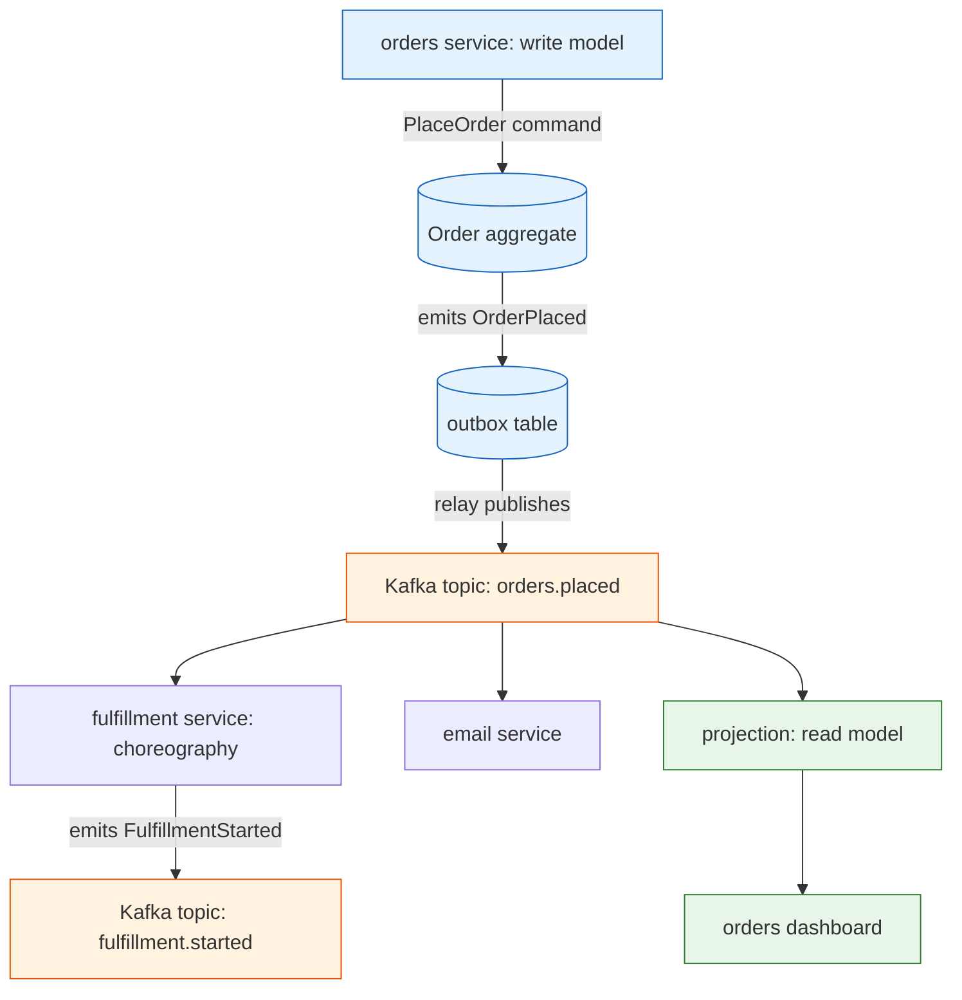

**TL;DR:** Event-driven architecture means services communicate by emitting facts ("OrderPlaced happened") onto a log like Apache Kafka, and other services react — instead of calling each other directly. The hard part isn't publishing the event; it's that the event and your database write can diverge (dual-write), the event can be lost, and your read model is always a beat behind. The outbox pattern is the standard fix for the first two.

## 1. What is event-driven architecture (and what it isn't)

A **request/response** system is services calling each other synchronously: checkout calls payment, waits, calls shipping, waits. An **event-driven** system flips this — the `orders` service records that an order was placed and emits an `OrderPlaced` event; the `fulfillment`, `email`, and `analytics` services each notice it on their own time.

The win is decoupling: `orders` has no idea who cares about orders, so you can add a new reactor (a fraud-check service) without touching the producer. The cost is that there is no single transaction spanning the work, no instant answer, and a whole new class of consistency bugs — which is what the rest of this post is about.

## 2. A real example: an order and its reactors

Picture a small e-commerce backend built on real components. The `orders` service is an event-sourced aggregate: a command `PlaceOrder` loads the `Order`, validates it, and emits an `OrderPlaced` event that lands on a Kafka topic. The event follows the [CloudEvents](https://github.com/cloudevents/spec) shape — `id`, `source: orders-service`, `type: OrderPlaced`, `datacontenttype: application/json` — so any consumer can bind to it regardless of transport.

Here is the shape of the system, with the event bus in the middle:

Look at what this tells you about EDA in practice:

- **The producer doesn't call anyone.** `orders` writes to its outbox and Kafka; it never names `fulfillment`.
- **Reactors are independent.** `email` and `analytics` can be down for an hour and `orders` still succeeds — they catch up by replaying the topic.
- **The read model is a separate thing.** The dashboard reads from a projection, not from the `Order` aggregate.

## 3. How the pieces connect: events, CQRS, and the outbox

Three mechanisms make this work, and they are the vocabulary of the whole series.

**Events are the contract.** `OrderPlaced` is an immutable fact with a payload (`orderId`, `customerId`, `items`, `total`). Because it is past-tense and append-only, it is safe to broadcast to many consumers at once. CloudEvents standardizes the envelope so the same event works over Kafka, HTTP, or a cloud queue.

**CQRS splits write from read.** The `orders` service is the *write model*: it loads the `Order` aggregate, enforces invariants, and emits events. Separately, a *projection* consumes `OrderPlaced` and builds a denormalized *read model* — say a "orders by customer" table in a fast store — that the dashboard queries. The read model is derived from the event stream, so you can delete it and rebuild it by replaying Kafka. The trade-off: the dashboard is **eventually consistent**, a beat behind the write.

**The outbox pattern closes the dual-write gap.** The naive version writes the order to Postgres *and* publishes to Kafka as two steps. If the DB commit succeeds but the Kafka publish crashes, you have an order with no event — every reactor silently misses it. The outbox writes both the order row and an `outbox` row in **one Postgres transaction**, then a relay (or Debezium reading the WAL) publishes the outbox rows to Kafka. The event is now emitted if and only if the business data committed, so the two can never diverge.

## 4. What breaks: the consistency traps

This is the section to internalize before you emit your first event.

**The dual-write problem.** As above: two separate writes (DB + broker) can split on a crash, leaving state and events inconsistent. The outbox pattern is the fix — never publish outside the same transaction as your state change.

**Lost events.** Even with the outbox, a relay bug or an unhandled Kafka error can drop an event, and because delivery is at-least-once, the opposite problem — duplicates — is the default. You must make every handler **idempotent** (track processed event ids) so a redelivered `OrderPlaced` doesn't create a second shipment.

**Eventual-consistency confusion.** A user places an order and immediately refreshes the dashboard; it isn't there yet because the projection hasn't consumed the event. If the UI assumes read-your-writes, you get "where did my order go?" bugs. Either accept the lag, or have the write path return a token the read path can use to wait for catch-up.

**Poison events.** One malformed `OrderPlaced` (bad JSON, missing field) can make a consumer throw forever, stalling the whole partition as it retries. Route repeated failures to a **dead-letter** topic so the stream keeps moving and you can inspect the bad message later.

## 5. What to care about when designing event-driven systems

If you take one thing from this post: **emit events from a transactionally consistent outbox, make every consumer idempotent, and design the UI for eventual consistency.**

- **Adopt CloudEvents** so your event envelope is portable across Kafka and HTTP.
- **Use the outbox pattern** (DB row + relay) instead of publishing after a separate commit.
- **Make handlers idempotent** — at-least-once delivery guarantees you'll see duplicates.
- **Treat the read model as derived** — rebuildable by replay, never the source of truth.
- **Add a dead-letter path** so one poison event can't stall a consumer group.
- **Pick choreography vs orchestration deliberately** — reactors for loose coupling, a saga orchestrator when you need to see the whole flow.

## Review checklist

- [ ] Events are immutable facts in past tense, emitted on a broker like Kafka, not synchronous calls.
- [ ] The outbox pattern writes state and the event in one transaction (no dual-write).
- [ ] Every consumer is idempotent against duplicate delivery.
- [ ] Read models are projections rebuilt from the event stream, not the source of truth.
- [ ] A dead-letter topic catches poison events so the stream keeps moving.
- [ ] The UI accounts for eventual consistency (read-your-writes handled explicitly).

## FAQ

**Is event-driven always better than calling services directly?** No. Synchronous calls give you an immediate answer and a single transaction; events give you decoupling and resilience at the cost of lag and complexity. Use events for "tell the next thing this happened," and direct calls for "I need the result now."

**Why Kafka and not a simple queue?** Kafka is a durable, replayable log: topics retain events so new consumers can replay history and rebuild state, which is exactly what projections and the outbox relay need. A queue typically deletes a message after it's consumed, so you can't rebuild a read model from it.

**What is the difference between choreography and orchestration?** In choreography, each service reacts to events and emits its own (our `fulfillment` reacts to `OrderPlaced`); nobody coordinates the whole flow. In orchestration, one saga process tells each service what to do and handles failures with compensating actions. Choreography couples less; orchestration is easier to observe.

**Where do I start reading next?** The deeper posts take each concern one at a time — start with the shared vocabulary: [Event-Driven Architecture Key Terms]({{ '/event-driven/event-driven-key-terms/' | relative_url }}).

## Source

Event envelope and attribute specification from the CNCF [cloudevents/spec](https://github.com/cloudevents/spec) repository. Event backbone and topic/partition semantics from Apache [kafka](https://github.com/apache/kafka). The outbox and transaction-outbox mechanics follow the Debezium log-based CDC pattern for draining an outbox table to Kafka. The worked example (an `OrderPlaced` event driving fulfillment, email, and a read-model projection) is a standard event-sourced order aggregate.

## Next in the series

→ [Event-Driven Architecture Key Terms]({{ '/event-driven/event-driven-key-terms/' | relative_url }})
