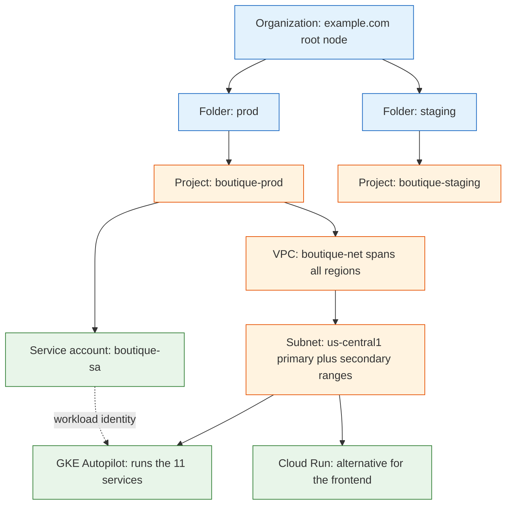

**TL;DR:** Before you can deploy anything on Google Cloud you have to know where it lives (a **project**, nested under folders and an **organization**), what network it sits on (a **VPC** and a regional **subnet**), who it acts as (a **service account**) and who may touch it (**IAM** roles). Deploying Google's real **Online Boutique** demo makes all four concrete: 11 microservices land in one project, on one subnet, running on **GKE** or **Cloud Run**, acting as a service account you grant least-privilege IAM to.

> **In plain English (30 sec):** Code you already write — Map, function, API call, just bigger.

## 1. The one rule that explains the whole hierarchy

Every single thing you create on GCP — a VM, a bucket, a GKE cluster — belongs to exactly one **project**. A project is the atom of billing, API enablement, quota, and permission scoping. Turn on the Kubernetes API "in a project," get billed "per project," hit quota limits "per project."

On top of that atom sits an inheritance tree:

- **Organization** — the root node, one per company domain (backed by Cloud Identity / Google Workspace).
- **Folder** — optional grouping under the org (a department, or an environment like `prod` / `staging`).
- **Project** — the leaf, where resources actually live.

IAM policies and Org Policy constraints set on a higher node **flow downward** and can only be *narrowed* by children, never widened. That single property is the reason the hierarchy exists: it lets a security team grant "auditors can read everything under the `prod` folder" once, at the folder, instead of re-granting it in every project — and lets them forbid "no VM may have a public IP" org-wide with no project able to opt back in.

## 2. A real example: deploying Online Boutique

Google's [Online Boutique](https://github.com/GoogleCloudPlatform/microservices-demo) is a cloud-first e-commerce app — 11 microservices in 5 languages talking over gRPC. It's the same demo used in the microservices series; here we care about the *GCP scaffolding* it needs to run. Here is where every piece lands:

Read the diagram top to bottom and you've read the whole post: the org and folders decide *policy and grouping*, the project is the *billing and IAM boundary*, the VPC and subnet are *where packets flow*, and GKE or Cloud Run is *what runs the containers* — as a service account, not as you.

## 3. The network: VPC and subnet

A **VPC (Virtual Private Cloud)** is a global, software-defined network that belongs to one project and spans every region at once — it is *not* tied to a location. Inside it you carve **subnets**, and a subnet *is* regional: `boutique-net` might have one subnet in `us-central1`.

The subnet is where the addresses come from, and this is where GKE forces a detail on you. A subnet's **primary range** hands out IPs to nodes/VMs. GKE VPC-native clusters also need IPs for thousands of ephemeral Pods and for Services — far more than the node count — so the subnet carries **secondary ranges**: separate, independently-sized address blocks for Pod IPs and Service IPs. Get the secondary ranges too small and the cluster silently can't schedule new Pods once the range exhausts.

Firewall rules then decide what may talk to what. GCP rules target instances by **network tag or service-account identity**, not just CIDR — so "allow `frontend` to reach `checkout`" keeps working as VMs are recreated with new IPs.

## 4. Identity: IAM vs service accounts (two different questions)

These get conflated constantly, so pin them down:

- **A service account is an identity.** It answers *"who is this workload?"* When the `checkoutservice` Pod calls the Cloud Storage API, it authenticates *as* a service account (`boutique-sa`), not as a human. It's a non-human account a VM, Pod, Cloud Run service, or function runs as.
- **IAM is the permission system.** It answers *"what is that identity allowed to do?"* An IAM **binding** attaches a **member** (a user, group, or service account) to a **role** (a bundle of permissions) **on a resource**.

So "the checkout workload can read the `orders` bucket" is really two decisions: give the Pod the identity `boutique-sa` (service account), then bind `boutique-sa` to `roles/storage.objectViewer` on that bucket (IAM). Neither is enough alone.

The modern way to give a GKE Pod that identity is **Workload Identity** — the Pod gets short-lived tokens from the metadata server with **no downloaded key file**. The old way, a long-lived JSON key baked into the container, is exactly the exportable secret you're trying to avoid.

## 5. Compute: GKE or Cloud Run

Online Boutique ships with Kubernetes manifests, so the reference deployment is **GKE** — a managed Kubernetes control plane plus nodes (Autopilot lets Google run the nodes). All 11 services become Deployments and Services in one cluster. A baseline set of Pods stays running even at zero traffic.

**Cloud Run** is the other managed option: a serverless container platform where "zero running instances" is a first-class state — a request cold-starts a container, and you're billed per request, not per uptime hour. You *could* run the boutique frontend on Cloud Run and reach it by name from a load balancer.

The trade is the usual one: GKE gives you the full Kubernetes surface (StatefulSets, DaemonSets, operators) and a bill for capacity that's always on; Cloud Run gives you scale-to-zero and a much smaller operational surface, but it's one stateless container per service behind HTTP. For an 11-service gRPC mesh, GKE is the natural home; for a single stateless web tier, Cloud Run wins.

## 6. What breaks / what to care about

This is the section to internalize before you provision anything.

**IAM sprawl beats you if you don't start least-privilege.** The default is to grant `roles/editor` on the whole project and move on — and now every workload can delete every resource. Grant the *narrowest* role on the *smallest* resource: `objectViewer` on one bucket, not `editor` on the project. It's far harder to claw back permissions later than to add them.

**One project per environment, not one project for everything.** Because the project is the billing, quota, and IAM boundary, putting `prod` and `staging` in one project means a staging quota spike or a fat-fingered IAM binding hits production. Separate projects (grouped under folders) isolate blast radius and make "who spent what" answerable.

**Network egress is a real line item.** Traffic *into* GCP and *within* a region is cheap or free; traffic *leaving* to the internet or *crossing regions* is billed per GB. A chatty service pulling data across regions, or serving lots of egress, can dwarf the compute bill. Keep talkative services in the same region/VPC.

**Quotas are per-project and will stop a deploy cold.** CPU, IP addresses, and API request rates are all capped per project by default. A GKE cluster that can't get enough in-use IP addresses or CPU quota won't scale — the failure looks like "Pods pending" or a stalled apply, not a billing warning. Know your quotas before a launch.

## Review checklist

- [ ] Every resource is in a deliberately-chosen project, with separate projects per environment grouped under folders.
- [ ] Workloads run as a dedicated service account, never as a user or the default editor account.
- [ ] IAM grants are the narrowest role on the smallest resource (least privilege), not `roles/editor` on the project.
- [ ] The subnet has correctly-sized secondary ranges for GKE Pod and Service IPs.
- [ ] No long-lived service-account JSON keys — Workload Identity (or Federation) issues short-lived tokens instead.

## FAQ

**Do I need an Organization and Folders to start?** No. A single project works for learning and is all a solo developer needs. Organizations and folders become essential once multiple teams, environments, or company-wide policies enter the picture — that's when hierarchy-wide IAM and Org Policy earn their keep.

**What's the difference between a role and a permission?** A permission is one fine-grained action (e.g. `storage.objects.get`). A role is a named bundle of permissions (e.g. `roles/storage.objectViewer`). You bind *roles* to members, not individual permissions — the role is the unit of grant.

**GKE or Cloud Run for my first deploy?** If your app is a single stateless container that speaks HTTP, start with Cloud Run — scale-to-zero and near-zero ops. Reach for GKE when you need the full Kubernetes model: multiple interdependent services, stateful workloads, or operators. Online Boutique is the latter.

## Source

Example system and deployment shape from Google's real [microservices-demo (Online Boutique)](https://github.com/GoogleCloudPlatform/microservices-demo) repository — 11 services across 5 languages, shipped with Kubernetes manifests for GKE. The resource-hierarchy, VPC, IAM, and compute concepts are the standard GCP model those manifests are deployed into.

## Next in the series

→ [Compute Engine vs App Engine vs Cloud Run: When Scaling Means a VM vs Nothing at All]({{ '/gcp/compute-engine-vs-app-engine-vs-cloud-run/' | relative_url }})

