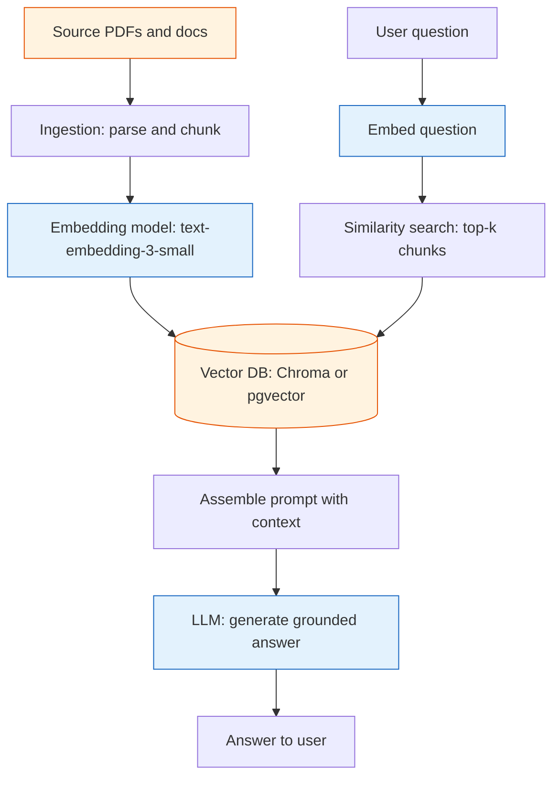

**TL;DR:** A GenAI app is a normal software pipeline that wraps an LLM — you turn documents into embeddings, store them in a vector database, retrieve the top-k closest chunks for a question, and ground the model's answer in that context. The real repos are [langchain-ai/langchain](https://github.com/langchain-ai/langchain), [run-llama/llama_index](https://github.com/run-llama/llama_index), and [modelcontextprotocol](https://github.com/modelcontextprotocol); the hard part isn't calling the model, it's that chunking, context windows, and agent loops decide whether the answer is right.

## 1. What is a GenAI app (and what it isn't)

A **traditional app** is deterministic: you write the logic, the input maps to a predictable output. A **GenAI app** puts an LLM in the loop — a probabilistic component that generates text — and surrounds it with ordinary code that feeds it context and interprets its output.

The win is that you can answer questions over your own data without hand-coding rules for every query. The cost is that "call a function" becomes "call a model that might be wrong," and the surrounding pipeline (retrieval, chunking, tool calls) is where most of the real engineering lives.

## 2. A real example: a RAG knowledge assistant

Say you want to answer questions over a folder of company PDFs. You build it with **LlamaIndex** (run-llama/llama_index) for ingestion and retrieval and **LangChain** (langchain-ai/langchain) for the prompt/chain orchestration. The shape of the system:

Walk through what each step actually does:

- **Ingestion chunks the docs.** LlamaIndex's `SimpleDirectoryReader` parses the PDFs, then a `TokenTextSplitter` cuts them into ~512-token chunks with overlap so ideas aren't split across boundaries.
- **Each chunk becomes an embedding.** The embedding model maps every chunk to a 1536-float vector stored in the vector DB alongside the original text.
- **At query time you embed the question, not the corpus.** A cosine-similarity search returns the k nearest chunks — the most semantically relevant passages.
- **The LLM is grounded by those chunks.** LangChain's `RetrievalQA` chain injects the retrieved text into the prompt with an instruction like "answer using only the context," so the model cites rather than guesses.

## 3. How the pieces connect

Two flows make the whole thing work, and they are deliberately separate:

- **The offline index pipeline** runs once (or on document change): parse, chunk, embed, store. This is where your knowledge becomes queryable. LlamaIndex's `VectorStoreIndex.from_documents` does exactly this.
- **The online query pipeline** runs per request: embed the question, retrieve top-k, build the prompt, call the LLM, stream the answer. LangChain's `RetrievalQA` or a LlamaIndex `QueryEngine` wraps this into one call.

This separation is the defining rule of RAG: **the model never sees the whole corpus, only the few retrieved chunks you hand it.** That's what keeps answers grounded and lets you update knowledge by re-indexing, not retraining.

## 4. Adding tools: agents and MCP

Retrieval handles "answer from my documents." For "answer by calling live systems," you add an **agent** — an LLM loop that picks and calls tools, observes results, and retries until the goal is met. The cleanest way to expose those tools is the **Model Context Protocol** (modelcontextprotocol): a server advertises resources and tools over a uniform interface, and any MCP-aware client (including LangChain via its MCP adapter) can use them without a custom integration per API.

So the same assistant can both retrieve from your vector DB *and* call a `get_order_status` tool exposed through an MCP server — the orchestration layer decides which path each question needs.

## 5. What breaks: the traps that produce wrong answers

This is the section to internalize before you ship anything.

**Bad chunking silently poisons retrieval.** If chunks are too large, the top-k results are mostly irrelevant padding and the model can't find the fact; if too small, a single concept is fragmented across chunks and never retrieved whole. Chunk size, overlap, and splitter choice are the first knob to tune, not an afterthought.

**The context window overflows.** Retrieved chunks plus system prompt plus conversation history must fit in the model's token limit (e.g. 128k). Exceed it and the model drops the earliest context with no error — your grounding vanishes mid-conversation. Truncate, summarize, or retrieve fewer chunks deliberately.

**Hallucination when retrieval misses.** If the top-k chunks don't actually contain the answer, an instruction to "use only the context" is ignored by a model that will still produce a plausible sentence. The fix is retrieval quality plus an explicit "if not in context, say I don't know" branch — and evaluation to catch misses.

**Agent loops run away.** An agent that calls a tool, gets a bad observation, and retries can spin, call paid APIs in circles, or drift from the goal. You need max-iteration caps, stop conditions, and guardrails around tool outputs, or one vague question becomes a hundred model calls.

## 6. What to care about when building GenAI apps

If you take one thing from this post: **the LLM is the easy part — retrieval quality, context discipline, and bounded agent loops are what make answers correct and cheap.**

- **Treat chunking as a first-class design decision** — size, overlap, and semantic splitting per document type.
- **Keep the prompt within the context window** and prefer prompt caching for the stable prefix (system instructions, large context) to cut cost and latency.
- **Ground every answer in retrieved or tool-sourced context**, and add an explicit abstain path to fight hallucination.
- **Bound your agents** with max steps, stop conditions, and guardrails before they touch paid tools.
- **Evaluate continuously** — measure faithfulness to context and answer correctness, because a change that "feels better" often just shifts the failure.

## Review checklist

- [ ] Documents are chunked with a deliberate size/overlap, not defaults, and the splitter matches the content type.
- [ ] Embeddings and the vector DB are chosen and the top-k retrieval is verified to return relevant chunks.
- [ ] The assembled prompt fits the model's context window, with truncation/summarization handled explicitly.
- [ ] The LLM is instructed to answer only from context, with an abstain path for missing information.
- [ ] Any agent has max-iteration caps, stop conditions, and guardrails around tool outputs.
- [ ] An evaluation harness scores faithfulness and correctness, not just vibes.

## FAQ

**Do I need to fine-tune the model to use my data?** No. RAG injects your data into the prompt at query time, so the model answers from retrieved facts without weight changes. Fine-tuning is for style or task behavior at scale, not for injecting fresh documents — use retrieval for knowledge.

**Why not just paste the whole document into the prompt?** Context windows are finite and cost scales with input tokens; pasting everything is slow, expensive, and dilutes the signal. Retrieval hands the model only the relevant few chunks, which improves both accuracy and bill.

**Is LangChain or LlamaIndex better?** They overlap. LlamaIndex leans into data indexing and retrieval engines; LangChain leans into chaining, agents, and integrations (including MCP adapters). Many production apps use LlamaIndex for the index and LangChain for orchestration — pick by which job you're solving.

**Where do I start reading next?** The deeper posts take each concern one at a time — start with the vocabulary behind every lesson: [Generative AI Key Terms]({{ '/genai/genai-key-terms/' | relative_url }}).

## Source

Worked patterns and component names from real repositories: [langchain-ai/langchain](https://github.com/langchain-ai/langchain) (chains, RetrievalQA, MCP adapters), [run-llama/llama_index](https://github.com/run-llama/llama_index) (ingestion, `VectorStoreIndex`, query engines), and [modelcontextprotocol](https://github.com/modelcontextprotocol) (the MCP spec and SDKs). Vector storage examples use Chroma and pgvector; embeddings use OpenAI's `text-embedding-3-small` as a representative model.

## Next in the series

→ [Generative AI Key Terms]({{ '/genai/genai-key-terms/' | relative_url }})

