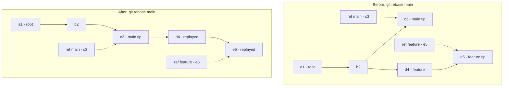

**TL;DR:** Git is a content-addressed object database with a directed acyclic graph of commits and a set of movable pointers (refs) on top. The real repo [git/git](https://github.com/git/git) is the reference implementation: a commit is a hashed object pointing to a tree of blobs, a branch is just a file holding a commit hash, and rebase rewrites history by replaying commits with new hashes. The traps — detached HEAD, merge conflicts, hard-reset commits, and rebasing a shared branch — all come from those same mechanics.

## 1. What Git is (and what it isn't)

A **centralized** VCS like SVN keeps one linear history on a server and checks out files by version number. **Git** is distributed: every clone is a full repository with its own complete object database and history, so commits happen locally and "the server" is just another remote you sync with.

The mental model that matters is this: Git is not a folder of file versions. It is a **content-addressed store of objects** (blobs, trees, commits, tags) addressed by SHA-1 (Git is migrating to SHA-256 since Git 2.29, but SHA-1 remains the default for most repositories), wired together into a **DAG** by commit parent pointers, with a thin layer of **refs** (branch and tag names) pointing into that graph. Learn those three ideas and every Git command is just an operation on them.

## 2. A real example: building a commit by hand

Take the actual `git/git` source. When you run `git commit`, Git does roughly this:

1. Writes each changed file as a **blob** object (the file's bytes, zlib-compressed, named by `SHA-1("blob <size>\0" + content)`).
2. Writes a **tree** object listing every path and the blob (or subtree) hash it maps to.
3. Writes a **commit** object containing that tree hash, the parent commit hash(es), author/committer, and message — itself named by its own SHA-1.
4. Moves the current branch ref to point at the new commit.

You can see the object model directly:

```bash
# Make a change and commit it
echo "hello" > greeting.txt
git add greeting.txt
git commit -m "Add greeting"

# Inspect the commit object and what it points to
git cat-file -p HEAD
# tree 8d0e...
# parent 3a1f...
# author ...
git cat-file -p 8d0e...      # the tree: lists greeting.txt -> blob hash
git cat-file -p <blobhash>   # the blob: "hello"
```

So a single commit is a hash that names a tree, and that tree names blobs — the snapshot is reconstructed by walking the hashes. Nothing is stored by filename at the object layer; the name lives only inside the tree.

Now a branch is just a ref. Creating `feature` writes one file, `refs/heads/feature`, containing the new commit's hash. New commits on `feature` rewrite that one file; `main` is untouched. Let's rebase `feature` onto `main`:

```bash
git checkout feature
git rebase main
```

Git finds the commits on `feature` not on `main`, checks out `main`'s tip, and replays each one as a **new commit with a new hash** on top. The old feature commits still exist in the object database (reachable via reflog) but the `feature` ref now points at the rewritten chain. Here is the shape before and after:



The feature work (`d4`, `e5`) is the same *diff* but now hangs off `main`'s tip with fresh hashes — the history is rewritten, not moved.

## 3. How the pieces connect: object model + refs

Git has three copies of your files: the working tree (what you see), the staging area / index (what `git add` prepares), and HEAD (the last commit). The two layers are deliberately separate, and that separation is the whole game:

- **Objects are immutable and content-addressed.** A blob, tree, or commit never changes once written; its hash is its identity. Identical content anywhere in history collapses to one object, which is why Git repos stay small.
- **Refs are mutable pointers into the object graph.** `refs/heads/*` are branches, `refs/tags/*` are tags, `refs/remotes/*` are remote-tracking refs, and `HEAD` says which ref (or commit) you're on. Moving a branch is just rewriting a 40-character file.
- **The DAG is the history.** Each commit's parent hash(s) form edges from child to parent; a two-parent commit is a merge. Because commits reference parents by hash, the graph is tamper-evident: change an old commit and every descendant's hash changes too.

This is why a "branch" is cheap (one file) and why "history" is just the set of objects reachable by following parent pointers from a ref. `git log` walks that graph; `git gc` prunes objects no ref can reach.

## 4. What breaks: the traps newcomers hit

These four failures are not bugs — they are the object/ref model expressing itself.

**Detached HEAD.** Check out a tag or an old commit (`git checkout 3a1f...`) and HEAD holds a raw hash instead of a branch name. New commits still get created as objects, but no branch ref moves to track them, so they become unreachable the moment you check out something else — and eventually get pruned. Fix: `git switch -c save-my-work` to attach a branch before you lose the tip.

**Merge conflicts.** When you merge (or rebase) and the same lines changed differently on both sides, Git cannot auto-pick a winner. It writes both versions into the file with `<<<<<<<` / `=======` / `>>>>>>>` markers and pauses in a MERGING state. You edit the file to the correct result, `git add` it to clear the conflict marker, then continue. Conflicts are Git telling you the two histories genuinely diverged at that spot.

**Lost commits via hard reset.** `git reset --hard <commit>` moves the branch ref *and* overwrites your index and working tree to match that commit, discarding edits and any commits after it. Those commits are not deleted immediately — they linger in the reflog (`git reflog`) for weeks — but they are no longer on any branch, so they look gone. Recover with `git reflog` first to find the hash of the commit you want, then `git reset --hard <hash>` or `git checkout -b recover <hash>`.

**Rebasing a shared branch.** Because rebase creates new commit hashes, rewriting a branch that teammates have already pulled makes their history diverge from yours: their old hashes are now "missing" from your branch and a push is rejected as non-fast-forward. The rule: never rebase commits that have left your machine. Rebase private feature branches onto `main`; merge shared branches instead.

## 5. What to care about when using Git

If you take one thing from this post: **treat commits as immutable objects and branches as cheap, movable pointers — and only rewrite history that nobody else has seen.**

- **Commit often, on a private branch.** Cheap refs mean a branch per feature is free; rebase it clean before sharing.
- **Understand the three trees** — working tree, index (staging area), and `HEAD` — because `add`, `reset`, and `checkout` are just moving content between them.
- **Prefer merge over rebase for shared history**; use rebase to tidy local work.
- **Lean on the reflog** as your safety net; almost nothing in Git is truly unrecoverable within the expiry window.
- **Read the object model when confused** — `git cat-file -p <hash>` removes the mystery from any command.

## Review checklist

- [ ] A commit is understood as a hashed object pointing to a tree of blobs, not a file diff.
- [ ] A branch is understood as a ref (a file holding a commit hash), not a copy of files.
- [ ] `git rebase` is used only on private, unpushed commits.
- [ ] Merge conflicts are resolved by editing, `git add`-ing, then continuing — not by aborting blindly.
- [ ] `git reflog` is known as the recovery path for hard-reset and detached-HEAD losses.
- [ ] The working tree, index, and `HEAD` are distinguished when reasoning about `add`/`reset`/`checkout`.

## FAQ

**Is Git really just a key-value store of objects?** Yes. At its core `.git/objects/` is a content-addressed store keyed by SHA-1, and commands like `commit`, `branch`, and `merge` are operations that write objects and move refs. The porcelain commands are a friendly shell over that store.

**Why do my commit hashes change after a rebase?** A commit's hash covers its parent hash, so replaying a commit onto a new base changes its parent, which changes its hash. The content diff is preserved; the object identity is not.

**What's the difference between `git pull` and `git fetch`?** `fetch` only downloads objects and updates remote-tracking refs (`origin/main`) — it never touches your branches or working tree. `pull` is `fetch` plus an integration step (merge or rebase) onto your current branch.

**Where do I start reading next?** The deeper posts build on this object model one concern at a time — start with the vocabulary: [Git Key Terms]({{ '/git/git-key-terms/' | relative_url }}).

## Source

Mechanics and object layout described here are grounded in the real [git/git](https://github.com/git/git) repository — the reference implementation of the object database (blob/tree/commit), the ref layer under `refs/`, and the DAG walk that every `git log`, `merge`, and `rebase` performs.

## Next in the series

→ [Git Key Terms]({{ '/git/git-key-terms/' | relative_url }})
