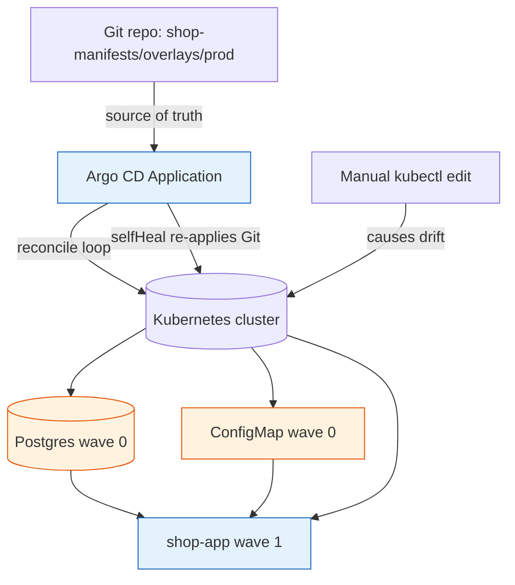

**TL;DR:** GitOps means your Git repo holds the declarative desired state and a controller continuously makes the cluster match it — Argo CD (`argoproj/argo-cd`) and Flux (`fluxcd/flux2`) are the two real implementations. The win is that "deploy" becomes "merge to Git" and the cluster self-heals; the traps are drift you didn't notice, resources syncing in the wrong order, and secrets you can't safely commit.

## 1. What GitOps is (and what it isn't)

A **traditional deploy** is an imperative push: a CI job runs `kubectl apply` or `helm install` against a cluster, and the cluster's state is whatever the last job happened to do. A **GitOps** setup flips this: a Git repository holds the desired state, and a controller *inside* or watching the cluster pulls that state and reconciles the live cluster toward it.

The defining rules:

- **Git is the single source of truth.** The repo says what *should* be; the cluster is just a convergence target.
- **Reconciliation is continuous.** A loop compares live vs desired and closes the gap, so the system self-heals after manual edits or crashes.
- **Changes are Git operations.** You don't deploy by running a command against the cluster; you merge a PR, and the controller picks it up.

This is not just "we store YAML in Git." Plenty of teams do that and still deploy imperatively. GitOps specifically means the *controller* is the thing applying state, and it does so on a loop, not as a one-shot CI step.

## 2. A real example: a repo, an Application, and a drift

Take a Git repo that holds Kubernetes manifests for a small app — a `ConfigMap`, a `Postgres` Deployment, and the app Deployment that depends on both. In Argo CD you describe that repo as an `Application`:

```yaml
apiVersion: argoproj.io/v1alpha1
kind: Application
metadata:
  name: shop
  namespace: argocd
spec:
  project: default
  source:
    repoURL: https://github.com/example/shop-manifests
    path: overlays/prod
    targetRevision: main
  destination:
    server: https://kubernetes.default.svc
    namespace: shop
  syncPolicy:
    automated:
      selfHeal: true
      prune: true
```

The `Application` binds a source (the Git repo at `overlays/prod`) to a destination cluster and namespace, with `automated.syncPolicy` turned on. Now watch what happens when someone runs `kubectl edit deployment shop-app` in the cluster and bumps the replica count by hand:

1. The live Deployment no longer matches the Git manifest.
2. Argo CD's application controller detects the difference and marks the resource `OutOfSync`.
3. Because `selfHeal: true`, the controller immediately re-applies the Git version, reverting the manual edit.

That revert is the whole point: the manual edit was drift, and the loop corrected it. Here is the shape of the system, including a sync wave that orders the dependency:



The `shop-app` is annotated with a higher `syncWave` than Postgres and the ConfigMap, so within a single sync Argo CD brings the dependencies up first and only then the app that needs them.

## 3. How the pieces connect

Two real controllers, two shapes:

- **Argo CD** (`argoproj/argo-cd`) runs an *application controller* plus a *repo-server*. The repo-server fetches and renders manifests (plain YAML, Kustomize, Helm, Jsonnet); the application controller compares them to the live cluster and syncs. You interact through a UI, a CLI, or the `Application`/`ApplicationSet` CRDs, and health assessment tells you not just "synced" but "actually healthy."
- **Flux** (`fluxcd/flux2`) is a set of small, composable controllers built on controller-runtime. `source-controller` defines where state lives (`GitRepository`, `HelmRepository`); `kustomize-controller` applies Kustomize output via the `Kustomization` CRD; `helm-controller` does the same for charts via `HelmRelease`. They communicate through artifacts and custom resources rather than one central server.

The shared mental model is identical: a **source** (Git) holds desired state, a **controller** watches it and the cluster, and a **reconciliation loop** makes live match desired. Flux expresses ordering with `Kustomization.spec.dependsOn`; Argo CD uses `syncWave` annotations. Both can trigger an immediate reconcile via a **webhook** instead of waiting for the polling interval.

## 4. What breaks: the GitOps gotchas

This is the section to internalize before you adopt it.

**Drift you don't notice.** If `selfHeal` is off (or you're on Flux without `prune`/`wait`), a manual edit or an in-cluster operator can quietly diverge from Git. The cluster "works," but it no longer matches the source of truth, so the next sync may surprise you. Always know whether your controller auto-corrects or only reports.

**Sync order blows up dependencies.** If you apply `shop-app` before Postgres exists, the app crashes on startup and may wedge the rollout. Without explicit ordering (`syncWave` in Argo CD, `dependsOn` in Flux), the controller applies resources in arbitrary order within a sync.

**Secrets can't just live in Git.** GitOps says "everything in Git," but a plaintext `Secret` in a public or shared repo is a leak. The naive fix (commit a `Secret`) is a security incident waiting to happen. Real answers are Sealed Secrets (`bitnami-labs/sealed-secrets`), external secret stores (Vault, AWS/GCP secret managers) referenced from Git, or Flux's SOPS-encrypted secrets — never a raw `Secret` object.

**Manual edits fight the loop.** Even with `selfHeal`, someone doing an emergency `kubectl scale` gets silently reverted on the next reconcile, which can look like the fix "didn't stick." The discipline is: the only legitimate change path is a Git commit, and emergency fixes must be committed back or they vanish.

**Image tags that don't update.** If your manifest pins `image: shop-app:1.2.3` and you keep rebuilding `1.2.3`, Git never changes and the controller sees nothing to sync. Use immutable tags or a tool (Argo CD Image Updater, Flux image automation) that writes the new tag back into Git so the loop has something to converge on.

## 5. What to care about when adopting GitOps

If you take one thing from this post: **make Git the only write path, and make the controller's correction behavior explicit and visible.**

- **Pick a controller and learn its reconciliation model** — Argo CD's `Application`/UI or Flux's composable CRDs; both are real and production-grade.
- **Turn on self-healing and pruning deliberately**, and alert on `OutOfSync`/`Degraded` so drift is loud, not silent.
- **Order dependent resources** with `syncWave` (Argo CD) or `dependsOn` (Flux) so databases and config come up before the apps that need them.
- **Handle secrets outside plaintext Git** from day one — Sealed Secrets, SOPS, or an external secret operator.
- **Use immutable image tags plus an image updater** so every real change is a visible Git diff the loop can act on.

## Review checklist

- [ ] A Git repo is the single source of truth; no imperative `kubectl apply` is the deploy path.
- [ ] A controller (Argo CD `Application` or Flux `Kustomization`/`HelmRelease`) reconciles live toward Git on a loop.
- [ ] Drift correction behavior is explicit (`selfHeal`/`prune`) and `OutOfSync`/`Degraded` is alerted.
- [ ] Dependent resources are ordered (`syncWave` or `dependsOn`) so dependencies exist before dependents.
- [ ] Secrets are encrypted or external — no raw `Secret` objects committed to Git.
- [ ] Image tags are immutable and updated via an image updater that writes back to Git.

## FAQ

**Is GitOps only for Kubernetes?** Practically yes for the mature tooling — Argo CD and Flux both target Kubernetes custom resources. The *idea* (Git as source of truth + reconciliation loop) generalizes, but the working implementations everyone runs are Kubernetes controllers.

**Argo CD or Flux — which should I start with?** Argo CD if you want a UI, health assessment, and an `Application`-centric model; Flux if you prefer small composable controllers and Git-first, no-server operation. Both reconcile the same way; the difference is operational shape, not philosophy.

**What if my cluster loses contact with Git?** The last-synced state stays running; the controller just can't detect or correct new drift until connectivity returns. GitOps degrades to "last known good," not "cluster down" — which is usually the safe failure mode.

**Where do I go next?** The deeper posts take each concern one at a time — start with why clusters pull from Git instead of CI pushing to them: [Pull-Based Reconciliation]({{ '/gitops/gitops-pull-based-reconciliation-loop/' | relative_url }}).

## Source

Controller models and CRDs from the real [argoproj/argo-cd](https://github.com/argoproj/argo-cd) and [fluxcd/flux2](https://github.com/fluxcd/flux2) repositories — `Application`/`ApplicationSet` and health assessment in Argo CD; `GitRepository`, `Kustomization`, and `HelmRelease` in Flux. Secret handling via [bitnami-labs/sealed-secrets](https://github.com/bitnami-labs/sealed-secrets).

## Next in the series

→ [Pull-Based Reconciliation]({{ '/gitops/gitops-pull-based-reconciliation-loop/' | relative_url }})
