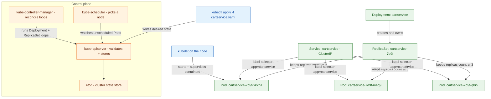

**TL;DR:** A container packages one process and its dependencies; **Kubernetes** is the control loop that decides *where* that container runs, keeps the declared number of copies alive, and gives them a stable name so other containers can find them. Google's real **Online Boutique** `cartservice` is the perfect worked example: one `kubectl apply` flows through the API server, scheduler, and kubelet to produce a Deployment → ReplicaSet → Pod → Service chain — none of which a bare `docker run` would ever give you.
> **In plain English (30 sec):** Think of this like concepts you already use, but in a production system at scale.

## 1. What is Kubernetes (and what a container alone is)

A **container** (built by Docker/containerd from an OCI image) is one isolated process with its own filesystem and network namespace. It runs, and then it stops. That's the whole contract. If the host dies, the container dies with it; if you want five copies, you run the command five times; if a copy crashes, nothing brings it back; and nothing tells other containers where it lives.

**Kubernetes** sits on top of that and answers four questions a container can't:

- **Scheduling** — *which node* should this container run on, given CPU, memory, and placement rules?
- **Self-healing** — if a container or node dies, *who* notices and starts a replacement?
- **Scaling** — *how* do I go from 1 copy to 5 copies of the same container without manual commands?
- **Service discovery** — *what stable name* do other containers use, when the real container IPs keep changing?

The win is that you declare *desired state* in a manifest; a set of control-plane components continuously drives the cluster toward that state. The cost is a real control plane to run and reason about — but that's exactly what this post maps out.

## 2. A real example: the Online Boutique `cartservice`

Google's [Online Boutique](https://github.com/GoogleCloudPlatform/microservices-demo) is a cloud-first e-commerce app — 11 microservices deployed on Kubernetes. Take the **`cartservice`**: it holds a user's shopping cart (backed by Redis) and is called by the frontend during checkout. Here is what Kubernetes actually manages for that one service, end to end:

Walk the arrow path and you see every layer Kubernetes owns:

- **You declare one object.** A `Deployment` manifest saying "run 3 copies of `cartservice`, here is the container image." You never name a node.
- **The Deployment creates a ReplicaSet.** The ReplicaSet is the thing that actually enforces "there shall be exactly 3 Pods matching this template." On every image update the Deployment stands up a new ReplicaSet and drains the old one — that's how rollouts happen without downtime.
- **The scheduler binds each Pod to a node.** The kubelet on that node then starts the container(s). If the node later dies, the ReplicaSet notices the missing Pods and creates replacements elsewhere — self-healing, not luck.
- **A Service gives the three volatile Pods one stable name.** Other services call `cartservice:7070` (DNS) and never learn the underlying Pod IPs, which churn every time a Pod restarts. A Service gives you internal cluster access. For external traffic, you need an Ingress resource (or a LoadBalancer Service), which routes HTTP/HTTPS traffic to Services based on hostname or path.

## 3. The control plane: the machinery behind that chain

The reason the `cartservice` chain works without you babysitting it is a set of control-plane components, all talking through one door:

- **etcd** — the only place cluster state lives. Every object (the Deployment, the Pods, the Service) is a record here.
- **kube-apiserver** — the front door. `kubectl`, the scheduler, the controllers, and the kubelets all read and write state *through* it. It validates and persists; it does not itself run your containers.
- **kube-scheduler** — watches for Pods that have no node assigned and writes the binding ("this Pod goes to node-7"). It decides *where*, never *what*.
- **kube-controller-manager** — runs the reconcile loops, including the Deployment and ReplicaSet controllers that keep reality matching your declared replicas.
- **kubelet** — the agent on every node. It receives the Pods assigned to its node and starts/stops/supervises their containers via the container runtime (containerd/CRI-O). After v1.24 it no longer talks to Docker directly.

The mental model: **you describe the world; the control plane makes the world match the description.** A `docker run` does none of this — it starts one container on one machine and forgets it.

## 4. What breaks: the distributed gotchas

This is the section to internalize before you `kubectl apply` anything serious.

**Pod IPs are not stable, so you must never hardcode them.** A Pod that crashes, gets OOM-killed, or loses its node is deleted and replaced with a *new* UID and a *new* random IP. Any client holding the old IP is now talking to nothing. That is exactly why the **Service** exists: a permanent ClusterIP + DNS name in front of the volatile Pods, routing only to Pods whose `readinessProbe` currently passes. Lose the Service and you are back to chasing IPs by hand.

**"Running" is not "working," so you need probes.** The kubelet's only default health signal is the container's process exit code — a deadlocked, connection-pool-exhausted, still-alive container looks perfectly healthy. **Liveness** probes restart a wedged container; **readiness** probes pull a not-yet-ready or dependency-lost Pod out of Service traffic *without* restarting it; **startup** probes hold the other two off during a slow boot. Skip them and Kubernetes will happily route traffic into a container that can't serve it, and leave a hung one running forever.

**You do not SSH into nodes — and you shouldn't want to.** The kubelet and container runtime own every container's lifecycle. If you hand-fix something on a node (restart a process, edit a file, change a port), the control plane doesn't know, a reschedule throws your fix away, and debugging becomes a guessing game about which node diverged from the manifest. The fix belongs in the manifest (or a ConfigMap/Secret), not on the box. Treat nodes as cattle, not pets.

**A single replica is a single point of failure.** Online Boutique's `cartservice` manifest ships with `replicas` unset, so it defaults to 1. Fine for a demo; in production one node drain takes your cart down. The ReplicaSet only self-heals *after* the failure — it does not prevent the downtime window a single copy guarantees.

## 5. What to care about when adopting Kubernetes

If you take one thing from this post: **Kubernetes manages declared desired state through a control loop — your job is to declare correctly (replicas, probes, Service) and let the plane reconcile, never to hand-manage individual containers.**

**Namespaces** provide logical isolation for multi-tenancy and resource quotas, but they don't provide network isolation by default — that requires NetworkPolicy. A common mistake is assuming Namespace separation means security separation.

**Resource requests and limits** tell the cluster how to treat your Pods: requests tell the scheduler how much CPU/memory a Pod needs, and limits cap the maximum. Without requests, Pods can starve each other; without limits, a single Pod can consume an entire node's resources.

- **Always wrap a workload in a Deployment** (not a bare Pod) so a ReplicaSet owns self-healing and rolling updates.
- **Set `replicas` deliberately** and add a PodDisruptionBudget for anything that must stay available during node drains.
- **Define liveness + readiness probes** so broken or booting containers are restarted or kept out of traffic automatically.
- **Reach every dependency by Service DNS name, never by Pod IP** — the IP behind a Service is a implementation detail that changes constantly.
- **Put config and secrets in ConfigMaps/Secrets**, not baked into the image or edited on a node.

## Review checklist

- [ ] The workload is a `Deployment` (not a bare Pod), with `replicas` set explicitly for anything production-facing.
- [ ] A `Service` fronts the Pods so clients use a stable DNS name, not a churning Pod IP.
- [ ] `livenessProbe` and `readinessProbe` are defined so broken/booting Pods are restarted or held out of traffic.
- [ ] Dependencies are addressed by Service name + port (zero hardcoded Pod IPs).
- [ ] Config and credentials live in ConfigMaps/Secrets, not on nodes or images.

## FAQ

**Is Kubernetes only useful if I have containers already?** You need a container (or at least an OCI image) to run a workload in Kubernetes — that's its unit of execution. But "I have a container" and "I have orchestration" are different milestones: the container gives you isolation and portability; Kubernetes adds scheduling, self-healing, scaling, and discovery across many nodes.

**Why can't the scheduler just run my container directly?** It can't, because "run this container" requires several distinct decisions spread across components: the API server must persist the intent, the scheduler must pick a node, the kubelet must start it, and a controller must replace it if it dies. Those are separate reconcile loops, which is why a Deployment produces a ReplicaSet that produces Pods — each layer owns one concern.

**What is the difference between a Pod and a container?** A container is one running image. A Pod is Kubernetes' atomic scheduling and lifecycle unit — usually one container, but possibly several that share a network namespace and volumes and are always placed together on one node. The scheduler places Pods; the kubelet supervises the containers inside them.

## Source

Example system, service topology, and the `cartservice`/`frontend` manifests from Google's real [microservices-demo (Online Boutique)](https://github.com/GoogleCloudPlatform/microservices-demo) repository — 11 services across 5 languages communicating over gRPC, deployed on Kubernetes. Control-plane component responsibilities (etcd, kube-apiserver, kube-scheduler, kube-controller-manager, kubelet) follow the upstream [kubernetes/kubernetes](https://github.com/kubernetes/kubernetes) architecture.

## Next in the series

→ [Kubernetes Control Plane: How a Cluster Bootstraps Itself Before an API Server Exists]({{ '/kubernetes/kubernetes-control-plane-bootstrap-static-pods/' | relative_url }})

