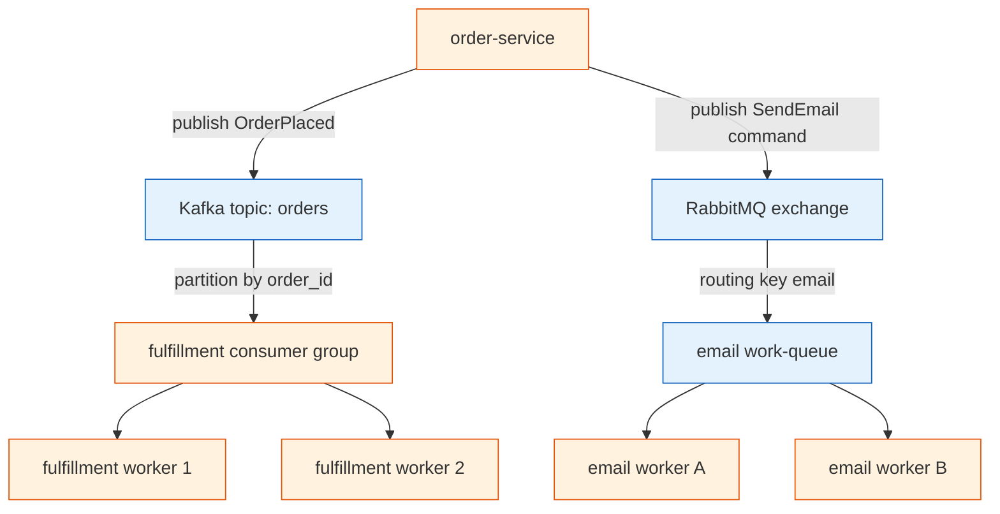

**TL;DR:** Messaging is how services talk by writing to a broker instead of calling each other directly — Apache Kafka gives you a replayable partitioned log read by consumer groups, RabbitMQ gives you routed queues drained by workers. The hard part isn't connecting them; it's that at-least-once delivery means duplicates, partitions mean ordering is per-key, and one bad message can stall a whole queue.

> **In plain English (30 sec):** Code you already write — Map, function, API call, just bigger.

## 1. What is messaging (and what it isn't)

A **direct call** is one service invoking another over the network and waiting for the answer — like gRPC from the microservices post. **Messaging** replaces that "call and wait" with "write to a broker and move on": the producer sends a message and returns immediately, and the broker holds it until a consumer is ready to read it.

The win is decoupling: the producer never knows who consumes, how many there are, or whether they are even running right now. The cost is that you no longer get an immediate answer, and you inherit a set of delivery problems — duplicates, ordering, and stuck messages — that a function call never had.

## 2. A real example: an order pipeline

Imagine an e-commerce system where `order-service` takes a purchase. Instead of calling fulfillment and email directly, it **publishes an event** to a broker and forgets about it. Two independent downstream systems react on their own schedule:

- A **fulfillment consumer group** reads the "order placed" event from Kafka and starts packing.
- A **RabbitMQ work-queue** carries a "send confirmation email" command to one of several email workers.

Here is the shape of that system, grounded in how [apache/kafka](https://github.com/apache/kafka) and [rabbitmq/rabbitmq-server](https://github.com/rabbitmq/rabbitmq-server) actually behave:

Look at what this tells you about messaging in practice:

- **The producer is done after one write.** `order-service` publishes once and returns; fulfillment and email are someone else's problem.
- **Two different delivery models coexist.** The Kafka topic broadcasts the event to a consumer group; the RabbitMQ queue load-balances a command across email workers.
- **Failure is isolated.** If the email workers are down for an hour, `order-service` and fulfillment are unaffected — the message waits in the queue or log.

## 3. How the pieces connect: Kafka vs RabbitMQ

Both are brokers, but they are built around opposite ideas, and the difference matters for correctness.

**Kafka** is a partitioned, append-only **log**. A topic is split into partitions; a producer uses a partition key (e.g. `order_id`) so all events for one order land on the same partition in order. A **consumer group** splits the partitions among its members — each partition is read by exactly one member — and the group commits one offset (the position marker in a partition's log) per partition to track progress. Because the log is durable, a consumer can rewind and replay.

**RabbitMQ** is a routed **queue** system built on AMQP. A producer publishes to an **exchange**, which uses the message's **routing key** and the queue **bindings** to decide which queues get a copy. A worker pulls a message, processes it, and **acknowledges** it — at which point RabbitMQ deletes it. There is no replay: once acked, it is gone.

The practical split:

- **Use Kafka** when many independent systems need the same event stream, when you need replay, or when throughput and ordering-per-key dominate.
- **Use RabbitMQ** when you need flexible routing, per-message ack, and a simple work-queue where each task is done at-least-once (with manual deduplication for exactly-once behavior) by one worker.

For synchronous request/response you would still reach for [grpc/grpc](https://github.com/grpc/grpc); for pushing live updates to browsers, [dotnet/aspnetcore](https://github.com/dotnet/aspnetcore) SignalR over WebSocket is the realtime layer — messaging brokers are for backend-to-backend integration, not direct user push.

## 4. What breaks: the delivery gotchas

This is the section to internalize before you wire a broker into anything important.

**Duplicate delivery.** Both Kafka and RabbitMQ default to **at-least-once**: a message is resent if the consumer crashes before acknowledging. If fulfillment processes an order, then dies before committing its offset, it reprocesses the same order on restart — and you ship two boxes. The fix is an **idempotent consumer** that deduplicates on a message or business ID.

**Lost ordering.** Ordering is guaranteed only *within a partition*, not across a topic. If you partition by `user_id` but need per-`order_id` order, events for the same order can land on different partitions and be processed out of sequence. Choose the partition key to match the ordering you actually need.

**Poison messages.** A malformed or always-failing message can be requeued forever, blocking a RabbitMQ queue, or be endlessly retried by a Kafka consumer, driving up lag. Route failures to a **dead-letter queue** after a retry budget so one bad record doesn't stall healthy traffic.

**Consumer lag.** If consumers can't keep up, Kafka partitions pile up unread (lag grows) and RabbitMQ queues grow. Without **backpressure** or scaling the consumer group up to the partition count, a brief slowdown becomes a long backlog and stale data.

**Exactly-once semantics in Kafka.** Kafka does offer exactly-once delivery, but only through its transactional API combined with an idempotent producer (`enable.idempotence=true`). This locks the producer to a single transactional session and forces all consumers in the group to read at `read_committed` isolation, which adds latency and reduces throughput. Because the cost is high, most systems settle for at-least-once delivery with idempotent consumers rather than paying for true exactly-once.

## 5. What to care about when designing with messaging

If you take one thing from this post: **pick the broker to match the delivery model, and design consumers to survive duplicates and bad messages.**

- **Decide pub/sub vs point-to-point per message** — broadcast events through Kafka topics, load-balance commands through RabbitMQ queues.
- **Choose the partition key deliberately** so the ordering you rely on is actually preserved.
- **Make every consumer idempotent** — dedupe on a message or business ID, because at-least-once will hand you the same message twice.
- **Plan for poison messages** with a dead-letter queue and a retry budget from day one.
- **Watch lag and scale the consumer group** up to (but not beyond) the partition count.

## Review checklist

- [ ] The broker choice (Kafka log vs RabbitMQ queue) matches the delivery model (broadcast vs load-balance).
- [ ] Kafka partition key preserves the ordering the business actually depends on.
- [ ] Every consumer is idempotent and safe under at-least-once redelivery.
- [ ] A dead-letter queue catches poison messages after a bounded retry count.
- [ ] Consumer-group size does not exceed the partition count, and lag is monitored.

## FAQ

**Is messaging always better than calling a service directly?** No. If you need an immediate answer to make the next decision, a synchronous gRPC call is simpler and clearer. Messaging pays off when you want decoupling, replay, fan-out, or buffering against slow downstreams — not for "I need the result now."

**Why would I run both Kafka and RabbitMQ?** They solve different problems. Kafka is for high-throughput, replayable event streams consumed by many systems; RabbitMQ is for routed, acked work items handled by one worker. Real systems often use Kafka for the event backbone and RabbitMQ for task queues, as in the order example above.

**Where do I start reading next?** The deeper posts take each concern one at a time — start with the vocabulary so the later mechanics make sense: [Messaging Key Terms]({{ '/messaging/messaging-key-terms/' | relative_url }}).

## Source

Mechanics and component names grounded in the real [apache/kafka](https://github.com/apache/kafka) repository (partitioned, replicated commit log; consumer groups; offset commits to `__consumer_offsets`) and [rabbitmq/rabbitmq-server](https://github.com/rabbitmq/rabbitmq-server) (AMQP exchanges, bindings, routing keys, and consumer acknowledgements). Synchronous and realtime contrasts drawn from [grpc/grpc](https://github.com/grpc/grpc) (Protobuf RPC over HTTP/2) and [dotnet/aspnetcore](https://github.com/dotnet/aspnetcore) (SignalR over WebSocket).

## Next in the series

→ [Messaging Key Terms]({{ '/messaging/messaging-key-terms/' | relative_url }})

