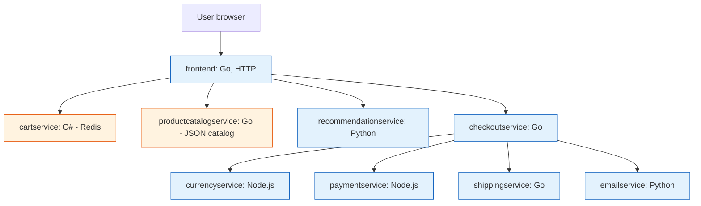

**TL;DR:** A microservice is one deployable unit that owns one job and its own data, and talks to others over the network. Google's real **Online Boutique** demo is 11 such services (cart, checkout, payment, shipping…) in 5 languages — a perfect worked example. The hard part isn't splitting the code; it's that every call can fail, every service owns its own database, and one purchase now spans five network hops.

## 1. What is a microservice (and what it isn't)

A **monolith** is one process: the cart, the catalog, and the checkout are functions that call each other in memory and share one database. A **microservice** breaks that into independent deployable units — each owns a single responsibility and exposes it over the network, usually via an API.

The win is isolation: you scale, deploy, and choose a language for *one* service without touching the others. The cost is that "call a function" becomes "call a service over the network," and the network is where all the interesting failures live.

## 2. A real example: Online Boutique

Google's [Online Boutique](https://github.com/GoogleCloudPlatform/microservices-demo) is a cloud-first e-commerce app — browse, add to cart, check out. It is **11 microservices written in 5 languages** (Go, C#, Node.js, Python, Java) talking to each other over **gRPC**. Here is the shape of the system:

Look at what this tells you about microservices in practice:

- **Each service does one job.** `currencyservice` only converts money; `adservice` only serves text ads.
- **Languages are mixed on purpose.** The cart team chose C# and the frontend team chose Go — neither decision affects the other.
- **The frontend is the only HTTP face; everything behind it is gRPC.** Users never call `paymentservice` directly.

## 3. How the pieces talk

Two communication shapes show up immediately:

- **Synchronous request/response** for "I need an answer now": the frontend asks `productcatalogservice` for the catalog, and `checkoutservice` *orchestrates* a purchase by calling `paymentservice`, `shippingservice`, and `emailservice` in sequence.
- **The orchestrator pattern**: `checkoutservice` is the one that knows the *order* of a purchase. It retrieves the cart, charges payment, asks for shipping, then triggers the confirmation email.

This is already more involved than a monolith's `checkout()` method, which would just call three in-process functions.

## 4. Data ownership — the part monoliths hide

In a monolith, one database holds the cart, the catalog, and the orders. In Online Boutique, **each service owns its own store**:

- `cartservice` keeps the cart in **Redis**.
- `productcatalogservice` serves the catalog from a **JSON file**.
- `checkoutservice` prepares an order but doesn't persist it in someone else's database.

This is the defining rule of microservices: **a service owns its data and exposes it only through its API.** No other service reads its database directly. That independence is what lets teams move fast — and what makes "join these two tables" impossible.

## 5. What breaks: the distributed gotchas

This is the section to internalize before you split anything.

**The purchase is now a distributed transaction.** When `checkoutservice` calls payment, shipping, and email, any of those can fail *after* a previous one succeeded. If payment succeeds but `emailservice` is down, do you roll back the payment? A monolith would wrap it all in one database transaction; across services you can't. The standard answers are the **Saga** pattern (compensating actions) and the **Outbox** pattern (publish events reliably) — covered in later posts.

**Every call can fail.** A function call never times out; a gRPC call to `currencyservice` absolutely can. You now need timeouts, retries, and circuit breakers, or one slow service takes down the checkout.

**You can't see it without instrumentation.** When a monolith is slow, one profile tells you where. When `checkoutservice` is slow, the cause might be `paymentservice` or the network between them — so you need **distributed tracing** to follow one request across five services.

**Deployment multiplies.** Eleven services mean eleven build/deploy pipelines, eleven health checks, and eleven things that can be misconfigured.

## 6. What to care about when designing microservices

If you take one thing from this post: **split along business boundaries, not technical layers, and assume the network is hostile.**

- **Decompose by bounded context** — the cart and the catalog are different domains owned by different teams, so they're different services.
- **Let each service own its data** and never share a database.
- **Pick sync vs async deliberately** — orchestration for "I need the result," events for "tell the next thing it happened."
- **Plan for failure** — timeouts, retries with backoff, circuit breakers from day one.
- **Build observability in** — structured logs, metrics, and distributed tracing, because you can't debug what you can't see.

## Review checklist

- [ ] Each service has one responsibility and its own datastore (no shared DB).
- [ ] Communication style (sync gRPC vs async events) is chosen per call, not by default.
- [ ] Timeouts, retries, and a circuit breaker sit in front of every cross-service call.
- [ ] Distributed tracing follows a request across all services.
- [ ] Each service deploys and scales independently.

## FAQ

**Is microservices always better than a monolith?** No. A monolith is simpler to build, deploy, and reason about. Microservices pay off when independent scaling, team autonomy, or technology choice per component matter more than the operational overhead they add.

**Why so many languages in one app?** Online Boutique is a *demo* of polyglot freedom; in production you'd usually limit languages to keep the team's operational expertise broad. The point it proves is that services are independently deployable, so language is a local choice.

**Where do I start reading next?** The deeper posts take each concern one at a time — start with how to actually draw the boundaries: [Service Decomposition & Bounded Contexts]({{ '/microservices/service-decomposition-and-bounded-contexts/' | relative_url }}).

## Source

Example system and service topology from Google's real [microservices-demo (Online Boutique)](https://github.com/GoogleCloudPlatform/microservices-demo) repository — 11 services across 5 languages communicating over gRPC, deployed on Kubernetes.

## Next in the series

→ [Service Decomposition & Bounded Contexts]({{ '/microservices/service-decomposition-and-bounded-contexts/' | relative_url }})
