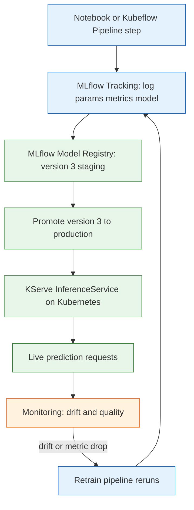

**TL;DR:** MLOps is the discipline of turning a trained model into a reliable production service and keeping it that way. The worked path is concrete: train in a notebook, log the artifact to the **MLflow** registry, deploy it as a **KServe** `InferenceService` on Kubernetes, and watch it for drift — and the parts that break are skew, drift, and "I can't reproduce that run."

## 1. What is MLOps (and what it isn't)

A **data science notebook** is where a model is *born*: you load a CSV, fit a scikit-learn `RandomForestClassifier`, and print 0.94 accuracy. **MLOps** is everything that has to happen after that for the model to actually answer real requests, correctly, for months — packaging, deployment, monitoring, and retraining.

The win is reliability: a model in production is a *service* with latency, uptime, and correctness guarantees, not a file on a laptop. The cost is that "fit and predict" becomes "track the run, register the version, ship it behind an endpoint, and prove it still works next week."

## 2. A real example: from MLflow run to KServe endpoint

We'll use three real projects. **[mlflow/mlflow](https://github.com/mlflow/mlflow)** logs and registers the model. **[kserve/kserve](https://github.com/kserve/kserve)** serves it on Kubernetes. **[kubeflow/kubeflow](https://github.com/kubeflow/kubeflow)** orchestrates the training pipeline that produces it. Here is the shape of the system:



Walk the path with a concrete worked example — a churn model:

**Step 1: train and log to MLflow.** The training script logs parameters, metrics, and the model artifact. MLflow records it as run `abc123` and we register it.

```python
import mlflow
import mlflow.sklearn
from sklearn.ensemble import RandomForestClassifier
from sklearn.metrics import roc_auc_score

mlflow.set_tracking_uri("http://mlflow:5000")
mlflow.set_experiment("churn")

with mlflow.start_run() as run:
    clf = RandomForestClassifier(n_estimators=200, max_depth=8)
    clf.fit(X_train, y_train)
    auc = roc_auc_score(y_test, clf.predict_proba(X_test)[:, 1])
    mlflow.log_param("n_estimators", 200)
    mlflow.log_metric("auc", auc)
    mlflow.sklearn.log_model(clf, "model", registered_model_name="churn-model")
```

**Step 2: register and promote.** In the MLflow UI (or API) the run's artifact becomes `churn-model` version 3. You move it from `None` to `Staging`, run evaluation gates, then to `Production`.

**Step 3: deploy via KServe.** The registry artifact is pulled by KServe and wrapped in an `InferenceService` — a Kubernetes custom resource that exposes a standardized predict endpoint with autoscaling.

```yaml
apiVersion: serving.kserve.io/v1beta1
kind: InferenceService
metadata:
  name: churn-model
spec:
  predictor:
    model:
      modelFormat:
        name: mlflow
      storageUri: s3://models/churn-model/3
```

**Step 4: monitor for drift.** Live requests hit the endpoint; a monitoring layer compares incoming feature distributions and delayed ground-truth accuracy against baselines, and when they cross a threshold it triggers a retrain.

## 3. How the pieces connect

Three roles show up immediately:

- **MLflow is the source of truth for the artifact.** It tracks every run and versions each registered model, so the thing KServe deploys is a specific, auditable version — not "whatever was on the laptop."
- **KServe is the serving runtime.** It takes that versioned artifact and turns it into a scalable Kubernetes endpoint with a uniform predict protocol, so the deploy manifest is identical regardless of whether the model is sklearn, XGBoost, or PyTorch.
- **Kubeflow is the orchestrator.** Its Pipelines component runs training as a DAG of containerized steps (ingest, train, evaluate, register) so the run that produced version 3 is reproducible and re-runnable, not a one-off script.

This is already more involved than `clf.predict()` in a notebook, which would just score in memory with no versioning, no endpoint, and no drift watch.

## 4. Why a feature store matters (the data half)

In the notebook, features are columns you engineered inline. In production, those same features must be computed on live requests with identical logic. That gap is where the worst bugs live, which is why a **feature store** (Feast, Tecton) appears between training and serving: it serves historical features to MLflow for training and low-latency features to KServe for inference from one definition. The model is only as consistent as its features, so the store is what keeps training and serving reading the same world.

## 5. What breaks: the MLOps gotchas

This is the section to internalize before you ship a model.

**Training/serving skew.** If the feature `purchase_count_30d` is computed one way in the notebook and a different way in the KServe pre-processing, the model is trained on data it never sees live. It scores 0.94 offline and falls over in production — and the bug is invisible until users hit it. The fix is one shared feature definition (a feature store) rather than duplicated logic.

**Drift.** Even with perfect skew control, the world moves. Feature drift shifts the inputs (a price spike changes `income`-derived features); concept drift shifts the input-to-target relationship (fraudsters change tactics). The model's weights are frozen, so accuracy decays silently while every infrastructure metric stays green. You catch it only by monitoring prediction distributions and delayed ground truth, not by watching pod health.

**Reproducibility loss.** If you didn't pin the data version, library versions, and random seed in MLflow, you cannot rebuild version 3 to investigate why it failed, and you cannot prove what data it learned from. A model you can't reproduce is a model you can't trust or audit — which is why experiment tracking is not optional.

**Deployment multiplies risk.** Promoting a model is a traffic change, not a code deploy; a bad version can serve wrong predictions to real users within seconds, so you need canary rollouts, shadow deployments, and fast rollback to a prior registry version.

## 6. What to care about when doing MLOps

If you take one thing from this post: **treat the model as a versioned, monitored service, and make training and serving read the same data.**

- **Track every run** in MLflow — params, metrics, data version, artifact — so any model is reproducible.
- **Register and version models** so rollback is a re-point, not a rebuild.
- **Deploy through KServe** (or equivalent) so serving is scalable and uniform across frameworks.
- **Kill skew at the source** with a shared feature definition between training and serving.
- **Monitor drift and quality**, not just infrastructure, because a healthy pod can serve a silently wrong model.
- **Gate promotion** with evaluation and canary/shadow deploys before full traffic.

## Review checklist

- [ ] Every training run is logged to MLflow with params, metrics, and the model artifact.
- [ ] The served model is a specific registered version, not an ad-hoc file.
- [ ] Training and serving compute features from one shared definition (no duplicated logic).
- [ ] Deployment uses canary or shadow traffic before full cutover, with rollback to a prior version.
- [ ] Monitoring watches feature drift, prediction distribution, and accuracy against delayed ground truth.
- [ ] The run that produced the live model is reproducible (pinned data, libs, seed).

## FAQ

**Is MLOps just DevOps for ML?** No. CI/CD is part of it, but the artifact is a model whose correctness depends on data and decays over time, so you also need experiment tracking, registries, drift monitoring, and feature consistency — concerns ordinary software deployment doesn't have.

**Do I need Kubernetes to do MLOps?** Not for the fundamentals. MLflow alone gives you tracking and a registry; you can serve with a Flask app. Kubernetes and KServe become worth it when you need autoscaling, scale-to-zero, and standardized canaries across many models.

**Why can't I just re-fit the model monthly by hand?** You can, early on. But without tracking you can't tell which data version produced the current model, and without monitoring you won't know it's already degraded until business metrics drop. MLOps is the automation that makes "fit and forget" safe.

**Where do I start reading next?** The deeper posts take each concern one at a time — start with the vocabulary used across every MLOps post: [MLOps Key Terms]({{ '/mlops/mlops-key-terms/' | relative_url }}).

## Source

Tooling and workflow grounded in three real repositories: **[mlflow/mlflow](https://github.com/mlflow/mlflow)** (Tracking, Models, and the Model Registry), **[kserve/kserve](https://github.com/kserve/kserve)** (the `InferenceService` Kubernetes resource and standardized predict protocol), and **[kubeflow/kubeflow](https://github.com/kubeflow/kubeflow)** (Pipelines for orchestrating reproducible training). The feature-store role follows the Feast/Tecton pattern referenced throughout the MLOps curriculum.

## Next in the series

→ [MLOps Key Terms]({{ '/mlops/mlops-key-terms/' | relative_url }})
