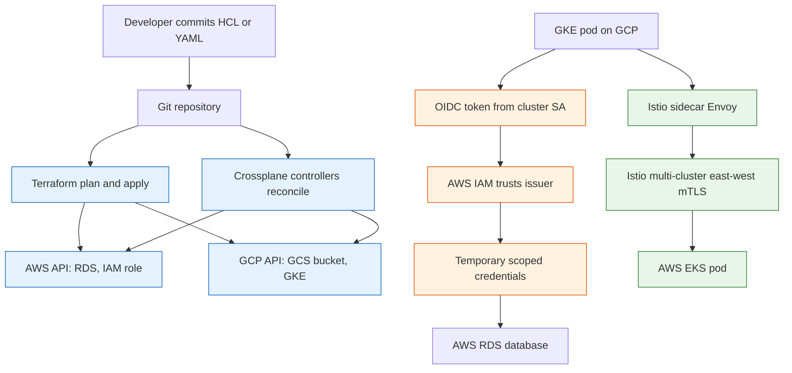

**TL;DR:** Multi-cloud means declaring your infrastructure once and reconciling it across more than one provider — Terraform plans the diff, Crossplane runs it as a Kubernetes control plane, and Istio wires the clusters together — but state locking, egress cost, identity federation, and latency are where it actually breaks.

## 1. What multi-cloud is (and what it isn't)

A **single-cloud** setup puts everything in one provider's API surface: one IAM model, one VPC, one bill. **Multi-cloud** spreads workloads across two or more providers (say AWS and GCP) so no single control plane is a hard dependency.

The point is *not* "run the same app twice for fun." It is resilience against a provider outage, leverage in pricing, and the freedom to use the best-managed service per job. The cost is real: every provider has a different IAM dialect, a different network primitive, and a different way of billing egress — and your tooling has to reconcile all three.

## 2. A real example: an app on AWS + GCP

Imagine a checkout service. We want its database on AWS RDS and its object storage on GCP Cloud Storage — picking the best service per need, not for dogma. Two real engines can stand this up:

- **Terraform** (hashicorp/terraform) reads one set of `.tf` files and calls both the AWS and GCP APIs, recording what it built in a state file.
- **Crossplane** (crossplane/crossplane) runs *inside* a Kubernetes cluster and treats both clouds as custom resources it continuously reconciles.

The identity story is the part that usually surprises people. The checkout pod on GCP should be allowed to read the AWS RDS secret *without* a static key copied into a file. That is **workload identity federation** via **OIDC**: the pod presents a short-lived token signed by its cluster; AWS IAM trusts that token issuer and hands back temporary, scoped credentials. No secret at rest.

## 3. How the pieces connect

Here is the whole shape — declare once, reconcile across clouds, federate identity, mesh the traffic:

Reading the diagram top to bottom:

- **Declare once.** Whether you write HCL (Terraform) or custom resources (Crossplane), you describe the *desired* state, not the steps to build it.
- **Reconcile across both clouds.** Terraform computes a plan and applies it; Crossplane's controllers keep re-checking and fixing drift. Both end up calling AWS and GCP APIs.
- **Federate identity, don't ship secrets.** The GCP pod proves who it is with an OIDC token; AWS IAM maps that claim to a role and returns temporary creds.
- **Mesh the traffic.** Istio (istio/istio) puts an Envoy sidecar next to each pod and programs east-west mTLS across the two clusters so services talk as if on one network.

## 4. What breaks: the multi-cloud gotchas

This is the section to internalize before you commit to two providers.

**State locking and concurrent applies.** Terraform's state is the source of truth for diffs. If two engineers (or two CI jobs) run `apply` at once, they can corrupt it — so you use a *remote* backend with a lock (e.g. an S3 DynamoDB lock or GCS). Crossplane avoids this class of bug by storing state in the Kubernetes etcd and reconciling, not by locking a file.

**Egress cost.** The killer line item. A chatty checkout pod on GCP that reads from AWS RDS on every request pays cross-provider egress *per gigabyte* — quietly, because it shows up only on the receiving provider's bill. Co-locate chatty callers with their data; use the mesh for control-plane traffic, not bulk data movement.

**Identity federation mismatch.** OIDC federation only works if the cloud's IAM trusts your token issuer *and* the claims line up. A mismatch (wrong audience, wrong subject claim) fails closed — the pod gets no credentials and the call 403s. Each provider models trust differently, so this is bespoke per cloud.

**Network latency across the gap.** Two clusters in different providers are not on one VPC. East-west calls traverse the public internet (or an expensive interconnect), so a 2 ms in-cluster call becomes 40-80 ms cross-cloud. Keep strongly-coupled services in one cluster; use multi-cluster only for failure isolation or locality, not for tight request loops.

## 5. What to care about when designing multi-cloud

If you take one thing from this post: **declare intent once, federate identity instead of shipping secrets, and treat cross-provider network and egress as a first-class design constraint.**

- **Pick one provisioning model** — Terraform for plan/apply workflows, Crossplane for Kubernetes-native continuous reconciliation — and use it consistently.
- **Federate, don't hardcode credentials.** Use OIDC workload identity so pods get short-lived, scoped tokens; rotate by expiry, not by ticket.
- **Model the network before the app.** CIDR plans, peering/interconnect, and DNS failover decisions shape what is even possible later.
- **Watch egress from day one.** Put a budget alert on cross-provider data transfer; co-locate chatty pairs.
- **Plan for drift.** Terraform `plan` in CI; Crossplane/GitOps reconcile continuously so reality can't silently diverge from Git.

## Review checklist

- [ ] Infrastructure is declared once (HCL or Crossplane XR) and applied across both providers from that single source.
- [ ] Terraform uses a remote backend with state locking, or Crossplane runs as a Kubernetes control plane.
- [ ] Workloads use OIDC workload identity federation — no static keys stored in the cluster.
- [ ] Cross-provider egress is budgeted and chatty callers are co-located with their data.
- [ ] East-west traffic crosses clusters only over Istio mTLS, not plaintext internet.
- [ ] A drift check (Terraform plan in CI, or GitOps reconcile) runs on a schedule.

## FAQ

**Do I need both Terraform and Crossplane?** No. Terraform is a good fit if you want explicit plan/apply and Git-triggerred runs; Crossplane fits if your platform already lives in Kubernetes and you want continuous reconciliation. Many teams use Terraform for the landing zone and Crossplane for workload-level infra.

**Isn't running two clouds just twice the operational cost?** Often yes, which is why multi-cloud is a deliberate trade for resilience or best-of-breed services, not a default. The 101 shows the minimum: one app, two providers, one identity model, one mesh.

**Why Istio and not just a load balancer?** A global load balancer handles north-south (user to edge) traffic and failover. The mesh handles east-west (service to service) mTLS and routing *across* clusters, which an LB does not. They solve different layers.

**Where do I start reading next?** The deeper posts take each concern one at a time — start with how to declare infra as a control plane: [Crossplane Deep Dive]({{ '/multicloud/crossplane-deep-dive/' | relative_url }}).

## Source

Mechanisms grounded in real repositories: [hashicorp/terraform](https://github.com/hashicorp/terraform) (declarative plan/apply and remote state backends), [crossplane/crossplane](https://github.com/crossplane/crossplane) (Kubernetes control plane that reconciles managed resources and composites toward external clouds), and [istio/istio](https://github.com/istio/istio) (Envoy sidecar data plane with the `istiod` control plane for multi-cluster mTLS and traffic management). OIDC workload identity federation follows each provider's IAM trust-principal model (AWS IAM OIDC provider, GCP Workload Identity).

## Next in the series

→ [Crossplane Deep Dive]({{ '/multicloud/crossplane-deep-dive/' | relative_url }})
