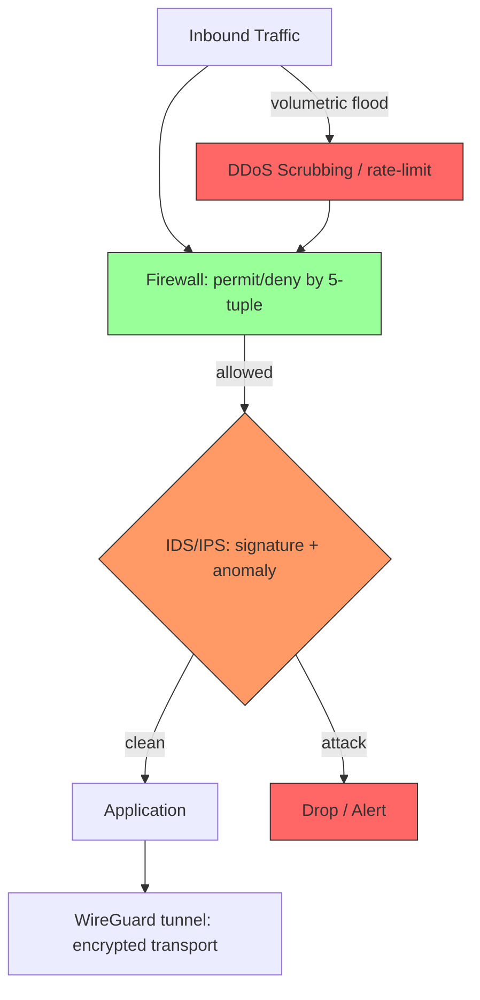
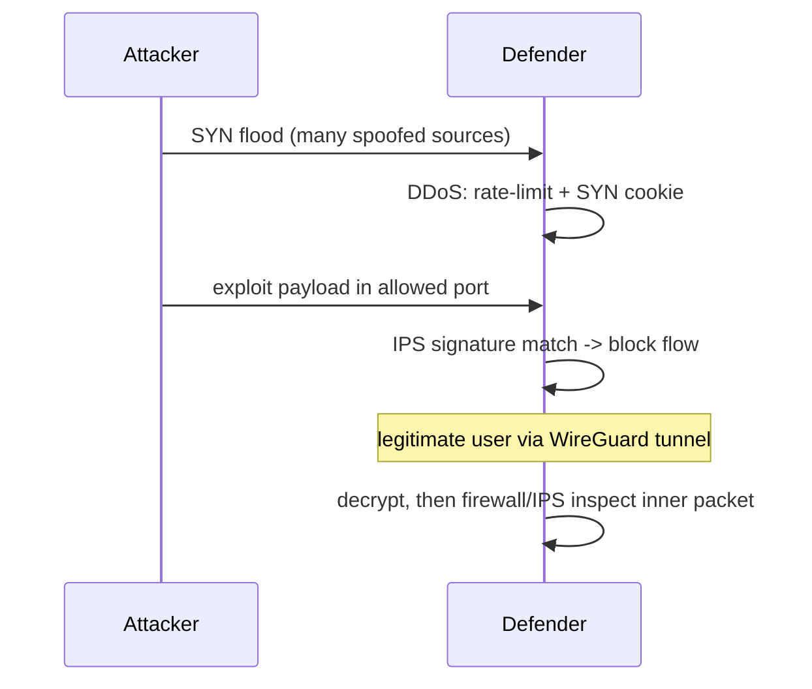

**TL;DR:** How do you keep a network both reachable and safe? Layer defenses: **firewalls** enforce per-packet/per-flow policy, **IDS/IPS** detect and block intrusion patterns, and **DDoS mitigation** absorbs volumetric floods — with encrypted tunnels (VPN) protecting the transport itself.

**Real repo:** [WireGuard/wireguard-linux](https://github.com/WireGuard/wireguard-linux) — a modern, minimal VPN tunnel that secures the transport layer, the foundation under the other defenses.

## 1. The Engineering Problem

A connected network is attackable on three axes at once: unauthorized *access* (who may talk), malicious *content* (what they send), and *overwhelm* (too much of it). No single tool covers all three, so defenses are layered (defense in depth).

## 2. The Technical Solution





**Core truths:**
- A **firewall** is a policy enforcement point (stateless packet filter or stateful/NGFW doing DPI) — the gatekeeper.
- **IDS** watches and alerts; **IPS** watches and *acts* (drops/blocks) — same detection, different response posture.
- **DDoS mitigation** is mostly about absorbing or scattering volumetric load (anycast, scrubbing, rate-limiting), not deep inspection.
- A **VPN tunnel** (e.g., WireGuard) encrypts and authenticates transport, shrinking the attack surface before the other layers even see plaintext.

## 3. The clean example

WireGuard's design philosophy — a tiny, auditable tunnel — shows how transport security is reduced to a minimal trusted core. Its peer model binds allowed traffic to authenticated keys rather than open ports:

```c
/* conceptual — WireGuard associates peers with allowed IPs */
struct wg_peer {
    u8 public_key[32];          /* Curve25519 identity */
    struct allowedip *allowedips; /* which src/dst this peer may carry */
    struct noise_keypairs keypairs;/* rotating symmetric session keys */
};
/* Only packets from a peer whose key matches and whose source IP is
   in allowedips are accepted — firewall-by-cryptography. */
```

Compared to stateful firewalls that keep per-flow tables, WireGuard's "cryptokey routing" is a firewall expressed as authenticated routes — every accepted packet is provably from a known peer.

## 4. Production reality

WireGuard keeps peers as first-class, reference-counted objects — the secure analog of a firewall session table. While the exact `peer.c` path is environment-dependent, the kernel module's `struct wg_peer` and `allowedips` trie are the mechanism by which a tunnel endpoint *is* an access-control list: traffic not matching an authenticated peer+allowed-IP pair is simply dropped.

The defense-in-depth stack then layers on top:
- **Firewall** — the 5-tuple gate (or NGFW DPI) in front of everything.
- **IDS/IPS** — signature/anomaly detection on the inspected flows.
- **DDoS** — volumetric absorption (anycast + scrubbing centers) so the firewall/IPS aren't starved.

> Layering callout: (1) DDoS scrubbing edge → (2) firewall perimeter → (3) IDS/IPS inline → (4) WireGuard/TLS encrypted transport → (5) application. Each layer assumes the outer ones may leak and compensates.

**What this teaches:** security is concentric, not a single box. The firewall answers "may you speak," IPS answers "is what you say malicious," DDoS answers "can we stay up," and the tunnel answers "can anyone even read this." WireGuard shows the tunnel can itself be the first firewall.

**Stale facts:** HTTP/2 fixed HTTP HOL but TCP HOL persists — HTTP/3/QUIC fixes both; TLS 1.3 removed static RSA key exchange — only ECDHE/DHE, forward secrecy by default; DNS round-robin dead at scale — clients cache A records; "firewalls inspect packets" oversimplified — modern stateful/NGFW do DPI.

## 5. Review checklist

- Is there a perimeter firewall (stateless or stateful/NGFW) enforcing the 5-tuple or DPI policy?
- Is intrusion detection wired to an active prevention response (IPS), not just alerts?
- Is volumetric DDoS absorbed upstream (anycast/scrubbing) before it hits the app?
- Is the transport itself encrypted/authenticated (VPN/TLS) so the surface is minimized?

## 6. FAQ

- **Firewall vs IPS — do I need both?** Yes: firewall enforces access; IPS enforces behavior on allowed flows.
- **IDS or IPS?** IDS alerts (out-of-band); IPS blocks inline. IPS is better for active threats if it won't false-positive.
- **Can DDoS be stopped by a firewall?** Not volumetric floods — firewalls get overwhelmed; you need upstream absorption/scrubbing.
- **How does a VPN help security?** It encrypts and authenticates transport, so eavesdroppers and spoofers are excluded before app-layer inspection.
- **Is "firewalls inspect packets" still true?** Only for stateless filters; modern NGFWs do deep packet inspection and app-layer policy.

## Source

- **Concept:** firewall enforcement, IDS/IPS detection-vs-prevention, DDoS volumetric mitigation, VPN tunnel security
- **Domain:** networking
- **Repo:** WireGuard/wireguard-linux → [src/device/peer.c](https://github.com/WireGuard/wireguard-linux/blob/master/src/device/peer.c) — `struct wg_peer`, cryptokey routing as firewall-by-cryptography
