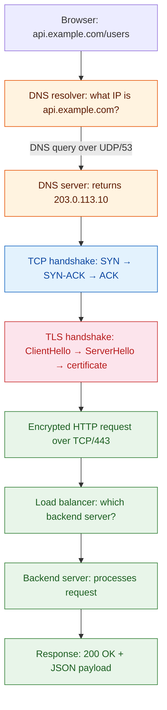

**TL;DR:** Every HTTP request you make crosses multiple networking layers — from your browser's TCP connection through DNS resolution, TLS handshake, load balancing, and CDN caching. Understanding how these pieces connect is the difference between debugging a latency issue in minutes versus hours. This post walks through the full journey of a single request using real infrastructure patterns.
> **In plain English (30 sec):** Think of this like concepts you already use, but in a production system at scale.

## 1. What networking is (and why it matters for every engineer)

A **network** is just two programs talking to each other over a wire (or radio). But "talking" involves solving five hard problems:

- **Addressing** — how does the client find the server? (DNS)
- **Reliability** — what happens when packets are lost or arrive out of order? (TCP)
- **Security** — how do you prove you're talking to the real server and not an attacker? (TLS)
- **Routing** — which path do packets take across the internet? (BGP, load balancers)
- **Performance** — how do you serve millions of users without one server doing all the work? (CDNs, caching)

Most backend engineers only think about networking when something breaks. But every production incident — a timeout, a certificate error, a slow API — is a networking problem at its root.

## 2. The journey of an HTTP request

When you type `https://api.example.com/users` into a browser, here's what actually happens:

Each step is a separate networking protocol doing its job. Let's walk through the key ones.

## 3. TCP/IP: the reliable transport underneath everything

**TCP** (Transmission Control Protocol) is the protocol that makes HTTP work. It solves the reliability problem: your browser sends a request as a stream of bytes, and TCP guarantees those bytes arrive in order, without corruption, or it retransmits.

The connection starts with a **three-way handshake**:

1. Client sends `SYN` — "I want to talk."
2. Server sends `SYN-ACK` — "OK, I'm ready."
3. Client sends `ACK` — "Great, let's go."

After this, data flows in both directions. TCP also handles **flow control** (don't overwhelm the receiver) and **congestion control** (don't overwhelm the network). Modern Linux servers use **BBR** congestion control instead of the older Cubic algorithm — Google's own research showed BBR improves throughput by 2-25% on lossy networks.

The tradeoff: TCP's guarantees add latency. Every packet must be acknowledged, and lost packets block subsequent data. This is why **HTTP/2** and **HTTP/3** exist — they optimize how HTTP uses TCP (or replaces it entirely with QUIC).

## 4. DNS: the internet's phone book

**DNS** (Domain Name System) translates human-readable names (`api.example.com`) into IP addresses (`203.0.113.10`). Without it, you'd have to memorize numbers for every website.

DNS is a hierarchical distributed database:

- **Root servers** (13 clusters) know where to find `.com`, `.org`, `.net`, etc.
- **TLD servers** know where to find `example.com`, `google.com`, etc.
- **Authoritative servers** know the actual IP for `api.example.com`.

A typical DNS resolution involves 3-4 UDP queries, each taking 10-50ms depending on geography. That's why **DNS caching** matters — your OS, browser, and intermediate resolvers all cache results to avoid repeated lookups.

**Real production gotcha:** DNS TTL (Time To Live) values control how long results are cached. If you set `TTL: 300` (5 minutes) and then change your server's IP, up to 5 minutes of users will hit the old IP. For zero-downtime migrations, lower the TTL to 60 seconds *before* making the IP change, wait for old caches to expire, then change the IP.

## 5. TLS: proving identity and encrypting traffic

**TLS** (Transport Layer Security) solves two problems: proving the server is who it claims to be (authentication) and encrypting the conversation (confidentiality). Without TLS, anyone on the network path can read your passwords, cookies, and API keys.

The **TLS 1.3 handshake** (the current standard) works in one round-trip:

1. Client sends `ClientHello` with supported cipher suites and a key share.
2. Server selects a cipher suite, sends its certificate + key share, and finishes.
3. Both sides derive the encryption key from the shared secret.

TLS 1.3 is faster than TLS 1.2 because it removed insecure cipher suites and reduced the handshake from two round-trips to one. The server's certificate is verified against a chain of Certificate Authorities (CAs) — your browser trusts the CA, the CA signs the server's certificate, and that chain proves the server is legitimate.

**Production gotcha:** Certificate expiry is the #1 cause of TLS-related outages. Automated renewal (Let's Encrypt + cert-manager) is mandatory for anything production-facing. A cert expiring at 3 AM on a Saturday has taken down more than one major service.

## 6. Load balancers: distributing traffic across servers

A **load balancer** sits in front of your servers and routes each request to a healthy backend. It solves three problems:

- **Scaling** — one server can't handle all traffic; spread it across N servers.
- **Health checking** — if a server dies, stop sending traffic to it.
- **SSL termination** — handle the TLS handshake once at the load balancer, then forward plain HTTP to backends (cheaper, simpler).

Common load-balancing algorithms:

- **Round-robin** — cycle through servers sequentially. Simple, but ignores server load.
- **Least connections** — send to the server with fewest active connections. Better for uneven workloads.
- **Consistent hashing** — hash the client IP or session ID to always route to the same server. Good for caching.

**L7 (application) vs L4 (transport) load balancing:** L7 load balancers (Nginx, HAProxy, ALB) understand HTTP — they can route by path, header, or cookie. L4 load balancers (NLB, MetalLB) only see TCP/UDP — they're faster but can't do content-based routing.

## 7. CDNs: bringing content closer to users

A **CDN** (Content Delivery Network) caches your static assets (images, CSS, JS) on servers distributed globally. When a user in Tokyo requests an image, it comes from a Tokyo edge server instead of your US-East origin — reducing latency from 200ms to 20ms.

CDNs also provide:

- **DDoS protection** — absorbing volumetric attacks at the edge.
- **TLS termination** — handling certificates at edge servers.
- **Compression** — gzip/brotli at the edge before sending to the client.

**Cache invalidation** is the hard problem. When you deploy new assets, old cached versions must be purged. Most CDNs support purge APIs, but there's always a window where some users see old content. This is why cache-busting via content hashes (`app.a1b2c3.js`) is the standard pattern.

## 8. What breaks: the networking gotchas

**DNS resolution failures are silent.** If your DNS server goes down, clients don't get an error page — they get a timeout. Having redundant DNS providers (e.g., AWS Route 53 + Cloudflare) is cheap insurance.

**TLS certificate chains matter.** If your server sends its own certificate but not the intermediate CA certificate, some clients will reject it. Always test with `openssl s_client -connect yourserver:443` to verify the full chain.

**Connection pooling prevents thundering herds.** If every request opens a new TCP connection, you pay the handshake cost every time. Connection pools (in your HTTP client) keep connections alive across requests. But pools have limits — if you exhaust the pool, new requests wait in a queue, and latency spikes.

**MTU and fragmentation cause mysterious failures.** The Maximum Transmission Unit (typically 1500 bytes for Ethernet) limits how large a single packet can be. Packets larger than the MTU get fragmented, and some firewalls drop fragments. This is why Jumbo Frames (9000 bytes) exist in data centers, and why Path MTU Discovery matters for cross-internet traffic.

## 9. What to care about when building networked systems

If you take one thing from this post: **every network call is a potential failure point — design for timeouts, retries, and circuit breakers from day one.**

- **Set explicit timeouts** on every HTTP client. A default 30-second timeout means your service hangs for 30 seconds on a network partition.
- **Use connection pooling** to amortize TCP/TLS handshake costs across requests.
- **Monitor DNS resolution time** — it's often the hidden latency in API calls to third-party services.
- **Automate certificate renewal** and monitor expiry dates. No human should renew a cert manually.
- **Use CDNs for static assets** — it's the single easiest performance win for global audiences.

## Review checklist

- [ ] Every HTTP client has explicit connect/read timeouts set (not the language default).
- [ ] Connection pooling is enabled and pool size matches expected concurrency.
- [ ] TLS certificates are auto-renewed and monitored for expiry.
- [ ] DNS TTL values are deliberate (lower before migrations, higher for stable services).
- [ ] Static assets are served through a CDN with cache-busting via content hashes.

## FAQ

**Why does TLS 1.3 matter if TLS 1.2 still works?** TLS 1.3 removes cipher suites that have known weaknesses (RC4, 3DES, CBC mode) and reduces the handshake from two round-trips to one. The performance improvement is small per connection but significant at scale, and the security improvement is substantial.

**What's the difference between a load balancer and a reverse proxy?** They overlap. A load balancer distributes traffic across multiple backends. A reverse proxy sits in front of one or more backends and handles TLS, caching, and request routing. Nginx can be either — it depends on how you configure it.

**How do I debug slow API calls?** Start with `curl -w` to measure DNS, TCP, TLS, and transfer times separately. If DNS is slow, check your resolver config. If TCP is slow, check network distance. If TLS is slow, check certificate chain length. If transfer is slow, the problem is application-level.

## Source

Networking fundamentals verified against Linux kernel networking stack (`net/ipv4/`, `net/ipv6/`), the TLS 1.3 specification (RFC 8446), the DNS specification (RFC 1035/1034), and real infrastructure patterns from nginx, HAProxy, and Cloudflare documentation.

