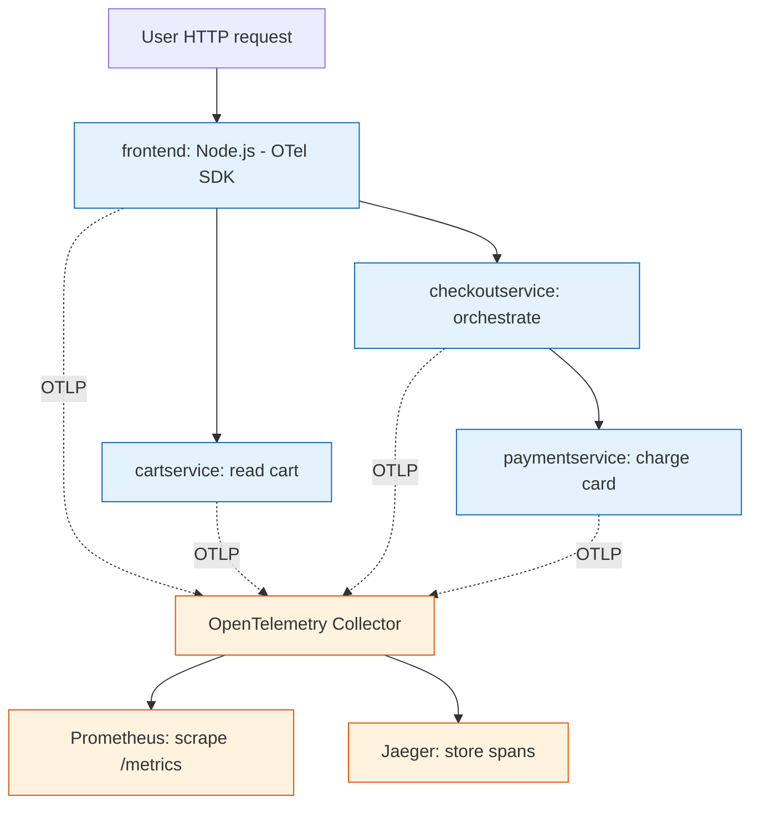

**TL;DR:** Observability is the ability to answer "what is happening inside my system, and why" from the outside, using three signals — **metrics, logs, and traces**. A real request through three OpenTelemetry-instrumented services, scraped by Prometheus and traced in Jaeger, shows how the pieces connect; the traps are high cardinality, missing trace context, and over-aggressive sampling.

## 1. What observability is (and what it isn't)

A system is **observable** when you can explain any internal state — including one you didn't predict — from its external outputs. The outputs are telemetry: numbers, records, and request paths your code emits while running.

"Monitoring" tells you *that* something broke (an alert fired). **Observability** lets you *debug* it — to ask an arbitrary question like "why were checkout requests slow only for the `mobile` client between 14:00 and 14:05" and get an answer from data you already collected. The shift is from dashboards you pre-build to signals you can slice after the fact.

## 2. The three signals

Three signal types cover almost every failure mode:

- **Metrics** — cheap, aggregated numbers over time. Good for "how many, how much" and SLO math. Prometheus stores these as time series.
- **Logs** — one immutable record per event, best as structured JSON so you can filter on fields. Good for "what exactly happened here."
- **Traces** — the path of one request across services, built from spans. Good for "which hop was slow."

The mental shortcut is RED for services (rate, errors, duration) and USE for the boxes they run on (utilization, saturation, errors) — covered in the [glossary]({{ '/observability/observability-key-terms/' | relative_url }}).

## 3. A real example: a checkout request across three services

Take a minimal checkout flow instrumented with OpenTelemetry:

- `frontend` (Node.js, `open-telemetry/opentelemetry-js`) receives the HTTP request.
- It calls `cartservice` to read the cart.
- It calls `checkoutservice`, which charges `paymentservice`.

Every service runs the OTel SDK. Each inbound request starts a **span**; each outbound call injects the **span context** into the request headers using the W3C `traceparent` format, so the next service's span becomes a child. The result is one trace spanning all three services.



What each piece does:

- **Spans** record per-operation timing: the `frontend` span covers the whole request; child spans cover the cart read and the payment call. If payment is slow, the trace waterfall shows exactly that bar stretching.
- **Metrics** come from the same SDK: request count, error count, and a latency histogram per route. Prometheus **scrapes** each service's `/metrics` endpoint on its interval.
- **Trace context propagation** is what makes the tree real. Without the `traceparent` header crossing each boundary, `paymentservice` would start a *new* trace and you'd lose the link back to the user's request.

## 4. How the pieces connect

The pipeline is deliberately decoupled, and the OpenTelemetry Collector (`open-telemetry/opentelemetry-collector`) is the hinge:

1. Each service's OTel SDK emits metrics, logs, and traces over **OTLP** (the OTel wire protocol).
2. The **Collector** receives OTLP and runs it through pipelines of receivers, processors, and **exporters**.
3. An exporter sends metrics to **Prometheus** (as a scrape target), spans to **Jaeger** (`jaegertracing/jaeger`), and logs to a log store.
4. **Grafana** queries all three: a latency panel links via an **exemplar** to a real Jaeger trace, so "p99 is high" becomes "here is the actual slow trace."

This is why you instrument once (OTLP out) and can change backends (swap exporters) without touching application code.

A Prometheus query that turns raw counters into a per-status error rate looks like this — note the `{{ $labels }}` template, which is why this block is wrapped in a raw tag:


```promql
sum by (status_code) (rate(http_requests_total[5m]))
/
sum by (status_code) (rate(http_requests_total[5m]))
```


In practice you'd compute error *ratio* with `rate(http_requests_total{status=~"5.."}[5m]) / rate(http_requests_total[5m])`; the point is that labels let you slice the same series any way you need after collection.

## 5. What breaks: the three traps

This is the section to internalize before you ship telemetry to production.

**High cardinality OOMs your metrics store.** A label like `user_id` or `trace_id` on a hot metric explodes the series count into the millions, and Prometheus holds one time series per unique label combination. One bad label turns "cheap metric" into "memory exhaustion." Keep high-cardinality dimensions on traces and logs, not on metrics.

**Missing trace context hides the slow hop.** If one service forgets to propagate `traceparent` — a misconfigured proxy, a queue that drops headers, a manually-built downstream call — the chain splits into two traces. The user's request looks fast in `frontend` and slow in `paymentservice`, with no parent linking them, so you can't see the real path.

**Sampling drops the one trace you needed.** Head sampling decides at request start whether to keep a trace; if you sample at 1% you keep 1% of evidence. Tail sampling (decide after the trace finishes, keeping only errors or slow ones) fixes this but needs the Collector to buffer traces — more memory, more moving parts. Too much sampling and the single failing request is the one that got dropped.

## 6. What to care about when building observability

If you take one thing from this post: **instrument the three signals from day one, and treat cardinality as a first-class design constraint.**

- **Emit all three signals through OpenTelemetry** so you're not locked to one backend.
- **Pick labels deliberately** — `route`, `status_code`, `service.name` are safe; `user_id` belongs in traces, not metrics.
- **Propagate trace context on every boundary**, including async queues, or tracing silently breaks.
- **Set SLOs from SLIs** (error rate, latency) and alert on symptoms users feel, not on a single pod restart.
- **Use exemplars** to bridge "metric is high" to "here is the trace that caused it."

## Review checklist

- [ ] Each service emits metrics, logs, and traces via the OpenTelemetry SDK (or auto-instrumentation).
- [ ] Trace context (`traceparent`) propagates across every sync and async boundary.
- [ ] The Collector receives OTLP and fans out to Prometheus and Jaeger via exporters.
- [ ] Metric labels are bounded (no `user_id`/`trace_id` on hot counters).
- [ ] Sampling strategy keeps error and slow traces (tail sampling) rather than blind head sampling.
- [ ] Dashboards show RED per service and USE per host, with exemplars linking to traces.

## FAQ

**Is observability just a rebrand of monitoring?** No. Monitoring tells you a threshold was crossed; observability lets you investigate an unknown failure after the fact by slicing the signals you already collected. You still need both — alerts for the known, exploration for the unknown.

**Do I need all three signals?** For a single process, metrics and logs may suffice. Across services, traces are what tell you *which* service caused a slowdown; without them you're guessing from per-service metrics.

**Why OpenTelemetry instead of just Prometheus client libraries?** Prometheus only does metrics, and its client binds you to Prometheus. OTel covers metrics, logs, and traces with one pipeline and one wire protocol (OTLP), so you can send the same telemetry to Prometheus, Jaeger, Tempo, or anything else by swapping an exporter.

**Where do I start reading next?** The deeper posts take each concern one at a time — start with how the Collector actually routes telemetry: [OpenTelemetry Collector: Pipelines, Processors, and Exporters]({{ '/observability/otel-collector-pipelines/' | relative_url }}).

## Source

Worked example and component names from real repositories: [open-telemetry/opentelemetry-collector](https://github.com/open-telemetry/opentelemetry-collector) (receivers, processors, exporters, OTLP), [open-telemetry/opentelemetry-js](https://github.com/open-telemetry/opentelemetry-js) (Node.js SDK and auto-instrumentation), [prometheus/prometheus](https://github.com/prometheus/prometheus) (scrape-based TSDB and PromQL), and [jaegertracing/jaeger](https://github.com/jaegertracing/jaeger) (trace storage and search). The W3C `traceparent` header format is specified by the W3C Trace Context recommendation.

## Next in the series

→ [OpenTelemetry Collector: Pipelines, Processors, and Exporters]({{ '/observability/otel-collector-pipelines/' | relative_url }})
