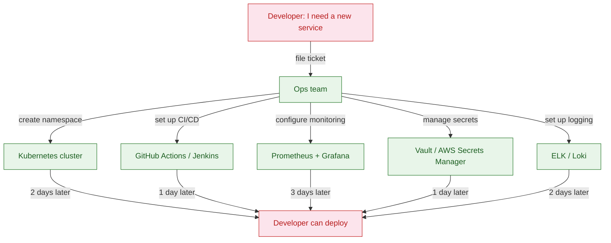

**TL;DR:** Platform engineering exists because `kubectl apply` doesn't scale — not technically, but cognitively. When 200 developers all need to deploy services, configure monitoring, set up CI/CD, and manage secrets, the platform team builds an internal developer platform (IDP) that abstracts the infrastructure complexity into golden paths. The result: developers self-serve in minutes instead of filing tickets that take days.
> **In plain English (30 sec):** Think of this like concepts you already use, but in a production system at scale.

## 1. What platform engineering is (and what it isn't)

**Platform engineering** is the discipline of building and maintaining an internal developer platform (IDP) that provides self-service infrastructure to development teams. It sits between DevOps/SRE (who manage production infrastructure) and application developers (who write business logic).

The core insight: **DevOps was supposed to make developers responsible for their own infrastructure, but it just gave them more things to learn.** A developer who wants to ship a new microservice now needs to know Kubernetes manifests, Helm charts, Terraform, Prometheus dashboards, Grafana panels, alert rules, CI/CD pipelines, secrets management, and ten other tools. Platform engineering says: "We'll handle the infrastructure complexity; you focus on your business logic."

What it is **not**:

- **Not DevOps rebranded.** DevOps is a culture of collaboration between dev and ops. Platform engineering is a product discipline — you build an internal product for developers.
- **Not a ticket-based ops team.** If developers still file tickets to get a new environment, you have an ops team, not a platform.
- **Not a single tool.** An IDP is a *platform* — a collection of tools, workflows, and golden paths stitched together.

## 2. The problem: kubectl doesn't scale

Here's what happens when you have 50 developers and no platform:

The timeline: 2-3 days to get a new service running. Multiply by 50 developers, each needing 2-3 services per quarter, and your ops team is a permanent bottleneck.

But it's worse than just speed. Every developer does the Kubernetes setup slightly differently — different resource limits, different probe configurations, different monitoring labels. The result: 50 services with 50 different deployment patterns, making incident response a nightmare because nothing looks the same.

## 3. What an internal developer platform provides

An **IDP** solves this with golden paths — opinionated, pre-configured workflows that developers use to self-serve. Here's what a real IDP provides:

**Service scaffolding.** A developer runs `platform create-service orders-api` and gets a git repo with:
- A Kubernetes Deployment manifest (pre-configured with resource limits, probes, and labels)
- A CI/CD pipeline (build → test → deploy to staging → manual gate → deploy to production)
- A monitoring dashboard (pre-configured with golden signals: latency, traffic, errors, saturation)
- A secrets configuration (linked to Vault with the right policies)
- A README with the team's conventions

Time to get started: 5 minutes, not 5 days.

**Self-service environments.** A developer needs a preview environment for a PR? The platform spins up a temporary namespace with the service's dependencies, runs the tests, and tears it down when the PR merges. No ticket required.

**Golden paths.** The platform defines *how* to do things correctly:
- How to expose an HTTP endpoint (use the platform's ingress controller, not a bare Service)
- How to handle secrets (use the platform's secrets operator, not ConfigMaps)
- How to set up alerts (use the platform's alert templates, not ad-hoc Prometheus rules)

Golden paths are opinionated but not mandatory — developers *can* deviate, but the platform makes the right thing the easy thing.

## 4. The technology stack behind an IDP

A modern IDP typically combines:

- **Backstage** (by Spotify) — a developer portal that provides a service catalog, scaffolding (Software Templates), and documentation (TechDocs). It's the "front door" of the platform.
- **Crossplane** — a Kubernetes-native infrastructure provisioner. Instead of writing Terraform, you define infrastructure as Kubernetes Custom Resources. The platform team writes the XRDs (Composite Resource Definitions); developers claim them.
- **Argo CD / Flux** — GitOps-based continuous delivery. The platform defines how deployments happen; developers push to git and the platform handles the rest.
- **Golden path templates** — pre-configured service templates that include CI/CD, monitoring, secrets, and documentation. Backstage's Software Templates or custom CRDs.

The key insight: **the platform is itself a product.** It has users (developers), a roadmap (features to add), metrics (time-to-deploy, cognitive load), and a team that maintains it.

## 5. Measuring platform success

Platform engineering has three core metrics (from the DORA and SPACE frameworks):

- **Time to first deployment** — how long from "I have an idea" to "it's running in production." Goal: hours, not days.
- **Cognitive load** — how many things a developer needs to understand to ship code. Goal: fewer tools, more abstraction.
- **Developer satisfaction** — surveys asking "does the platform help you do your job?" Goal: 80%+ satisfaction.

**What to watch out for:** platforms that optimize for one metric at the expense of others. A platform that makes deployment instant but requires developers to learn a custom DSL has reduced time-to-deploy but increased cognitive load. The best platforms are invisible — developers don't think about the platform, they just ship code.

## 6. What breaks: the platform engineering gotchas

**Building for the edge cases first.** The platform should handle the 80% case (standard web services, standard databases, standard monitoring) and let the 20% (ML training jobs, bare-metal databases, custom networking) use raw infrastructure. If you try to abstract everything, you build a worse version of Kubernetes.

**Not treating the platform as a product.** If the platform team builds what they *think* developers need instead of what developers *actually* need, the platform gets ignored. Regular user research, feedback loops, and adoption metrics are mandatory.

**Gold-plating the abstraction.** Every abstraction leaks. The platform should expose escape hatches for when the abstraction doesn't fit — and document them clearly. A platform that forces developers into a corner when their use case doesn't fit the golden path is worse than no platform at all.

**Forgetting documentation.** Backstage's TechDocs exists for a reason: a platform without documentation is just a collection of tools that nobody knows how to use. Every golden path, every self-service action, every escape hatch needs clear, searchable docs.

## 7. What to care about when building a platform

If you take one thing from this post: **a platform team builds a product for developers — measure adoption, collect feedback, and iterate like any product team.**

- **Start with the most painful workflow** (usually deployment or environment creation) and build the golden path for that first. Don't try to build everything at once.
- **Measure time-to-deploy** before and after the platform. If it doesn't improve, the platform isn't working.
- **Make the platform opt-in** initially. Forced adoption breeds resentment. Let early adopters prove the value, then expand.
- **Build escape hatches** for every abstraction. Developers need to know they can break out when they need to.
- **Document everything.** A platform without docs is a platform without users.

## Review checklist

- [ ] The platform has a clear golden path for the most common service type (web API).
- [ ] Time-to-first-deployment for a new service is under 30 minutes.
- [ ] Developers can self-service common infrastructure changes without filing tickets.
- [ ] The platform has escape hatches for edge cases that don't fit the golden path.
- [ ] Platform adoption is measured and reported regularly.

## FAQ

**How is platform engineering different from SRE?** SRE focuses on reliability — keeping production running. Platform engineering focuses on developer productivity — making it easy to ship code. They overlap (a reliable platform is a productive platform), but the goals and skillsets differ.

**Do I need Backstage to do platform engineering?** No. Backstage is a popular choice for the developer portal layer, but you can build a platform with Kubernetes CRDs, custom CLIs, or even a well-documented set of Terraform modules. The tool matters less than the self-service experience.

**How do I convince leadership to invest in a platform?** Measure the current cost of developer waiting time. If 50 developers each spend 2 hours per week waiting for infrastructure, that's 100 hours per week — equivalent to 2.5 full-time engineers doing nothing but waiting. A platform that cuts that in half pays for itself.

## Source

Platform engineering patterns verified against Backstage documentation (backstage.io), Google's book "Accelerate" and DORA metrics research, Spotify's engineering blog on Backstage adoption, and real internal platform implementations at companies like Zalando, Netflix, and Thoughtworks.

