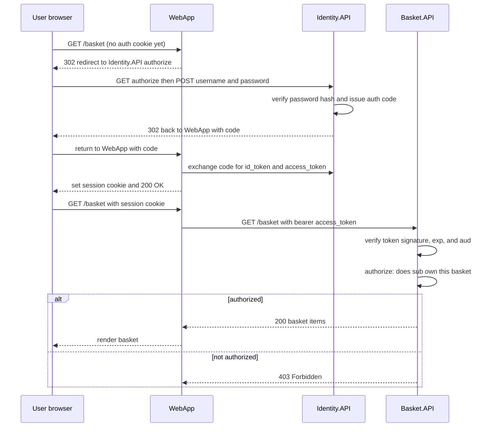

**TL;DR:** Authentication answers "who are you" (a password check, a token signature); authorization answers "what are you allowed to do" (an ownership check, a role). dotnet/eShop's real flow makes the split concrete: `Identity.API` *authenticates* you and hands `WebApp` an access token, and then `Basket.API` must *authorize* every call before returning your basket. Get the second one wrong and you've built a login that anyone can drive into someone else's data.

## 1. Authentication vs authorization — the distinction everyone mixes up

These two words get collapsed into "login" constantly, but they are different questions answered by different code at different times:

- **Authentication (authn)** = *who are you?* It establishes an identity. A password check, an OIDC `id_token`, an mTLS certificate, a session cookie — all of these prove (with some confidence) that the caller is a specific principal.
- **Authorization (authz)** = *what is this identity allowed to do?* It decides whether *this* request may read *this* object, call *this* endpoint, or act as *this* role. This is where ownership and permissions live.

The trap is thinking "we authenticated the user, so the endpoint is safe." Authentication tells you the request came from Alice. It says nothing about whether Alice is allowed to open Bob's basket. That second decision is a separate check that has to be written, and written correctly, at every protected resource — and it's the one teams most often forget. The rest of this post keeps returning to that gap because it's the single most exploited mistake in real apps.

## 2. A real example: logging into eShop, then calling an API

[dotnet/eShop](https://github.com/dotnet/eShop) is Microsoft's reference e-commerce app (Catalog, Basket, Ordering, WebApp storefront, and an `Identity.API`). It ships a *real* identity provider, not a stub: `src/Identity.API/Program.cs` calls `AddIdentity<ApplicationUser, IdentityRole>()` (ASP.NET Core Identity, with a hashed password store) and `AddIdentityServer()` (Duende IdentityServer, an OAuth2/OIDC issuer) wired together with `AddAspNetIdentity<ApplicationUser>()`. `WebApp` is an OIDC client that signs the user in against `Identity.API` and then calls the backend APIs. Here is the whole flow:

Read the diagram left to right and you can see the two phases fall out naturally:

- **Blue (`Identity.API`) is authentication.** It checks the password, decides who you are, and mints the tokens. The `id_token` says *who*; the `access_token` is the proof you carry to the APIs.
- **Orange (`Basket.API`) is authorization.** It never asks for a password. It trusts the token (validates the signature, expiry, audience) to know *who* is calling, then makes the separate decision: *is this caller allowed to see the basket they asked for?*
- **Red (`User`) matters because the user is also a threat.** A logged-in Alice can try to read Bob's basket by swapping an ID in the URL. The red participant is a reminder that the authenticated caller is exactly who the authorization check must defend against.

## 3. How the flow actually works (the mechanism, not the hand-wave)

A few details from eShop's real code worth pinning down, because they're where the concepts become concrete:

- **`WebApp` is the OIDC client, not the browser.** The browser ends up with a session cookie tied to `WebApp`; `WebApp` holds the access token server-side and forwards it as a `Bearer` header to the APIs. That's why the diagram shows the token exchange between `WebApp` and `Identity.API`, not the browser. (Session auth vs token auth — the two shapes — are covered in depth later in the series.)
- **`Identity.API` validates the password against a *hash*, not the password itself.** The `Users` table never contains your plaintext password; `AddIdentity` uses ASP.NET Core Identity's `PasswordHasher`, which stores a salted, iterated, versioned digest. If the database leaks, the attacker gets garbage, not passwords. This is the "storing passwords" half of what tends to go wrong.
- **The token is verified, not trusted.** When `Basket.API` receives the access token, it checks the signature (using `Identity.API`'s signing key), plus `exp` (expired?) and `aud` (meant for me?). A valid signature means `Identity.API` really issued it; it does *not* mean the caller may see this basket.
- **The authorization check is a *separate* step after verification.** After the token is known good, `Basket.API` must compare the token's `sub` (subject = who) against the basket's owner. Signature-valid + wrong-owner = 403. That comparison is the authz check the next sections are built around.

## 4. The threat model — who is actually attacking you

Before touching controls, name the attacker. The same app faces three very different adversaries, and each needs a different defense:

- **The network eavesdropper.** Someone on the same Wi-Fi, a compromised proxy, or a misrouted BGP path who wants to read credentials or tokens in transit. Defense: TLS everywhere (HTTPS), and mTLS between services so a sniffed packet is still useless. This is why eShop serves everything over `https://` and why tokens travel inside encrypted channels, never as URL parameters.
- **The other tenant / other user.** A legitimate, *authenticated* Alice who tries to reach Bob's data by guessing or enumerating an ID (`GET /basket/{bob-id}`). She already passed authentication — so only a correct authorization check stops her. This is the single biggest real-world category (OWASP API Top 10 #1) and it's exactly the red participant in the diagram.
- **The user themselves (and their compromised session).** The person logged in is also a risk: they can tamper with request bodies, replay tokens, or try to escalate their own role. Defense: don't trust anything the client sends (IDs, roles, prices), validate the *shape* of inputs, rotate/revoke sessions, and add MFA so a stolen password isn't a full takeover.

Notice none of these require a "hacker in a hoodie." Two of the three are *authorized* actors abusing gaps you left in your own logic.

## 5. What breaks / what to care about

This is the section to internalize before you ship anything with a login.

**Storing passwords in plaintext or with a fast hash.** If you keep `password = "hunter2"` or even `SHA256(password)` and the DB leaks, every account is instantly readable and crackable. Real fix: a unique salt per password plus a slow KDF (Argon2id, or PBKDF2 as eShop/ASP.NET Core use) — covered in the next post.

**Trusting the client.** The client is hostile by default. If the request body can set a `role` or `ownerId`, an attacker will set it. If the URL supplies the object ID, an attacker will supply *someone else's*. Never let client-supplied state stand in for a server-side trust decision.

**Missing authorization checks (the BOLA preview).** This is the headline bug for the whole security series. An endpoint authenticates the caller, then loads an object by a client-supplied ID *without checking the caller owns it* — so any logged-in user reads or edits any other user's data. Authentication passed; authorization was never written. The later API Security and Broken Access Control posts take this apart in real vulnerable code (OWASP's `crAPI` and `WebGoat`).

**Secrets in plaintext.** Signing keys, DB connection strings, API keys checked into source or dumped in logs. In eShop, `Identity.API` even carries a `TODO: Not recommended for production` next to its developer signing credential — a reminder that key material must live in a secret store, not in code.

The throughline: every one of these is "we did the easy part (authn / config) and skipped the hard, specific part (authz / secrets handling)."

## 6. Defense in depth — assume one layer fails

No single control is enough, so stack them so that one miss doesn't mean a breach:

- **Encrypt in transit (TLS) and, between services, mTLS** — so a network attacker gets nothing even if they're on the wire.
- **Hash passwords and never log them** — so a storage breach is recoverable, not catastrophic.
- **Authenticate every request, then authorize every object** — verify the token *and* check ownership on every ID-accepting endpoint, not just the "important" ones.
- **Never trust the client** — validate and whitelist input shapes; derive role/owner server-side.
- **Rotate and revoke** — short-lived access tokens, rotating refresh tokens (covered later), and the ability to kill a session the moment it's suspected stolen.

If the authz check is missing, defense-in-depth is what limits the blast radius: TLS didn't help, but rate-limiting, input validation, and audit logging still make mass exfiltration slow and detectable.

## Review checklist

- [ ] Authentication (who) and authorization (what) are separate code paths, and every protected endpoint performs *both*.
- [ ] Passwords are stored only as salted, slow KDF digests — never plaintext or fast hashes.
- [ ] Every handler that loads an object by a client-supplied ID checks the caller owns it (the BOLA check), not just that the caller is logged in.
- [ ] Nothing the client sends (role, ownerId, price) is trusted without re-derivation server-side; inputs are validated against a whitelist.
- [ ] Secrets (signing keys, connection strings) live in a secret store, not in code or logs; TLS/mTLS protect data in transit.

## FAQ

**Isn't "logged in" the same as "authorized"?** No. "Logged in" only answers *who are you*. A logged-in user can still be blocked from another user's data, an admin endpoint, or a resource their role doesn't permit. Authentication gets you in the door; authorization decides which rooms you may enter. The confusion between the two is precisely why missing-authorization bugs are so common.

**If my API checks the token signature, am I safe from the other user?** Only from *forged* tokens. A valid token from Alice proves Alice called — it does nothing to stop Alice from requesting Bob's basket ID. You still need the per-object ownership check, which is why signature verification and authorization are two distinct steps in the diagram.

**Where do I start reading next?** With the foundation every other post assumes — how a password is actually stored so a database leak isn't a password leak: [Password Hashing: What's Inside the String ASP.NET Core Stores Instead of Your Password]({{ '/security/password-hashing-and-credential-storage/' | relative_url }}).

## Source

Auth flow, identity provider, and service topology from [dotnet/eShop](https://github.com/dotnet/eShop) — specifically `src/Identity.API/Program.cs` (ASP.NET Core Identity + Duende IdentityServer issuing `id_token`/`access_token`) and `src/WebApp/Program.cs` (the OIDC client that forwards bearer tokens to `Basket.API`/`Ordering.API`). The authorization and BOLA concepts are expanded later in this series using OWASP's deliberately vulnerable `crAPI` and `WebGoat` repositories.

## Next in the series

→ [Password Hashing: What's Inside the String ASP.NET Core Stores Instead of Your Password]({{ '/security/password-hashing-and-credential-storage/' | relative_url }})
