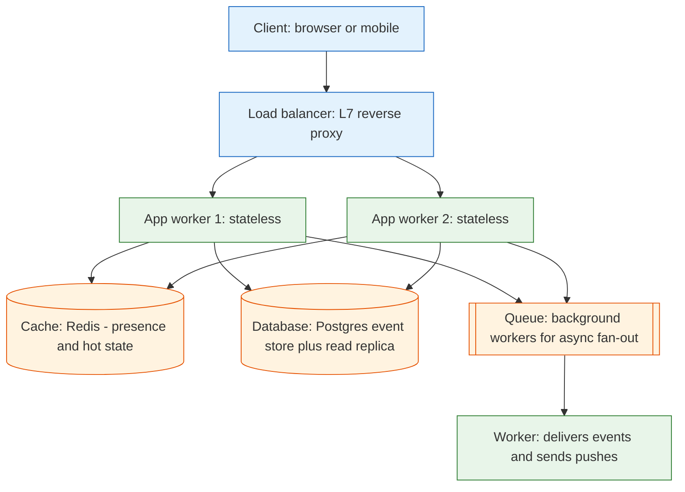

**TL;DR:** System design is the act of turning a fuzzy prompt ("build me a chat app") into a set of components and the tradeoffs between them. The method is always the same: read the requirements (read/write ratio, scale, latency, consistency), draw one data-flow diagram, then reach for the standard building blocks — load balancer, stateless app tier, cache, database, queue. Matrix's real **Synapse** homeserver is a concrete example of all five in production: a load balancer fronts stateless app workers, Redis caches hot state, PostgreSQL is the event store, and a message queue/background workers carry async fan-out.

## 1. What "system design" actually asks you to do

A coding question has a right answer you can run. A system design question has no single right answer — it has a set of *reasonable* answers, each with a cost. Your job is to pick components and justify the tradeoffs under the stated constraints.

Every system, no matter how fancy, is an assembly of a small set of primitives:

- A **load balancer** to spread traffic and hide the number of backends.
- A **stateless app tier** that holds no data of its own, so you can add or remove copies freely.
- A **cache** for reads that are expensive or repeated.
- A **database** for data that must survive a restart.
- A **queue** to let one component do work later, or hand it to many consumers.

The skill isn't memorizing the primitives — it's reading the prompt well enough to know *which one carries the weight* for this particular system.

## 2. Reading the requirements prompt (the part people skip)

Before drawing anything, extract four numbers from the prompt. If the prompt doesn't state them, state your own assumptions out loud — that *is* the design work.

| Dimension | What to pin down | Why it changes the design |
|-----------|------------------|---------------------------|
| **Read/write ratio** | Mostly reads (URL shortener), mostly writes (metrics ingest), or balanced (chat)? | A read-heavy system lives or dies by its cache; a write-heavy one lives or dies by its write path and queue. |
| **Scale** | Requests/sec now and at target; total data size | Drives sharding, replication, and whether a single box is even possible. |
| **Latency budget** | p99 response time the user will tolerate | Decides if you can afford a disk seek, a network hop, or a consensus round-trip per request. |
| **Consistency** | Can a reader ever see stale data, or must every read be current? | Picks your database type and your position on CAP/PACELC. |

The same primitives assemble differently for three classic prompts:

- **URL shortener** is almost pure read, point-lookup-by-key: the cache and a key-sharding scheme carry the weight, nothing else is load-bearing.
- **Notification system** is dominated by fan-out (one event to many recipients): a queue and idempotent delivery carry the weight.
- **Chat system** needs both an ordered, append-only per-room log (read side) *and* a bounded write path (rate-limited sends): cache, database ordering, and queue all matter at once.

That last one is our worked example.

## 3. A real example: a real-time chat system, grounded in Synapse

Matrix's production homeserver, [Synapse](https://github.com/element-hq/synapse), is a real system that uses every building block above. Here is the shape of it:

Reading the diagram against real Synapse code:

- **Load balancer.** A reverse proxy (Synapse sits behind nginx or a similar L7 proxy) terminates TLS and spreads connections across app workers. Clients never address a worker directly.
- **Stateless app tier.** Synapse runs multiple `synapse.app.homeserver` worker processes. None of them owns room state in memory — any worker can serve any request because the state lives in the shared store. That's what makes horizontal scaling possible.
- **Cache (Redis).** Presence, rate-limit buckets, and frequently read room state are cached so the hot path doesn't hit Postgres on every request.
- **Database (PostgreSQL).** The event store is a relational table with a monotonic `stream_ordering` and a `topological_ordering` per room — this is what gives chat its strict, correct history ordering (covered in the case-study post on Synapse).
- **Queue / background workers.** Sending a message to a room with many members is fan-out: the write is persisted once, then background workers push to recipients, send push notifications, and federate to other servers. The queue decouples "accept the message" from "deliver it everywhere."

The point: this is not five special chat technologies. It's the five generic building blocks, assembled to fit chat's read/write shape.

## 4. Picking the data layer: SQL vs NoSQL, and consistency vs availability

The chat example's hardest choice is the store. Two axes decide it.

**SQL vs NoSQL.** Use a relational database (Postgres) when you need transactions, joins, or a strict ordering guarantee — Synapse's `stream_ordering` is exactly that, and you can't get it from a dumb key-value store. Reach for NoSQL (a wide-column or key-value store) when your dominant operation is a single-key read/write at a write volume that a single relational primary can't sustain, and you don't need cross-row transactions. A URL shortener's `short_key -> long_url` is the canonical NoSQL fit.

**Consistency vs availability (CAP/PACELC).** When a network partition happens you must choose: **C**onsistency (every read sees the latest write, but the system may reject requests) or **A**vailability (always answers, but may be stale). Even *without* a partition, PACELC says you still trade **L**atency against **C**onsistency: a read that waits for the latest replica is slower than one that returns a nearby stale copy. Chat history leans CP-ish (you want correct ordering), while a like-counter or presence indicator can lean AP (stale for a moment is fine).

## 5. What breaks / what to care about

This is the section to internalize before you claim a design is "done."

**Single points of failure.** If the load balancer or the database primary has no standby, one machine dying takes down the whole system. Every building block needs a redundant copy or a documented acceptance that it can fail.

**Cache stampede (thundering herd).** When a hot key expires, every app server sees a miss at once and all hammer the database to rebuild it — the cache was supposed to *protect* the database, but the miss spikes the exact load it was shielding. Fixes: serve stale-while-revalidate, request coalescing (one worker fills, others wait), or a short jitter on TTLs.

**Hot partitions.** Sharding spreads load evenly only on average. One wildly popular room (or one celebrity user, or one trending URL) lands entirely on one shard, and that shard melts while the others idle. Consistent hashing helps rebalance, but a single hot key is a single-point-of-load no matter how many shards exist.

**Underestimating scale.** "10 QPS today" hides "10,000 QPS at launch." Capacity planning models *arrival rate* (requests per second), not just a server count — a design that picks a single primary because "it's small now" is the most common way to fall over on day one. Do the back-of-envelope math before choosing the store.

For example: 10K requests/sec × 1 KB average payload = ~10 MB/s throughput, which a single Postgres primary can handle for writes. But 10M daily active users × 100 reads/day = 1B reads/day ≈ 11.5K reads/sec, which needs caching or read replicas.

## 6. What to care about when designing

If you take one thing from this post: **read the prompt into numbers first, then let the read/write shape pick the primitives — never the other way around.**

- **Extract read/write ratio, scale, latency, and consistency** before drawing a single box.
- **Draw one data-flow diagram** (client to LB to app to cache/db/queue) and name the dominant operation on each arrow.
- **Choose SQL vs NoSQL by transactions/ordering needs, not by fashion.**
- **Take a position on CAP/PACELC** and say which operations can tolerate staleness.
- **Design for failure from the first sketch:** redundancy for every SPOF, stampede protection on the cache, and a scale number you actually computed.

## Review checklist

- [ ] The prompt is reduced to four numbers: read/write ratio, scale (QPS + data size), latency budget, consistency requirement.
- [ ] A load balancer fronts a stateless app tier, so workers can scale horizontally with no shared in-memory state.
- [ ] The cache is wired to protect the database (coalescing / stale-while-revalidate), not to stampede it on a miss.
- [ ] The database type (SQL vs NoSQL) and the consistency stance (CP vs AP) are chosen deliberately and stated.
- [ ] Every single point of failure has a redundant copy or an explicit accepted-risk note.

## FAQ

**Do I always need all five building blocks?** No. A URL shortener may have no queue at all; a pure compute service may have no database. The prompt's read/write shape tells you which primitives are load-bearing. The mistake is adding a queue or a shard "because real systems have them" when nothing in the workload needs it.

**SQL or NoSQL for a chat system?** The event store wants SQL (transactions + strict ordering via `stream_ordering`), which is exactly what Synapse uses with PostgreSQL. You'd reach for NoSQL only for the high-write, single-key parts — like a presence cache — and even there Synapse uses Redis, not a relational table.

**How do I know if my cache will stampede?** Ask: "when a hot key expires, how many app servers will miss at once, and what will each one do?" If the answer is "all of them, and each hits the database," you have a stampede risk and need coalescing or stale-while-revalidate before launch.

## Source

Worked example and component topology grounded in Matrix's real production homeserver, [element-hq/synapse](https://github.com/element-hq/synapse) — stateless `synapse.app.homeserver` workers behind a load balancer, Redis for cached hot state, PostgreSQL as the ordered event store (`stream_ordering` / `topological_ordering`), and background worker queues for async fan-out and federation. (The project moved from the archived `matrix-org/synapse` to `element-hq/synapse` after Element took over maintenance of the Matrix.org Foundation's reference homeserver.)

## Next in the series

→ [Scalability: Vertical vs Horizontal Scaling and Load-Aware Placement]({{ '/system-design/scalability-vertical-vs-horizontal-scaling/' | relative_url }})
