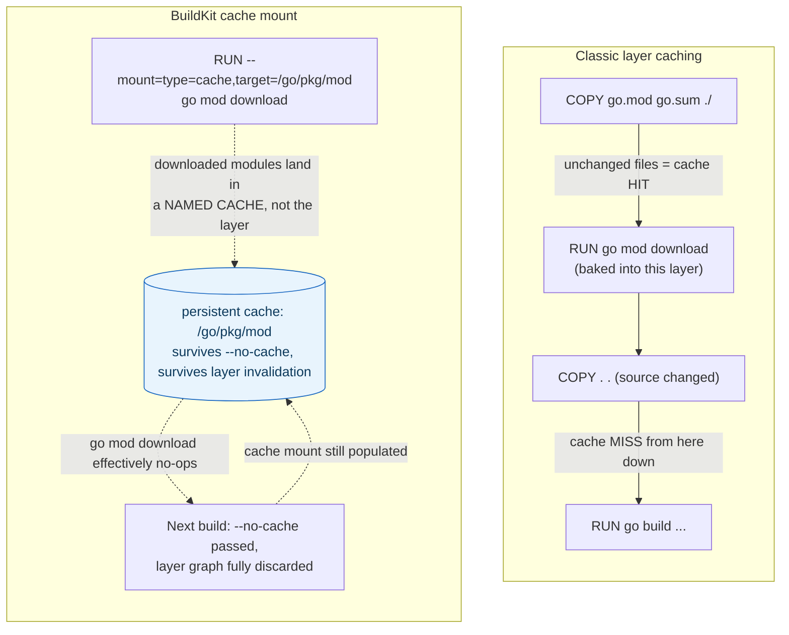

## 1. The Engineering Problem: layer caching only helps until the first thing changes

Classic Docker layer caching reuses a layer only if its instruction *and every layer before it* are byte-identical to a previous build. Order your `COPY`s well (dependency manifests before source code) and you get real wins — but that cache is still tied to the layer graph. Run on a fresh CI runner with no prior image cache, or pass `--no-cache` to force a clean rebuild, and every `RUN go mod download` or `npm install` starts from zero again — minutes of redundant package-manager downloads, every single time, regardless of whether the dependencies actually changed.

You need a cache that survives independently of the layer graph itself — one that isn't erased just because an earlier layer was invalidated or the build was told to ignore its cache.

---

## 2. The Technical Solution: two different caches solving two different problems

**Layer caching** (classic, still the first line of defense): each instruction's cache key is a hash of the instruction plus its inputs plus the previous layer's cache key. Reordering `COPY go.mod go.sum ./` before `COPY . .` means a source-code change doesn't invalidate the dependency-download layer above it — but the layer's *contents* are still baked into the image and still tied to that hash chain.

**BuildKit cache mounts** (`RUN --mount=type=cache,target=<path>`) are a completely different mechanism: a persistent scratch directory that BuildKit tracks by mount ID, not by layer digest — its contents are **never baked into any image layer at all**, and it survives even a `--no-cache` build that throws away the entire layer graph.



Core truths: **a cache mount's contents are invisible to the final image** — nothing written to `/go/pkg/mod` during the build ends up in `docker history` or the shipped image, which is exactly why it's safe to cache package-manager downloads there without bloating the final artifact; and **`# syntax=`, the first line of a Dockerfile, pins which BuildKit frontend version parses the rest of the file** — it lets a Dockerfile opt into newer syntax features (like `COPY --parents`, still gated behind a `-labs` channel) independent of which Docker Engine version is actually running the build, since BuildKit fetches that frontend as its own image.

---

## 3. The clean example (concept in isolation)

```dockerfile
# syntax=docker/dockerfile:1.7
FROM golang:1.23-alpine

WORKDIR /app
COPY go.mod go.sum ./

# Downloaded modules land in a persistent cache mount, not this layer -
# survives even a --no-cache rebuild, unlike a plain RUN.
RUN --mount=type=cache,target=/go/pkg/mod \
    go mod download

COPY . .
RUN --mount=type=cache,target=/go/pkg/mod \
    --mount=type=cache,target=/root/.cache/go-build \
    go build -o /app/server .
```

---

## 4. Production reality (from `grafana/grafana`)

Grafana's real `Dockerfile` combines both mechanisms deliberately — careful `COPY` ordering for classic layer caching, plus BuildKit cache mounts for the parts layer caching alone can't protect:

```dockerfile
# syntax=docker/dockerfile:1.7-labs

FROM ${GO_IMAGE} AS go-builder
...
WORKDIR /tmp/grafana

COPY go.mod go.sum go.work go.work.sum ./
COPY .citools .citools

# Copy go.mod/go.sum from each workspace module for dependency caching.
# Only dependency file changes invalidate the go mod download cache layer.
# Uses --parents to preserve directory structure with fewer COPY directives.
COPY --parents **/go.mod **/go.sum ./

RUN --mount=type=cache,target=/go/pkg/mod \
    go mod download

# Copy full source (invalidates layers below, NOT the cache mount above)
COPY embed.go Makefile package.json ./
COPY pkg pkg
COPY apps apps
...

RUN --mount=type=cache,target=/go/pkg/mod \
    --mount=type=cache,target=/root/.cache/go-build \
    make build-go GO_BUILD_TAGS=${GO_BUILD_TAGS} WIRE_TAGS=${WIRE_TAGS}
```

What this teaches that a hello-world can't:

- **`COPY --parents **/go.mod **/go.sum ./`** is a `1.7-labs`-gated feature specifically for a Go workspace with many `go.mod` files scattered across subdirectories — it copies each one while *preserving its relative path*, replacing what would otherwise be dozens of individual `COPY` lines. This exists because Grafana's build is a multi-module Go workspace (`go.work`), not a single-module repo — a detail invisible in any hello-world Dockerfile.
- **Two separate cache mounts, not one, on the final build step.** `/go/pkg/mod` (downloaded module source) and `/root/.cache/go-build` (compiled object/build cache) are populated by different tools at different times and invalidate on different triggers — module downloads change only when `go.mod`/`go.sum` change, but the build cache changes on every source edit. Mounting them separately means a source-only change still gets full module-download reuse without needing the build cache to also stay valid.
- **The comment "Only dependency file changes invalidate the go mod download cache layer" describes the classic layer-cache mechanism, but the `--mount=type=cache` on the same `RUN` is what actually protects the *download itself* on a cold/CI runner where that classic layer cache doesn't exist at all.** The two mechanisms are stacked, not redundant — layer caching gives a fast local rebuild; the cache mount gives a fast *first* build on a fresh machine, which is the case that matters most in CI.

Known-stale fact: BuildKit has been the default builder in current Docker Engine and Docker Desktop for years now, not an opt-in flag (`DOCKER_BUILDKIT=1` used to be required, and is now a no-op on current versions) — advice that still frames cache mounts as an "experimental BuildKit feature you need to enable" is describing a Docker version that's long past current.

---

## Source

- **Concept:** BuildKit & build caching
- **Domain:** docker
- **Repo:** [grafana/grafana](https://github.com/grafana/grafana) → [`Dockerfile`](https://github.com/grafana/grafana/blob/main/Dockerfile) — Grafana's real multi-stage, multi-module build.
