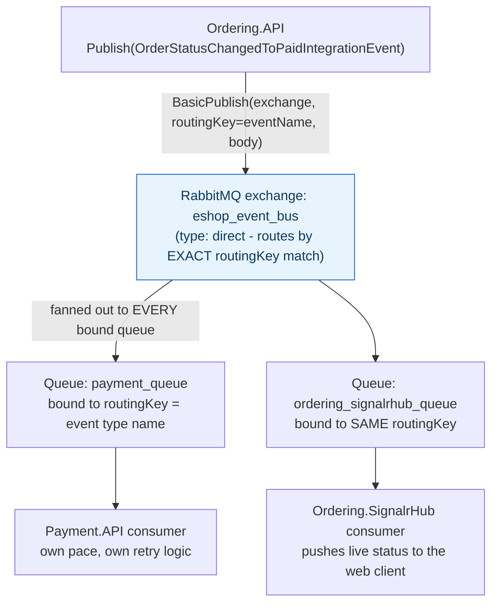
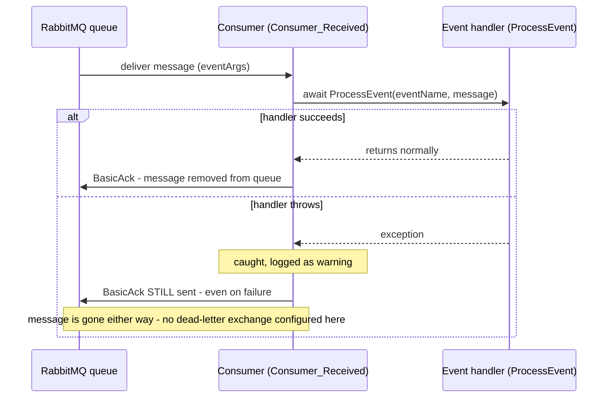

## 1. The Engineering Problem: synchronous calls couple every interested service to the publisher

"An order was placed" is something the Payment service, the Inventory service, and the Notifications service all need to react to. Model that as direct REST/gRPC calls and the Ordering service now has to know the address of every interested service and call each one synchronously — if Notifications is slow or down, does placing an order fail too? Adding a fourth interested service means modifying Ordering's code to add another outbound call. The publisher ends up coupled to every consumer that will ever exist, and a slow consumer's latency leaks straight into the publisher's response time.

You need publishers that broadcast "this happened" without knowing or caring who's listening, and consumers that react on their own schedule, isolated from the publisher's availability.

---

## 2. The Technical Solution: publish to an exchange, let the broker fan out to durable per-service queues

A message broker inserts a real, persistent buffer between publisher and consumers. The publisher sends an event to an **exchange**; the broker fans it out, by routing key, to every **queue** that's bound to that key — each interested service has its own durable queue, consumes independently, and a slow or offline consumer never blocks the publisher.



Two mechanism details that separate this from "a shared queue everyone pulls from":

- **Each subscriber gets its own durable queue**, not a shared one. A `direct` exchange with the same routing key fans the message out to *every* bound queue — this is publish-subscribe, not a single work queue where only one consumer wins each message. Two services can both react to the exact same event independently.
- **Delivery is at-least-once, achieved by acknowledging only after successful processing.** The consumer sets `autoAck: false` and calls `BasicAck` itself, after `ProcessEvent` returns — if the consumer crashes mid-processing, the unacked message stays in the queue and gets redelivered. Combined with `DeliveryMode: 2` (persistent) on publish, a message survives a broker restart too.

That acknowledgment timing has a real failure-mode consequence worth seeing explicitly, not glossing over:



---

## 3. The clean example (concept in isolation)

```csharp
public record OrderPlacedIntegrationEvent(Guid OrderId, decimal Total) : IntegrationEvent;

// Publisher (Ordering service)
eventBus.Publish(new OrderPlacedIntegrationEvent(order.Id, order.Total));

// Subscriber (Inventory service) - registered once at startup
eventBus.Subscribe<OrderPlacedIntegrationEvent, ReserveStockHandler>();

public class ReserveStockHandler : IIntegrationEventHandler<OrderPlacedIntegrationEvent>
{
    public Task Handle(OrderPlacedIntegrationEvent @event)
    {
        // reserve stock for @event.OrderId - runs independently of Ordering's own request/response cycle
    }
}
```

---

## 4. Production reality (from `dotnet-architecture/eShopOnContainers`)

```
src/BuildingBlocks/EventBus/
├── EventBus/
│   └── Events/IntegrationEvent.cs      # shared base type - every event carries Id + CreationDate
└── EventBusRabbitMQ/
    └── EventBusRabbitMQ.cs              # RabbitMQ-specific IEventBus implementation
```

```csharp
// EventBus/Events/IntegrationEvent.cs
public record IntegrationEvent
{
    public IntegrationEvent()
    {
        Id = Guid.NewGuid();
        CreationDate = DateTime.UtcNow;
    }
    [JsonInclude] public Guid Id { get; private init; }
    [JsonInclude] public DateTime CreationDate { get; private init; }
}
```

```csharp
// EventBusRabbitMQ/EventBusRabbitMQ.cs (Publish)
public void Publish(IntegrationEvent @event)
{
    var policy = RetryPolicy.Handle<BrokerUnreachableException>()
        .Or<SocketException>()
        .WaitAndRetry(_retryCount, retryAttempt =>
            TimeSpan.FromSeconds(Math.Pow(2, retryAttempt)));

    var eventName = @event.GetType().Name;   // routing key = the event's own type name
    using var channel = _persistentConnection.CreateModel();
    channel.ExchangeDeclare(exchange: BROKER_NAME, type: "direct");

    var body = JsonSerializer.SerializeToUtf8Bytes(@event, @event.GetType());
    policy.Execute(() =>
    {
        var properties = channel.CreateBasicProperties();
        properties.DeliveryMode = 2;   // persistent - survives a broker restart
        channel.BasicPublish(exchange: BROKER_NAME, routingKey: eventName,
            mandatory: true, basicProperties: properties, body: body);
    });
}
```

```csharp
// EventBusRabbitMQ/EventBusRabbitMQ.cs (consume loop)
private async Task Consumer_Received(object sender, BasicDeliverEventArgs eventArgs)
{
    var eventName = eventArgs.RoutingKey;
    var message = Encoding.UTF8.GetString(eventArgs.Body.Span);
    try
    {
        await ProcessEvent(eventName, message);
    }
    catch (Exception ex)
    {
        _logger.LogWarning(ex, "----- ERROR Processing message \"{Message}\"", message);
    }
    // Even on exception we take the message off the queue.
    // in a REAL WORLD app this should be handled with a Dead Letter Exchange (DLX).
    _consumerChannel.BasicAck(eventArgs.DeliveryTag, multiple: false);
}
```

What this teaches that a hello-world can't:

- **`eventName = @event.GetType().Name` used directly as the routing key** means the broker never needs a separate registry mapping event types to topics — the .NET type system and the RabbitMQ routing key are kept in lockstep by construction. Rename the C# record and the routing key silently changes with it, which is a real footgun a hello-world "publish to a hardcoded string" example would never surface.
- **The retry policy wraps the publish call, not the message content** — it's handling *broker connectivity* failures (`BrokerUnreachableException`, `SocketException`) with exponential backoff, completely separate from whatever retry/idempotency logic a consumer's own handler might need for processing failures. Two different failure domains, two different retry strategies, easy to conflate as "the retry logic."
- **The code's own comment admits the real limitation**: acknowledging a failed message anyway (rather than routing it to a dead-letter exchange) means a poison message that always throws just vanishes silently after one failed attempt — logged, but gone. This is the reference architecture being honest about a corner it cut, which is more instructive than a polished example that hides the tradeoff entirely.
- **A sibling `EventBusServiceBus` folder implements the exact same `IEventBus` interface against Azure Service Bus instead of RabbitMQ.** That's the real reason `IEventBus` exists as an interface at all — every publisher/subscriber in the codebase is written against the abstraction, and swapping brokers is a dependency-injection registration change, not a rewrite of application code.

Known-stale fact: Netflix's Hystrix/Eureka-era "circuit breaker in your message consumer" advice predates the shift toward broker-native reliability features (dead-letter exchanges, quorum queues) and mesh-level resilience — a modern RabbitMQ deployment increasingly handles the "poison message" problem this code punts on via a DLX policy on the queue itself, rather than application-level retry-and-give-up logic.

---

## Source

- **Concept:** Event-driven communication (message brokers)
- **Domain:** microservices
- **Repo:** [dotnet-architecture/eShopOnContainers](https://github.com/dotnet-architecture/eShopOnContainers) → [`src/BuildingBlocks/EventBus/EventBusRabbitMQ/EventBusRabbitMQ.cs`](https://github.com/dotnet-architecture/eShopOnContainers/blob/dev/src/BuildingBlocks/EventBus/EventBusRabbitMQ/EventBusRabbitMQ.cs), [`src/BuildingBlocks/EventBus/EventBus/Events/IntegrationEvent.cs`](https://github.com/dotnet-architecture/eShopOnContainers/blob/dev/src/BuildingBlocks/EventBus/EventBus/Events/IntegrationEvent.cs) — Microsoft's classic .NET microservices reference architecture.
