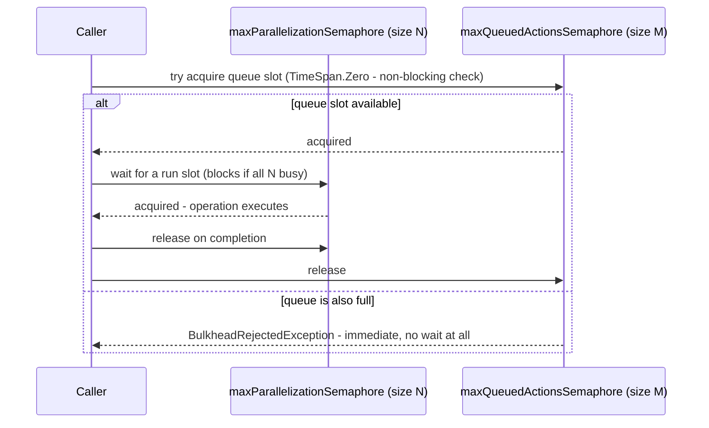

## 1. The Engineering Problem: two different failure modes need two different defenses

**Failure mode one:** a single client (or a misbehaving script, or one noisy tenant in a multi-tenant system) sends far more requests than any reasonable caller should, degrading the endpoint for everyone else sharing it. **Failure mode two:** a slow downstream dependency — a flaky payment gateway, a database under load — causes calling threads or connections to pile up waiting on it, until the *calling* service exhausts its own thread pool or connection pool and becomes unresponsive to *everything*, including requests that never touch the slow dependency at all.

These look similar ("too much load") but they're genuinely different problems. A service well within its overall request-rate budget can still be brought down by failure mode two — 100 requests/second is nothing, but if each one blocks for 30 seconds on a hanging dependency, the thread pool empties fast regardless of how "low" the rate looks. Conversely, capping concurrency alone does nothing to stop a burst of very fast, very frequent requests from overwhelming a cheap endpoint. You need both, and they're not the same mechanism.

---

## 2. The Technical Solution: rate limiting caps throughput over time, bulkheads cap concurrent occupancy

**Rate limiting** (commonly a **token bucket**): a bucket holds tokens, refilled at a fixed rate. Each request consumes one token; an empty bucket means the request queues (bounded) or gets rejected. This caps *how often* — throughput over a time window — and says nothing about how long any individual request takes.

**Bulkheads** (named for a ship's watertight compartments — one flooded section shouldn't sink the whole ship): a fixed-size pool reserved for one operation or dependency. Requests beyond the pool's capacity queue (bounded) or get rejected immediately. This caps *how many at once* — concurrent occupancy — and says nothing about request frequency; 10,000 sequential calls through a bulkhead of size 5 is completely fine, because the bulkhead only ever looks at what's in-flight right now.

```mermaid
flowchart TD
    subgraph RL["Rate limiting (token bucket) - caps THROUGHPUT OVER TIME"]
        BUCKET["bucket: 1 token, refills 1 token / 10s"]
        REQ1["request consumes 1 token"] --> BUCKET
        BUCKET -.->|"bucket empty"| Q1["queue (bounded QueueLimit)<br/>or reject (429)"]
    end
    subgraph BH["Bulkhead - caps CONCURRENT OCCUPANCY"]
        POOL["fixed pool: maxParallelization slots"]
        REQ2["request takes a slot"] --> POOL
        POOL -.->|"pool full"| Q2["separate queue semaphore<br/>(maxQueuingActions)"]
        Q2 -.->|"queue also full"| REJ["BulkheadRejectedException - immediate"]
    end

    classDef cap fill:#e8f4fd,stroke:#1565c0,color:#0d3a5c;
    class BUCKET,POOL cap;
```



The mechanism worth naming explicitly for a bulkhead: **it's implemented with two separate counters, not one.** One tracks how many operations are *actually running* (the true concurrency cap); a second, independent one tracks how many callers are *allowed to wait in line* for a slot. Exceeding the first means "wait if there's room in the queue"; exceeding the second means "reject immediately, don't even queue" — two different limits, two different failure points.



---

## 3. The clean example (concept in isolation)

```csharp
// Rate limiting: caps requests over TIME
services.AddRateLimiter(options =>
    options.AddTokenBucketLimiter("api", o =>
    {
        o.TokenLimit = 100;
        o.TokensPerPeriod = 100;
        o.ReplenishmentPeriod = TimeSpan.FromSeconds(1);   // ~100 req/s sustained
        o.QueueLimit = 20;
    }));

// Bulkhead: caps CONCURRENT calls to one specific dependency
var paymentGatewayBulkhead = Policy.BulkheadAsync(
    maxParallelization: 10,   // at most 10 concurrent calls to the payment gateway
    maxQueuingActions: 5);     // 5 more may wait; beyond that, reject immediately
```

---

## 4. Production reality (from `dotnet/aspnetcore` and `App-vNext/Polly`)

ASP.NET Core's real rate-limiting sample combines a per-endpoint token bucket with a *global* concurrency limiter — both in the same config, addressing both failure modes at once:

```csharp
// src/Middleware/RateLimiting/samples/RateLimitingSample/Program.cs
builder.Services.AddRateLimiter(options =>
{
    options.AddTokenBucketLimiter(todoName, o =>
    {
        o.TokenLimit = 1;
        o.QueueProcessingOrder = QueueProcessingOrder.OldestFirst;
        o.QueueLimit = 1;
        o.ReplenishmentPeriod = TimeSpan.FromSeconds(10);
        o.TokensPerPeriod = 1;
    });

    // Global limiter: a CONCURRENCY limiter, not a rate limiter -
    // caps how many requests are in-flight across the WHOLE app at once
    options.GlobalLimiter = PartitionedRateLimiter.Create<HttpContext, string>(context =>
        RateLimitPartition.GetConcurrencyLimiter<string>("globalLimiter", key => new ConcurrencyLimiterOptions
        {
            PermitLimit = 10,
            QueueProcessingOrder = QueueProcessingOrder.NewestFirst,
            QueueLimit = 5
        }));
});

app.MapGet("/todoitems", async (TodoDb db) => await db.Todos.ToListAsync())
    .RequireRateLimiting(todoName);
```

Polly's real bulkhead implementation shows the two-semaphore mechanism directly:

```csharp
// src/Polly/Bulkhead/BulkheadEngine.cs
internal static TResult Implementation<TResult>(
    Func<Context, CancellationToken, TResult> action, Context context,
    Action<Context> onBulkheadRejected,
    SemaphoreSlim maxParallelizationSemaphore,
    SemaphoreSlim maxQueuedActionsSemaphore,
    CancellationToken cancellationToken)
{
    if (!maxQueuedActionsSemaphore.Wait(TimeSpan.Zero, cancellationToken))
    {
        onBulkheadRejected(context);
        throw new BulkheadRejectedException();   // queue full - reject immediately, don't block
    }
    try
    {
        maxParallelizationSemaphore.Wait(cancellationToken);   // wait for a run slot
        try { return action(context, cancellationToken); }
        finally { SafeRelease(maxParallelizationSemaphore); }
    }
    finally { SafeRelease(maxQueuedActionsSemaphore); }
}
```

What this teaches that a hello-world can't:

- **The sample's `GlobalLimiter` uses `RateLimitPartition.GetConcurrencyLimiter`, not a token bucket** — Microsoft's own sample deliberately pairs a per-endpoint *rate* limiter (`todoName`, token bucket) with an app-wide *concurrency* limiter as the global backstop. That's the real answer to "which one should I use": often both, at different scopes — per-endpoint throughput caps for abuse prevention, and a global concurrency cap as a last line of defense against total resource exhaustion.
- **`maxQueuedActionsSemaphore.Wait(TimeSpan.Zero, ...)` is a non-blocking check — the queue-admission decision itself never waits.** Only *after* successfully claiming a queue slot does the code block on `maxParallelizationSemaphore.Wait(...)` for an actual run slot. This ordering is why a full bulkhead rejects instantly rather than making the caller wait just to find out there was no room to wait in the first place.
- **`QueueProcessingOrder.OldestFirst` (todoName) vs. `NewestFirst` (globalLimiter) is a real, deliberate difference in the same file.** Oldest-first is fairness-oriented (first come, first served); newest-first favors low latency for the most recent caller at the cost of potentially starving older queued requests under sustained load — the sample uses different fairness policies for a per-endpoint limiter versus a global backstop, not the same policy everywhere.

Known-stale fact: before .NET 7, ASP.NET Core had no built-in rate-limiting middleware at all — teams either hand-rolled a semaphore-based limiter or pulled in a third-party package. `Microsoft.AspNetCore.RateLimiting` (built on the framework-level `System.Threading.RateLimiting` namespace, usable outside ASP.NET Core too) is the current, first-party answer; guidance that still assumes you need a third-party rate-limiting library for a modern .NET service is outdated.

---

## Source

- **Concept:** Rate limiting & bulkheads
- **Domain:** microservices
- **Repo:** [dotnet/aspnetcore](https://github.com/dotnet/aspnetcore) → [`src/Middleware/RateLimiting/samples/RateLimitingSample/Program.cs`](https://github.com/dotnet/aspnetcore/blob/main/src/Middleware/RateLimiting/samples/RateLimitingSample/Program.cs) — the official ASP.NET Core rate-limiting sample; [App-vNext/Polly](https://github.com/App-vNext/Polly) → [`src/Polly/Bulkhead/BulkheadEngine.cs`](https://github.com/App-vNext/Polly/blob/main/src/Polly/Bulkhead/BulkheadEngine.cs) — the .NET resilience library's real bulkhead implementation.
