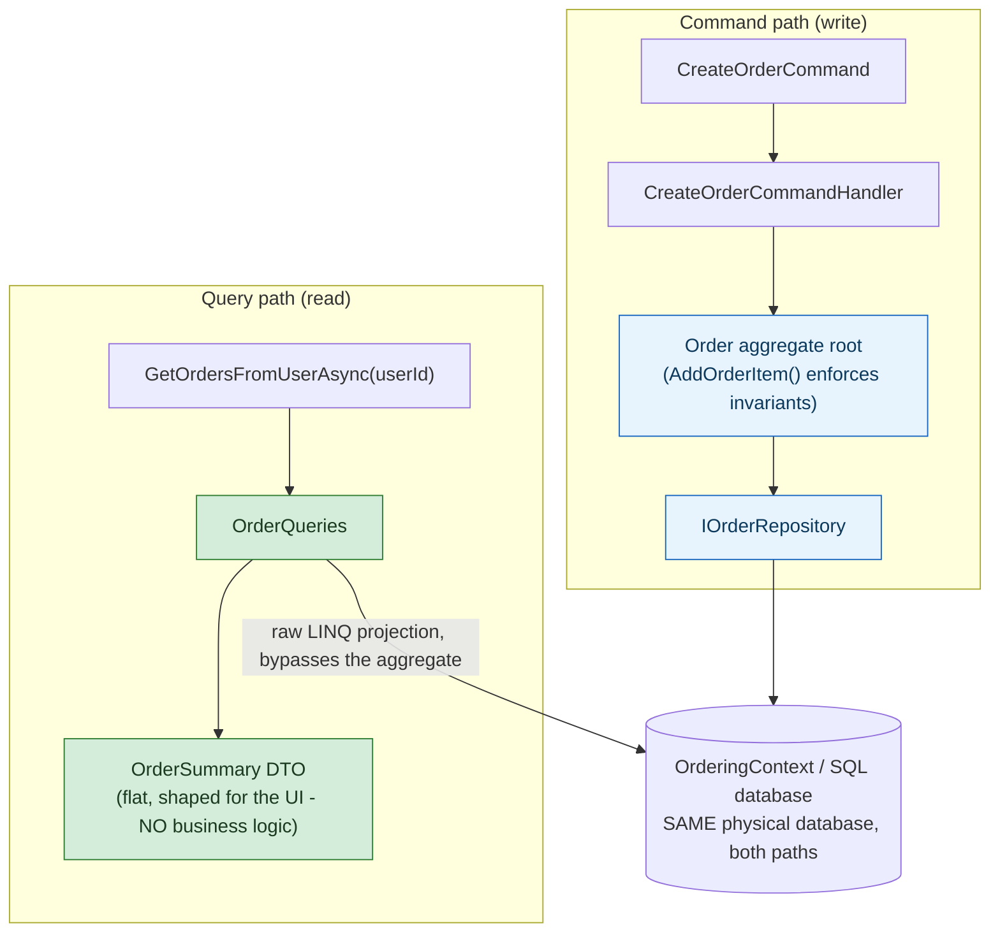

## 1. The Engineering Problem: one model can't be both strict and fast at the same time

A single `Order` class trying to serve both writes and reads accumulates conflicting pressure. Writes need a *rich* model — invariants enforced through methods (`AddOrderItem`, not a public `OrderItems` setter any caller can mutate directly), because that's the only thing keeping the data internally consistent. Reads need *shape* — a UI listing a user's orders wants `{orderNumber, date, status, total}`, not a fully hydrated aggregate with its entire child-entity graph loaded and business methods attached that a display page will never call.

Force one model to serve both and you get one of two bad outcomes: the write model gets watered down (public setters everywhere, invariants no longer guaranteed) so reads can shape data easily, or every read pays the full cost of loading and mapping a rich domain object it has no use for.

---

## 2. The Technical Solution: split the read path and write path into two different models, same database

**CQRS (Command Query Responsibility Segregation)**: writes go through a rich domain model via a repository, mutating state only through business methods that enforce invariants. Reads bypass the domain model *entirely* — querying the underlying store directly and projecting straight into flat, purpose-shaped view models. No business logic in the read path, because reads don't need business logic, only accurate data with minimal ceremony.



Core truths: **this is CQRS against a single, synchronously-consistent database — not the "full," event-sourced flavor with a separate read store.** CQRS is fundamentally about separating *models*, not necessarily about separating *databases* or accepting eventual consistency; those are optional escalations, not the definition. Reaching for a fully separate read database with async projection when a same-database model split already solves the actual problem is a common over-engineering mistake — the query side here reads the exact same rows the command side just wrote, in the same transaction boundary, with zero staleness.

---

## 3. The clean example (concept in isolation)

```csharp
// WRITE side - goes through the rich domain model
public async Task<bool> Handle(CreateOrderCommand cmd, CancellationToken ct)
{
    var order = new Order(cmd.UserId, cmd.Address);
    foreach (var item in cmd.Items)
        order.AddOrderItem(item.ProductId, item.Units, item.UnitPrice);  // invariants enforced here

    _repository.Add(order);
    return await _repository.UnitOfWork.SaveEntitiesAsync(ct);
}

// READ side - flat projection, no domain model involved
public async Task<IEnumerable<OrderSummary>> GetOrdersFromUserAsync(string userId) =>
    await _context.Orders
        .Where(o => o.Buyer.IdentityGuid == userId)
        .Select(o => new OrderSummary { OrderNumber = o.Id, Total = o.OrderItems.Sum(i => i.UnitPrice * i.Units) })
        .ToListAsync();
```

---

## 4. Production reality (from `dotnet/eShop`)

```
src/Ordering.API/Application/
├── Commands/
│   └── CreateOrderCommandHandler.cs   # write path - through the Order aggregate
└── Queries/
    ├── OrderQueries.cs                 # read path - raw DbContext projection
    └── OrderViewModel.cs               # flat DTOs, distinct from the domain model
```

```csharp
// Commands/CreateOrderCommandHandler.cs
public async Task<bool> Handle(CreateOrderCommand message, CancellationToken cancellationToken)
{
    var address = new Address(message.Street, message.City, message.State, message.Country, message.ZipCode);
    var order = new Order(message.UserId, message.UserName, address, message.CardTypeId,
        message.CardNumber, message.CardSecurityNumber, message.CardHolderName, message.CardExpiration);

    foreach (var item in message.OrderItems)
        order.AddOrderItem(item.ProductId, item.ProductName, item.UnitPrice, item.Discount, item.PictureUrl, item.Units);

    _orderRepository.Add(order);
    return await _orderRepository.UnitOfWork.SaveEntitiesAsync(cancellationToken);
}
```

```csharp
// Queries/OrderQueries.cs
public class OrderQueries(OrderingContext context) : IOrderQueries
{
    public async Task<IEnumerable<OrderSummary>> GetOrdersFromUserAsync(string userId) =>
        await context.Orders
            .Where(o => o.Buyer.IdentityGuid == userId)
            .Select(o => new OrderSummary
            {
                OrderNumber = o.Id,
                Date = o.OrderDate,
                Status = o.OrderStatus.ToString(),
                Total = (double)o.OrderItems.Sum(oi => oi.UnitPrice * oi.Units)
            })
            .ToListAsync();

    public async Task<IEnumerable<CardType>> GetCardTypesAsync() =>
        await context.CardTypes.Select(c => new CardType { Id = c.Id, Name = c.Name }).ToListAsync();
}
```

What this teaches that a hello-world can't:

- **`CreateOrderCommandHandler` never constructs an `Order` with a public setter — it calls `new Order(...)` and `order.AddOrderItem(...)`, methods that enforce whatever invariants the aggregate defines.** `OrderQueries`, by contrast, never touches the `Order` domain type at all — it queries `context.Orders` (the EF Core `DbSet`) directly and projects into `OrderSummary`, a plain DTO with no methods, no invariants, nothing to enforce, because a read has nothing to protect.
- **`GetOrdersFromUserAsync` computes `Total` inline in the LINQ projection (`o.OrderItems.Sum(oi => oi.UnitPrice * oi.Units)`)** rather than calling the aggregate's own `GetTotal()` method (used by `GetOrderAsync` for a single order). The read side is free to duplicate a calculation as a database-translatable expression instead of round-tripping through domain logic — something the write side would never be allowed to do, since the aggregate is supposed to be the single source of truth for that computation during a write.
- **Both paths hit `OrderingContext`, the exact same `DbContext` and physical database** — this CQRS split buys model separation and cleaner responsibility, but *not* independent scaling of reads vs. writes, and *not* eventual consistency to reason about. That's a deliberate scope choice, not a missing feature; a service that actually needs independently-scaled reads (a read replica, a separate denormalized store, Elasticsearch) would extend this same pattern, not replace it.

Known-stale fact: "CQRS" is frequently taught as inseparable from event sourcing and a fully separate, eventually-consistent read store — that's one legitimate, more complex implementation of the pattern, not a requirement of it. The core idea — separate models for reading and writing — is fully realized here against one synchronous database, which is the far more common shape CQRS actually takes in production systems that don't have a specific need for independently-scaled or denormalized reads.

---

## Source

- **Concept:** CQRS (Command Query Responsibility Segregation)
- **Domain:** microservices
- **Repo:** [dotnet/eShop](https://github.com/dotnet/eShop) → [`src/Ordering.API/Application/Commands/CreateOrderCommandHandler.cs`](https://github.com/dotnet/eShop/blob/main/src/Ordering.API/Application/Commands/CreateOrderCommandHandler.cs), [`src/Ordering.API/Application/Queries/OrderQueries.cs`](https://github.com/dotnet/eShop/blob/main/src/Ordering.API/Application/Queries/OrderQueries.cs) — the modern .NET microservices reference architecture.
