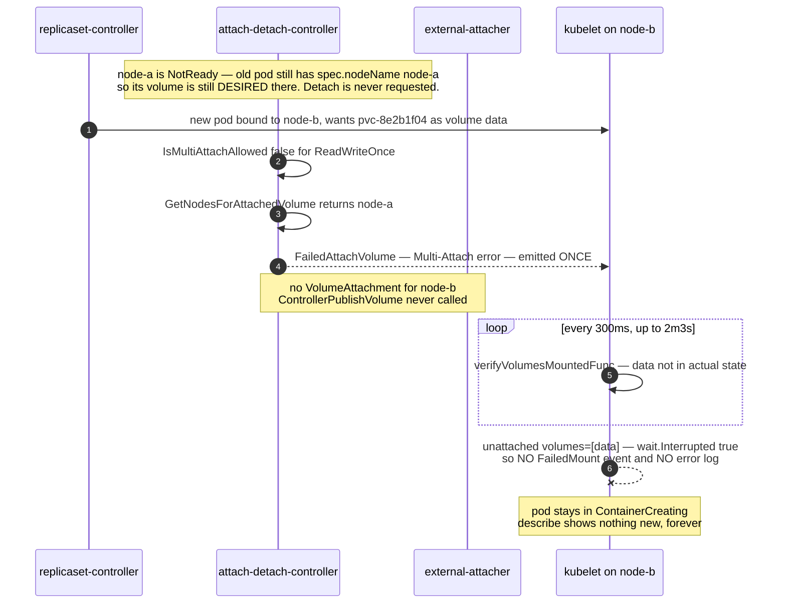

**TL;DR:** The pod is not stuck mounting — it is stuck *attaching*. A ReadWriteOnce PersistentVolume is still recorded as attached to a node that died, so the attach-detach controller in kube-controller-manager refuses to create a `VolumeAttachment` for the new node, and the kubelet's 2-minute mount wait ends in a plain timeout that (since Kubernetes 1.28) produces no event at all.

## The symptom

> "One pod — `grafana-7d9f5c` — has been in `ContainerCreating` for twelve minutes. `kubectl describe pod` shows the container as `Waiting: ContainerCreating` and the Events list has one warning from eleven minutes ago and nothing since. The node it landed on is `Ready`, its kubelet is fine, and three other pods that got scheduled to that same node in the same minute went `Running` in under ten seconds. The image is already in the node's cache. I've deleted the pod twice and it comes back and hangs in exactly the same way."

Three guesses die immediately. It is not image pull — other pods on the node pulled and started fine, and `describe` would show `Pulling`/`ErrImagePull`. It is not CNI — a failed pod sandbox produces a loud, *repeating* `FailedCreatePodSandBox` event every few seconds. It is not scheduling — a pod in `ContainerCreating` is already bound to a node, so `spec.nodeName` is set and the scheduler is out of the picture.

What is left is the one part of pod startup that is not owned by the kubelet at all.

## Reproduce

A single-replica Deployment with a ReadWriteOnce PVC — the shape almost every self-hosted Grafana, Prometheus, or single-instance Postgres ends up with.

```yaml
apiVersion: apps/v1
kind: Deployment
metadata:
  name: grafana
spec:
  replicas: 1
  selector:
    matchLabels: { app: grafana }
  template:
    metadata:
      labels: { app: grafana }
    spec:
      containers:
        - name: grafana
          image: grafana/grafana:11.1.0
          volumeMounts:
            - name: data
              mountPath: /var/lib/grafana
      volumes:
        - name: data
          persistentVolumeClaim:
            claimName: grafana-data
---
apiVersion: v1
kind: PersistentVolumeClaim
metadata:
  name: grafana-data
spec:
  # ReadWriteOnce is the whole story. A block-device CSI driver
  # (EBS, PD, Cinder, vSphere) can attach this PV to exactly one node.
  accessModes: ["ReadWriteOnce"]
  storageClassName: standard-rwo
  resources:
    requests: { storage: 10Gi }
```

Now kill the node the pod is running on — hard, the way a real spot-instance reclaim or hypervisor failure kills it. Do **not** `kubectl drain` it, because a drain is exactly the graceful path this bug lives outside of.

```bash
kubectl get pod -l app=grafana -o wide      # note the node, call it node-a
gcloud compute instances stop node-a --zone us-central1-a   # or: aws ec2 stop-instances --instance-ids ...

# node-a goes NotReady after ~40s, taint-based eviction marks the pod for
# deletion, and the ReplicaSet controller immediately creates a replacement
# because a pod with a deletionTimestamp no longer counts as active.
kubectl get pod -l app=grafana -w
# grafana-7d9f5c-abcde   1/1   Terminating         0   3h1m   node-a
# grafana-7d9f5c-fghij   0/1   ContainerCreating   0   0s     node-b
# grafana-7d9f5c-fghij   0/1   ContainerCreating   0   12m    node-b   <-- forever
```

## The root cause chain

### 1. The immediate trigger: a volume that is still attached somewhere else

```bash
kubectl get volumeattachments \
  -o custom-columns=NAME:.metadata.name,PV:.spec.source.persistentVolumeName,NODE:.spec.nodeName,ATTACHED:.status.attached
```

```
NAME                   PV                                         NODE     ATTACHED
csi-3f9a1c...          pvc-8e2b1f04-7c1a-4c2e-9a11-6b0d5a3e77ce   node-a   true
```

There is no `VolumeAttachment` for `node-b`. Not a failing one — none at all. Nothing ever asked for the volume to be attached to the new node.

`VolumeAttachment` is a real cluster-scoped API object (`storage.k8s.io/v1`) with exactly three spec fields — `attacher`, `source`, and `nodeName` — and a `status.attached` boolean that, per the API type's own comment, "must only be set by the entity completing the attach operation, i.e. the external-attacher." Its continued existence pointing at a dead node is the whole bug.

### 2. The mechanism: attach and mount are two different components

This is the distinction the symptom hides. Getting a CSI volume into a container is two independent phases owned by two independent processes:

| Phase | Who does it | CSI call | Kubernetes object |
|---|---|---|---|
| **Attach** | attach-detach controller in kube-controller-manager, executed by the `external-attacher` sidecar | `ControllerPublishVolume` | creates a `VolumeAttachment`, sets `status.attached` |
| **Mount** | the kubelet on the target node, via the CSI node plugin | `NodeStageVolume` then `NodePublishVolume` | none — it is filesystem work under `/var/lib/kubelet` |

The attach-detach controller keeps a "desired state of world" built from every pod that has `spec.nodeName` set and is not terminated. The old pod on `node-a` has a `deletionTimestamp` but its kubelet is gone, so nothing ever moves it to a terminal phase — as far as the controller is concerned, that pod still legitimately wants that volume on `node-a`. Detach is therefore never *requested*.

Meanwhile the new pod wants the same volume on `node-b`. In `attachDesiredVolumes`, the controller checks `IsMultiAttachAllowed` — false for a `ReadWriteOnce` PV — then calls `GetNodesForAttachedVolume`, gets back `[node-a]`, and calls `reportMultiAttachError` instead of attaching.

That produces the one warning you saw:

```
Warning  FailedAttachVolume  11m  attachdetach-controller
  Multi-Attach error for volume "pvc-8e2b1f04-7c1a-4c2e-9a11-6b0d5a3e77ce"
  Volume is already used by pod(s) grafana-7d9f5c-abcde
```

And exactly one, ever. The controller sets `MultiAttachErrorReported` on the volume immediately after emitting it, guarding against a repeat. Every other stuck-pod warning in Kubernetes repeats on a loop; this one does not.

### 3. Why the kubelet then goes completely silent

The kubelet does its part in `volumeManager.WaitForAttachAndMount`. It polls every `podAttachAndMountRetryInterval` (300ms) up to `podAttachAndMountTimeout` — a literal `2*time.Minute + 3*time.Second` — and on failure builds this error:

```go
return fmt.Errorf(
    "unmounted volumes=%v, unattached volumes=%v, failed to process volumes=%v: %w",
    unmountedVolumes,
    unattachedVolumes,
    volumesNotInDSW,
    err)
```

Those first two lists are the attach/mount split made visible, and reading them correctly is the fastest diagnosis in this whole post:

- a volume in **`unattached volumes=`** means `PluginIsAttachable` is true and the volume is not in the node's actual state — the *controller-side* attach never happened. Look at kube-controller-manager.
- a volume in **`unmounted volumes=`** only means the attach succeeded and the *node-side* `NodeStageVolume`/`NodePublishVolume` is failing. Look at the CSI node plugin on that node.

Here it is `unattached volumes=[data]`. But you will not find that string anywhere, because of this in `pkg/kubelet/kubelet.go`:

```go
if err := kl.volumeManager.WaitForAttachAndMount(ctx, pod); err != nil {
    // ...
    // wait.Interrupted(err) is TRUE for a poll deadline, so a pure
    // timeout takes neither branch below — no event, no error log.
    if !wait.Interrupted(err) {
        kl.recorder.Eventf(pod, v1.EventTypeWarning, events.FailedMountVolume,
            "Unable to attach or mount volumes: %v", err)
        klog.ErrorS(err, "Unable to attach or mount volumes for pod; skipping pod", ...)
    }
    return false, err
}
```

`wait.Interrupted` returns true for `errWaitTimeout`, `context.Canceled`, and `context.DeadlineExceeded`, and `errors.Is` unwraps the `%w` above — so a mount wait that simply ran out of clock emits **no** `FailedMount` event and **no** error log. This guard has been in the kubelet since 1.28; before that (1.27 and earlier) the event fired unconditionally, which is why every older Stack Overflow answer for this symptom quotes an `Unable to attach or mount volumes: ... timed out waiting for the condition` event that your cluster will never print.

A *mount* failure still shouts, because `verifyVolumesMountedFunc` pops real errors out of the desired-state cache and returns them as a non-timeout error. It is specifically the "attach never even started" case that is silent.



## The fix

Two things have to happen: the dead node's claim on the volume has to be released, and the orphaned pod object has to stop counting as a live consumer.

### Option A — taint the dead node out of service (ship this)

`NodeOutOfServiceVolumeDetach` is stable and on by default since Kubernetes 1.28. Applying the taint tells the control plane that the node is genuinely gone, not just unreachable — pods on it are force-deleted and their volumes force-detached without waiting.

```bash
# Only ever do this on a node you have CONFIRMED is powered off.
# The taint tells Kubernetes "nothing is running here" — if the kubelet is
# actually alive, you are authorising a second writer on an RWO volume.
kubectl taint node node-a node.kubernetes.io/out-of-service=nodeshutdown:NoExecute
```

Within a few seconds the `VolumeAttachment` for `node-a` disappears, the attach-detach controller creates one for `node-b`, `external-attacher` calls `ControllerPublishVolume`, and the kubelet's next 300ms poll finds the volume and mounts it. Remove the taint if the node ever comes back.

### Option B — force-delete the orphaned pod

```bash
kubectl delete pod grafana-7d9f5c-abcde --force --grace-period=0
```

This removes the pod from the controller's desired state, so detach is finally *requested*. But `node-a` still lists the volume in `status.volumesInUse` and no kubelet is alive to clear it, so the controller treats the volume as "not safe to detach" and waits `ReconcilerMaxWaitForUnmountDuration` — a hardcoded **6 minutes** in `DefaultTimerConfig` — before force-detaching anyway. Expect roughly six more minutes of `ContainerCreating`, not an instant fix. (If your cluster runs kube-controller-manager with `--disable-force-detach-on-timeout=true`, which defaults to `false`, this option never completes at all and Option A is mandatory.)

The genuinely correct long-term answer is neither: let the node object be *deleted* rather than left NotReady. Cluster Autoscaler, GKE/EKS node auto-repair, and Cluster API all delete the `Node` on termination, which drops it from the actual state of world and releases the attachment with no human in the loop. A cluster that leaves dead `Node` objects lying around will hit this every time an instance is reclaimed.

## Deeper checks for production

1. **Check `unattached` before `unmounted`, every time.** Pull the kubelet's own view rather than guessing: `kubectl get pod <name> -o jsonpath='{.spec.volumes[*].name}'` then compare against `kubectl get volumeattachments | grep <pv-name>`. If there is no `VolumeAttachment` for the pod's node, stop reading node logs — the problem is in kube-controller-manager.

2. **The same deadlock happens with zero node failures, during an ordinary rolling update.** A `replicas: 1` Deployment with an RWO PVC defaults to `maxSurge: 25%` (rounds *up* to 1) and `maxUnavailable: 25%` (rounds *down* to 0), so the new pod is created on a different node *before* the old one is deleted, and multi-attaches against itself forever. The fix is `strategy: { type: Recreate }` on any Deployment holding a ReadWriteOnce volume — treat that as a lint rule, not a debugging step.

3. **Alert on `VolumeAttachment` objects whose node is not `Ready`.** This is a cheap, high-signal check that no default dashboard performs: join `kubectl get volumeattachments -o json` against the node list and page on any attachment pointing at a NotReady or nonexistent node. It fires before the next pod reschedule turns it into an outage.

4. **Verify `attachRequired` on your CSIDriver object.** `attachRequired` defaults to `true` when the field is omitted *or when no CSIDriver object exists at all*. Drivers that do not implement `ControllerPublishVolume` (many file/NFS-backed drivers) but ship without a CSIDriver object make every pod wait on an attach phase that will never complete — the same silent 2m3s timeout, from a completely different cause.

5. **Watch for the event text changing under you.** The `Multi-Attach error` prefix is what Kubernetes 1.34 and earlier emit; it has since been reworded on the main branch to `Waiting for detach`. Grep your alerting rules for the PV name and the `FailedAttachVolume` *reason*, which are stable, not the human-readable prefix, which is not.

## Prevention checklist

- [ ] Every Deployment that mounts a `ReadWriteOnce` PVC sets `strategy.type: Recreate`, so `maxSurge: 1` can never place two pods on two nodes against one volume
- [ ] Dead nodes are *deleted*, not left NotReady — autoscaler or node-auto-repair owns the `Node` object lifecycle
- [ ] The runbook for a stuck `ContainerCreating` starts with `kubectl get volumeattachments`, not with kubelet logs
- [ ] `node.kubernetes.io/out-of-service=nodeshutdown:NoExecute` is a documented, gated runbook step with an explicit "confirm the machine is powered off first" gate
- [ ] kube-controller-manager's `--disable-force-detach-on-timeout` value is known and recorded — the 6-minute `ReconcilerMaxWaitForUnmountDuration` fallback either exists or it does not, and that changes the runbook

## FAQ

**Why did `kubectl describe pod` show me nothing when other stuck pods always show repeating warnings?**
Two separate suppressions stack. The attach-detach controller emits its `FailedAttachVolume` warning exactly once per volume — it sets `MultiAttachErrorReported` immediately afterwards to prevent a repeat — and the kubelet skips its `FailedMount` event entirely when the mount wait ends in a timeout, because `wait.Interrupted(err)` is true for a poll deadline. Nothing is broken about your event pipeline.

**The pod started fine on this exact node yesterday. What changed?**
Nothing about the node. The pod's *volume* is what moved, or rather failed to move. Attach is a cluster-level operation keyed on the PV and the target node, so the node's own health tells you nothing about whether a given volume can be attached to it. That is precisely why the other pods on the node start in seconds: they do not want that PV.

**Would increasing a timeout have helped?**
No. `podAttachAndMountTimeout` is a hardcoded `2*time.Minute + 3*time.Second` in the kubelet's volume manager — there is no flag for it — and the kubelet retries the whole sync loop afterwards anyway, which is why the pod sits there for twelve minutes rather than failing at two. Waiting longer does not create a `VolumeAttachment` that nothing has requested.

**Is this specific to CSI, or does it happen with in-tree volume plugins too?**
The `VolumeAttachment` object and the `external-attacher` sidecar are CSI-specific, but the attach/detach split and the multi-attach guard live in the generic attach-detach controller and predate CSI. Since the in-tree AWS/GCE/Azure disk plugins are all CSI-migrated now, in practice every cluster hits the CSI code path — but the "attach is a controller job, mount is a kubelet job" split is the durable idea.

## Source

- **Symptom:** A pod sits in `ContainerCreating` for 10+ minutes with a single stale event, while other pods on the same node start normally
- **Domain:** kubernetes
- **Docs/Repo:** [kubernetes/kubernetes — `pkg/controller/volume/attachdetach/reconciler/reconciler.go`](https://github.com/kubernetes/kubernetes/blob/master/pkg/controller/volume/attachdetach/reconciler/reconciler.go) — `attachDesiredVolumes` and `reportMultiAttachError`, including the once-only `MultiAttachErrorReported` guard
- **Docs/Repo:** [kubernetes/kubernetes — `pkg/kubelet/volumemanager/volume_manager.go`](https://github.com/kubernetes/kubernetes/blob/master/pkg/kubelet/volumemanager/volume_manager.go) — `podAttachAndMountTimeout` of `2*time.Minute + 3*time.Second` and the `unmounted volumes=` / `unattached volumes=` error format
- **Docs/Repo:** [kubernetes/kubernetes — `pkg/kubelet/kubelet.go`](https://github.com/kubernetes/kubernetes/blob/master/pkg/kubelet/kubelet.go) — the `if !wait.Interrupted(err)` guard that suppresses the `FailedMount` event on a timeout
- **Docs/Repo:** [kubernetes/kubernetes — `pkg/controller/volume/attachdetach/attach_detach_controller.go`](https://github.com/kubernetes/kubernetes/blob/master/pkg/controller/volume/attachdetach/attach_detach_controller.go) — `DefaultTimerConfig` with `ReconcilerMaxWaitForUnmountDuration: 6 * time.Minute`
- **Docs/Repo:** [kubernetes-csi/external-attacher](https://github.com/kubernetes-csi/external-attacher) — the sidecar that watches `VolumeAttachment` objects and issues `ControllerPublishVolume`
- **Docs/Repo:** [Kubernetes docs — Non-Graceful Node Shutdown](https://kubernetes.io/docs/concepts/cluster-administration/node-shutdown/) — the `node.kubernetes.io/out-of-service:NoExecute` taint and `NodeOutOfServiceVolumeDetach`, stable since v1.28
