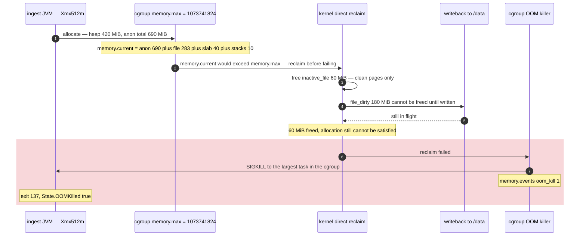

**TL;DR:** Three different numbers are being compared as if they were the same number. The app reports *heap*, `docker stats` reports `memory.current` *minus* `inactive_file`, and the kernel enforces `memory.max` against `memory.current` in full — including page cache, slab and kernel stacks. The container is over the limit even though every dashboard says it isn't.

> **In plain English (30 sec):** Code you already write — Map, function, API call, just bigger.

## The symptom

> "Our ingest service gets killed roughly every forty minutes. `--memory=1g`, and the JVM's own `/actuator/metrics/jvm.memory.used` gauge peaks around 420 MB against a 512 MB max heap. `docker stats` never showed it above 680 MiB either — I watched it. But `docker inspect` says `OOMKilled: true` and the exit code is 137. The host has 60 GB free. There is no leak: the heap flattens out, the GC logs are boring, and a heap dump shows nothing retained."

The heap being flat is what rules out the obvious answers. It is not a leak, it is not GC tuning, and it is not host pressure. Every tool the team looked at was reporting a number that genuinely was under the limit — just not the number the kernel uses to decide.

## Reproduce

A container with a modest heap ceiling, a normal amount of file I/O, and a memory limit that looks generous:

```bash
docker run -d --name ingest \
  --memory=1g \
  -e JAVA_TOOL_OPTIONS="-Xmx512m" \
  -v /var/data/ingest:/data \
  registry.example.com/ingest:2.7.1
```

The workload streams inbound batches to `/data` and re-reads recent files. Within an hour:


```bash
docker inspect --format '{{.State.OOMKilled}} {{.State.ExitCode}}' ingest
# true 137
```


137 is `128 + 9` — the process was SIGKILLed. `OOMKilled: true` narrows that to the OOM killer specifically, not a `docker stop` timeout (which also produces 137, with `OOMKilled: false`).

## The root cause chain

### 1. `docker stats` is not showing you what the kernel enforces

The CLI does not print `memory.current` raw. It subtracts a cache term first. This is `calculateMemUsageUnixNoCache` in `docker/cli`, verbatim:

```go
func calculateMemUsageUnixNoCache(mem container.MemoryStats) float64 {
	// cgroup v1
	if v, isCgroup1 := mem.Stats["total_inactive_file"]; isCgroup1 && v < mem.Usage {
		return float64(mem.Usage - v)
	}
	// cgroup v2
	if v := mem.Stats["inactive_file"]; v < mem.Usage {
		return float64(mem.Usage - v)
	}
	return float64(mem.Usage)
}
```

On the daemon side, `mem.Usage` for cgroup v2 is mapped straight from `memory.current` and `Limit` from `memory.max` (moby's `daemon/stats_unix.go`, `statsV2`). So the `MEM USAGE` column is `memory.current − inactive_file`. The kernel's limit check is against `memory.current`, full stop. The difference between those two numbers is exactly the amount by which `docker stats` will under-report — and on an I/O-heavy container it is not small.

Two cgroup v1 → v2 differences bite here, both visible in moby's own conversion code:

- The `Stats` map keys are different. v1 exposes `total_inactive_file`, `cache`, `rss`. v2 exposes `inactive_file`, `file`, `anon`. moby's source comments this as *"Stats is not compatible with v1"*. A dashboard query written against `container_memory_stats_cache` on a v1 host returns nothing on a v2 host.
- **`MaxUsage` is not supported on cgroup v2.** v1 had `memory.max_usage_in_bytes`, so `docker stats` and the API could show a high-water mark. On v2 that field is simply absent from the API response, which is why nobody on the team saw a peak — there was no peak to see.

### 2. The application's number is heap, and heap is a fraction of RSS

`-Xmx512m` caps one region. Outside it, and all counted against the same cgroup: metaspace, the JIT code cache, one stack per thread (1 MiB default on 64-bit Linux), GC bookkeeping structures, direct `ByteBuffer` allocations, and glibc's per-thread malloc arenas. A JVM with a 512 MiB heap routinely sits at 850 MiB–1 GiB RSS. The gauge was honest; it was measuring a different thing.

### 3. `memory.current` counts page cache — and the kill happens when reclaim can't free it fast enough

This is where most internet advice goes wrong in one of two directions. The accurate version:

The kernel doc defines `memory.current` as "the total amount of memory currently being used by the cgroup and its descendants," and that **does** include page cache. `memory.max` is the "memory usage hard limit," and when it is reached the kernel **attempts reclaim first**; only if memory cannot be freed sufficiently is "the OOM killer invoked in the cgroup."

So clean page cache alone does not kill you — it gets reclaimed. What kills you is when the reclaimable portion is too small to cover the shortfall. Read it directly from inside the container — dockerd's `--default-cgroupns-mode` defaults to `private`, so `/sys/fs/cgroup` inside the container is the container's own cgroup, not the host's root:

```bash
$ cat /sys/fs/cgroup/memory.max
1073741824
$ cat /sys/fs/cgroup/memory.current
1073405952
$ grep -E '^(anon|file|file_dirty|file_writeback|inactive_file|slab|kernel_stack|sock) ' \
    /sys/fs/cgroup/memory.stat
anon 723517440
file 297271296
file_dirty 188743680
file_writeback 52428800
inactive_file 62914560
slab 41943040
kernel_stack 10485760
sock 2097152
$ cat /sys/fs/cgroup/memory.events
low 0
high 0
max 4127
oom 6
oom_kill 1
```

`memory.current` is 1023 MiB of a 1024 MiB limit. `anon` alone is 690 MiB — that is the JVM's real footprint, not the 420 MiB the gauge showed. Of the 283 MiB of page cache, only `inactive_file` (60 MiB) is cheaply reclaimable; 180 MiB is dirty and 50 MiB is already in writeback, and neither can be freed until the write completes. `docker stats` subtracted exactly that 60 MiB and showed ~963 MiB — still under 1 GiB, still "fine."

`memory.events` is the confirming artifact. `max 4127` counts how many times usage was about to exceed the limit; `oom_kill 1` counts processes killed by any OOM killer in this cgroup. Note that moby maps `Failcnt` in the stats API to the `oom` field of `memory.events` on v2 — it is *not* the v1 `failcnt` counter, so a v1-era alert on `failcnt` means something different after a v2 migration.



### 4. The heap flag is what turned "tight" into "fatal"

`-Xmx512m` in a 1 GiB container leaves ~512 MiB for metaspace, code cache, thread stacks, direct buffers, malloc arenas **and** every page of file cache the workload touches. Raising `-Xmx` — the instinctive response to an OOM — makes it strictly worse, because it hands more of a fixed budget to one region.

There is a nastier version of this on older JDKs. `-XX:+UseContainerSupport` is on by default and reads the cgroup limit, but **cgroup v2 detection was only added in OpenJDK 15, and backported to 11.0.16 and 8u372.** On a cgroup-v2-only host, a JDK older than those sees no container at all: it falls back to host RAM, applies the default `MaxRAMPercentage` of `25.0` (verified in HotSpot's `gc_globals.hpp`), and on a 64 GiB node sizes a 16 GiB max heap inside a 1 GiB container. It will grow until it is killed, every time, and the JVM will insist nothing is wrong.

## The fix

Size the container from RSS, and size the heap from the cgroup limit rather than pinning it with an absolute number.

```dockerfile
# MaxRAMPercentage is applied to whatever UseContainerSupport detected —
# /sys/fs/cgroup/memory.max, not host RAM. Do not also set -Xmx: an absolute
# value silently overrides the percentage and reintroduces the original bug.
ENV JAVA_TOOL_OPTIONS="\
  -XX:MaxRAMPercentage=60 \
  -XX:MaxMetaspaceSize=192m \
  -XX:MaxDirectMemorySize=64m \
  -XX:NativeMemoryTracking=summary"

# glibc allocates up to 8 arenas per core by default, each backed by its own
# heap — the single largest source of "RSS is way above Xmx" on many-core hosts
ENV MALLOC_ARENA_MAX=2
```

The arithmetic, out loud, for `--memory=1g`:

| Region | Budget |
|---|---|
| Java heap (`MaxRAMPercentage=60`) | 614 MiB |
| Metaspace ceiling | 192 MiB |
| Direct byte buffers | 64 MiB |
| Thread stacks, code cache, GC structures, slab | ~120 MiB |
| Headroom for page cache and writeback | remainder |

That is deliberately tight — it is the point. If the sum of the explicit ceilings exceeds the limit, you have a design problem the kernel is going to find for you. Raise `--memory` to `1.5g` before raising `MaxRAMPercentage` past 70 on a container this size; percentage-based sizing works best when the absolute remainder is large enough to absorb native allocations, and 30% of 1 GiB is not much.

Do not reach for `--oom-kill-disable`. Docker's own resource-constraints doc pairs it with a warning, and a container that is over its limit and cannot be killed becomes a stuck process holding memory the host wanted back.

## Deeper checks for production

1. **Alert on `memory.events`, not on `docker stats`.** The `max` counter climbing is the early warning — it increments every time usage is about to breach the limit, long before `oom_kill` increments. A container with `max` in the thousands and `oom_kill 0` is one traffic spike away from a page.

2. **Confirm which cgroup version you are actually on.** `stat -fc %T /sys/fs/cgroup` returns `cgroup2fs` on v2 and `tmpfs` on v1. Then confirm the runtime agrees: `java -Xlog:os+container=trace -version` prints exactly what the JVM detected. If those disagree, your JDK is too old for v2 detection and every heap-sizing flag you set is being applied to the wrong number.

3. **Turn on Native Memory Tracking before you need it.** With `-XX:NativeMemoryTracking=summary` set, `jcmd <pid> VM.native_memory summary` breaks RSS into heap / class / thread / code / GC / internal. This is the only way to answer "the heap is 420 MiB, where are the other 270 MiB" without guessing.

4. **The adjacent failure: CPU throttling.** Containers sized this tightly usually have `--cpus` set too, and `memory.events` climbing often coincides with `cpu.stat`'s `nr_throttled` climbing — GC threads that can't get scheduled don't reclaim, which makes the memory picture worse. Check both files together, not one at a time.

5. **Watch `--memory-swap`.** If the host has swap and you set `--memory` without `--memory-swap`, the container gets swap headroom, which changes the failure mode from a kill into severe latency. Most CI runners and Kubernetes nodes have swap off entirely, so behaviour differs between your test host and production.

## Prevention checklist

- [ ] No container sets an absolute `-Xmx` — heap is derived from the cgroup limit via `-XX:MaxRAMPercentage`
- [ ] The base image's JDK is at least 11.0.16 / 8u372 / 15, so `UseContainerSupport` can read cgroup v2
- [ ] Monitoring reads `memory.current` and `memory.events` directly, not the `docker stats` `MEM USAGE` column, which subtracts `inactive_file`
- [ ] `MaxMetaspaceSize` and `MaxDirectMemorySize` have explicit ceilings, so RSS has a computable upper bound
- [ ] Dashboards migrated off cgroup v1 stat keys (`total_inactive_file`, `cache`, `rss`) to the v2 keys (`inactive_file`, `file`, `anon`)

## FAQ

**If page cache is reclaimable, why does it matter that `memory.current` counts it?**
Because "reclaimable" is conditional. Only clean pages can be dropped immediately. `file_dirty` and `file_writeback` pages have to reach the disk first, and under a write-heavy workload they accumulate faster than writeback drains them. Reclaim then fails to free enough within the allocation's deadline and the kernel invokes the OOM killer — the exact path `memory.events`' `max` counter is counting.

**Why does `docker stats` subtract `inactive_file` at all?**
To make the number comparable to how cadvisor and containerd/CRI report container memory, so that a container doing heavy I/O doesn't appear pinned at 100%. It is a reasonable display choice and a bad enforcement proxy — the two numbers answer different questions, and the CLI's is not the one the kernel asks.

**The exit code is 137 but `OOMKilled` is false. Same problem?**
No. 137 is `128 + SIGKILL`, and plenty of things send SIGKILL — most commonly `docker stop` escalating after its grace period. `OOMKilled: true` is what specifically identifies the cgroup OOM killer. With it false, check the host's `dmesg` for a system-wide OOM event and check whether something stopped the container.

**Can I just watch the peak memory instead of the current value?**
Not through `docker stats` on cgroup v2 — moby's stats conversion marks `MaxUsage` as unsupported there, so the field the v1 API populated from `memory.max_usage_in_bytes` is simply absent. Use the `oom` / `oom_kill` / `max` counters in `memory.events`, which are cumulative and therefore survive the sampling gaps that a point-in-time gauge misses.

## Source

- **Symptom:** container exits 137 with `State.OOMKilled: true` while both the JVM heap gauge and `docker stats` report usage well under `--memory`
- **Domain:** docker
- **Docs/Repo:** [Linux kernel cgroup v2 admin guide](https://docs.kernel.org/admin-guide/cgroup-v2.html) — the definitions of `memory.current` (includes page cache), `memory.max` (reclaim first, then invoke the OOM killer), and `memory.events`' `max` / `oom` / `oom_kill` counters
- **Docs/Repo:** [docker/cli — `cli/command/container/stats_helpers.go`](https://github.com/docker/cli/blob/master/cli/command/container/stats_helpers.go) — `calculateMemUsageUnixNoCache`, quoted verbatim, showing the `inactive_file` subtraction and the v1/v2 key split
- **Docs/Repo:** [moby/moby — `daemon/stats_unix.go`](https://github.com/moby/moby/blob/master/daemon/stats_unix.go) — the cgroup v2 mapping of `Usage` to `memory.current`, `Failcnt` to `memory.events`' `oom` field, and the `MaxUsage is not supported` comment
- **Docs/Repo:** [OpenJDK — `src/hotspot/share/gc/shared/gc_globals.hpp`](https://github.com/openjdk/jdk/blob/master/src/hotspot/share/gc/shared/gc_globals.hpp) — `MaxRAMPercentage` default `25.0`, `MinRAMPercentage` default `50.0`
- **Docs/Repo:** [JDK-8230305 Cgroups v2: Container awareness](https://bugs.openjdk.org/browse/JDK-8230305) — the change that added cgroup v2 detection, backported to 11.0.16 and 8u372


