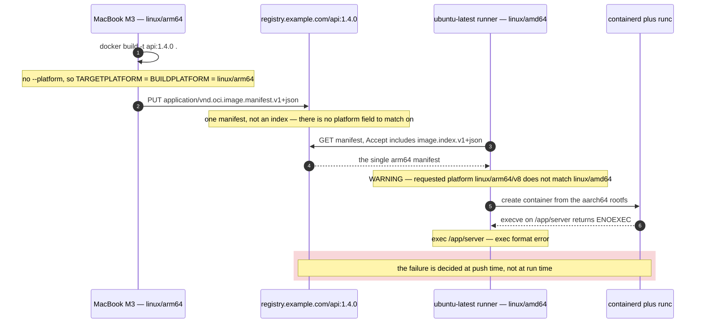

**TL;DR:** The image is not broken — it is `linux/arm64`. A plain `docker build` on an Apple Silicon Mac builds only for the builder's own platform, the classic image store can't store a manifest list, so what lands in the registry is one arm64 manifest with no platform choice in it. The amd64 CI runner pulls it anyway and the kernel refuses to `execve()` an aarch64 ELF binary.

## The symptom

> "I build and push from my MacBook, then the deploy job in CI pulls the exact same tag and the container is dead before it logs anything: `exec /app/server: exec format error`. The image is fine — I run it locally every day. The digest CI reports is byte-for-byte the digest I pushed. It's a static Go binary, so there's no shell and no shebang to get wrong, and `/app/server` definitely exists because the build stage `COPY`d it."

That rules out the three things people reach for first. It isn't a missing binary (the layer is there and the digest matches). It isn't a CRLF shebang, because a static Go binary has no interpreter line. And it isn't a musl-vs-glibc mismatch, because a `CGO_ENABLED=0` binary has no dynamic loader to fail. `exec format error` is `ENOEXEC` coming straight out of the kernel's ELF loader — the file is a valid executable, just not for this CPU.

## Reproduce

On an Apple Silicon Mac, with the default builder and no `--platform` anywhere:

```bash
# Nothing here says "arm64" — that is the point.
docker build -t registry.example.com/api:1.4.0 .
docker push registry.example.com/api:1.4.0
```

Then, on any amd64 runner (`ubuntu-latest` is x86_64):

```bash
docker run --rm registry.example.com/api:1.4.0
```

```
WARNING: The requested image's platform (linux/arm64/v8) does not match the
detected host platform (linux/amd64/v3) and no specific platform was requested
exec /app/server: exec format error
```

The warning is the whole diagnosis, and it is easy to scroll past in a CI log because the daemon prints it on every pull, not just on failure.

## The root cause chain

### 1. `docker build` has exactly one default platform: the builder's own

BuildKit resolves `BUILDPLATFORM` from the machine doing the building. On an M-series Mac that is `linux/arm64`. Nothing in the Dockerfile or the CLI invocation opts into anything else, and `DOCKER_DEFAULT_PLATFORM` is unset, so `TARGETPLATFORM` collapses to the same value. The build succeeds, the image works locally, and no warning is printed — locally, the platform matches.

### 2. The classic image store cannot represent a multi-platform image

This is the part that surprises people who *did* try to fix it by adding `--platform`. Docker's classic (pre-containerd) image store has no way to hold an OCI image index or a Docker manifest list. Ask the default `docker` driver for two platforms and buildx refuses outright:

```
ERROR: Multi-platform build is not supported for the docker driver.
Switch to a different driver, or turn on the containerd image store, and try again.
```

So a single-platform push is not a bad default you can flip with one flag — it is a storage limitation. You need either the containerd image store or a builder on the `docker-container` driver, which keeps its own content store and can therefore assemble an index.

### 3. `docker buildx imagetools inspect` proves it in one line

`docker manifest inspect` also works but is still marked experimental in the CLI reference. `imagetools` is the modern equivalent and its output makes the difference obvious. A healthy multi-platform image looks like this — this is the real output shape for `alpine`:

```
$ docker buildx imagetools inspect alpine
Name:      docker.io/library/alpine:latest
MediaType: application/vnd.docker.distribution.manifest.list.v2+json
Digest:    sha256:21a3deaa0d32a8057914f36584b5288d2e5ecc984380bc0118285c70fa8c9300

Manifests:
  Name:      docker.io/library/alpine:latest@sha256:e7d88de73db3d3fd9b2d63aa7f...
  MediaType: application/vnd.docker.distribution.manifest.v2+json
  Platform:  linux/amd64

  Name:      docker.io/library/alpine:latest@sha256:e047bc2af17934d38c5a7fa9f4...
  MediaType: application/vnd.docker.distribution.manifest.v2+json
  Platform:  linux/arm/v6
```

The broken image has no `Manifests:` block at all, because there is no index — the top-level `MediaType` is a *manifest*, not a *manifest list*:

```
$ docker buildx imagetools inspect registry.example.com/api:1.4.0
Name:      registry.example.com/api:1.4.0
MediaType: application/vnd.oci.image.manifest.v1+json
Digest:    sha256:9c2f...
```

`application/vnd.oci.image.manifest.v1+json` where you expected `application/vnd.oci.image.index.v1+json` is the tell. An index carries a `platform` object per entry — `{"architecture": "amd64", "os": "linux"}` — and that object is what the puller matches against. With a bare manifest there is nothing to match, so the daemon pulls the only thing on offer and warns instead of failing.



## The fix

Build the image in CI, on a builder that can produce an index, for both platforms.

### Option A — multi-platform build in CI on the `docker-container` driver (ship this)

`docker/setup-buildx-action` creates a builder on the `docker-container` driver by default, which is exactly the driver the classic store lacks. `docker/setup-qemu-action` registers the binfmt handlers so the non-native stage can run under emulation.


```yaml
name: build
on: push
jobs:
  image:
    runs-on: ubuntu-latest
    steps:
      - uses: actions/checkout@v4
      - uses: docker/setup-qemu-action@v3
      # creates a builder on the docker-container driver — the default
      # `docker` driver cannot assemble a manifest list at all
      - uses: docker/setup-buildx-action@v3
      - uses: docker/login-action@v3
        with:
          registry: registry.example.com
          username: ${{ secrets.REGISTRY_USER }}
          password: ${{ secrets.REGISTRY_TOKEN }}
      - uses: docker/build-push-action@v7
        with:
          context: .
          # push: true is required — a multi-platform result cannot be
          # loaded into the local engine store, only pushed to a registry
          push: true
          # the one line that turns a single manifest into an OCI image index
          platforms: linux/amd64,linux/arm64
          tags: registry.example.com/api:1.4.0
```


Cross-compile instead of emulating wherever the toolchain allows it. QEMU emulation is, per Docker's own multi-platform guidance, "much slower than native builds, especially for compute-heavy tasks like compilation." Go pins the build stage to the runner's native arch and cross-compiles from there:

```dockerfile
# --platform=$BUILDPLATFORM keeps the compiler running natively on the
# amd64 runner even when TARGETARCH is arm64 — no QEMU in the hot path
FROM --platform=$BUILDPLATFORM golang:1.24-alpine AS build
ARG TARGETOS
ARG TARGETARCH
WORKDIR /src
COPY go.mod go.sum ./
RUN go mod download
COPY . .
RUN CGO_ENABLED=0 GOOS=$TARGETOS GOARCH=$TARGETARCH \
    go build -trimpath -o /out/server ./cmd/server

# the final stage is per-platform and contains no toolchain at all
FROM gcr.io/distroless/static-debian12:nonroot
COPY --from=build /out/server /app/server
USER nonroot
ENTRYPOINT ["/app/server"]
```

### Option B — turn on the containerd image store locally

Enabled by default in Docker Desktop 4.34 and later; in Engine 29.0+ it is the default store. It gives the laptop the ability to build, `--load`, and inspect multi-platform images without a separate builder. Do this so local behaviour matches CI, not as a substitute for Option A — you still do not want release images built on a laptop.

### Option C — `DOCKER_DEFAULT_PLATFORM=linux/amd64`

Only correct if you genuinely ship one architecture. It makes the laptop build amd64 under QEMU, which is slow, and every local `docker run` of that image is then emulated too. It fixes CI by making local development worse.

## Deeper checks for production

1. **Check what a base image actually publishes before you pin it.** `docker buildx imagetools inspect <base>` on every `FROM` line — a base with no `linux/arm64` entry silently forces the whole arm64 leg of your build under emulation, or fails outright. This is the most common reason a working multi-platform build regresses after a base-image bump.

2. **Expect `unknown/unknown` entries in the index and don't panic.** Provenance attestations with `mode=min` are added to images by default, and per Docker's attestation-storage doc the attestation manifest's `platform` is set to `unknown/unknown` with the annotation `vnd.docker.reference.type: attestation-manifest`. Older registry tooling sometimes chokes on these. Disable with `BUILDX_NO_DEFAULT_ATTESTATIONS` or `--provenance=false` only if a downstream consumer genuinely breaks — you are giving up supply-chain metadata.

3. **Run a smoke test on the platform you deploy to, not the one you build on.** Add a job step that does `docker run --rm --platform linux/amd64 <tag> --version`. Building an index is not proof that the amd64 leg works — a cross-compile can succeed and still produce a binary linked against the wrong libc.

4. **Consider native arm64 runners over QEMU.** GitHub's `ubuntu-24.04-arm` and `ubuntu-22.04-arm` labels became generally available for public repositories in August 2025 and for private repositories in January 2026. Building each architecture natively and merging with `docker buildx imagetools create` is usually faster than one emulated job.

## Prevention checklist

- [ ] Release images are built by CI with `platforms: linux/amd64,linux/arm64`, never pushed from a developer machine
- [ ] The build uses a `docker-container` driver builder (or the containerd image store) — the default `docker` driver cannot produce an image index
- [ ] `docker buildx imagetools inspect <tag>` reports `MediaType: ...image.index.v1+json` with one `Platform:` line per deployed architecture
- [ ] Every `FROM` base image is verified to publish all target platforms before it is pinned
- [ ] A post-push job runs the image with an explicit `--platform` matching the deploy target

## FAQ

**Why does the daemon warn instead of refusing to run the wrong-architecture image?**
Because a platform mismatch is not always fatal — with `binfmt_misc` handlers registered (what `docker/setup-qemu-action` installs), an arm64 image *will* run on an amd64 host under emulation. The daemon can't know whether emulation is available, so it warns and lets `execve()` decide. On a bare CI runner with no handlers registered, `execve()` returns `ENOEXEC` and you get `exec format error`.

**I added `--platform linux/amd64,linux/arm64` to `docker build` and got an error instead of an image. Isn't that the fix?**
That error is the second link in the chain: `Multi-platform build is not supported for the docker driver.` The flag is right, the builder is wrong. Multi-platform images require a store that can hold a manifest list, which the classic image store cannot — switch to a `docker-container` builder or enable the containerd image store.

**Can I build multi-platform and `--load` the result into my local engine?**
Not with the classic image store — that is the same limitation. With the containerd image store you can. Otherwise the result of a multi-platform build has to go straight to a registry with `--push`, which is why `docker/build-push-action` requires `push: true` for this configuration.

**Is `docker manifest inspect` or `docker buildx imagetools inspect` the right tool?**
`imagetools`. `docker manifest inspect` is documented as experimental in the CLI reference and its behaviour has shifted across releases. `imagetools inspect` prints the top-level `MediaType` and one `Platform:` line per manifest without extra flags, and `--raw` gives you the untouched JSON when you need to diff it.

## Source

- **Symptom:** `exec /app/server: exec format error` on an amd64 CI runner for an image that runs fine on an Apple Silicon laptop
- **Domain:** docker
- **Docs/Repo:** [Multi-platform builds](https://docs.docker.com/build/building/multi-platform/) — establishes that multi-platform images require a store supporting manifest lists, that the containerd image store or a `docker-container` builder is needed, and that QEMU emulation is much slower than native builds
- **Docs/Repo:** [opencontainers/image-spec — image-index.md](https://github.com/opencontainers/image-spec/blob/main/image-index.md) — the canonical `application/vnd.oci.image.index.v1+json` media type and the per-manifest `platform` object that pull-time matching uses
- **Docs/Repo:** [docker buildx imagetools inspect](https://docs.docker.com/reference/cli/docker/buildx/imagetools/inspect/) — the verbatim `Manifests:` / `Platform:` output format quoted above
- **Docs/Repo:** [Attestation storage](https://docs.docker.com/build/metadata/attestations/attestation-storage/) — the `unknown/unknown` platform value and `vnd.docker.reference.type` annotation on attestation manifests


