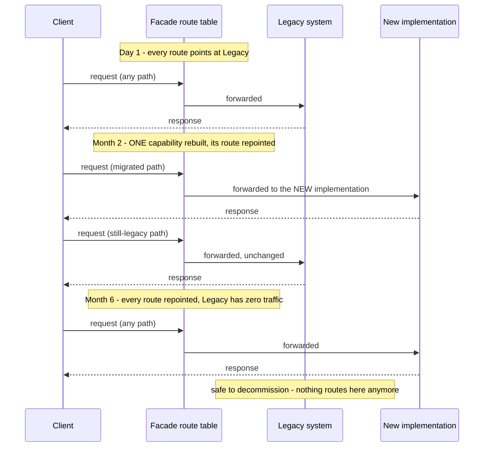

## 1. The Engineering Problem: a big-bang rewrite is a bet you can't take back

The obvious plan for replacing a legacy system is: freeze it, build the new one in isolation for months, then flip a switch on cutover day. This fails in two predictable ways. First, the legacy system doesn't actually get to freeze — it still needs bug fixes and small features while the rewrite is underway, so the target the new system is being built against keeps moving. Second, cutover day is all-or-nothing: any gap the new system has, however small, is now everyone's problem simultaneously, with no partial fallback — you either commit fully or roll the whole thing back.

You need a way to replace a system's internals gradually, capability by capability, where the system stays fully working at every single point along the way, and any one piece can be reverted without touching the rest.

---

## 2. The Technical Solution: a facade whose route table changes over time, not the system underneath it all at once

The **Strangler Fig** pattern (named for the vine that grows around a host tree, gradually replacing its structure until the original can be removed) puts a facade — a reverse proxy / gateway — in front of the whole system. Every request goes through the facade's route table. At the start, every route points at the legacy implementation. One capability at a time gets rebuilt in the new system; when it's ready, exactly one route in the facade is repointed at the new implementation. Nothing else changes. Repeat until no routes point at legacy anymore, and it can be safely decommissioned.



Core truths: **the system is fully functional at every intermediate stage** — there's no "half-migrated, partially broken" state, because each route independently points at exactly one working implementation the whole time; and **reverting one migrated capability means repointing one route back**, not rolling back a deployment or restoring a database — the blast radius of a bad migration step is exactly the one route that changed.

A common misconception worth correcting: Strangler Fig doesn't require an event bus or message queue — it's fundamentally a **routing** pattern. A reverse proxy's route table is a complete implementation of the facade. (Migrating the *data* underneath a capability, if the new implementation needs its own store, is a related-but-separate concern, often handled with dual-writes or change-data-capture — but that's an addition on top of the routing pattern, not a requirement of it.)

---

## 3. The clean example (concept in isolation)

```csharp
// Illustrative: extending a real route table to migrate ONE capability
var yarp = builder.AddYarp("gateway").WithConfiguration(y =>
{
    var legacyCluster = y.AddCluster(legacyMonolith);
    var newCluster = y.AddCluster(newCatalogService);

    // Capability already migrated: /catalog-api now points at the new service
    y.AddRoute("/catalog-api/{**catch-all}", newCluster)
        .WithTransformPathRemovePrefix("/catalog-api");

    // Everything else still points at the legacy monolith, unchanged
    y.AddRoute("/{**catch-all}", legacyCluster);
});
```

---

## 4. Production reality (from `dotnet/eShop`)

`dotnet/eShop`'s real mobile BFF gateway uses exactly the routing mechanism a strangler facade needs — a per-path route table, each route bound to a specific cluster, with request matching down to the query-string level:

```csharp
// src/eShop.AppHost/Extensions.cs
public static IResourceBuilder<YarpResource> ConfigureMobileBffRoutes(
    this IResourceBuilder<YarpResource> builder,
    IResourceBuilder<ProjectResource> catalogApi,
    IResourceBuilder<ProjectResource> orderingApi,
    IResourceBuilder<ProjectResource> identityApi)
{
    return builder.WithConfiguration(yarp =>
    {
        var catalogCluster = yarp.AddCluster(catalogApi);

        yarp.AddRoute("/catalog-api/api/catalog/items", catalogCluster)
            .WithMatchRouteQueryParameter([new() {
                Name = "api-version", Values = ["1.0", "1", "2.0"],
                Mode = QueryParameterMatchMode.Exact
            }])
            .WithTransformPathRemovePrefix("/catalog-api");

        yarp.AddRoute("/catalog-api/api/catalog/items/withsemanticrelevance", catalogCluster)
            .WithMatchRouteQueryParameter([new() {
                Name = "api-version", Values = ["2.0"],
                Mode = QueryParameterMatchMode.Exact
            }])
            .WithTransformPathRemovePrefix("/catalog-api");
        // ... more routes, each independently bound to a cluster
    });
}
```

What this teaches that a hello-world can't:

- **Every route is bound to a cluster independently — nothing about YARP's route table requires all routes to point at the same backend.** This code currently sends every `api-version` value to the same `catalogCluster` because eShop has only one generation of the catalog service running, but the mechanism is already exactly what a strangler migration needs: nothing structural would change to add a second cluster and repoint one route at it.
- **`WithMatchRouteQueryParameter` matching on `api-version` shows a real, finer-grained dispatch axis than just the URL path.** A strangler migration doesn't have to cut over an entire path at once — version-based matching (`api-version: "1.0"` → legacy cluster, `api-version: "2.0"` → new cluster) is a legitimate, real mechanism for letting old and new clients hit different backends for the *same* logical endpoint during a gradual migration.
- **`WithTransformPathRemovePrefix("/catalog-api")` strips the gateway-facing prefix before forwarding** — the public contract (`/catalog-api/...`) stays stable throughout a migration regardless of which cluster is actually serving it, which is exactly the property that lets clients stay unaware a migration is happening at all.

**Context, stated honestly:** `dotnet-architecture/eShopOnContainers` (Microsoft's earlier Docker/Ocelot-based microservices reference) and `dotnet/eShop` (the current .NET Aspire/YARP-based rewrite) are two real, dated reference architectures covering the same e-commerce domain from the same publisher — a genuine "before and after" of a full architectural modernization. This post doesn't claim a single shared live facade incrementally migrated traffic between the two specific repos (they're sequential full reference-app generations, not one system caught mid-strangler-migration) — the routing mechanism above is the real, general-purpose tool such a migration would use, verified from eShop's own current code.

Known-stale fact: Strangler Fig is sometimes conflated with "microservices migration" broadly, but the pattern applies equally to migrating a monolith to a different monolith, swapping a framework version, or replacing a single subsystem — its defining property is the incremental, revertible, route-at-a-time cutover, independent of what architecture sits on either side of the facade.

---

## Source

- **Concept:** Strangler Fig (incremental monolith migration)
- **Domain:** microservices
- **Repo:** [dotnet/eShop](https://github.com/dotnet/eShop) → [`src/eShop.AppHost/Extensions.cs`](https://github.com/dotnet/eShop/blob/main/src/eShop.AppHost/Extensions.cs) — real YARP route-table mechanism, the general-purpose tool a strangler facade is built from.
