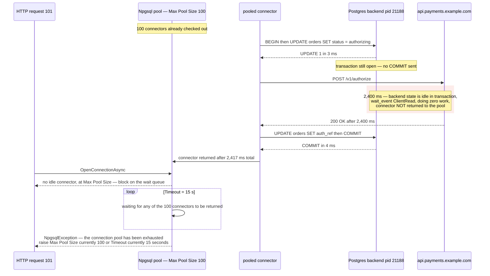

**TL;DR:** The pool is exhausted, the database is not. Connections are being held by transactions parked on an outbound HTTP call — `pg_stat_activity` shows 96 of them in state `idle in transaction`, waiting on `ClientRead`, executing nothing. Pool occupancy is arrival rate times hold time, and hold time stopped being about queries.

## The symptom

> "We're getting hundreds of `The connection pool has been exhausted` errors during checkout traffic. So I went to look at the database — and it's *fine*. CPU 4%. `pg_stat_statements` shows nothing above 6ms. `SELECT count(*) FROM pg_stat_activity WHERE state = 'active'` returns 2. Two. We raised Max Pool Size from 50 to 100 and it bought us about a week before it came back."

The obvious explanations are already ruled out by that last sentence and the two active queries. It is not a slow query — nothing is executing. It is not an undersized database — the server is doing almost nothing. It is not a traffic spike — the error appears at a steady, predictable request rate. And doubling the pool bought a week, which is the classic signature of a fix that moves a threshold instead of removing a cause.

The confusing detail is the one worth holding onto: **the connections are all checked out, and the database has no work.** Those two facts are only compatible if something is holding connections without using them.

## Reproduce

The exception, verbatim from Npgsql, which interpolates the live configured values into the message:

```
Npgsql.NpgsqlException: The connection pool has been exhausted, either raise
'Max Pool Size' (currently 100) or 'Timeout' (currently 15 seconds) in your
connection string.
 ---> System.TimeoutException: The operation has timed out.
```

The code that produces it — an ASP.NET Core checkout handler that authorizes a payment inside its database transaction:

```csharp
public async Task<AuthResult> AuthorizeAsync(long orderId, decimal amount)
{
    await using var conn = await _dataSource.OpenConnectionAsync();
    await using var tx   = await conn.BeginTransactionAsync();

    // 3 ms of actual database work
    await conn.ExecuteAsync(
        "UPDATE orders SET status = 'authorizing' WHERE id = @id",
        new { id = orderId }, tx);

    // 2,400 ms against a third-party payment gateway.
    // The connection stays checked out of the pool for every one of them,
    // and the Postgres backend behind it does nothing at all.
    var gateway = await _http.PostAsJsonAsync(
        "https://api.payments.example.com/v1/authorize",
        new { orderId, amount });
    var auth = await gateway.Content.ReadFromJsonAsync<GatewayAuth>();

    // 4 ms of actual database work
    await conn.ExecuteAsync(
        "UPDATE orders SET status = @s, auth_ref = @r WHERE id = @id",
        new { s = auth.Status, r = auth.Reference, id = orderId }, tx);

    await tx.CommitAsync();
    return new AuthResult(auth.Status, auth.Reference);
}
```

Drive it at a steady 40 requests/second. Nothing else is required — no spike, no slow query, no lock contention.

## The root cause chain

### 1. The immediate trigger: the pool is full and the database is empty

Ask Postgres what its backends are actually doing, grouped by state:

```sql
SELECT state,
       count(*),
       max(now() - state_change) AS longest_in_state
FROM pg_stat_activity
WHERE datname = current_database()
GROUP BY state ORDER BY count DESC;
```

```
        state        | count |  longest_in_state
---------------------+-------+--------------------
 idle in transaction |    96 | 00:00:02.371
 idle                |     4 | 00:04:11.882
 active              |     2 | 00:00:00.004
```

96 backends are in `idle in transaction` — documented as *"The backend is in a transaction, but is not currently executing a query."* Two are `active`. The database's own view of itself agrees with the dashboard: it has essentially nothing to do. Every one of those 96 backends is on the far end of a checked-out pooled connection.

Now look at what they are waiting on:

```sql
SELECT pid, state, wait_event_type, wait_event,
       now() - xact_start   AS xact_age,
       now() - state_change AS state_age,
       left(query, 48)      AS last_statement
FROM pg_stat_activity
WHERE datname = current_database() AND state = 'idle in transaction'
ORDER BY xact_start LIMIT 4;
```

```
  pid  |        state        | wait_event_type | wait_event |   xact_age   |  state_age   |                 last_statement
-------+---------------------+-----------------+------------+--------------+--------------+-------------------------------------------------
 21188 | idle in transaction | Client          | ClientRead | 00:00:02.401 | 00:00:02.371 | UPDATE orders SET status = 'authorizing' WHERE i
 21193 | idle in transaction | Client          | ClientRead | 00:00:02.288 | 00:00:02.259 | UPDATE orders SET status = 'authorizing' WHERE i
 21201 | idle in transaction | Client          | ClientRead | 00:00:01.944 | 00:00:01.911 | UPDATE orders SET status = 'authorizing' WHERE i
 21206 | idle in transaction | Client          | ClientRead | 00:00:01.977 | 00:00:01.944 | UPDATE orders SET status = 'authorizing' WHERE i
```

Three columns finish the diagnosis:

- **`wait_event = ClientRead`**, documented as *"Waiting to read data from the client."* The backend is not blocked on a lock, on I/O, or on another transaction. It is blocked on **your application**, waiting for the next command that will not arrive for 2.4 seconds.
- **`last_statement` is always the same `UPDATE`.** Every stuck backend is parked at the same point in the code path.
- **`xact_age` clusters around 2.3 seconds** — the payment gateway's response time, not any database operation's.

### 2. The mechanism: pool occupancy is arrival rate times hold time, and hold time is no longer query time

A connection pool has no opinion about *why* a connection is checked out. Its occupancy follows Little's Law:

```
concurrent connections in use  =  arrival rate  ×  hold time
```

Hold time here is the whole `AuthorizeAsync` body, not the query time:

```
hold time = 3 ms  (UPDATE)
          + 2,400 ms  (HTTP POST to the payment gateway)
          + 4 ms  (UPDATE)
          + ~10 ms  (COMMIT and round trips)
          = 2,417 ms

occupancy = 40 req/s × 2.417 s = 96.7 connections
```

96.7 against a `Max Pool Size` of 100. That matches the `idle in transaction` count exactly, and it explains the shape of the failure precisely:

- **Steady-state is 97% pool utilization**, which looks survivable on a dashboard and is not. There are three connections of headroom.
- **Actual database work is 7ms of the 2,417ms hold — 0.29%.** The pool is 97% occupied to do 0.29% of a connection's worth of work. This is why the database looks idle: it *is* idle.
- **Raising the pool from 50 to 100 bought exactly one doubling of traffic headroom.** It did not change hold time at all, so occupancy went on tracking arrival rate linearly. Growth ate the headroom, and the same error returned.

The 101st concurrent request finds no idle connector and cannot open a new one, so it blocks on the pool's internal wait queue for up to `Timeout` — Npgsql's default is **15 seconds** — and then throws. The exception text is generated with the currently configured `MaxConnections` and `Settings.Timeout` interpolated into it, which is why it names your real numbers back at you.

That framing matters: **pool exhaustion is a statement about the application's hold time, not about the database's capacity.** They are measured on different sides of the socket and they can move in opposite directions.



## The fix

Move the external call out of the transaction. The two database writes do not need to be atomic with the gateway call — they need to be *recoverable* around it, which is a different and much cheaper requirement.

```csharp
public async Task<AuthResult> AuthorizeAsync(long orderId, decimal amount)
{
    // Transaction 1 — mark intent and claim an idempotency key. ~4 ms held.
    var idempotencyKey = Guid.NewGuid();
    await using (var conn = await _dataSource.OpenConnectionAsync())
    {
        await conn.ExecuteAsync(
            @"UPDATE orders SET status = 'authorizing', auth_key = @k
              WHERE id = @id AND status = 'pending'",
            new { k = idempotencyKey, id = orderId });
    }
    // <- connector is back in the pool BEFORE the slow call starts

    // No connection held for these 2,400 ms.
    // The idempotency key makes a retry after a crash safe rather than a double charge.
    var gateway = await _http.PostAsJsonAsync(
        "https://api.payments.example.com/v1/authorize",
        new { orderId, amount, idempotencyKey });
    var auth = await gateway.Content.ReadFromJsonAsync<GatewayAuth>();

    // Transaction 2 — record the outcome. ~5 ms held.
    await using (var conn = await _dataSource.OpenConnectionAsync())
    {
        await conn.ExecuteAsync(
            @"UPDATE orders SET status = @s, auth_ref = @r
              WHERE id = @id AND auth_key = @k",
            new { s = auth.Status, r = auth.Reference, id = orderId, k = idempotencyKey });
    }
    return new AuthResult(auth.Status, auth.Reference);
}
```

Re-run the occupancy arithmetic on the same traffic:

```
hold time = 4 ms + 5 ms = 9 ms   (was 2,417 ms)
occupancy = 40 req/s × 0.009 s = 0.36 connections   (was 96.7)
```

The same 40 requests/second now needs well under one connection on average. `Max Pool Size = 100` stops being a limit anyone will reach, and the pool has roughly 270x more headroom than before — without touching the database, the pool configuration, or the request rate.

The `WHERE ... AND status = 'pending'` and `WHERE ... AND auth_key = @k` guards are what replace the transaction's atomicity. If the process dies between the two transactions, the order is left in `authorizing` with a known key, and the reconciliation job can query the gateway with that same idempotency key to find out what really happened. That is strictly more robust than the original, which would have rolled back the intent record and left no trace that a gateway call was ever in flight.

**Do not raise `Max Pool Size` as the fix.** Each pooled connection is a real Postgres backend *process* with its own memory. `max_connections` defaults to `100`, so a pool of 300 across three app instances is 900 requested backends against a server that will start refusing them with `FATAL: sorry, too many clients already`. Raising the pool converts an application-side timeout into a server-side hard failure, and it still does not shorten hold time.

## Deeper checks for production

1. **Set `idle_in_transaction_session_timeout` as a detector.** It defaults to `0` — disabled — meaning a transaction can stay open forever. Setting it to a value comfortably above your slowest legitimate transaction (`ALTER SYSTEM SET idle_in_transaction_session_timeout = '30s'`) makes leaked transactions fail loudly at the point of the leak instead of showing up later as pool exhaustion. It is a smoke alarm, not a fix: it terminates the session, it does not shorten hold time.

2. **On PostgreSQL 17 and later, add `transaction_timeout` too.** Also `0` by default, it bounds the *entire* transaction rather than only its idle stretches — so it catches a transaction that keeps issuing cheap statements while a slow loop runs, which `idle_in_transaction_session_timeout` never sees because the session is never idle.

3. **Scrape the pool's own metrics, not just the database's.** Npgsql publishes a `Npgsql` meter exposing `db.client.connection.count` broken down by idle/used state and `db.client.connection.max`, plus `db.client.operation.duration`. The used/max ratio is the leading indicator; the exhaustion exception is the lagging one. Pair it with `pg_stat_database.idle_in_transaction_time`, which accumulates milliseconds spent in exactly this state.

4. **Do not expect PgBouncer in transaction mode to rescue this.** Transaction pooling assigns a server connection for the duration of a transaction — and this transaction is open across the whole HTTP call, so the server connection stays pinned for all 2.4 seconds too. The leak simply relocates from the application pool to the PgBouncer pool. Transaction pooling multiplexes *short* transactions; it has nothing to multiplex here.

## Prevention checklist

- [ ] No HTTP call, message publish, blob upload, or `Task.Delay` occurs between `BeginTransactionAsync` and `CommitAsync` on any code path
- [ ] Pool sizing is derived from `arrival rate × hold time`, with hold time measured from connection open to close, not from query duration
- [ ] `idle_in_transaction_session_timeout` is non-zero in production, set above the slowest legitimate transaction
- [ ] Npgsql's `db.client.connection.count` (used) against `db.client.connection.max` is dashboarded and alerted before it reaches `Max Pool Size`
- [ ] Triage for a pool-exhaustion alert starts by grouping `pg_stat_activity` by `state`, to separate `idle in transaction` from `active` before anyone resizes anything
- [ ] Work split out of a transaction is made recoverable with an idempotency key and a status guard in the `WHERE` clause, not left to a retry

## FAQ

**How can the pool be exhausted when the database reports only two active queries?**

Because `active` and `checked out of the pool` measure different things. A connector is checked out for the whole time the application holds it, while `state = active` is only true while a statement is executing. During the 2.4-second gateway call the connector is checked out and the backend is `idle in transaction` — occupied from the pool's perspective, idle from the database's. Grouping `pg_stat_activity` by `state` is what makes the two views line up.

**Why does `wait_event = ClientRead` prove the database is not the bottleneck?**

`ClientRead` is documented as "Waiting to read data from the client." It means the backend has finished everything asked of it and is blocked on the socket waiting for the next command. If the database were the constraint, the wait event would be a `Lock`, `LWLock`, or `IO` type instead. `Client` as the `wait_event_type` points the investigation back across the socket by definition.

**Would raising `Timeout` from 15 seconds fix it instead of raising `Max Pool Size`?**

No — it converts a fast failure into a slow one. `Timeout` only controls how long a request waits on the pool's queue before throwing. At 97% steady-state utilization the queue is not draining faster than it fills, so a longer timeout means requests sit longer, hold more application threads, and fail anyway. Both knobs in the exception message are the wrong lever here, which is worth remembering given the message names them.

**Is a single 2.4-second transaction actually a problem, or only at 40 requests/second?**

The arithmetic is the answer: occupancy is arrival rate times hold time, so a 2.4-second hold is harmless at 1 request/second (2.4 connections) and fatal at 40 (96.7 connections). That is why this class of bug ships cleanly, passes staging, and fails at a specific traffic level — the defect is fixed, and only one term in the product changed.

## Source

- **Symptom:** `The connection pool has been exhausted` from Npgsql while Postgres reports 4% CPU and two active queries
- **Domain:** databases
- **Docs/Repo:** [`npgsql/npgsql` → `src/Npgsql/PoolingDataSource.cs`](https://github.com/npgsql/npgsql/blob/main/src/Npgsql/PoolingDataSource.cs) — the exhaustion exception is thrown here after the wait-queue read is cancelled, with `MaxConnections` and `Settings.Timeout` interpolated into the message
- **Docs/Repo:** [Npgsql — Connection String Parameters](https://www.npgsql.org/doc/connection-string-parameters.html) — establishes `Timeout` default 15, `Maximum Pool Size` default 100
- **Docs/Repo:** [Npgsql — Metrics](https://www.npgsql.org/doc/diagnostics/metrics.html) — establishes the `Npgsql` meter and `db.client.connection.count` / `db.client.connection.max`
- **Docs/Repo:** [PostgreSQL — `pg_stat_activity` and wait events](https://www.postgresql.org/docs/current/monitoring-stats.html) — establishes `idle in transaction` state, `ClientRead` wait event, `xact_start` / `state_change`
- **Docs/Repo:** [PostgreSQL — Client Connection Defaults](https://www.postgresql.org/docs/current/runtime-config-client.html) — establishes `idle_in_transaction_session_timeout` and `transaction_timeout` defaults of `0`
