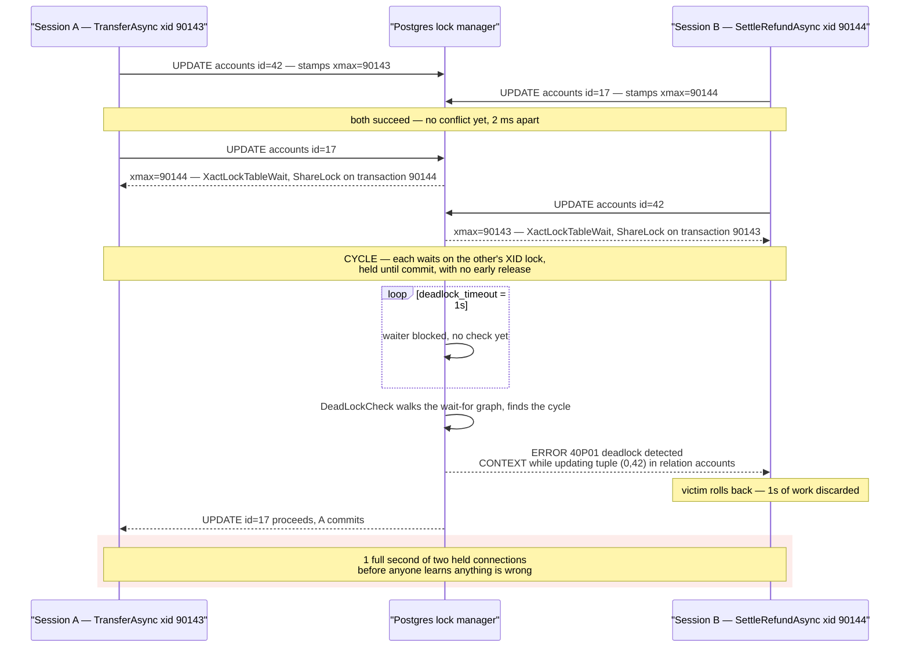

**TL;DR:** Two code paths update the same two rows in opposite order. Each holds the row lock the other is waiting on, and because a row lock in Postgres is released only at commit, neither can ever yield — so the deadlock detector kills one of them. Adding a retry makes the error go away without making the collision go away.

## The symptom

> "We get 30 to 40 `deadlock detected` errors an hour, but only between 11:00 and 14:00 when traffic peaks. It's always the same two statements in the log. Both transactions are tiny — two `UPDATE`s each, no long-running queries, no reports. Staging has never produced one, and I can't reproduce it locally no matter how fast I click. Our retry wrapper catches them so users mostly don't notice, but the error rate is climbing week over week."

The first three guesses do not survive the log. It is not a long-running transaction holding locks — both transactions are two statements long and normally commit in under 5ms. It is not a missing index causing lock escalation — Postgres has no lock escalation, and both statements are primary-key `UPDATE`s. And it is not an isolation-level problem — the app runs at the default `READ COMMITTED`, and raising the isolation level makes deadlocks *more* likely, not less.

What makes it non-obvious is that both transactions are individually correct, individually fast, and individually deadlock-free. The bug only exists in the relationship between them.

## Reproduce

Two `psql` sessions and four statements. No load generator required — the concurrency just has to be *deliberate*.

```sql
-- Setup
CREATE TABLE accounts (
    id      bigint PRIMARY KEY,
    balance bigint NOT NULL
);
INSERT INTO accounts VALUES (17, 500000), (42, 500000);
```

Run these interleaved, one line at a time, alternating sessions:

```sql
-- Session A: transfer 100 from account 42 to account 17
BEGIN;
UPDATE accounts SET balance = balance - 100 WHERE id = 42;   -- (1) takes the row lock on 42

-- Session B: settle a refund, 250 from account 17 to account 42
BEGIN;
UPDATE accounts SET balance = balance - 250 WHERE id = 17;   -- (2) takes the row lock on 17

-- Session A (continued)
UPDATE accounts SET balance = balance + 100 WHERE id = 17;   -- (3) BLOCKS on B

-- Session B (continued)
UPDATE accounts SET balance = balance + 250 WHERE id = 42;   -- (4) BLOCKS on A -> deadlock
```

Statement (4) hangs for exactly one second and then one of the two sessions dies. The one-second pause is not network latency — it is `deadlock_timeout`, and it is the single most useful clue in the whole incident.

## The root cause chain

### 1. The immediate trigger: read the DETAIL block, not the ERROR line

The client sees this:

```
ERROR:  deadlock detected
DETAIL:  Process 4471 waits for ShareLock on transaction 90144; blocked by process 4488.
Process 4488 waits for ShareLock on transaction 90143; blocked by process 4471.
HINT:  See server log for query details.
CONTEXT:  while updating tuple (0,17) in relation "accounts"
SQLSTATE: 40P01
```

The server log — and *only* the server log — carries two extra lines the client never receives:

```
2026-09-01 11:47:22.918 IST [4471] DETAIL:  Process 4471 waits for ShareLock on transaction 90144; blocked by process 4488.
	Process 4488 waits for ShareLock on transaction 90143; blocked by process 4471.
	Process 4471: UPDATE accounts SET balance = balance + $1 WHERE id = $2
	Process 4488: UPDATE accounts SET balance = balance + $1 WHERE id = $2
2026-09-01 11:47:22.918 IST [4471] STATEMENT:  UPDATE accounts SET balance = balance + $1 WHERE id = $2
```

That asymmetry is deliberate in the Postgres source: `DeadLockReport()` builds two separate buffers and emits the query text through `errdetail_log()`, which goes to the log only, while the wait-for lines go out through `errdetail_internal()` to both. This is why chasing a deadlock from an application exception message alone is a dead end — **the statements involved are never in the exception**, which is exactly what `HINT: See server log for query details.` is telling you.

Three things to extract from the block:

- **`ShareLock on transaction 90144`, not a lock on a row.** The two `waits for` lines form a cycle, and the cycle is what the detector found.
- **`CONTEXT: while updating tuple (0,17) in relation "accounts"`** names the physical tuple and the table. That string is emitted by `XactLockTableWaitErrorCb` in `src/backend/storage/lmgr/lmgr.c` for the `XLTW_Update` operation — so the wait is definitively an `UPDATE` waiting on a row, not an index or DDL wait.
- **`SQLSTATE 40P01`** (`ERRCODE_T_R_DEADLOCK_DETECTED`). Note it is *not* `40001` (`serialization_failure`) — that distinction matters for the fix, below.

### 2. The mechanism: a row lock is a wait on the *holder's transaction ID*, and it is only released at commit

The confusing part of the DETAIL is that nobody asked for a lock on transaction 90144. Here is what actually happens.

When `UPDATE` modifies a row, it stamps the row's `xmax` header field with the updating transaction's ID. There is no entry in the lock manager for "row 42 is locked" — the lock lives in the tuple itself, which is why Postgres can hold millions of row locks without a lock table and has no lock escalation at all.

So when a second transaction reaches that row, it cannot find a row lock to queue on. Instead it reads `xmax`, sees transaction 90144, and calls `XactLockTableWait()` — which does exactly this:

```c
/* src/backend/storage/lmgr/lmgr.c — XactLockTableWait() */
SET_LOCKTAG_TRANSACTION(tag, xid);

/* Acquire ShareLock on the HOLDER's transaction-ID lock.
   Every transaction holds ExclusiveLock on its own XID for its
   entire lifetime, so this blocks until that transaction ends. */
(void) LockAcquire(&tag, ShareLock, false, false);
LockRelease(&tag, ShareLock, false);
```

Every transaction holds `ExclusiveLock` on its own transaction-ID lock from the moment it gets an XID until it commits or aborts. Waiting for a row therefore becomes waiting for a *transaction*, and the wait ends only when that transaction ends. **There is no mechanism for a transaction to release a row lock early** — no lock downgrade, no timeout-and-yield. That property is what turns a mutual wait into a permanent one.

Now the cycle. Session A holds 42 and wants 17. Session B holds 17 and wants 42. Neither can proceed and neither can back off.

### 3. The confirming evidence: `deadlock_timeout`, and why staging never saw it

Postgres does not detect the cycle immediately. From the documentation for `deadlock_timeout` (default **`1s`**):

> "The check for deadlock is relatively expensive, so the server doesn't run it every time it waits for a lock. We optimistically assume that deadlocks are not common in production applications and just wait on the lock for a while before checking for a deadlock."

So a waiter blocks for a full second first, and only then runs `DeadLockCheck` over the wait-for graph. That one second is why this scales so badly: **every deadlock costs both transactions a second of held connections and held locks before anyone is even told there is a problem.** At 40 deadlocks an hour that is not the error rate hurting you, it is the 80 transaction-seconds of stalled work behind it.

It also explains staging. The overlap window is the gap between statement (1) and statement (3) — roughly 2ms of application time. Two transactions must enter that 2ms window simultaneously *and* be touching the same pair of account rows. At staging's 3 requests/second the odds are negligible. At production's 900 requests/second across a hot set of merchant accounts, it happens dozens of times an hour. The bug was always there. Concurrency only made it observable.

Confirm the rate independently of the log:

```sql
-- Cluster-wide counter, incremented by pgstat_report_deadlock() in DeadLockReport()
SELECT datname, deadlocks, xact_commit, xact_rollback
FROM pg_stat_database WHERE datname = current_database();
```

And catch the waits *before* they become deadlocks — `log_lock_waits` defaults to `off`, and when enabled it logs any wait longer than `deadlock_timeout`:

```sql
ALTER SYSTEM SET log_lock_waits = on;
SELECT pg_reload_conf();
```



## The fix

Find the two code paths and make them acquire rows in the same order. Here they are:

```csharp
// Path 1 — PaymentService.TransferAsync: locks SOURCE first, then DESTINATION
await conn.ExecuteAsync("UPDATE accounts SET balance = balance - @amt WHERE id = @id",
                        new { amt, id = fromAccountId });
await conn.ExecuteAsync("UPDATE accounts SET balance = balance + @amt WHERE id = @id",
                        new { amt, id = toAccountId });

// Path 2 — RefundService.SettleRefundAsync: same two rows, REVERSED roles.
// A refund's source is a transfer's destination. Nothing here looks wrong
// in isolation — the ordering only conflicts with the OTHER file.
await conn.ExecuteAsync("UPDATE accounts SET balance = balance - @amt WHERE id = @id",
                        new { amt, id = merchantAccountId });
await conn.ExecuteAsync("UPDATE accounts SET balance = balance + @amt WHERE id = @id",
                        new { amt, id = customerAccountId });
```

Nothing is wrong with either file. The defect is that "source first" is a *local* ordering rule, and two call sites disagree about which account is the source.

Replace it with a **global** ordering rule that does not depend on the caller's semantics — ascending primary key:

```csharp
// Deterministic lock ordering: sort by the primary key, then apply the deltas.
// Any two transactions touching an overlapping row set now acquire the shared
// rows in identical order, so the wait-for graph can no longer contain a cycle.
var deltas = new Dictionary<long, long> { [fromAccountId] = -amt, [toAccountId] = +amt };

await using var tx = await conn.BeginTransactionAsync();
foreach (var (accountId, delta) in deltas.OrderBy(kv => kv.Key))
{
    await conn.ExecuteAsync(
        "UPDATE accounts SET balance = balance + @delta WHERE id = @id",
        new { delta, id = accountId }, tx);
}
await tx.CommitAsync();
```

`OrderBy(kv => kv.Key)` is the entire fix. With it, whichever transaction reaches account 17 first also reaches account 42 first, so the second one waits once and then proceeds. A cycle requires two transactions to disagree about order, and now none can.

The `Dictionary` matters too: enumerating a `HashSet` or `Dictionary` unsorted gives an order that is not guaranteed stable across runs, which is a common way this bug gets introduced by an ORM batching change rather than by anyone writing ordering code.

### Why the retry wrapper is a band-aid, not a fix

The team already catches `40P01` and retries, and the retry does succeed. It is still the wrong resting state, for three reasons this post has established:

1. **It does not reduce the collision rate.** The retried transaction re-enters with the same ordering logic against the same hot rows, so its probability of colliding again is unchanged. As traffic grows the collision rate grows with it, and the retry count grows with the collision rate.
2. **Detection costs a fixed second, every time.** `deadlock_timeout` is 1s by default. Every deadlock burns that second on two connections *before* the retry even begins — so the retry hides the error while the latency and connection-occupancy cost stay fully paid.
3. **A retry after a deadlock is a rollback of real work.** The victim's entire transaction is discarded, including any statements before the conflicting one. If the transaction has side effects that are not transactional, the retry re-runs them.

Keep the retry as a safety net for the genuinely unavoidable conflicts. Do not let it be the reason nobody fixes the ordering.

### What will not help

Raising the isolation level does not prevent this. Deadlocks are lock cycles, detected by `DeadLockCheck` and reported as `40P01`. `SERIALIZABLE` adds Serializable Snapshot Isolation, which reports *serialization anomalies* as `40001` — a different error from a different mechanism. Under `SERIALIZABLE` you get both failure modes, not fewer.

## Deeper checks for production

1. **Turn on `log_lock_waits` and shorten `deadlock_timeout` for a diagnostic window.** With `log_lock_waits = on`, any wait exceeding `deadlock_timeout` is logged even when it never becomes a deadlock — which surfaces the near-misses that predict where the next deadlock pair lives. The documentation explicitly suggests the pairing: *"If you are trying to investigate locking delays you might want to set a shorter than normal `deadlock_timeout`."* Set it back afterwards, since the check is genuinely expensive.

2. **Bound lock waits with `lock_timeout` instead of waiting forever.** It defaults to `0` (disabled), so a transaction blocked behind a slow holder waits indefinitely and occupies a connection the whole time. A session-level `SET lock_timeout = '3s'` converts an unbounded stall into a fast, retryable error your circuit breaker can see.

3. **Alert on `pg_stat_database.deadlocks` as a rate, not a threshold.** The counter is cumulative since the last stats reset, so the useful signal is its first derivative. A step change in deadlocks/minute after a deploy is the cheapest possible detector for someone having just introduced a second lock ordering.

4. **Watch for the foreign-key deadlock this one usually travels with.** Inserting a child row takes a `FOR KEY SHARE` lock on the referenced parent row to keep the FK valid. A workload that inserts `order_items` while another path updates the parent `orders` row produces the same cycle shape between two statements that look completely unrelated — and the `CONTEXT` line will name the *parent* table, not the one you inserted into.

## Prevention checklist

- [ ] Every multi-row write path sorts its target rows by primary key before issuing `UPDATE`s, so lock order is global rather than derived from caller semantics
- [ ] No write path enumerates a `Dictionary` or `HashSet` to decide statement order — the iteration order is not a stability guarantee
- [ ] `log_lock_waits = on` in production, so waits longer than `deadlock_timeout` are logged before they become deadlocks
- [ ] `pg_stat_database.deadlocks` is scraped and alerted on as a per-minute rate, tied to deploys
- [ ] Deadlock triage starts from the server log's `DETAIL` block and `CONTEXT` line, because the client exception never contains the statements
- [ ] `lock_timeout` is set to a non-zero value so a blocked transaction cannot hold a pooled connection indefinitely

## FAQ

**Why does the DETAIL say `ShareLock on transaction 90144` when the code was updating a row?**

Because row locks are stored in the tuple's `xmax` header field, not in the lock manager. A blocked updater reads `xmax`, finds the holding transaction ID, and calls `XactLockTableWait()`, which takes `ShareLock` on that transaction's own XID lock. Every transaction holds `ExclusiveLock` on its XID for its whole lifetime, so the wait naturally ends at commit or abort. The lock manager only ever sees transaction-ID locks, which is why that is what the report names.

**Why did the failing statement hang for exactly one second before erroring?**

That is `deadlock_timeout`, default `1s`. Postgres does not run the cycle check on every lock wait because the check is expensive — it waits first, then runs `DeadLockCheck`. A deadlock that resolves in "about a second" is therefore the signature of the default value, not of network or query latency.

**Could I just make the transactions shorter so the window closes?**

It reduces the probability, it does not remove the failure. The window is the gap between the first and second `UPDATE`, and it cannot be zero as long as two rows are updated in two statements. Halving it halves the collision rate, then traffic doubles and you are back where you started. Deterministic ordering makes the cycle structurally impossible at any window size.

**Both transactions are correct in isolation — how would a code review catch this?**

By reviewing the ordering rule rather than the statements. "Source account first" reads fine in `TransferAsync` and fine in `SettleRefundAsync`, and is a contradiction only when you hold both files at once. The reviewable invariant is "rows are locked in ascending primary-key order," because that one is checkable in a single file.

## Source

- **Symptom:** `deadlock detected` (`SQLSTATE 40P01`) between the same two `UPDATE` statements, dozens of times an hour at peak load and never in staging
- **Domain:** databases
- **Docs/Repo:** [`postgres/postgres` → `src/backend/storage/lmgr/deadlock.c`](https://github.com/postgres/postgres/blob/master/src/backend/storage/lmgr/deadlock.c) — `DeadLockReport()`, the source of the `deadlock detected` message, the `Process %d waits for %s on %s` DETAIL lines, and the log-only query-text lines
- **Docs/Repo:** [`postgres/postgres` → `src/backend/storage/lmgr/lmgr.c`](https://github.com/postgres/postgres/blob/master/src/backend/storage/lmgr/lmgr.c) — `XactLockTableWait()` taking `ShareLock` on the holder's XID, and `XactLockTableWaitErrorCb()` emitting the `while updating tuple (%u,%u) in relation "%s"` context
- **Docs/Repo:** [PostgreSQL — Lock Management](https://www.postgresql.org/docs/current/runtime-config-locks.html) — establishes `deadlock_timeout` default `1s` and why the check is deferred
- **Docs/Repo:** [PostgreSQL — `pg_stat_database`](https://www.postgresql.org/docs/current/monitoring-stats.html) — establishes the `deadlocks` counter
- **Docs/Repo:** [`postgres/postgres` → `src/backend/utils/errcodes.txt`](https://github.com/postgres/postgres/blob/master/src/backend/utils/errcodes.txt) — establishes `40P01 deadlock_detected` versus `40001 serialization_failure`
