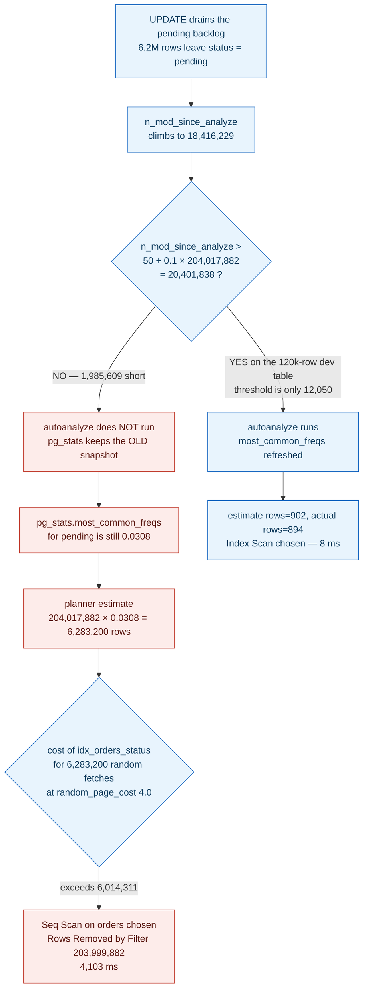

**TL;DR:** The production query is not slow because production has more data — it is slow because the planner's row estimate is 53,000x too high, so it correctly prices a sequential scan as cheaper than the index. The estimate is wrong because `autovacuum_analyze_scale_factor` is a *percentage* of table size, and on a 204-million-row table that percentage has not been crossed in six weeks.
> **In plain English (30 sec):** Think of this like concepts you already use, but in a production system at scale.


## The symptom

> "Same query. Same schema. Same index — I checked `\d orders` on both. 8ms on my laptop against a restored dump, 4.1 seconds in production. And it's not a cold cache: I ran it ten times in a row and it's 4 seconds every time. `EXPLAIN` in prod shows a Seq Scan on a table that definitely has the index the query needs."

Three guesses die immediately. The index is not missing — `\d orders` lists it in both environments. It is not a cold buffer cache — the timing is stable across repeated runs. And it is not Postgres refusing to use the index because of a type mismatch or a function wrapper on the column — the `Filter:` line shows a plain equality on a plain column.

The planner is not failing to *find* the index. It is looking at the index, pricing it, and deciding the sequential scan is cheaper. On the numbers it has, it is right.

## Reproduce

PostgreSQL 16. One table, one index, one query.

```sql
-- The table and the index both environments have
CREATE TABLE orders (
    id           bigserial PRIMARY KEY,
    customer_id  bigint      NOT NULL,
    status       text        NOT NULL,
    total_cents  bigint      NOT NULL,
    created_at   timestamptz NOT NULL DEFAULT now()
);
CREATE INDEX idx_orders_status ON orders (status);

-- The query the API runs on every dashboard load
SELECT id, customer_id, total_cents, created_at
FROM orders
WHERE status = 'pending';
```

The reproduction is not "load a lot of rows." It is **load a lot of rows, then change the data distribution, then do not run `ANALYZE`**:

```sql
-- 1. Simulate the state statistics were captured in: a payment-processor
--    outage six weeks ago left ~3% of a 204M-row table stuck in 'pending'
UPDATE orders SET status = 'pending' WHERE id % 33 = 0;
ANALYZE orders;          -- <- the LAST time stats were accurate

-- 2. The backlog drains. 6.2M rows move out of 'pending'. No ANALYZE runs.
UPDATE orders SET status = 'shipped' WHERE status = 'pending' AND id % 33 = 0;

-- 3. Now only live traffic is 'pending' — about 118 rows at any moment.
--    Run the SELECT. It sequential-scans 204 million rows to find 118.
```

## The root cause chain

### 1. The immediate trigger: the plan flipped, and the estimate is off by 53,000x

Run the same statement in both environments. Ask for buffers explicitly — `BUFFERS` defaults to off, and is only folded into `ANALYZE` automatically from PostgreSQL 18 onward:

```sql
EXPLAIN (ANALYZE, BUFFERS)
SELECT id, customer_id, total_cents, created_at
FROM orders WHERE status = 'pending';
```

Dev — 120,000 rows in the table:

```
 Index Scan using idx_orders_status on orders
   (cost=0.42..312.51 rows=902 width=28)
   (actual time=0.038..7.914 rows=894 loops=1)
   Index Cond: (status = 'pending'::text)
   Buffers: shared hit=6 read=871
 Planning Time: 0.121 ms
 Execution Time: 8.002 ms
```

Production — 204,017,882 rows in the table:

```
 Seq Scan on orders
   (cost=0.00..6014311.00 rows=6283200 width=28)
   (actual time=2841.117..4103.882 rows=118 loops=1)
   Filter: (status = 'pending'::text)
   Rows Removed by Filter: 203999882
   Buffers: shared hit=2144 read=3462167
 Planning Time: 0.184 ms
 Execution Time: 4103.951 ms
```

The number that matters is not `4103.951 ms`. It is the pair on the production line:

- `rows=6283200` — what the planner **estimated** the node would emit.
- `rows=118` — what the node **actually** emitted.

That is a 53,247x overestimate. Postgres's own `EXPLAIN` documentation names this as the first thing to check: *"The thing that's usually most important to look for is whether the estimated row counts are reasonably close to reality."* In dev the pair is `rows=902` estimated / `rows=894` actual — dead on. Same query, same index, same planner. Only the inputs differ.

`Rows Removed by Filter: 203999882` is the cost of that mistake stated in rows: the executor read and discarded 204 million tuples, and `Buffers: shared read=3462167` says it pulled 3.46 million 8KB pages off disk to do it.

### 2. The mechanism: the planner priced a real index scan against a fake row count

The planner does not measure anything at plan time. It runs arithmetic over statistics that `ANALYZE` captured earlier, and the selectivity of `status = 'pending'` comes straight out of `pg_stats`:

```sql
SELECT attname, most_common_vals, most_common_freqs
FROM pg_stats WHERE tablename = 'orders' AND attname = 'status';
```

```
 attname |          most_common_vals            |        most_common_freqs
---------+--------------------------------------+----------------------------------
 status  | {shipped,paid,pending,cancelled}     | {0.6104,0.3441,0.0308,0.0147}
```

`most_common_freqs` is documented as *"number of occurrences of each divided by total number of rows."* The planner reads `0.0308` for `'pending'`, multiplies by the table's recorded row count, and gets its estimate:

```
204,017,882 × 0.0308 ≈ 6,283,200      <- the "rows=6283200" printed in EXPLAIN
```

Now it prices two paths for 6.28 million rows:

- **Seq Scan** — 3,464,311 pages at `seq_page_cost = 1.0`, plus 204,017,882 tuples at `cpu_tuple_cost = 0.01` plus one qual evaluation each at `cpu_operator_cost = 0.0025`. That is `3,464,311 + 204,017,882 × 0.0125 ≈ 6,014,311` — exactly the `cost=0.00..6014311.00` on the plan line.
- **Index Scan** — walk the index, then fetch 6.28 million heap tuples in essentially random physical order at `random_page_cost = 4.0`. Even with heavy correlation discounting, millions of random fetches at 4.0 apiece price out well above 6,014,311.

So the planner picks the sequential scan. **Given a 6.28-million-row match, that is the correct decision** — reading 3.4 million pages sequentially genuinely does beat 6 million random fetches. The plan is not the bug. The `0.0308` is.

### 3. The confirming evidence: autoanalyze has not run in six weeks, and will not run soon

`pg_stat_user_tables` records exactly when statistics were last refreshed and how much has changed since:

```sql
SELECT relname, last_analyze, last_autoanalyze,
       n_mod_since_analyze, n_live_tup
FROM pg_stat_user_tables WHERE relname = 'orders';
```

```
 relname |  last_analyze  |         last_autoanalyze         | n_mod_since_analyze | n_live_tup
---------+----------------+----------------------------------+---------------------+------------
 orders  |     (null)     |  2026-07-24 02:11:47.883+05:30   |            18416229 |  204017882
```

`n_mod_since_analyze` is documented as *"estimated number of rows modified since this table was last analyzed"* — 18.4 million rows have changed, and the planner has seen none of them.

The reason autoanalyze has not fired is arithmetic, not a broken daemon. Autovacuum's analyze trigger is:

```
threshold = autovacuum_analyze_threshold + autovacuum_analyze_scale_factor × reltuples
```

with documented defaults of **50 tuples** and **0.1 (10% of table size)**. On this table:

```
50 + 0.1 × 204,017,882 = 20,401,838 modifications required
                         18,416,229 modifications so far
                       = 1,985,609 modifications still to go
```

That default is fine on a 120,000-row dev table — 10% is 12,000 modifications, crossed several times a day, which is precisely why dev's estimate was dead-on. On a 204-million-row table, 10% is 20.4 million modifications, and the table crosses it roughly every seven weeks. **The same default that keeps small tables accurate makes large tables blind**, and the divergence grows with the exact thing that makes the query expensive.



## The fix

Two changes: one to stop the bleeding now, one so it cannot recur.

```sql
-- 1. Immediate: refresh the statistics the planner is reading
ANALYZE orders;

-- 2. Durable: make the analyze threshold a fixed row count on THIS table
--    instead of a percentage of a number that keeps growing.
--    0.002 × 204,017,882 = ~408,000 modifications, crossed several times a day.
ALTER TABLE orders SET (
    autovacuum_analyze_scale_factor = 0.002,
    autovacuum_analyze_threshold    = 5000
);
```

Re-run the query after `ANALYZE orders`:

```
 Index Scan using idx_orders_status on orders
   (cost=0.57..381.28 rows=124 width=28)
   (actual time=0.041..0.212 rows=118 loops=1)
   Index Cond: (status = 'pending'::text)
   Buffers: shared hit=4 read=7
 Planning Time: 0.203 ms
 Execution Time: 0.247 ms
```

`rows=124` estimated against `rows=118` actual, 11 buffers touched instead of 3.46 million, 0.247ms instead of 4,103ms. No index was added and no query text changed — only the numbers the planner was reading.

**Ship the per-table storage parameter, not a global change to `autovacuum_analyze_scale_factor`.** The global default of `0.1` is correct for the hundreds of small tables in the schema — dropping it to `0.002` cluster-wide would have autovacuum workers re-analyzing every lookup table constantly for no benefit. The problem is specific to tables whose absolute row count makes a percentage threshold meaningless, so the fix belongs on those tables.

Resist the two tempting non-fixes. Adding another index does nothing — the planner already declined a perfectly good one. Setting `enable_seqscan = off` forces the index by making sequential scans cost `1e10`, which hides a wrong estimate behind a distorted cost model and will pick a bad plan somewhere else in the same session.

## Deeper checks for production

1. **Check whether vacuum is starved too, not just analyze.** `autovacuum_vacuum_scale_factor` defaults to `0.2` — twice as lax as analyze — so the same table is almost certainly accumulating dead tuples as well. Query `n_dead_tup` and `last_autovacuum` in the same `pg_stat_user_tables` row; bloat inflates `relpages`, which feeds the seq-scan cost and distorts estimates in the opposite direction.

2. **Add extended statistics for correlated columns.** The planner assumes independence between predicates by default, so `WHERE status = 'shipped' AND carrier = 'DHL'` multiplies two selectivities that are not independent. `CREATE STATISTICS orders_status_carrier (dependencies) ON status, carrier FROM orders` teaches it the correlation — but it only takes effect after the next `ANALYZE`.

3. **Raise `SET STATISTICS` on high-cardinality columns, not on `status`.** `default_statistics_target` is `100`, meaning at most 100 most-common values and 100 histogram buckets per column. Four distinct statuses fit easily. A column like `customer_id` with millions of distinct values does not — `ALTER TABLE orders ALTER COLUMN customer_id SET STATISTICS 500` is where the extra buckets buy something.

4. **Log the plans instead of reconstructing them after the fact.** Load `auto_explain` and set `auto_explain.log_min_duration = '500ms'` with `auto_explain.log_analyze = on`, so the estimated-versus-actual pair is already in the server log the next time a plan flips — rather than depending on someone reproducing the slow query by hand.

## Prevention checklist

- [ ] Every table above ~10 million rows carries a per-table `autovacuum_analyze_scale_factor` override, because the 0.1 default translates to a modification count that grows with the table
- [ ] A monitoring check alerts when `pg_stat_user_tables.n_mod_since_analyze` exceeds a fixed fraction of `n_live_tup` on the largest tables
- [ ] Bulk data migrations and backfills end with an explicit `ANALYZE <table>` rather than waiting for autoanalyze to notice
- [ ] Slow-query triage compares estimated `rows=` against actual `rows=` on every plan node before anyone proposes a new index
- [ ] `auto_explain` is loaded with `log_analyze = on` so a plan flip is captured in the log at the moment it happens

## FAQ

**Why was the dev environment accurate if it was restored from the same production dump?**

Because the threshold that governs autoanalyze scales with row count. Dev holds 120,000 rows, so its analyze threshold is `50 + 0.1 × 120,000 = 12,050` modifications — a bar that ordinary development traffic clears repeatedly in a day. Production's bar is 20,401,838. Identical configuration, identical daemon, opposite outcome, purely because the scale factor is a percentage.

**If the planner's estimate was 53,000x wrong, why call the sequential scan the correct decision?**

Because the estimate is the planner's only input. Fetching 6.28 million heap tuples in index order means millions of non-sequential page reads priced at `random_page_cost = 4.0` apiece, against a sequential scan of 3.46 million pages at `seq_page_cost = 1.0`. Given `rows=6283200`, the seq scan really is cheaper. The cost arithmetic was sound — it was applied to a stale `most_common_freqs` value.

**Would `VACUUM ANALYZE` have been a better immediate fix than `ANALYZE`?**

It fixes more, but it is a much heavier operation on a 204-million-row table and it is not what the plan flip needed. `ANALYZE` alone rewrites `pg_statistic`, which is the input the planner read. `VACUUM` reclaims dead tuples and updates the visibility map — worth doing on this table given `autovacuum_vacuum_scale_factor = 0.2`, but as a separate, scheduled action rather than as the incident fix.

**Does `EXPLAIN` without `ANALYZE` show this problem?**

No — and that is the trap. Plain `EXPLAIN` prints only the estimate, so it shows `rows=6283200` with nothing to compare it against, and the plan looks entirely reasonable. The mismatch only becomes visible when `ANALYZE` actually executes the query and prints the measured row count next to the estimate. Add `BUFFERS` explicitly on PostgreSQL 17 and earlier — it is only automatic under `ANALYZE` from PostgreSQL 18.

## Source

- **Symptom:** An indexed query returns in 8ms in dev and sequential-scans for 4 seconds in production against the same schema and index
- **Domain:** databases
- **Docs/Repo:** [PostgreSQL — Automatic Vacuuming parameters](https://www.postgresql.org/docs/current/runtime-config-autovacuum.html) — establishes `autovacuum_analyze_threshold` (50 tuples) and `autovacuum_analyze_scale_factor` (0.1, 10% of table size)
- **Docs/Repo:** [PostgreSQL — Using EXPLAIN](https://www.postgresql.org/docs/current/using-explain.html) — establishes the estimated-versus-actual `rows` comparison and `Rows Removed by Filter`
- **Docs/Repo:** [PostgreSQL — `pg_stats`](https://www.postgresql.org/docs/current/view-pg-stats.html) — establishes `most_common_vals` / `most_common_freqs` as the selectivity source
- **Docs/Repo:** [PostgreSQL — Planner Cost Constants](https://www.postgresql.org/docs/current/runtime-config-query.html) — establishes `seq_page_cost` 1.0, `random_page_cost` 4.0, `default_statistics_target` 100
- **Docs/Repo:** [`postgres/postgres` → `src/backend/optimizer/path/costsize.c`](https://github.com/postgres/postgres/blob/master/src/backend/optimizer/path/costsize.c) — `cost_seqscan()`, the arithmetic behind the `cost=0.00..6014311.00` printed above


