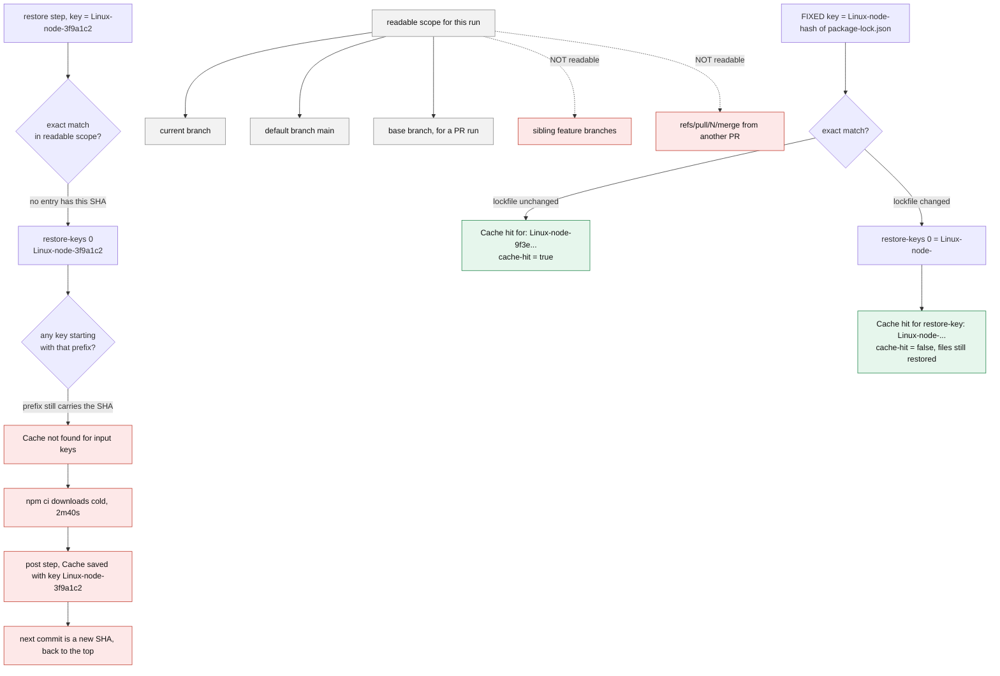

**TL;DR:** The cache is being *saved* fine — it is never *found*, because the primary key embeds `${{ github.sha }}`, which is unique to a commit that has never existed before, and the `restore-keys` list repeats that same SHA-bearing string, so the prefix fallback has nothing broader to match against.

## The symptom

> "We added `actions/cache` three weeks ago and `npm ci` still takes the full 2m40s on every run. The restore step always logs `Cache not found for input keys`. But the save step at the end of the job clearly works — Settings → Actions → Caches shows 180 entries, 9.4 GB, all created by this workflow. It writes caches nobody ever reads. Two consecutive pushes to the same branch, no dependency changes, still a miss."

The three obvious guesses are all already ruled out. The action is not misconfigured into a no-op — it demonstrably *writes*. The `path:` is not wrong — the archives are hundreds of MB, so it is finding real files to compress. And it is not the 7-day eviction window — the misses happen minutes apart, not days.

The failure is in the *lookup*, and the lookup has exactly three inputs: the key, the cache version, and the branch scope. Two of them are wrong here.

## Reproduce

The workflow, verbatim from the repo that has this problem:


```yaml
name: build
on: [push, pull_request]

jobs:
  build:
    runs-on: ubuntu-latest
    steps:
      - uses: actions/checkout@v4
      - uses: actions/setup-node@v4
        with:
          node-version: '20'

      - uses: actions/cache@v4
        id: npm-cache
        with:
          path: ~/.npm
          # the bug: github.sha is unique per commit, so this key
          # is guaranteed never to have been written before
          key: ${{ runner.os }}-node-${{ github.sha }}
          # and the "fallback" is a copy-paste of the same string,
          # so the prefix search is just as unmatchable
          restore-keys: |
            ${{ runner.os }}-node-${{ github.sha }}

      - run: npm ci
      - run: npm test
```


Push twice to the same branch with no change to `package-lock.json`. Both runs miss.

## The root cause chain

### 1. The primary key is unique by construction

`actions/cache` looks for an **exact** match on `key` first. A cache key is only useful if the same key can be produced again on a later run — that is the whole contract. `${{ github.sha }}` is the commit SHA of the run's own commit. By definition, no earlier run ever computed that string, so no cache entry was ever stored under it.

The value that belongs there is a hash of whatever genuinely decides "did the dependency set change" — the lockfile:


```yaml
key: ${{ runner.os }}-node-${{ hashFiles('**/package-lock.json') }}
```


`hashFiles()` is stable across runs when the file is unchanged, and changes exactly when it isn't. `github.sha` changes on every commit whether or not a single dependency moved.

### 2. `restore-keys` is a prefix search, and this prefix contains the SHA too

When the primary key misses, the action walks `restore-keys` **in order**, treating each entry as a *prefix*. GitHub's own reference states it plainly: a restore key of `npm-feature-` "matches any key that starts with the string `npm-feature-`", and when several keys match the prefix, "the action returns the most recently created cache."

That mechanism is the entire safety net for the "dependencies just changed" case — you want the previous, close-enough cache so `npm ci` becomes an incremental download instead of a cold one. But here the single restore key is a byte-for-byte copy of the primary key. Its prefix set is `{the primary key}`, which was already searched and already missed. There is no broader prefix in the list at all, so the fallback chain is empty in practice.

A restore key only helps if it is **strictly shorter than the volatile part of the primary key**. Copying the primary key into `restore-keys` is the single most common way to end up with a fallback that can never fire.

### 3. The branch-scoping rule hides the second half of the problem

Even with a correct lockfile-hashed key, this repo would still miss most of the time, because of *where* the caches were written. GitHub's dependency-caching reference is explicit:

> Workflow runs can restore caches created in either the current branch or the default branch (usually `main`).

and:

> Workflow runs cannot restore caches created for child branches or sibling branches.

and, most relevant here:

> When a cache is created by a workflow run triggered on a pull request, the cache is created for the merge ref (`refs/pull/.../merge`). Because of this, the cache will have a limited scope and can only be restored by re-runs of the pull request.

This workflow triggers on `[push, pull_request]`. Most of its 180 cache entries were written by `pull_request` runs, scoped to a merge ref that only a re-run of that same PR can read. A cache warmed on `feature/checkout-v2` is invisible from `feature/pricing-fix` — they are siblings, not ancestor and descendant. The only cache every branch can read is one written on the **default branch**.



### 4. The confirming evidence

The restore step's miss message lists **every key it tried**, primary first, then each restore key in order. That log line is the diagnostic — it is emitted by `restoreImpl.ts` as `Cache not found for input keys: ${[primaryKey, ...restoreKeys].join(", ")}`:

```
Run actions/cache@v4
Cache not found for input keys: Linux-node-3f9a1c2e8b4d, Linux-node-3f9a1c2e8b4d
```

Seeing the *same string twice* in that comma-separated list is the whole diagnosis in one line: the fallback is a duplicate of the primary.

The post-job step confirms the write side is healthy — `saveImpl.ts` logs `Cache saved with key: ${primaryKey}`:

```
Post job cleanup.
Cache Size: ~228 MB (239075328 B)
Cache saved with key: Linux-node-3f9a1c2e8b4d
```

For contrast, here is what a working restore looks like. An exact primary-key match:

```
Cache Size: ~228 MB (239075328 B)
Cache restored successfully
Cache hit for: Linux-node-9f3ea41c77b0
Cache restored from key: Linux-node-9f3ea41c77b0
```

and a prefix fallback match — note it says *restore-key*, and `cache-hit` will be `false` even though real files were restored:

```
Cache hit for restore-key: Linux-node-
Cache restored from key: Linux-node-2c1188de40aa
```

And on a run whose primary key already matched, the post step declines to write a duplicate:

```
Cache hit occurred on the primary key Linux-node-9f3ea41c77b0, not saving cache.
```

That last line is the real "the cache is working" signal. A workflow that logs `Cache saved with key: ...` on *every* run, forever, is a workflow whose primary key never matches.

## The fix


```yaml
      - uses: actions/cache@v4
        id: npm-cache
        with:
          path: ~/.npm
          # stable across runs, changes exactly when dependencies change
          key: ${{ runner.os }}-node-${{ hashFiles('**/package-lock.json') }}
          # strictly shorter prefixes, broadest LAST - the search stops
          # at the first prefix that matches anything
          restore-keys: |
            ${{ runner.os }}-node-
```


Two properties make this work, and both were missing before:

1. The primary key is **reproducible** — the next run on an unchanged lockfile computes the identical string and gets an exact hit.
2. The restore key is a **strict prefix** of the primary key with the volatile part removed, so on the first run after a dependency bump the action still restores the most recently created `Linux-node-*` cache and `npm ci` runs incrementally.

Then fix the scope problem so feature branches have something to fall back to. The workflow must run on the default branch, not only on PRs:


```yaml
on:
  push:
    branches: [main]
  pull_request:
```


A push to `main` writes a cache on the default branch, which every branch and every PR can read. Without that, a repo where all CI happens on PR merge refs warms a cache that only a re-run of the same PR can ever use.

Finally, for the Node/npm case specifically, check whether you need `actions/cache` at all. `actions/setup-node` has a built-in `cache:` input that computes the lockfile-hashed key for you:


```yaml
      - uses: actions/setup-node@v4
        with:
          node-version: '20'
          cache: 'npm'
```


Most `setup-*` actions (`setup-node`, `setup-python`, `setup-dotnet`, `setup-java`) now ship this. Hand-rolling `actions/cache` for a standard package manager is usually re-implementing a solved problem — and re-introducing the key bug in the process. Reach for `actions/cache` directly when you are caching something the setup action does not know about: a build output directory, a compiler cache, a container layer store.

## Deeper checks for production

1. **Verify the cache *version*, not just the key.** A cache entry is scoped to key, **version**, and branch. The version is a SHA-256 over the `path` inputs joined with the compression method and a version salt — computed by `getCacheVersion` in `@actions/toolkit`'s cache package. Changing `path: ~/.npm` to `path: node_modules`, or adding a second path, produces a different version and therefore a different cache namespace *under the same key string*. If misses started right after someone edited `path:`, this is why.

2. **Watch the 10 GB repo ceiling.** A repository can hold up to 10 GB of caches; past that, GitHub evicts "in order of last access date, from oldest to most recent," and separately removes anything not accessed in over 7 days. A broken key that writes a fresh 228 MB entry on every run reaches the ceiling in about 44 runs and then starts evicting the *good* caches other workflows depend on. Check Settings → Actions → Caches for total size and for a wall of near-identical keys.

3. **Expect fork PRs to restore but not save.** A pull request from a fork can restore existing caches but may not be permitted to save new ones — the save step completes with a warning rather than failing the job. Do not diagnose that warning as the same bug as this post's.

4. **Alert on the restore step's own output, not on wall-clock duration.** Gate a warning on the `cache-hit` output being empty (no cache restored at all) rather than `false` (a restore-key fallback did restore files). Those are different states, and only the first one means the cache is doing nothing.

## Prevention checklist

- [ ] No `github.sha`, `github.run_id`, or `github.run_number` appears anywhere in a cache `key:` — only stable inputs like `runner.os` and `hashFiles(...)`
- [ ] Every `restore-keys` entry is a **strict prefix** of the primary key with the volatile segment removed, never a copy of the primary key
- [ ] The workflow runs on pushes to the default branch, so sibling feature branches and PR merge refs have a readable cache to fall back to
- [ ] `path:` is treated as part of the cache identity — changing it is understood to invalidate every existing entry via the version hash, not just to move files
- [ ] Someone has actually read the `Cache not found for input keys:` line and confirmed the listed keys are the ones intended, rather than assuming the action is broken
- [ ] For npm/pip/NuGet/Maven, the built-in `cache:` input on the matching `setup-*` action was evaluated before hand-rolling `actions/cache`

## FAQ

**The log says `cache-hit: false` but the job clearly got faster. Is the cache working?**
Yes. `cache-hit` answers "was this an *exact* primary-key match," not "was anything restored." A `restore-keys` prefix match logs `Cache hit for restore-key:` and restores real files while reporting `cache-hit: false` — which is exactly the signal you want, because a fallback cache is a fast starting point for an incremental install, not a guaranteed-complete substitute for running the install step.

**Why does a cache created on my feature branch disappear when I open a PR from it?**
It does not disappear — the PR run is reading from a different scope. A `pull_request`-triggered run writes its cache against the merge ref `refs/pull/N/merge`, which only re-runs of that same PR can restore. The branch cache is still there and still readable from pushes to that branch.

**We fixed the key and the first run after the fix still missed. Did the fix not work?**
That is the expected first run. The new key has never been written, so it misses, and the restore-key prefix has nothing to match yet either if this is the first workflow run using the new naming scheme. The post step then writes the first entry. The *second* run is where you should see `Cache hit for:` and, in the post step, `Cache hit occurred on the primary key ..., not saving cache.`

**Can I just delete all the bad caches to force a fresh start?**
You can, from Settings → Actions → Caches or via the REST API, and it is worth doing here so the 180 junk entries stop consuming the 10 GB budget. But deleting caches does not fix anything on its own — with the SHA-bearing key still in place, the next run rebuilds one junk entry and the one after that rebuilds another.

## Source

- **Symptom:** `actions/cache` logs `Cache not found for input keys` on every run while the post step successfully saves a new entry each time
- **Domain:** cicd
- **Docs/Repo:** [actions/cache](https://github.com/actions/cache) — the action's own `src/restoreImpl.ts` and `src/saveImpl.ts` are the source for the exact `Cache not found for input keys: ...`, `Cache restored from key: ...`, `Cache saved with key: ...` and `Cache hit occurred on the primary key ..., not saving cache.` log strings, and for `cache-hit` being set from an exact-match comparison
- **Docs/Repo:** [Dependency caching reference — GitHub Docs](https://docs.github.com/en/actions/reference/workflows-and-actions/dependency-caching) — establishes the restore-keys prefix search and "most recently created cache" tiebreak, the current-branch / default-branch / base-branch read scope, the merge-ref scoping of PR-created caches, the 10 GB repository limit, the last-access eviction order, and the 7-day unused-cache removal
- **Docs/Repo:** [actions/toolkit — `packages/cache`](https://github.com/actions/toolkit/tree/main/packages/cache) — `getCacheVersion` in `src/internal/cacheUtils.ts` shows the cache version is a SHA-256 over the `path` inputs, compression method and version salt, which is why editing `path:` invalidates entries under an unchanged key
