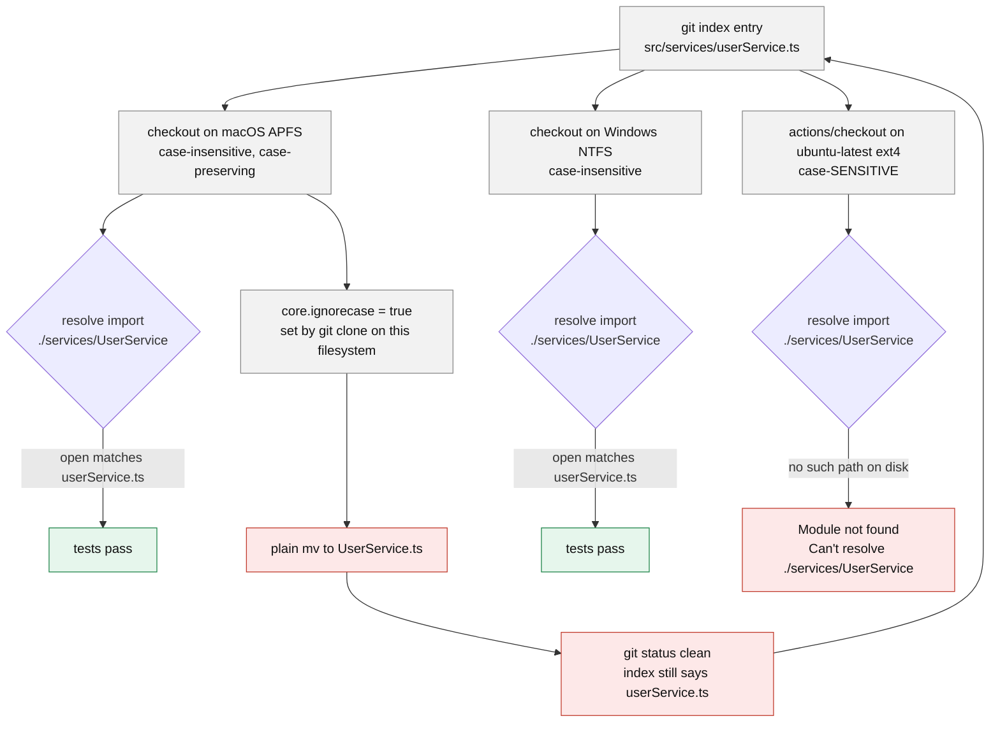

**TL;DR:** The Linux runner's filesystem is case-sensitive and every developer's macOS or Windows filesystem is not, so an import whose casing does not match the file on disk resolves locally and fails on the runner — and Git's `core.ignoreCase`, which `git clone` sets to `true` on those filesystems, is why "I renamed it and `git status` says clean" is a lie.
> **In plain English (30 sec):** Think of this like concepts you already use, but in a production system at scale.


## The symptom

> "CI has been red for four hours on `Module not found: Error: Can't resolve './services/UserService' in '/home/runner/work/payments-api/payments-api/src'`. That file exists. I can open it. Every one of the six people on this team runs `npm test` locally and it passes — three on macOS, two on Windows, one on WSL. It fails on `ubuntu-latest` on every single run, same error, same line. I renamed the file to match the import, committed, pushed. Still failing. `git status` is clean on my machine."

This is deterministic, not flaky — which immediately rules out the usual "works locally" suspects. It is not a race in test ordering. It is not a missing environment variable, which would surface as an undefined value rather than a resolver error. And it is not dependency drift, because a different resolved package version does not change whether a *first-party relative import* resolves.

The detail that makes it genuinely confusing is the last sentence: the developer already applied the obvious fix, committed it, and nothing changed.

## Reproduce

Ask git what it actually has, rather than asking the filesystem:

```bash
$ git ls-files src/services/
src/services/paymentGateway.ts
src/services/userService.ts

$ grep -rn "services/UserService" src/
src/api/checkout.ts:4:import { UserService } from './services/UserService';
```

The import says `UserService`. The tracked path says `userService`. That is the entire bug — and on macOS or Windows, `open("./services/UserService.ts")` still succeeds against a file named `userService.ts`, so nobody local ever sees it.

Confirm the second half, which is why the attempted fix did nothing:

```bash
$ git config core.ignorecase
true

$ mv src/services/userService.ts src/services/UserService.ts
$ git status --short
# (no output)
```

The file on disk is now `UserService.ts`. Git reports nothing to commit.

## The root cause chain

### 1. The runner's filesystem is case-sensitive and the developers' are not

`ubuntu-latest` runners use ext4, which is case-sensitive: `UserService.ts` and `userService.ts` are two different paths, and only one of them exists. macOS ships APFS formatted case-insensitive-but-case-preserving by default, and Windows NTFS is case-insensitive in practice for application file access. So the same `import` statement is resolved by two different `open()` semantics.

Node's resolver, webpack's resolver, TypeScript's module resolution, Python's importer, and the JVM's classloader all delegate the final lookup to the filesystem. None of them normalize case. The resolver is not the bug; it is faithfully reporting a filesystem answer that differs by platform.

### 2. `core.ignoreCase` makes the local correction a no-op

This is the part that turns a five-second fix into a four-hour outage. Git's own documentation for the variable:

> Internal variable which enables various workarounds to enable Git to work better on filesystems that are not case sensitive, like APFS, HFS+, FAT, NTFS, etc. For example, if a directory listing finds "makefile" when Git expects "Makefile", Git will assume it is really the same file, and continue to remember it as "Makefile".
>
> The default is false, except `git-clone` or `git-init` will probe and set core.ignoreCase true if appropriate when the repository is created.

Read the mechanism carefully: with `core.ignoreCase = true`, git treats a directory-listing name that differs only in case as *the same file it already has in the index*, and **keeps the index entry's spelling**. A plain `mv` that changes only case therefore produces no diff, no staged change, and no commit. The index still says `src/services/userService.ts`, the runner still checks out `userService.ts`, and the import still fails.

The developer's "I renamed it and pushed" was true about their working tree and false about the repository.

### 3. The confirming evidence

Three commands, in order, and the third is the one that ends the argument:

```bash
# what git actually tracks - the authority, not the filesystem
$ git ls-files src/services/ | grep -i userservice
src/services/userService.ts

# how git is configured to treat case on THIS machine
$ git config core.ignorecase
true

# what the runner sees - add this as a temporary step in the workflow
$ ls -l src/services/
-rw-r--r-- 1 runner docker  2841 Sep  8 09:14 paymentGateway.ts
-rw-r--r-- 1 runner docker  3517 Sep  8 09:14 userService.ts
```

The runner's directory listing shows the lowercase name. `actions/checkout` wrote exactly what the index contains, on a filesystem that will not pretend two spellings are one path.



The loop at the bottom right is the four hours: every attempted local fix feeds straight back into the same unchanged index entry.

## The fix

Force the rename through the index in two steps, so `core.ignoreCase` never gets the chance to collapse the two names into one:

```bash
# step 1: rename to a name that differs by more than case
git mv src/services/userService.ts src/services/userService.tmp.ts

# step 2: rename to the intended casing
git mv src/services/userService.tmp.ts src/services/UserService.ts

git status --short
# R  src/services/userService.ts -> src/services/UserService.ts

git commit -m "Fix casing of UserService.ts to match imports"
```

`git mv -f` in one step works on current git versions, but the two-step form is the one that behaves identically everywhere and leaves an unambiguous `R` in `git status` that you can actually verify before committing. Verify with `git ls-files`, not with `ls` — only the index matters to the runner.

Then close the hole so the next one is caught before it reaches CI. Add a case-collision guard as an early workflow step — it is a one-liner over the index and costs milliseconds:

```yaml
      - name: Reject paths that collide under case folding
        run: |
          dupes=$(git ls-files | tr 'A-Z' 'a-z' | sort | uniq -d)
          if [ -n "$dupes" ]; then
            echo "::error::paths differing only by case are tracked:"
            echo "$dupes"
            exit 1
          fi
```

And make the resolver itself enforce casing at compile time rather than at `open()` time. For TypeScript, set it explicitly — do not rely on the default, which has changed across releases:

```json
{
  "compilerOptions": {
    "forceConsistentCasingInFileNames": true
  }
}
```

The documented behavior is exactly the check you want: "When this option is set, TypeScript will issue an error if a program tries to include a file by a casing different from the casing on disk." On a case-insensitive machine that means `tsc --noEmit` fails locally, at the developer's desk, for the same reason CI would have failed — which is the point.

Do **not** "fix" this by setting `core.ignoreCase = false` on developer machines. Git's own documentation is explicit that this is an internal variable probed to match the filesystem: "Git relies on the proper configuration of this variable for your operating and file system. Modifying this value may result in unexpected behavior." You would be telling git the filesystem is case-sensitive when it is not.

## Deeper checks for production

1. **Parallelism differs, and that is the second-most-common "only in CI" failure.** Standard GitHub-hosted runners are 4-CPU / 16 GB for public repositories and 2-CPU / 8 GB for private ones; a developer laptop routinely has 10 or more cores. Test runners that default their worker count to the CPU count therefore shard and order tests differently in CI than locally, which is what exposes shared state — a module-level singleton, a leftover row in a test database, a fixture file two tests both write. Pin the worker count explicitly in both places (`--maxWorkers=2`, `-n 2`) so local and CI runs partition identically, and use the runner's serial mode to distinguish an ordering bug from a genuine one.

2. **Print the timezone and locale rather than assuming them.** Date-formatting and string-collation tests break when the runner's `TZ` and `LC_ALL` differ from a developer's. Do not assume any particular runner default — add `run: date +%Z; locale` as a diagnostic step, read the actual values, then pin both explicitly in the workflow `env:` and in the local test script so the two environments agree by construction rather than by coincidence.

3. **Confirm the lockfile is actually being honored.** `npm install` will resolve to newer versions and rewrite the lockfile; `npm ci` installs strictly from the lockfile, deletes `node_modules` first, and errors out if `package.json` and `package-lock.json` disagree. A CI step running `npm install` where developers run `npm ci` (or the reverse) is a real, silent version skew. The equivalents are `pip install -r requirements.txt` with hashes / `pip-sync`, `dotnet restore --locked-mode`, and `bundle install --frozen`.

4. **Remember that pinning an action does not pin the OS image.** Runner images are rebuilt continuously and tracked in `actions/runner-images`; pinning `actions/setup-node@v4` pins the action, not the preinstalled toolchain underneath it. A build that started failing with no change to your workflow file may have moved to a new image. Pin the runner label to a specific version (`runs-on: ubuntu-24.04`, not `ubuntu-latest`) when reproducibility matters more than staying current, and pin the language version in the `setup-*` action rather than accepting whatever the image ships.

## Prevention checklist

- [ ] A case-collision guard runs `git ls-files | tr 'A-Z' 'a-z' | sort | uniq -d` early in the workflow and fails the job on any output
- [ ] `forceConsistentCasingInFileNames` is set explicitly in `tsconfig.json` (or the language's equivalent import-casing check is enabled) so casing errors surface at compile time on every machine
- [ ] Case-only renames are done with the two-step `git mv` and verified with `git ls-files`, never with a plain `mv` plus a glance at `git status`
- [ ] `core.ignoreCase` is left at whatever `git clone` probed for the local filesystem, and is never hand-set to `false` as a workaround
- [ ] Test worker count is pinned to the same explicit number locally and in CI, rather than defaulting to each machine's CPU count
- [ ] `TZ` and the locale are set explicitly in the workflow `env:` and in the local test script, after checking the runner's real values with a `date +%Z; locale` step
- [ ] The install step is the lockfile-strict variant (`npm ci`, `--locked-mode`, `pip-sync`) in CI and locally

## FAQ

**The file is definitely named correctly in my editor. Why does the runner disagree?**
Because your editor is showing you the working tree and the runner is showing you the index. On a filesystem with `core.ignoreCase = true`, git keeps the index entry's original spelling when a directory listing differs only in case, so the working tree can display `UserService.ts` while the committed path is still `userService.ts`. `git ls-files` is the only local command that answers the runner's question.

**Would using a case-sensitive volume on macOS have caught this?**
Yes, and it is the strongest local guard available — a case-sensitive APFS volume makes the import fail on the developer's own machine. It is also disruptive: several commercial macOS applications do not support case-sensitive volumes. The compile-time check plus the CI guard step gets most of the benefit without that cost.

**We fixed the casing and the very next PR from a different developer reintroduced it. How?**
Because their clone still has `core.ignoreCase = true` and their filesystem still resolves either spelling. Nothing about fixing one file changes the conditions that produced it. That is exactly what the workflow guard step and `forceConsistentCasingInFileNames` are for — they make the class of bug impossible to commit, rather than fixing one instance of it.

**How do I tell this apart from a genuine flaky test that only happens to fail in CI?**
By determinism. This failure reproduces on every run, at the same import, with the same message, because the filesystem semantics are fixed. A flake caused by parallelism or shared state moves — different test, different run, sometimes green. If the same line fails ten times out of ten in CI and zero times out of ten locally, look at environment *semantics* (filesystem, timezone, locale, resolved versions), not at ordering.

## Source

- **Symptom:** `Module not found: Error: Can't resolve './services/UserService'` on `ubuntu-latest` only, deterministic, with a clean `git status` on every developer machine
- **Domain:** cicd
- **Docs/Repo:** [git — `Documentation/config/core.adoc`](https://github.com/git/git/blob/master/Documentation/config/core.adoc) — establishes `core.ignoreCase`'s exact behavior on APFS/HFS+/FAT/NTFS, that it defaults to false but `git clone`/`git init` probe and set it true when appropriate, and the warning that modifying it may result in unexpected behavior
- **Docs/Repo:** [GitHub-hosted runners reference — GitHub Docs](https://docs.github.com/en/actions/reference/runners/github-hosted-runners) — establishes the 4-CPU/16 GB standard runner for public repositories versus 2-CPU/8 GB for private ones, the difference that changes test-runner worker counts between CI and a developer machine
- **Docs/Repo:** [`forceConsistentCasingInFileNames` — TSConfig reference](https://www.typescriptlang.org/tsconfig/forceConsistentCasingInFileNames.html) — establishes the compile-time check: TypeScript "follows the case sensitivity rules of the file system it's running on", and when the option is set "will issue an error if a program tries to include a file by a casing different from the casing on disk"
- **Docs/Repo:** [actions/runner-images](https://github.com/actions/runner-images) — the source of truth for what is preinstalled on each runner label, and why pinning an action version does not pin the underlying image


