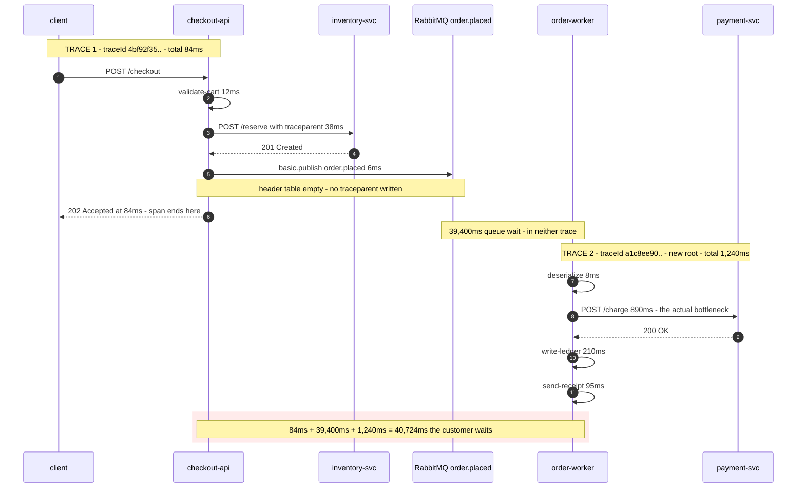

**TL;DR:** The trace stops at the message broker because OpenTelemetry's *active* `Context` lives in an execution-unit-local slot (`AsyncLocal` in .NET, `contextvars` in Python, a `ContextStorage` `ThreadLocal` in Java) and there is no instrumentation on the AMQP publish path to serialise it into a `traceparent` header — so the consumer, running on a completely unrelated execution unit in a different process, starts a fresh root span. Fix it by explicitly `Inject`-ing the context into the message headers on publish and `Extract`-ing it into the consumer span's parent.

> **In plain English (30 sec):** Logs with traceId that follows request across services.

## The symptom

> "Checkout p99 on the dashboard is 84 milliseconds and it has been 84 milliseconds all week. Support has three tickets saying the confirmation screen takes forty seconds. I pulled a trace ID off a slow request and Jaeger shows me a beautiful, complete, 84ms trace that ends at `order.placed publish`. Nothing is broken in it. There's no error, no gap, no orphan span — the trace just *finishes*, correctly, and the customer is still waiting."

What rules out the usual suspects: this isn't a sampling problem (the trace is present and complete), it isn't a clock-skew problem (there is no negative-duration span), and it isn't a missing-exporter problem (the worker *is* exporting spans — searching Jaeger for `service.name=order-worker` returns thousands of traces). The worker's traces are all there. They are just all **root** traces, with no parent, unlinked to any checkout.

## Reproduce

An HTTP hop and a broker hop, instrumented identically as far as the developer is concerned:

```csharp
// checkout-api — both calls look symmetric in the code
builder.Services.AddOpenTelemetry().WithTracing(t => t
    .AddAspNetCoreInstrumentation()
    .AddHttpClientInstrumentation()     // <- injects traceparent for you
    .AddSource("Checkout.Api")
    .AddOtlpExporter());

// hop 1: HTTP. Trace survives.
await _http.PostAsJsonAsync("http://inventory-svc/reserve", reservation);

// hop 2: AMQP. Trace dies here.
var props = _channel.CreateBasicProperties();
props.ContentType = "application/json";
_channel.BasicPublish(
    exchange: "orders", routingKey: "order.placed",
    basicProperties: props, body: JsonSerializer.SerializeToUtf8Bytes(evt));
```

```csharp
// order-worker — a long-lived consumer loop
var consumer = new EventingBasicConsumer(_channel);
consumer.Received += (_, ea) =>
{
    // Activity.Current here is null, every single time.
    using var activity = Source.StartActivity("order.placed process");
    _handler.Handle(Decode(ea.Body));
};
_channel.BasicConsume("order.placed", autoAck: false, consumer);
```

Publish one order, then look at Jaeger. You get two traces, not one.

## The root cause chain

### 1. The immediate trigger: only the HTTP hop has a propagator wired to it

`AddHttpClientInstrumentation()` hooks `HttpClient`'s `DiagnosticSource` events and, on every outbound request, calls the configured propagator to write `traceparent` onto the request headers. That is an *instrumentation library* for one specific transport. `RabbitMQ.Client` has no such hook in this pipeline, so `BasicPublish` sends a message whose header table is empty. Nothing about the publish call site tells you this — it compiles, it runs, it emits a perfectly good span.

You can see the asymmetry on the wire. The HTTP hop carries the W3C header, whose format is fixed by the spec at four dash-separated fields:

```text
traceparent: 00-4bf92f3577b34da6a3ce929d0e0e4736-00f067aa0ba902b7-01
             ^  ^                                ^                ^
             |  |                                |                trace-flags: 2 hex,
             |  |                                |                only bit 0 is defined
             |  |                                |                (01 = sampled)
             |  |                                parent-id: 16 hex chars / 8 bytes,
             |  |                                all-zero is invalid
             |  trace-id: 32 hex chars / 16 bytes, all-zero is invalid
             version: 2 hex chars, ff is invalid
```

The AMQP hop carries no header at all.

### 2. The underlying mechanism: the active Context is execution-unit-scoped, and the consumer is a different execution unit

The OpenTelemetry specification defines `Context` as "a propagation mechanism which carries execution-scoped values across API boundaries," and describes two modes for how you get at it. In **implicit** mode — which is what every mainstream SDK uses — the SDK "automatically manages `Context` per execution unit (threads, coroutines, etc.)," and you manipulate it with **Attach Context** (which returns a `Token`) and **Detach Context** (which restores the prior state using that `Token`).

"Per execution unit" is the whole failure. Concretely:

| Language | Implicit-context storage | Survives a hand-off to… |
| --- | --- | --- |
| .NET | `Activity.Current`, backed by `AsyncLocal<T>` over `ExecutionContext` | `await`, `Task.Run`, `ThreadPool.QueueUserWorkItem` — all flow it |
| Python | `contextvars.ContextVar` | `await` and `asyncio.create_task`; **not** a bare `threading.Thread` |
| Java | `Context` in a `ThreadLocal`-backed `ContextStorage` | nothing — a new thread starts empty unless you wrap the `Runnable` |

Note the .NET row, because it is the opposite of the folklore: `Task.Run` **does** flow `Activity.Current`, because `AsyncLocal<T>` rides on `ExecutionContext`, and the runtime "ensures that the `ExecutionContext` is consistently transferred across runtime-defined asynchronous points." Blaming `Task.Run` here would send you chasing a bug that isn't there.

The two hand-offs that genuinely lose it are:

1. **A long-lived consumer loop.** `EventingBasicConsumer`'s callback thread, or a `BackgroundService.ExecuteAsync` reading a `Channel<T>`, had its `ExecutionContext` established when the *host started*. Enqueuing an item copies a payload, not an ambient context. The reader's `Activity.Current` is whatever the host had at startup: `null`.
2. **A process boundary.** No in-process mechanism can span two processes. The only carrier is the message itself.

Both collapse to the same requirement: if you want the context on the other side, something has to serialise it into the payload's metadata.

### 3. The confirming evidence: an all-zero parentSpanId in the exported span

Don't infer this from the UI — read the exported span. Fetch the worker's trace straight from the tracing backend:

```bash
curl -s 'http://jaeger:16686/api/traces/a1c8ee90f4b74e0d9b1c2a3f5e6d7c88' \
  | jq '.data[0].spans[] | {operationName, spanID, references}'
```

```json
{
  "operationName": "order.placed process",
  "spanID": "5b1e0c72d9a34f10",
  "references": []
}
```

An empty `references` array — equivalently, an all-zero `parentSpanId` of `0000000000000000` in OTLP — is the definition of a root span. The worker didn't lose a parent it had. It never had one.

The matching in-process check, on both sides:

```csharp
// Publisher, immediately before BasicPublish
_log.LogInformation("publish traceparent={Tp}", Activity.Current?.Id);
// publish traceparent=00-4bf92f3577b34da6a3ce929d0e0e4736-00f067aa0ba902b7-01

// Consumer, first line of the Received handler
_log.LogInformation("consume traceparent={Tp} headerCount={N}",
    Activity.Current?.Id, ea.BasicProperties.Headers?.Count ?? 0);
// consume traceparent=(null) headerCount=0
```

`headerCount=0` is the diagnosis. The publisher had a valid context and simply never wrote it down.

### What the split trace hides

The reason this is worth a page and not a footnote is what the missing link costs you operationally. Here are both traces with their real per-hop numbers:



Read the numbers, not the boxes. The checkout dashboard reports 84ms and is *correct* — the API really does finish in 84ms. The 890ms payment call is the slowest single hop in the system and it is attributed to a trace nobody looks at. And the 39.4 seconds of queue wait, which is 97% of the customer's total, appears in **no** span at all: trace 1 ends before it and trace 2 begins after it. Latency attribution is the entire operational point of tracing, and a broken link at one hop doesn't degrade it gracefully — it deletes the largest term.

## The fix

Inject on publish, extract on consume. `TextMapPropagator` is transport-agnostic by design: it takes a carrier of any type plus a delegate that knows how to write to it, so the same propagator that handles HTTP headers handles an AMQP header table.

```csharp
// checkout-api — publisher
private static readonly ActivitySource Source = new("Checkout.Api");

public void PublishOrderPlaced(OrderPlaced evt)
{
    // PRODUCER kind marks this span as the message creation context.
    using var activity = Source.StartActivity("order.placed publish", ActivityKind.Producer);

    var props = _channel.CreateBasicProperties();
    props.Headers = new Dictionary<string, object>();

    // Inject<T>(PropagationContext, T carrier, Action<T, string, string> setter)
    // The setter is how the propagator writes into a carrier it knows nothing about.
    Propagators.DefaultTextMapPropagator.Inject(
        new PropagationContext(activity?.Context ?? default, Baggage.Current),
        props.Headers,
        static (headers, key, value) => headers[key] = value);

    activity?.SetTag("messaging.system", "rabbitmq");
    activity?.SetTag("messaging.operation.name", "publish");
    activity?.SetTag("messaging.destination.name", "order.placed");

    _channel.BasicPublish("orders", "order.placed", props,
        JsonSerializer.SerializeToUtf8Bytes(evt));
}
```

```csharp
// order-worker — consumer
private static readonly ActivitySource Source = new("Order.Worker");

private void OnReceived(object? sender, BasicDeliverEventArgs ea)
{
    // Extract<T>(PropagationContext, T carrier, Func<T, string, IEnumerable<string>?> getter)
    var parent = Propagators.DefaultTextMapPropagator.Extract(
        default, ea.BasicProperties.Headers, ReadHeader);

    // Baggage is ambient too - Extract returns it, but it will not apply itself.
    Baggage.Current = parent.Baggage;

    using var activity = Source.StartActivity(
        "order.placed process", ActivityKind.Consumer, parent.ActivityContext);

    activity?.SetTag("messaging.operation.type", "process");
    _handler.Handle(Decode(ea.Body));
}

// RabbitMQ.Client hands header values back as byte[], not string.
// Miss this and Extract silently finds nothing and you are back where you started.
private static IEnumerable<string> ReadHeader(IDictionary<string, object>? headers, string key)
    => headers is not null && headers.TryGetValue(key, out var v) && v is byte[] bytes
        ? new[] { Encoding.UTF8.GetString(bytes) }
        : Array.Empty<string>();
```

**Parent, or link?** Making the `process` span a direct child of the publish span, as above, is the right default for a **single-message, one-consumer** flow like this one — it produces the continuous trace the on-call engineer wants. The messaging semantic conventions do use span links as their *default* mechanism, because links are "the only consistent trace structure that can be guaranteed" across fan-out, batching and multi-consumer topologies, and they specifically say it is "NOT RECOMMENDED to use the message creation context as the parent of `Process` spans (by default) if processing happens in the scope of another span."

So: one message in, one handler, nothing else on the consumer's stack — use the parent. Batch consumers that pull 500 messages from N different traces in one `basic.get` loop — use links, because there is no single correct parent:

```csharp
var links = batch.Select(m => new ActivityLink(
    Propagators.DefaultTextMapPropagator
        .Extract(default, m.Headers, ReadHeader).ActivityContext)).ToList();

using var activity = Source.StartActivity(
    "order.placed process", ActivityKind.Consumer, default(ActivityContext), links: links);
```

## Deeper checks for production

1. **Confirm the propagator is not the no-op.** `Propagators.DefaultTextMapPropagator` is declared as `public static TextMapPropagator DefaultTextMapPropagator { get; internal set; } = Noop;` — it is a `NoopTextMapPropagator` until the SDK's static constructor replaces it with a `CompositeTextMapPropagator` of `TraceContextPropagator` + `BaggagePropagator`. In a worker process that references only `OpenTelemetry.Api` and never actually builds a `TracerProvider`, `Inject` runs, succeeds, and writes nothing. Assert `props.Headers.ContainsKey("traceparent")` in an integration test.

2. **Check the sampled flag, not just the presence of the header.** `traceparent` ending in `-00` means the producer's sampler decided not to record. A consumer span started with that `ActivityContext` as its parent inherits the decision under the default parent-based sampler and will not be recorded either — so a partially-sampled system produces exactly the same "worker traces exist but checkout traces don't link to them" appearance, from a different cause. Grep the header suffix before you go rewriting propagation code.

3. **Instrument the queue wait explicitly.** Even a correctly linked trace shows the 39.4s as dead space between the producer span's end and the consumer span's start, which no percentile query can aggregate. Stamp the publish time into a message header and record `now - publishedAt` as a histogram on the consumer span. Queue wait is a first-class SLI, not a gap.

4. **Audit every remaining transport that isn't HTTP.** The same hole exists for gRPC streaming, Kafka, Azure Service Bus, SQS, Redis pub/sub, database-backed outboxes, and cron jobs that poll a table. A quick census: for each, does something write `traceparent` on the way out and read it on the way in? Anything answering "no" is a place where your longest latencies are hiding.

## Prevention checklist

- [ ] Every non-HTTP hand-off calls `Propagators.DefaultTextMapPropagator.Inject` with a setter for that transport's carrier, and the matching `Extract` on the far side
- [ ] The consumer's extract getter handles the carrier's real value type — `byte[]` for `RabbitMQ.Client` headers — and is covered by a test that asserts a non-default `ActivityContext` comes back
- [ ] Consumer spans are started with `ActivityKind.Consumer` and an explicit parent `ActivityContext` (single message) or `links:` (batch), never with the ambient `Activity.Current`
- [ ] An integration test asserts `traceparent` is present on the published message and matches the 4-field W3C format with a non-zero trace-id and parent-id
- [ ] Queue wait time is recorded as its own histogram, since it lives in the gap between the producer and consumer spans rather than inside either one
- [ ] A dashboard panel counts root spans per service — a worker emitting only root spans is the signature of this bug

## FAQ

**Does `Task.Run` lose the trace context in .NET?**
No. `Activity.Current` is backed by `AsyncLocal<T>`, which rides on `ExecutionContext`, and the runtime transfers `ExecutionContext` across runtime-defined asynchronous points including `Task.Run` and `ThreadPool.QueueUserWorkItem`. Context is lost when the consuming code's execution unit was established somewhere else entirely — a `BackgroundService` loop started at host boot, a raw `Thread`, an `ExecutionContext.SuppressFlow()` region — or when the work crosses a process boundary. On a `Channel<T>`, the writer's context does not travel with the item, because you enqueued a payload, not a context.

**Why does the parent span's duration not cover the child's, even after I fix propagation?**
Because it shouldn't. The publish span ends at 84ms and the process span starts 39.4 seconds later. That is a legitimate, expected shape for asynchronous messaging — the parent is not "wrapping" the child in wall-clock time, it is establishing causality. Tracing UIs that render the timeline as strict nesting will show a long empty bar, which is exactly why check #3 above records queue wait as its own metric.

**Can I just put the trace ID in the message body instead of the headers?**
You can propagate it, but you lose interoperability. The value of `traceparent` is that it is a wire format any W3C-compliant implementation parses without a shared SDK — a Java consumer, a Go sidecar, or a vendor's broker-side instrumentation can all pick up a header. A field inside your JSON body is understood only by code that knows your schema, and it won't be read by any auto-instrumentation.

**Both traces have `sampled=01` and the link still didn't form. What else?**
Check the getter's return type first — the `byte[]`-vs-`string` mismatch is the single most common cause, and it fails silently because `Extract` just returns the default `PropagationContext` when it finds nothing parseable. Then check that `Extract`'s result is actually passed as the `parentContext` argument of `StartActivity` and not discarded; `StartActivity(name, kind)` with no third argument falls back to `Activity.Current`, which is `null` here.

## Source

- **Symptom:** A trace terminates at the message-broker publish and the downstream work appears as an unrelated root trace, hiding the largest latency contributor.
- **Domain:** observability
- **Docs/Repo:** [W3C Trace Context](https://www.w3.org/TR/trace-context/) — the exact 4-field `traceparent` format, field lengths, and the invalid all-zero trace-id/parent-id values
- **Docs/Repo:** [OpenTelemetry Context specification](https://opentelemetry.io/docs/specs/otel/context/) — `Context` as execution-scoped, and the implicit-mode Attach/Detach/Token operations
- **Docs/Repo:** [open-telemetry/opentelemetry-dotnet](https://github.com/open-telemetry/opentelemetry-dotnet) — `TextMapPropagator.Inject`/`Extract` signatures, `PropagationContext`, and `Propagators.DefaultTextMapPropagator` defaulting to `Noop`
- **Docs/Repo:** [OpenTelemetry messaging semantic conventions](https://opentelemetry.io/docs/specs/semconv/messaging/messaging-spans/) — producer/consumer span kinds and why span links are the default correlation mechanism


