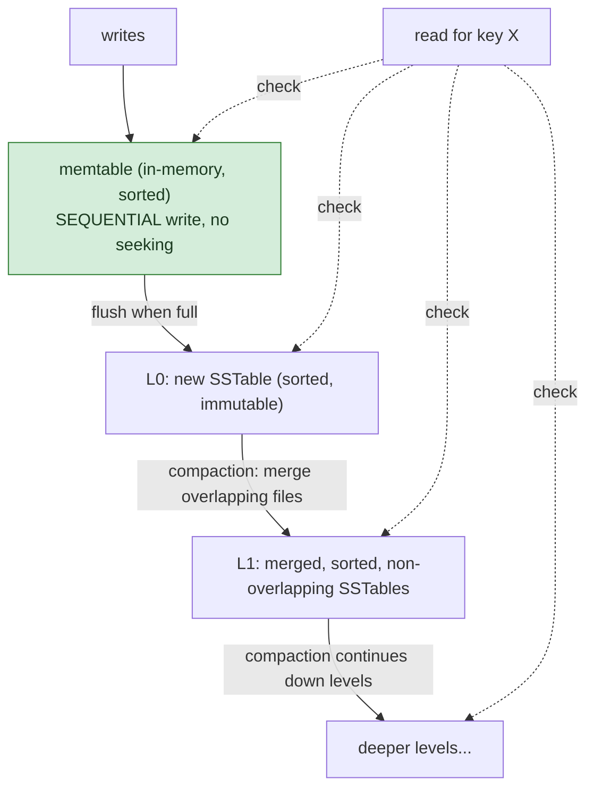

## 1. The Engineering Problem: in-place updates mean random disk writes, and random writes don't scale

A B-tree (the classic on-disk index structure behind Postgres, MySQL's InnoDB, SQLite) updates data *in place* — writing a new value for an existing key means finding that key's exact page on disk and rewriting it there. This is excellent for read-heavy workloads: a lookup is a direct tree traversal to one page. It's genuinely expensive under high write throughput: an update to a random key is a random disk write wherever that key's page happens to live, and keeping the tree balanced during inserts costs extra page-split rewrites on top. At real write scale — event logs, time-series ingestion, high-throughput OLTP — scattered random writes and page-split maintenance become the actual bottleneck.

---

## 2. The Technical Solution: never update in place — append, then periodically merge

An **LSM-tree (Log-Structured Merge-tree)** never updates in place. Writes go to an in-memory buffer (a memtable) and are periodically flushed as a new, immutable, sorted file (an SSTable) — always a sequential disk write, never a random one. The cost shifts to reads: a key might live in the memtable, or in any of several sorted files spread across multiple levels on disk, so a lookup potentially has to check more than one place.



To bound the growing read cost (and reclaim space from overwritten/deleted keys, which just exist as shadowing newer entries until cleaned up), the engine periodically **compacts** — merging sorted files together and pushing the merged output down a level. Deciding *when* and *which* level to compact isn't arbitrary: Pebble, CockroachDB's real LSM storage engine, computes a numeric score per level from a **fill factor** — how much bigger a level currently is relative to its ideal target size — and triggers compaction for whichever level is most over target.

Core truths: **the write path is fast specifically because it never seeks** — appending to a memtable and sequentially flushing it are both operations a spinning or solid-state disk handles efficiently, unlike scattered random writes; and **compaction is the cost LSM-trees defer, not eliminate** — the write-time savings are paid back later, in background CPU/IO work merging files, which is why LSM-based systems have "compaction falling behind" as a real, distinct operational failure mode B-tree systems don't have an equivalent to.

---

## 3. The clean example (concept in isolation)

```
fill_factor(level) = current_size(level) / ideal_size(level)

score(level):
    if level == bottom_level:
        score = fill_factor
    elif fill_factor < 1:
        score = fill_factor
    else:
        score = fill_factor / fill_factor(next_level)

should_compact(level) = score(level) > 0
# pick the HIGHEST-scoring level to compact next
```

---

## 4. Production reality (from `cockroachdb/pebble`)

```go
// compaction_picker.go
type candidateLevelInfo struct {
    // For L1+, the fill factor is the ratio between the total uncompensated
    // file size and the ideal size of the level (based on the total size
    // of the DB).
    fillFactor float64

    // The score of the level, used to rank levels.
    //
    // If the level doesn't require compaction, the score is 0. Otherwise:
    //  - for L6 the score is equal to the fillFactor;
    //  - for L0-L5:
    //    - if the fillFactor is < 1: the score is equal to the fillFactor;
    //    - if the fillFactor is >= 1: the score is the ratio between the
    //                                 fillFactor and the next level's fillFactor.
    score float64

    // The fill factor of the level after accounting for level size
    // compensation. Used to determine if the level should be compacted.
    compensatedFillFactor float64
}

func (c *candidateLevelInfo) shouldCompact() bool {
    return c.score > 0
}
```

What this teaches that a hello-world can't:

- **The score formula for L0-L5 divides by the NEXT level's fill factor when the current level is already over its target (`fillFactor >= 1`).** This isn't just "is this level too big" in isolation — it's relative pressure between adjacent levels. A level slightly over target next to an even-more-overloaded level below it scores differently than the same level next to a nearly-empty one, which is what lets the picker prioritize the levels where compaction will relieve the most actual pressure, not just the numerically largest one.
- **`compensatedFillFactor` is tracked SEPARATELY from the raw `fillFactor`**, specifically to account for space that deletions are expected to reclaim once compaction actually runs. A level full of tombstones (deletion markers) looks large by raw size but will shrink significantly post-compaction — the compensated figure is what the score calculation actually uses to decide urgency, avoiding wasted compaction effort on a level that's about to shrink on its own.
- **`shouldCompact()` is a one-line, purely score-based decision (`score > 0`)** — all the real complexity (fill factor computation, level-relative comparison, deletion compensation) is front-loaded into computing the score correctly; the actual trigger check itself stays trivially simple, which is a deliberate separation between "how hard is this to decide" and "how cheap is it to check repeatedly."

Known-stale fact: "database indexing" is often treated as one uniform concept regardless of storage engine — it isn't. B-tree indexing (read-optimized, in-place updates, page-split maintenance) and LSM-tree indexing (write-optimized, append-only plus background compaction) have genuinely different performance profiles and different operational failure modes — LSM engines can suffer "compaction falling behind" under sustained write pressure, a concern B-tree engines simply don't have an equivalent to, while B-tree engines face page fragmentation and split overhead LSM engines avoid by design. Which storage engine a database uses underneath is a real architectural fact worth knowing, not an implementation detail safe to ignore.

---

## Source

- **Concept:** Indexing & query optimization at scale
- **Domain:** system-design
- **Repo:** [cockroachdb/pebble](https://github.com/cockroachdb/pebble) → [`compaction_picker.go`](https://github.com/cockroachdb/pebble/blob/master/compaction_picker.go) — the real, production LSM-tree storage engine used by CockroachDB.
