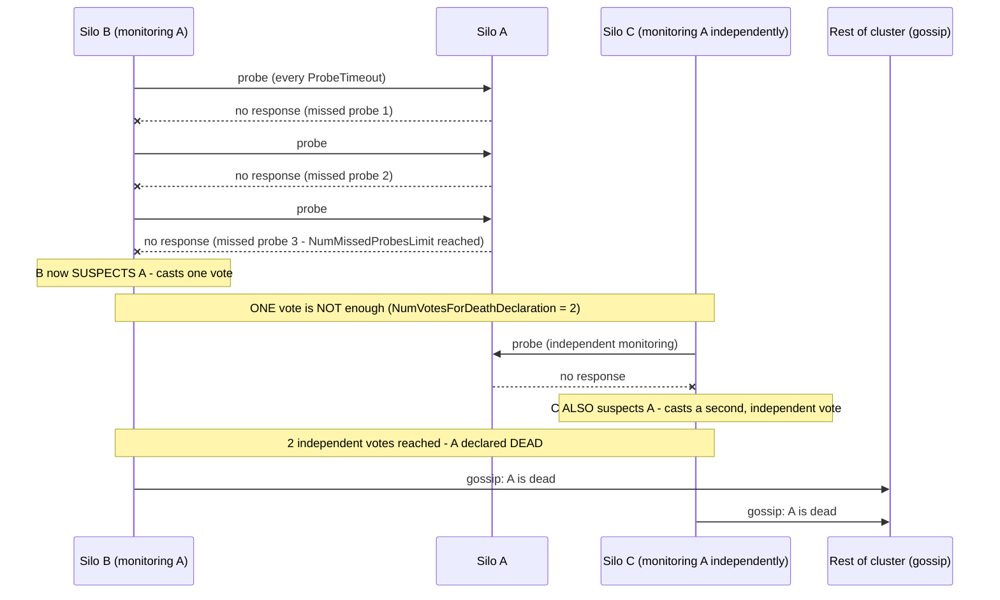

## 1. The Engineering Problem: "ping it, no response, it's dead" is a real, common source of false failures

Detecting node failure in a distributed system is genuinely hard — not the triviality "ping it, if no response, it's dead" it's often reduced to. A single observer's inability to reach a node could mean the node is actually down, or it could mean *the observer* has a network problem — a flaky link between just those two nodes, an asymmetric partial partition — while the supposedly-failed node is perfectly healthy and reachable by everyone else. Declare it dead based on one observer's view alone, and you risk evicting a perfectly healthy node, redistributing its work unnecessarily, and potentially causing duplicate processing on top. Wait too long, and requests keep routing to a node that genuinely will never respond.

---

## 2. The Technical Solution: require independent corroboration before declaring a node dead

Orleans' real cluster membership protocol (a SWIM-family design) never lets a single observer's suspicion alone declare a node dead. Each silo actively monitors a *bounded* subset of peers — not an all-to-all mesh, which would scale as O(n²) monitoring traffic — and missing several consecutive probes only makes a silo **suspected**, not dead. Declaring a silo actually dead requires **multiple independent votes** from *different* observers.



The mechanism's real defense against false positives: **a single observer's network issue can't unilaterally evict a healthy node**, because that observer's vote alone never crosses the declaration threshold — a *second*, independently-arrived-at suspicion is required, and a network problem specific to one link is unlikely to also affect a completely different observer's connection to the same node. Votes also **expire**, so unrelated, resolved incidents from different observers at different times don't silently accumulate toward the threshold long after each individual problem was fixed.

Core truths: **monitoring is deliberately bounded, not exhaustive** — each node watches a fixed-size subset of the cluster, trading perfect immediate coverage for a scalable, constant-per-node monitoring cost; and **membership changes propagate by gossip, not a central coordinator** — avoiding a single bottleneck everyone has to poll to learn "who's still alive," at the cost of a small, bounded propagation delay before the whole cluster agrees on the current membership.

---

## 3. The clean example (concept in isolation)

```python
def record_missed_probe(observer, target):
    missed_counts[(observer, target)] += 1
    if missed_counts[(observer, target)] >= NUM_MISSED_PROBES_LIMIT:
        cast_vote(observer, target, expires_in=DEATH_VOTE_EXPIRATION)

def cast_vote(observer, target, expires_in):
    votes[target].add((observer, now() + expires_in))
    active_votes = [v for v in votes[target] if v.expires_at > now()]
    if len(active_votes) >= NUM_VOTES_FOR_DEATH_DECLARATION:
        declare_dead(target)   # requires MULTIPLE independent observers
        gossip_membership_update(target, status="dead")
```

---

## 4. Production reality (from `dotnet/orleans`)

```csharp
// src/Orleans.Core/Configuration/Options/ClusterMembershipOptions.cs

/// Gets or sets both the period between sending a liveness probe to any
/// given host as well as the timeout for each probe.
/// Probes time out and a new probe is sent every 5 seconds by default.
public TimeSpan ProbeTimeout { get; set; } = TimeSpan.FromSeconds(5);

/// Gets or sets the number of silos each silo probes for liveness.
/// A low value, such as 3, is generally sufficient and allows for prompt
/// removal... Monitoring is not expensive, however, and a higher value
/// improves recovery during sudden changes in cluster size.
/// Each silo will actively monitor up to 10 other silos by default.
public int NumProbedSilos { get; set; } = 10;

/// Gets or sets the number of missed probe requests from a silo that
/// lead to suspecting this silo as down.
/// A silo will be suspected as being down if three probes are missed.
public int NumMissedProbesLimit { get; set; } = 3;

/// Gets or sets the number of non-expired votes that are needed to
/// declare some silo as down (should be at most NumProbedSilos).
/// Two votes are sufficient for a silo to be declared as down, by default.
public int NumVotesForDeathDeclaration { get; set; } = 2;

/// Gets or sets the expiration time for votes in the membership table.
/// Votes expire after 2 minutes by default.
public TimeSpan DeathVoteExpirationTimeout { get; set; } = TimeSpan.FromMinutes(2);

/// Gets or sets a value indicating whether membership updates are
/// disseminated between hosts using gossip.
public bool UseLivenessGossip { get; set; } = true;
```

What this teaches that a hello-world can't:

- **`NumVotesForDeathDeclaration` (2) is documented as needing to be "at most `NumProbedSilos`" (10)** — this is a real structural constraint between two independent settings: you can never require more corroborating votes than the maximum number of silos that could possibly be monitoring any given peer. The two numbers aren't independently tunable; one bounds the other.
- **The doc comment for `NumProbedSilos` explicitly notes that suspicion triggers MORE silos to start probing the suspected one** — "when a silo becomes suspicious of another silo, additional silos may begin to probe that silo to speed up the detection." Monitoring load isn't static; it dynamically concentrates around a silo already under suspicion, getting a second independent opinion faster than waiting for the normal, sparser probe rotation to happen to cover it.
- **`DeathVoteExpirationTimeout` (2 minutes) is deliberately much longer than `ProbeTimeout` (5 seconds) but still finite** — long enough that votes from a genuine, ongoing outage accumulate and reach quorum, short enough that stale suspicion from a resolved, unrelated blip doesn't linger indefinitely waiting to combine with some future unrelated vote.

Known-stale fact: "heartbeat timeout equals dead" is a common, oversimplified mental model of failure detection — and it's a real, well-documented cause of false-positive failures in naively-built systems, where a network hiccup between exactly two nodes wrongly evicts a perfectly healthy third node from the rest of the cluster's perspective. Production distributed systems in this SWIM family (Orleans here, the same underlying pattern in Cassandra's and Consul's gossip protocols) require corroboration from multiple independent observers specifically to close this gap — a materially more resilient design than a single timeout triggering eviction.

---

## Source

- **Concept:** Designing for failure (redundancy, failover, disaster recovery)
- **Domain:** system-design
- **Repo:** [dotnet/orleans](https://github.com/dotnet/orleans) → [`src/Orleans.Core/Configuration/Options/ClusterMembershipOptions.cs`](https://github.com/dotnet/orleans/blob/main/src/Orleans.Core/Configuration/Options/ClusterMembershipOptions.cs) — the real distributed actor framework's cluster membership/failure-detection protocol.
