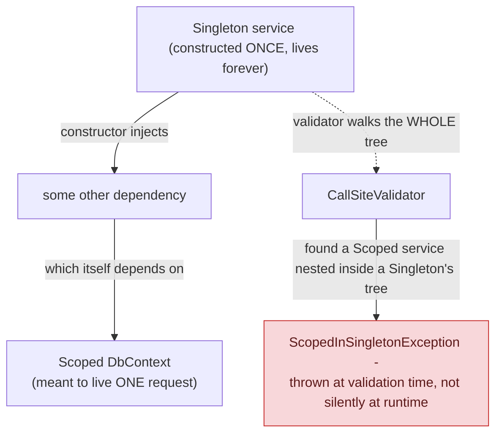

## 1. The Engineering Problem: a Singleton that captures per-request state lives forever, silently

Singleton is often taught as simply "good when you want exactly one instance" — but in a concurrent, request-scoped system, a singleton that *captures* (holds a reference to) a dependency meant to live only for one request creates a serious, hard-to-detect bug. The classic real case: a singleton service's constructor takes a scoped `DbContext` (meant to represent one HTTP request's unit of work). That `DbContext` gets created once, at the singleton's own construction — and because the singleton itself lives for the entire application lifetime, that "per-request" `DbContext` now effectively lives forever too, shared and mutated concurrently across every unrelated request that flows through the singleton. Data silently corrupts across requests, and the `DbContext`'s change tracker accumulates entities without bound, since it's never recreated the way a genuine per-request instance would be.

---

## 2. The Technical Solution: the DI container validates the dependency graph and refuses to build a broken one

This is exactly why treating global mutable state casually is dangerous in a concurrent, request-scoped system — and why a real DI container actively guards against it rather than relying on programmer discipline alone. ASP.NET Core's DI container has an explicit validation pass that walks a singleton's *entire* constructor-dependency tree and throws the moment it finds a scoped service anywhere in that tree — catching the "captive dependency" bug at startup, not in production under concurrent load.



Core truths: **the validator doesn't just check the singleton's direct constructor parameters** — it walks the full transitive dependency tree, catching a scoped service hidden several layers deep just as reliably as one injected directly; and **this is a deliberate design decision to fail loudly at validation time rather than corrupt data silently under concurrent load** — the alternative (letting the captive dependency slip through) would manifest as a much harder-to-diagnose production bug, appearing only under real concurrent traffic.

---

## 3. The clean example (concept in isolation)

```csharp
// Scoped DbContext meant to represent ONE request's unit of work
services.AddDbContext<AppDbContext>();   // Scoped by default

// BUG: a Singleton capturing that scoped DbContext
public class BadSingletonService
{
    private readonly AppDbContext _db;   // captured ONCE, at singleton construction
    public BadSingletonService(AppDbContext db) => _db = db;
    // every "request" through this singleton reuses the SAME DbContext forever
}
services.AddSingleton<BadSingletonService>();
// -> throws InvalidOperationException at validation time, not at some
//    unpredictable point in production under concurrent load
```

---

## 4. Production reality (from `dotnet/runtime`'s `Microsoft.Extensions.DependencyInjection`)

```csharp
// src/libraries/Microsoft.Extensions.DependencyInjection/src/ServiceLookup/CallSiteValidator.cs
protected override Type? VisitCallSite(ServiceCallSite callSite, CallSiteValidatorState argument)
{
    if (!_scopedServices.TryGetValue(callSite.Cache.Key, out Type? firstScopedServiceInCallSiteTree))
    {
        // Walk the ENTIRE dependency tree, not just direct constructor params
        firstScopedServiceInCallSiteTree = base.VisitCallSite(callSite, argument);
        _scopedServices[callSite.Cache.Key] = firstScopedServiceInCallSiteTree;
    }

    // If there is a scoped service ANYWHERE in the tree, make sure we are
    // not resolving it from a singleton
    if (firstScopedServiceInCallSiteTree != null && argument.Singleton != null)
    {
        throw new InvalidOperationException(SR.Format(SR.ScopedInSingletonException,
            callSite.ServiceType,
            argument.Singleton.ServiceType,
            nameof(ServiceLifetime.Scoped).ToLowerInvariant(),
            nameof(ServiceLifetime.Singleton).ToLowerInvariant()));
    }
    return firstScopedServiceInCallSiteTree;
}

protected override Type? VisitRootCache(ServiceCallSite singletonCallSite, CallSiteValidatorState state)
{
    state.Singleton = singletonCallSite;   // mark: "we are now inside a singleton's tree"
    return VisitCallSiteMain(singletonCallSite, state);
}

protected override Type? VisitScopeCache(ServiceCallSite scopedCallSite, CallSiteValidatorState state)
{
    VisitCallSiteMain(scopedCallSite, state);
    return scopedCallSite.ServiceType;   // report: "a scoped service was found here"
}
```

What this teaches that a hello-world can't:

- **`VisitConstructor` and `VisitIEnumerable` both recurse through `VisitCallSite` on every parameter/element** — this is what makes the validation transitive rather than shallow. A singleton whose constructor takes a service that, three layers down, eventually depends on something scoped still gets caught, because each layer of the walk propagates "did I find a scoped service in my own subtree" back up to its caller.
- **`argument.Singleton` is only set inside `VisitRootCache`, and it's threaded through as mutable state (`CallSiteValidatorState`) passed down the recursive walk.** This is the mechanism that lets the validator distinguish "a scoped service exists somewhere in this object graph" (fine, if nothing above it is a singleton) from "a scoped service exists inside a singleton's specific subtree" (the actual bug) — the same scoped service resolved from a Scoped or Transient consumer triggers no exception at all.
- **Results are cached per `callSite.Cache.Key`** (`_scopedServices` is a `ConcurrentDictionary`) — the validator doesn't re-walk the same dependency subtree repeatedly across different validation calls. This matters because a large real application's DI graph can be deep and shared across many registrations; re-walking it from scratch every time would make startup validation itself a real performance cost.

Known-stale fact: "Singleton is good when you want exactly one instance" is true as far as it goes, but incomplete for concurrent, request-scoped systems — in that context, Singleton is widely considered an anti-pattern specifically because of global mutable state and exactly this class of hidden lifetime mismatch. Modern DI containers default to Scoped lifetimes for anything representing "state shared within one logical unit of work" (a request, a job execution), reserving true process-wide Singletons for genuinely stateless or thread-safe shared resources — a connection pool, a cache client — never for request-specific state.

---

## Source

- **Concept:** Singleton (and why it's often an anti-pattern in concurrent systems)
- **Domain:** design-patterns
- **Repo:** [dotnet/runtime](https://github.com/dotnet/runtime) → [`src/libraries/Microsoft.Extensions.DependencyInjection/src/ServiceLookup/CallSiteValidator.cs`](https://github.com/dotnet/runtime/blob/main/src/libraries/Microsoft.Extensions.DependencyInjection/src/ServiceLookup/CallSiteValidator.cs) — the real .NET dependency injection container's captive-dependency validation.
