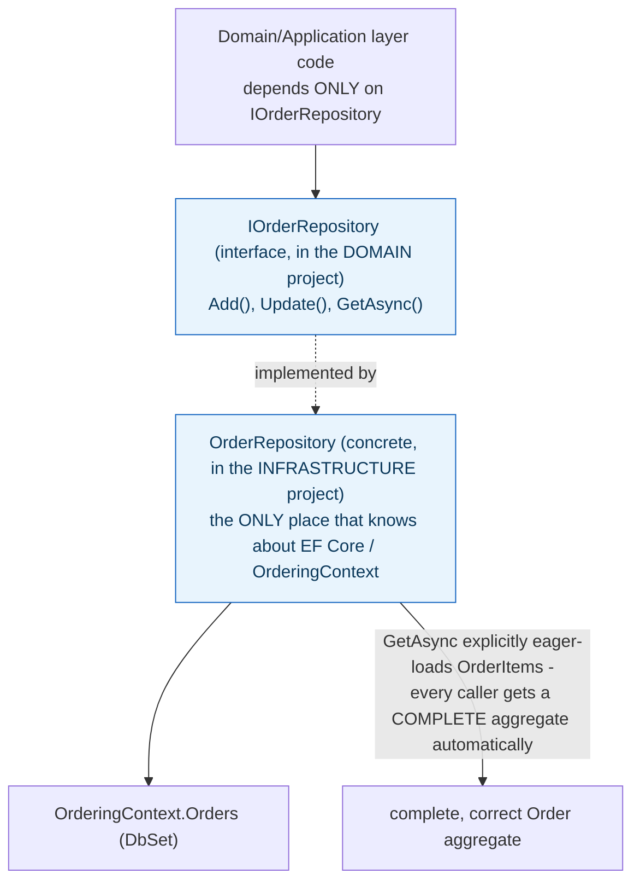

## 1. The Engineering Problem: a generic query API doesn't encode "how to correctly load this specific aggregate"

`DbSet<T>` is already a reasonably generic, testable-ish abstraction over a database table — so why would a real application wrap it in *another* interface? Because `DbSet<T>` exposes the full generic query surface (arbitrary LINQ, any shape of query) directly coupled to EF Core as a technology, and it doesn't encode anything about how a *specific* aggregate needs to be loaded correctly. A naive `context.Orders.Find(id)` call silently returns an `Order` with its `OrderItems` collection unloaded — a technically-successful query that hands back an incomplete, buggy aggregate, unless every single caller independently remembers to eager-load the related data too.

---

## 2. The Technical Solution: a narrow, domain-shaped interface that encapsulates correct loading, backed by one concrete implementation

**Repository**: a narrow interface (`IOrderRepository`) exposing only the operations the aggregate's lifecycle actually needs — `Add`, `Update`, `GetAsync` — living in the *domain* layer, with a concrete implementation (`OrderRepository`) living in the *infrastructure* layer as the only place that knows EF Core specifics.



Core truth: **the repository's real job is centralizing "the correct, complete way to load this aggregate" in exactly one place, not just hiding which database library is in use.** A raw `DbSet<T>.Find(id)` call would need every single caller to independently remember to eager-load `OrderItems` — miss it once, anywhere in the codebase, and you have a real, silent bug. Centralizing that knowledge in `GetAsync` means it's correct everywhere, by construction, because there's only one code path that does the loading at all.

---

## 3. The clean example (concept in isolation)

```csharp
public interface IOrderRepository
{
    Order Add(Order order);
    void Update(Order order);
    Task<Order> GetAsync(int orderId);   // guarantees a COMPLETE aggregate
}

public class OrderRepository : IOrderRepository
{
    private readonly OrderingContext _context;

    public async Task<Order> GetAsync(int orderId)
    {
        var order = await _context.Orders.FindAsync(orderId);
        if (order != null)
            await _context.Entry(order).Collection(o => o.OrderItems).LoadAsync();  // the rule, centralized
        return order;
    }
}

// Domain/application code never touches OrderingContext or DbSet directly:
var order = await _orderRepository.GetAsync(orderId);   // ALWAYS complete
```

---

## 4. Production reality (from `dotnet/eShop`)

```csharp
// src/Ordering.Domain/AggregatesModel/OrderAggregate/IOrderRepository.cs
// This is just the RepositoryContracts or Interface defined at the Domain Layer
// as requisite for the Order Aggregate
public interface IOrderRepository : IRepository<Order>
{
    Order Add(Order order);
    void Update(Order order);
    Task<Order> GetAsync(int orderId);
}
```

```csharp
// src/Ordering.Infrastructure/Repositories/OrderRepository.cs
public class OrderRepository : IOrderRepository
{
    private readonly OrderingContext _context;
    public IUnitOfWork UnitOfWork => _context;

    public Order Add(Order order) => _context.Orders.Add(order).Entity;

    public async Task<Order> GetAsync(int orderId)
    {
        var order = await _context.Orders.FindAsync(orderId);
        if (order != null)
        {
            await _context.Entry(order)
                .Collection(i => i.OrderItems).LoadAsync();
        }
        return order;
    }

    public void Update(Order order) => _context.Entry(order).State = EntityState.Modified;
}
```

What this teaches that a hello-world can't:

- **`IOrderRepository` lives in `Ordering.Domain`, not `Ordering.Infrastructure`** — the interface is a *domain* concept (this is what "how do I load/save an Order" means in this bounded context), while the EF-Core-specific implementation is an infrastructure detail. This directory placement is the physical enforcement of dependency direction: the domain project has zero reference to EF Core at all; only the infrastructure project references both the domain interface and EF Core.
- **`GetAsync` doesn't just wrap `FindAsync` — it adds exactly the one thing a generic query wouldn't do correctly by default: `.Collection(i => i.OrderItems).LoadAsync()`.** This single line is the entire justification for this repository existing rather than callers hitting `DbSet<Order>` directly — it's the encoded knowledge of "an Order isn't really loaded unless its items are too," applied automatically every single time this method is called.
- **`UnitOfWork => _context` exposes the same `OrderingContext` instance as a `IUnitOfWork`**, pairing Repository with Unit of Work deliberately: `OrderRepository.Add` stages a change, but nothing commits until something calls `UnitOfWork.SaveEntitiesAsync()` — letting multiple repository operations (adding an order, updating a buyer) participate in one atomic transaction rather than each repository method committing independently.

Known-stale fact: Repository is sometimes dismissed as "redundant with an ORM's own DbSet/QuerySet abstraction" — a fair critique for trivial single-table CRUD where a generic query API already does the whole job. It misses the two real reasons a narrower repository earns its keep here: encapsulating aggregate-shaped loading rules a generic API leaves to each caller to get right independently, and decoupling domain/application logic from the ORM as a specific technology choice — which matters most for unit-testing business logic without spinning up a real database. Whether a repository is worth adding is conditional on what the underlying object actually needs, not an automatic best practice for every entity.

---

## Source

- **Concept:** Repository pattern (data access abstraction)
- **Domain:** design-patterns
- **Repo:** [dotnet/eShop](https://github.com/dotnet/eShop) → [`src/Ordering.Domain/AggregatesModel/OrderAggregate/IOrderRepository.cs`](https://github.com/dotnet/eShop/blob/main/src/Ordering.Domain/AggregatesModel/OrderAggregate/IOrderRepository.cs), [`src/Ordering.Infrastructure/Repositories/OrderRepository.cs`](https://github.com/dotnet/eShop/blob/main/src/Ordering.Infrastructure/Repositories/OrderRepository.cs) — the modern .NET microservices reference architecture.
