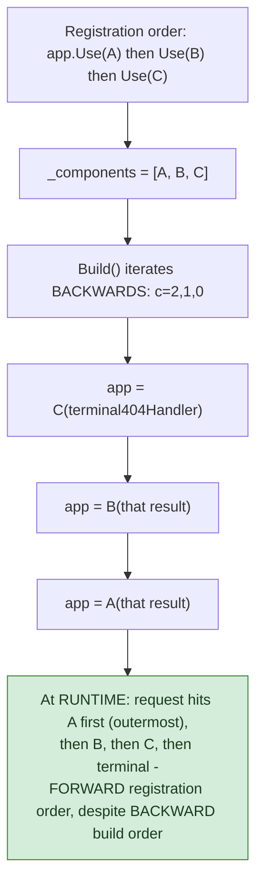

## 1. The Engineering Problem: independently composable handlers need to pass work along without knowing about each other

A request pipeline — authentication, logging, CORS, routing, the endpoint itself — needs each piece to do its own work and decide whether to pass the request along to the next stage, without any stage needing an explicit reference to every stage after it. Hard-coding `AuthMiddleware` to call `LoggingMiddleware` to call `CorsMiddleware` directly would make the pipeline rigid — reordering or removing a stage means editing every other stage's code.

---

## 2. The Technical Solution: each middleware wraps "the rest of the pipeline" as a single delegate, built by iterating backwards

ASP.NET Core represents the whole pipeline as one nested `RequestDelegate` — a chain where each middleware wraps "everything registered after it" (a single `RequestDelegate` parameter, conventionally `next`) into a new `RequestDelegate`. Registration just appends each middleware factory to a list, in order. The chain itself gets built by iterating that list **backwards**.



The mechanism: building backwards means the *last*-registered middleware wraps the terminal handler first, then the second-to-last wraps *that* result, and so on — the *first*-registered middleware ends up as the outermost layer, the one every request hits first at runtime. Forward execution order is an emergent property of nested function wrapping built in reverse, not because the build loop itself walks forward.

Core truth: **"first registered, first executed" isn't how the construction loop works — it's the *result* of how nested closures compose when built from the inside out.** Misunderstanding this is exactly why debugging "why did my middleware run in this order" gets confusing once conditional branching (`app.Map(...)`, `UseWhen`) enters the picture — the registration list isn't the execution order directly, it's the input to a reverse-build process that produces the execution order.

---

## 3. The clean example (concept in isolation)

```csharp
List<Func<RequestDelegate, RequestDelegate>> components = new();
void Use(Func<RequestDelegate, RequestDelegate> middleware) => components.Add(middleware);

RequestDelegate Build()
{
    RequestDelegate app = ctx => { /* terminal: 404 */ return Task.CompletedTask; };
    for (int c = components.Count - 1; c >= 0; c--)
        app = components[c](app);   // each middleware wraps the CURRENT app
    return app;
}

Use(next => async ctx => { /* A: before */ await next(ctx); /* A: after */ });
Use(next => async ctx => { /* B: before */ await next(ctx); /* B: after */ });
// Runtime order: A-before, B-before, [terminal], B-after, A-after
```

---

## 4. Production reality (from `dotnet/aspnetcore`)

```csharp
// src/Http/Http/src/Builder/ApplicationBuilder.cs
public IApplicationBuilder Use(Func<RequestDelegate, RequestDelegate> middleware)
{
    _components.Add(middleware);
    return this;
}

public RequestDelegate Build()
{
    RequestDelegate app = context =>
    {
        // If we reach the end of the pipeline, but we have an endpoint, then
        // something unexpected has happened.
        var endpoint = context.GetEndpoint();
        if (endpoint?.RequestDelegate != null)
        {
            throw new InvalidOperationException(
                $"The request reached the end of the pipeline without executing the endpoint...");
        }

        if (!context.Response.HasStarted)
        {
            context.Response.StatusCode = StatusCodes.Status404NotFound;
        }
        context.Items[RequestUnhandledKey] = true;
        return Task.CompletedTask;
    };

    for (var c = _components.Count - 1; c >= 0; c--)
    {
        app = _components[c](app);   // build BACKWARDS
    }

    return app;
}
```

What this teaches that a hello-world can't:

- **The terminal `RequestDelegate` (the innermost link in the chain) actively checks whether an endpoint was matched but never executed** — a request reaching the very end of the pipeline with a routed endpoint still unhandled means someone forgot to register the endpoint-execution middleware. This is defensive design baked into the chain's terminal link: a genuinely common configuration mistake gets a clear, specific exception instead of a silent, confusing 404.
- **`_components[c](app)` calls each middleware factory with the CURRENT `app` value as its argument** — each factory function receives "everything built so far" and returns a *new* `RequestDelegate` that closes over it. This is the literal mechanism making each middleware's `next` parameter mean "the rest of the pipeline" — it's not a global reference to some pipeline object, it's a specific closure captured at build time, one link at a time.
- **`Use()` itself does nothing but append to a list and return `this`** — all the real chain-construction complexity is deferred entirely to `Build()`, called once, later. Registration and construction are deliberately separate phases: an application can call `Use()` many times across different configuration methods and extension points before `Build()` ever assembles the final chain, which is what makes middleware registration composable across `Startup`/`Program.cs` conditionals and extension methods from different packages.

Known-stale fact: "middleware order matters, whatever you register first runs first" is true but frequently taught as if that's simply how the pipeline iterates at request time — the actual mechanism builds the chain in reverse and produces forward-order execution as an emergent result of nested closures, not a forward loop at request-handling time at all. Once conditional pipeline branching is involved (`Map`, `MapWhen`, `UseWhen`, each building their *own* sub-chain the same reverse way), understanding this construction mechanism — not just memorizing "first registered, first run" — is what actually explains the resulting execution order.

---

## Source

- **Concept:** Chain of Responsibility (middleware pipelines)
- **Domain:** design-patterns
- **Repo:** [dotnet/aspnetcore](https://github.com/dotnet/aspnetcore) → [`src/Http/Http/src/Builder/ApplicationBuilder.cs`](https://github.com/dotnet/aspnetcore/blob/main/src/Http/Http/src/Builder/ApplicationBuilder.cs) — the real, production ASP.NET Core middleware pipeline builder.
