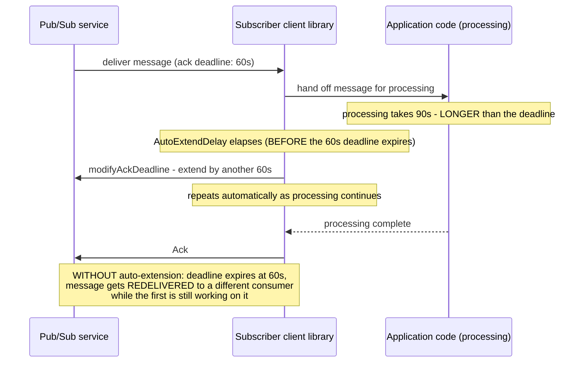

## 1. The Engineering Problem: the broker can't tell "still processing" apart from "consumer died," without help

At-least-once delivery means a message stays unacknowledged until the consumer explicitly acks it — but the consumer needs *some* time to actually process the message, and the broker needs a way to distinguish "this consumer is still legitimately working" from "this consumer died or hung." A fixed, short deadline that triggers redelivery the moment it passes would redeliver a slow-but-healthy consumer's in-progress message to a *different* consumer while the first one is still working on it — producing duplicate processing, or worse, two consumers racing on the same logical unit of work simultaneously.

---

## 2. The Technical Solution: the client library keeps the lease alive automatically, calculated with a safety margin

Pub/Sub's ack deadline is extendable, and Google's own client library extends it *automatically* while a message is still being processed — periodically sending a "modify ack deadline" request to push the redelivery clock forward, well before the current deadline would actually expire.



The extension timing itself is deliberately conservative: `AutoExtendDelay = AckDeadline - AckExtensionWindow`, clamped to a minimum — the extension fires with enough margin before the *current* deadline that a brief network hiccup sending the extension request doesn't accidentally let the deadline lapse anyway.

Core truths: **this is automatic background behavior the caller never implements themselves** — application code just processes a message and acks or nacks it when done; keeping the lease alive in the meantime is the library's job entirely. And **Pub/Sub actually supports two distinct delivery modes, not one** — normal at-least-once delivery and a newer, opt-in exactly-once delivery mode, each tracked with its own separate lease-timing configuration internally, because they genuinely behave differently under the hood.

---

## 3. The clean example (concept in isolation)

```python
def auto_extend_lease(message, ack_deadline_seconds, extension_window_seconds):
    delay = max(ack_deadline_seconds - extension_window_seconds, MIN_EXTENSION_DELAY)
    while not message.is_done_processing():
        sleep(delay)
        if message.is_done_processing():
            break
        modify_ack_deadline(message, ack_deadline_seconds)   # push the clock forward
    ack(message)   # only after processing genuinely finishes
```

---

## 4. Production reality (from `googleapis/google-cloud-dotnet`)

```csharp
// apis/Google.Cloud.PubSub.V1/Google.Cloud.PubSub.V1/SubscriberClientImpl.LeaseTiming.cs
public partial class SubscriberClientImpl
{
    /// Helper class to keep track of lease timing values. Each SingleChannel
    /// has references to TWO instances of this: one for exactly-once delivery,
    /// and one for normal delivery.
    private sealed class LeaseTiming
    {
        internal TimeSpan AutoExtendDelay { get; }
        internal int AckDeadlineSeconds { get; }
        internal TimeSpan ExtendQueueThrottleInterval { get; }

        internal LeaseTiming(TimeSpan ackDeadline, TimeSpan ackExtensionWindow)
        {
            AckDeadlineSeconds = (int) ackDeadline.TotalSeconds;
            ackDeadline = TimeSpan.FromSeconds(AckDeadlineSeconds);

            // The delay is calculated as AckDeadline - AckWindow, but with a
            // hard-coded minimum.
            var delay = ackDeadline - ackExtensionWindow;
            AutoExtendDelay = TimeSpan.FromTicks(Math.Max(delay.Ticks, MinimumLeaseExtensionDelay.Ticks));

            // The throttle is normally half the ack extension window, but is
            // expressed in terms of the computed AutoExtendDelay to take
            // account of any clamping to MinimumLeaseExtensionDelay.
            ExtendQueueThrottleInterval = TimeSpan.FromTicks((ackDeadline - AutoExtendDelay).Ticks / 2);
        }
    }
}
```

What this teaches that a hello-world can't:

- **`AutoExtendDelay` is clamped to a hard-coded minimum, not just the raw `AckDeadline - AckExtensionWindow` subtraction.** Without the clamp, a very short ack deadline combined with a large extension window could produce a negative or near-zero delay — extending "immediately, constantly" instead of on a sane schedule. The minimum exists specifically to keep the auto-extension behavior sane even under aggressive or misconfigured deadline settings.
- **Two separate `LeaseTiming` instances exist per channel — one for exactly-once delivery, one for normal (at-least-once) delivery** — this is real, direct evidence that Pub/Sub's exactly-once mode isn't just "at-least-once with a label," it has genuinely different lease-management characteristics the client library tracks separately rather than sharing one code path for both.
- **`ExtendQueueThrottleInterval` exists as a distinct value from `AutoExtendDelay`** — extending a lease and *throttling how often extension requests get queued* are two related but separate concerns. Under high message volume, sending an individual extend-deadline call the instant every single message's timer fires would itself become a real load problem; this throttle interval exists to batch/pace that traffic rather than spike it.

Known-stale fact: a common assumption is that Cloud Pub/Sub is purely at-least-once with no alternative — Google added an exactly-once delivery mode as a real, opt-in per-subscription setting well after Pub/Sub's original at-least-once-only design, and the client library's own internal structure (separate `LeaseTiming` instances per mode) confirms these are genuinely two different delivery guarantees with different internal handling, not the same underlying mechanism with a naming difference layered on top.

---

## Source

- **Concept:** Pub/Sub (managed messaging, delivery semantics)
- **Domain:** gcp
- **Repo:** [googleapis/google-cloud-dotnet](https://github.com/googleapis/google-cloud-dotnet) → [`apis/Google.Cloud.PubSub.V1/Google.Cloud.PubSub.V1/SubscriberClientImpl.LeaseTiming.cs`](https://github.com/googleapis/google-cloud-dotnet/blob/main/apis/Google.Cloud.PubSub.V1/Google.Cloud.PubSub.V1/SubscriberClientImpl.LeaseTiming.cs) — the official Google Cloud Pub/Sub client library for .NET.
