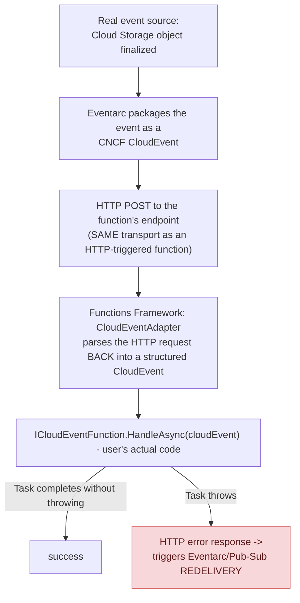

## 1. The Engineering Problem: "event-driven" sounds like it might mean a different invocation transport entirely

"Event-driven serverless" sounds like it might use a fundamentally different invocation mechanism than a plain HTTP-triggered function — as if a Cloud Storage upload or a Pub/Sub message somehow directly "calls" your function code through some non-HTTP channel. Developers writing event-driven and HTTP-triggered functions with genuinely different function signatures might reasonably assume these are two unrelated invocation models under the hood.

---

## 2. The Technical Solution: it's HTTP either way — the difference is who sends the request and how the event is encoded

They're not different transports. Every Cloud Function, event-driven or not, is invoked over plain HTTP. What differs is *who* sends that HTTP request and *how* the event is encoded within it. For event-driven functions, the real event (a Pub/Sub message, a Storage object-finalize notification) gets wrapped by Eventarc into a CNCF **CloudEvents**-formatted HTTP POST — a standardized event envelope, not a Google-specific protocol.



The `CloudEventAdapter` is a real, textbook **Adapter** (the pattern itself, not a metaphor) — it translates an incoming HTTP request into the `CloudEvent` shape the user's function actually expects, so the function author's code never touches raw HTTP parsing at all. And it maintains a fallback path for Google Cloud Functions' older, pre-CloudEvents-standard proprietary event format — real evidence the platform's event encoding evolved over time, with the framework preserving backward compatibility for functions still using the legacy shape.

Core truths: **success and failure are determined purely by whether the handler's `Task` completes without throwing** — an event-driven function that throws causes the underlying HTTP response to signal an error, which is exactly what triggers the event source's own retry-delivery logic (the same at-least-once delivery semantics and idempotency concerns as a Pub/Sub subscriber); and **the HTTP transport is uniform across trigger types** — "event-driven" describes the request's origin and encoding, not a separate invocation mechanism the runtime has to support in parallel.

---

## 3. The clean example (concept in isolation)

```csharp
public class MyFunction : ICloudEventFunction
{
    public Task HandleAsync(CloudEvent cloudEvent, CancellationToken cancellationToken)
    {
        // process the event...
        return Task.CompletedTask;   // completing = success, no redelivery
        // throwing here = failure, triggers the event source's retry logic
    }
}
```

---

## 4. Production reality (from `GoogleCloudPlatform/functions-framework-dotnet`)

```csharp
// src/Google.Cloud.Functions.Framework/CloudEventAdapter.cs
public sealed class CloudEventAdapter : IHttpFunction
{
    public async Task HandleAsync(HttpContext context)
    {
        CloudEvent cloudEvent;
        try
        {
            cloudEvent = await ConvertRequestAsync(context.Request, _formatter, _logger);
        }
        catch (Exception e)
        {
            context.Response.StatusCode = 400;
            _logger.LogError(e.Message);
            return;
        }
        await _function.HandleAsync(cloudEvent, context.RequestAborted);
    }

    /// Converts an HTTP request into a CloudEvent, either using regular CloudEvent
    /// parsing, or GCF event conversion if necessary.
    internal static Task<CloudEvent> ConvertRequestAsync(HttpRequest request, CloudEventFormatter formatter, ILogger logger) =>
        request.IsCloudEvent()
        ? request.ToCloudEventAsync(formatter)
        : GcfConverters.ConvertGcfEventToCloudEvent(request, formatter, logger);   // legacy format fallback
}
```

```csharp
// src/Google.Cloud.Functions.Framework/ICloudEventFunction.cs
public interface ICloudEventFunction
{
    /// Asynchronously handles the specified CloudEvent.
    /// If the task completes, the function is deemed to be successful.
    Task HandleAsync(CloudEvent cloudEvent, CancellationToken cancellationToken);
}
```

What this teaches that a hello-world can't:

- **`ConvertRequestAsync` branches on `request.IsCloudEvent()`, with a genuinely separate code path (`GcfConverters.ConvertGcfEventToCloudEvent`) for requests that AREN'T standard CloudEvents.** This is real, direct evidence that Google Cloud Functions' event format predates the CNCF CloudEvents standard — the framework has to actively convert an older, proprietary shape into the modern structure, not just parse one format uniformly.
- **A malformed or unparseable request results in an explicit HTTP 400, before the user's function code ever runs (`context.Response.StatusCode = 400; return;`).** Event-parsing failures and function-logic failures are handled as genuinely separate error classes — a broken event never reaches `HandleAsync` at all, which matters for debugging: a 400 in the framework's own logs means the *event itself* was malformed, distinct from an exception thrown *inside* the user's actual handler.
- **`ICloudEventFunction.HandleAsync` doesn't return any success/failure value — completion itself IS the signal.** There's no explicit `return Success` or status code the function author constructs; the CLR's own exception mechanism is the entire error-reporting channel between user code and the framework, which is what lets `CloudEventAdapter` map "did an exception propagate" directly onto "should this HTTP response look like a failure" with no extra translation layer.

Known-stale fact: a natural assumption is that event-driven and HTTP-driven serverless functions use fundamentally different invocation transports — they don't. The transport is uniformly HTTP; "event-driven" describes the request's source (Eventarc, a Pub/Sub push subscription) and its encoding (CloudEvents), not a parallel invocation mechanism the platform maintains separately. Related: Google Cloud Functions' event format genuinely predates CNCF CloudEvents standardization, and first-generation GCF functions used a proprietary format still supported today purely through the conversion shim visible directly in this adapter's fallback branch.

---

## Source

- **Concept:** Cloud Functions (event-driven serverless)
- **Domain:** gcp
- **Repo:** [GoogleCloudPlatform/functions-framework-dotnet](https://github.com/GoogleCloudPlatform/functions-framework-dotnet) → [`src/Google.Cloud.Functions.Framework/CloudEventAdapter.cs`](https://github.com/GoogleCloudPlatform/functions-framework-dotnet/blob/main/src/Google.Cloud.Functions.Framework/CloudEventAdapter.cs), [`ICloudEventFunction.cs`](https://github.com/GoogleCloudPlatform/functions-framework-dotnet/blob/main/src/Google.Cloud.Functions.Framework/ICloudEventFunction.cs) — the real, official Cloud Functions runtime framework for .NET.
