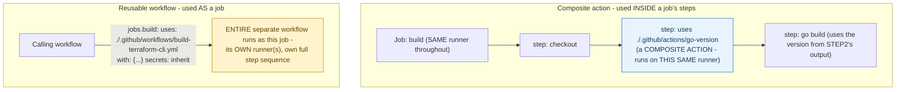



## 1. The Engineering Problem: duplication shows up at two genuinely different granularities

Two different kinds of duplication show up in real CI pipelines. First, the same short sequence of steps — "figure out which Go version to use" — repeated across many workflow files' jobs. Second, the same entire *job* — "build for this OS/arch combination," with its own runner and full step sequence — invoked with different parameters across many matrix legs or calling workflows. Copy-pasting either means every fix has to be applied everywhere it was copied, and copies inevitably drift.

---

## 2. The Technical Solution: composite actions reuse steps, reusable workflows reuse jobs — genuinely different levels

**Composite actions** (`runs: using: composite`) bundle multiple steps into one reusable step, invoked with `uses: ./path/to/action` *inside* a job, alongside that job's other ordinary steps — running on the *same* runner as the calling job, sharing its environment. **Reusable workflows** (`on: workflow_call:`) bundle an entire job (or several) invoked *as a job* via `uses: ./.github/workflows/other.yml` at the job level, not inside a job's steps — the called workflow gets its own runner, receives typed inputs, and can be told to `secrets: inherit` rather than needing secrets re-specified individually.



The distinguishing question isn't stylistic: it's whether the reusable logic needs its *own* runner/environment (reusable workflow) or just needs to execute as part of an *existing* job's step sequence (composite action). Composite actions can't declare their own `runs-on` at all — they inherit whatever runner the calling job is already using; reusable workflows always specify their own.

---

## 3. The clean example (concept in isolation)

```yaml
# .github/actions/setup-env/action.yml - COMPOSITE ACTION
name: 'Setup environment'
outputs:
  version:
    value: ${{ steps.detect.outputs.version }}
runs:
  using: "composite"
  steps:
    - id: detect
      shell: bash
      run: echo "version=$(cat .version-file)" >> "$GITHUB_OUTPUT"
```

```yaml
# .github/workflows/build.yml - REUSABLE WORKFLOW
on:
  workflow_call:
    inputs:
      target: {type: string, required: true}
    secrets:
      TOKEN: {required: true}
jobs:
  build:
    runs-on: ubuntu-latest   # its OWN runner
    steps:
      - run: echo "building ${{ inputs.target }}"
```

```yaml
# calling workflow
jobs:
  same-job-step:
    runs-on: ubuntu-latest
    steps:
      - uses: ./.github/actions/setup-env   # composite action - INSIDE this job's steps
  separate-job:
    uses: ./.github/workflows/build.yml       # reusable workflow - AS its own job
    with: {target: "linux"}
    secrets: inherit
```

---

## 4. Production reality (from `hashicorp/terraform`)

```yaml
# .github/actions/go-version/action.yml - composite action
name: 'Determine Go Toolchain Version'
outputs:
  version:
    value: ${{ steps.go.outputs.version }}
runs:
  using: "composite"
  steps:
    - name: "Determine Go version"
      id: go
      shell: bash
      run: |
        echo "version=$(cat .go-version)" >> "$GITHUB_OUTPUT"
```

```yaml
# .github/workflows/build-terraform-cli.yml - reusable workflow
on:
  workflow_call:
    inputs:
      cgo-enabled: {type: string, required: true}
      goos: {type: string, required: true}
      goarch: {type: string, required: true}
      product-version: {type: string, required: true}
      runson: {type: string, required: true}
jobs:
  build:
    runs-on: ${{ inputs.runson }}   # its OWN runner, chosen per-invocation
```

```yaml
# .github/workflows/build.yml - the calling site
build:
  needs: [get-product-version, get-go-version]
  uses: ./.github/workflows/build-terraform-cli.yml   # invoked AS a job
  with:
    goarch: ${{ matrix.goarch }}
    goos: ${{ matrix.goos }}
    product-version: ${{ needs.get-product-version.outputs.product-version }}
  secrets: inherit   # forward the caller's secrets down automatically
```

What this teaches that a hello-world can't:

- **The `go-version` composite action is referenced from multiple different workflows across the repo, not just once** — this is real, direct proof of the DRY payoff: "how do we determine the Go toolchain version" lives in exactly one file, and every job needing that answer gets it identically, rather than each workflow re-implementing (and potentially drifting from) the same `cat .go-version` logic independently.
- **`build-terraform-cli.yml`'s reusable workflow is invoked once PER MATRIX LEG in the calling workflow** — `build` (the calling job) has its own `strategy.matrix` with 16 OS/arch combinations, and each expansion calls the reusable workflow with different `with:` values (`goos`, `goarch`). The reusable workflow itself has no knowledge of the matrix; it just runs once per set of inputs it's handed, however many times that turns out to be.
- **`secrets: inherit` is a deliberate alternative to explicitly listing every secret the reusable workflow needs.** The reusable workflow's own `on.workflow_call.secrets` block (in the general pattern) can declare exactly which secrets it expects, but `inherit` at the call site says "just give it everything the caller already has access to" — convenient for a workflow with many secret dependencies, at the cost of not documenting at the call site precisely which secrets actually get used.

Known-stale fact: "composite action" and "reusable workflow" are sometimes treated as interchangeable synonyms for "reusable YAML" — they compose at genuinely different levels (step vs. job), have different `uses:` placement rules (inside a job's `steps:` list vs. at the job level itself), and different input/secret-passing mechanics (`inputs.*` scoped to just that composite action, versus `workflow_call.inputs` plus an explicit `secrets:` block or `secrets: inherit`). Reaching for the wrong one for a given reuse need either fails to work at all or forces an awkward, unnecessary restructuring to make it fit.

---

## Source

- **Concept:** Reusable workflows & composite actions
- **Domain:** cicd
- **Repo:** [hashicorp/terraform](https://github.com/hashicorp/terraform) → [`.github/actions/go-version/action.yml`](https://github.com/hashicorp/terraform/blob/main/.github/actions/go-version/action.yml), [`.github/workflows/build-terraform-cli.yml`](https://github.com/hashicorp/terraform/blob/main/.github/workflows/build-terraform-cli.yml) — a large, real project's production release pipeline.

