## 1. The Engineering Problem: "self-hosted" says nothing about whether state carries between jobs

A GitHub-hosted runner gives you a fresh virtual machine for every single job — no leftover files, no injected secret still sitting in an environment variable, no risk that one job's build artifacts (or a compromised workflow's `run:` step) contaminate the next job that happens to land there. The cost is zero control: you can't choose the hardware, pre-install software, or put the runner on your own network. A self-hosted runner flips that tradeoff — full control over the machine — but the *same* runner process, by default, keeps picking up job after job on the *same* persistent filesystem and OS indefinitely. Whether a self-hosted runner behaves like the GitHub-hosted one (fresh, then destroyed) or like a long-lived shared machine isn't automatic from "self-hosted" alone — it's a specific, explicit configuration choice.

---

## 2. The Technical Solution: `--ephemeral` is a literal registration flag, not a deployment style

The GitHub Actions runner binary (`actions/runner`) has two real operating modes, both implemented in the same `Runner.Listener` process. **Persistent** (the default): register once, then loop indefinitely — after finishing a job, go back to listening for the next one, on the same OS state. **Ephemeral** (`--ephemeral` at registration time): listen for exactly one job, execute it, then delete its own registration from GitHub and exit — the process is expected to never run a second job; a fresh one is created for whatever job comes next.

```mermaid
flowchart TD
    subgraph Persistent["Self-hosted, PERSISTENT (default)"]
        P1["listen for job"] --> P2["run job (same filesystem/env as last time)"]
        P2 --> P1
    end
    subgraph Ephemeral["Self-hosted, EPHEMERAL (--ephemeral flag)"]
        E1["listen for ONE job"] --> E2["run job"]
        E2 --> E3["delete own registration, exit process"]
        E3 --> E4["pod/VM destroyed - a NEW one created for the next job"]
    end
    subgraph Hosted["GitHub-hosted (no flag - always this way)"]
        H1["fresh VM provisioned"] --> H2["run job"]
        H2 --> H3["VM destroyed unconditionally"]
    end

    classDef risk fill:#fdecea,stroke:#c0392b,color:#5c1a13;
    classDef safe fill:#e8f4fd,stroke:#1565c0,color:#0d3a5c;
    class P1,P2 risk;
    class E1,E2,E3,E4,H1,H2,H3 safe;
```



Ephemeral self-hosted runners recreate GitHub-hosted runners' state-isolation guarantee while still giving you the "self-hosted" control over hardware and software — at the cost of needing something (a controller, an autoscaling group) to actually create the next fresh runner, since the process that just finished won't do a second job.

---

## 3. The clean example (concept in isolation)

```bash
# persistent (default) - registers once, this SAME machine handles every future job
./config.sh --url https://github.com/org/repo --token $TOKEN
./run.sh   # loops: job 1, job 2, job 3, ... on the same OS state

# ephemeral - registers, runs exactly ONE job, then de-registers itself
./config.sh --url https://github.com/org/repo --token $TOKEN --ephemeral
./run.sh   # runs one job, deletes its own config, exits - process does not loop
```

---

## 4. Production reality (from `actions/runner` and `actions/actions-runner-controller`)

The ephemeral behavior isn't a wrapper script — it's threaded directly through the runner's own C# source:

```csharp
// src/Runner.Listener/Runner.cs
_term.WriteLine("Warning: '--once' is going to be deprecated in the future, " +
    "please consider using '--ephemeral' during runner registration.");

// hosted runner only run one job and would like to know the result for telemetry
return await ExecuteRunnerAsync(
    settings,
    command.RunOnce || settings.Ephemeral || returnJobResultForHosted,
    returnJobResultForHosted);

// ... later, after the one job finishes ...
catch (RunnerRequestJobNotFoundException) when (settings.Ephemeral)
{
    Trace.Info("Acknowledge returned job-not-found for ephemeral runner request. Exiting runner.");
    runOnceJobCompleted = true;
    return Constants.Runner.ReturnCode.Success;
}

if ((settings.Ephemeral && runOnceJobCompleted) || cleanupLocalConfigAfter404)
{
    configManager.DeleteLocalRunnerConfig();   // the runner deletes ITS OWN registration
}
```

```yaml
# actions-runner-controller/charts/gha-runner-scale-set/values.yaml
## maxRunners is the max number of runners the autoscaling runner set will scale up to.
# maxRunners: 5
## minRunners is the min number of idle runners. The target number of runners created will be
## calculated as a sum of minRunners and the number of jobs assigned to the scale set.
# minRunners: 0
```

The controller's own architecture doc explains what creates each fresh runner once one exits:

> A `Runner ScaleSet Listener` pod connects to GitHub's `Actions Service` and establishes a **long poll HTTPS connection**, staying idle until a `Job Available` message arrives. On receiving that message, it patches the `EphemeralRunnerSet` resource's desired-replica count; the `EphemeralRunner Controller` then creates a **new** runner pod, which registers, runs its one job, and — once GitHub confirms it can be deleted — is torn down.

What this teaches that a hello-world can't:

- **`command.RunOnce || settings.Ephemeral || returnJobResultForHosted` is a single boolean feeding one code path** — meaning the deprecated `--once` flag, the modern `--ephemeral` flag, and GitHub's *own* hosted-runner infrastructure all ultimately run through the exact same "do one job then stop" logic in this one open-source binary. GitHub-hosted runners aren't a fundamentally different program — they're this same runner, always started with that behavior forced on.
- **`configManager.DeleteLocalRunnerConfig()` runs conditionally on `settings.Ephemeral && runOnceJobCompleted`** — an ephemeral runner doesn't just stop after one job, it actively erases its own registration first. This is why an orchestrator (ARC, an autoscaling group) *must* provision a genuinely new runner for the next job rather than restarting the old process — there is no valid config left to restart with.
- **The listener uses a long-poll HTTPS connection, not repeated polling requests** — a single connection that GitHub holds open and pushes a `Job Available` message down when work exists, rather than the listener asking "any work yet?" on a fixed interval. This is what the controller's own docs cite as eliminating the `api.github.com` rate-limit problems that the older, deprecated `HorizontalRunnerAutoscaler` design (percentage-busy polling on a `--sync-period` timer) used to hit at scale.

Known-stale fact: Actions Runner Controller's original design — `RunnerDeployment`/`RunnerSet` plus a `HorizontalRunnerAutoscaler` polling GitHub's API on a fixed `--sync-period` for a `PercentageRunnersBusy` metric — is explicitly marked **legacy** in the project's own current docs. The presently recommended mode is the Helm-chart-based `gha-runner-scale-set`, built on the long-poll listener architecture described above, which creates one ephemeral pod per job rather than maintaining a pool of long-running replica pods sized by periodic busy-percentage sampling.

---

## Source

- **Concept:** Self-hosted vs GitHub-hosted runners
- **Domain:** cicd
- **Repo:** [actions/runner](https://github.com/actions/runner) → [`src/Runner.Listener/Runner.cs`](https://github.com/actions/runner/blob/main/src/Runner.Listener/Runner.cs); [actions/actions-runner-controller](https://github.com/actions/actions-runner-controller) → [`charts/gha-runner-scale-set/values.yaml`](https://github.com/actions/actions-runner-controller/blob/master/charts/gha-runner-scale-set/values.yaml), [`docs/gha-runner-scale-set-controller/README.md`](https://github.com/actions/actions-runner-controller/blob/master/docs/gha-runner-scale-set-controller/README.md) — the actual open-source runner binary and its Kubernetes autoscaling controller.
