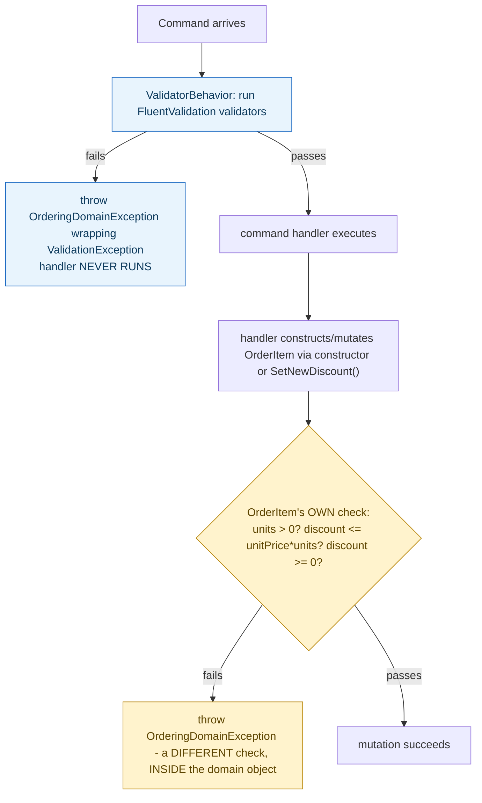

## 1. The Engineering Problem: "is this input well-formed" and "does this preserve the domain's rules" are different questions, checked at different moments

"The `Units` field must be a number" and "this discount can't exceed what the item is actually worth" sound like they belong to the same category of check — both reject bad input. But they're answerable at genuinely different points in a request's lifecycle. Input shape (is a required field present, is a number actually numeric) can be checked the instant a request arrives, before any domain object even exists. A business invariant (does this specific discount, applied to this specific item's price and quantity, still make sense) can only be checked once you have the actual values in front of a method that understands what "makes sense" means for that value — which might be deep inside domain logic, possibly after other values have already been established. Collapsing both into one validation pass either checks business rules too early (before you have enough context) or lets structurally invalid input reach the domain layer at all.

---

## 2. The Technical Solution: one validation pass runs before the domain is ever touched; a second, separate one is built into the domain objects themselves and can't be skipped

A MediatR pipeline behavior — `ValidatorBehavior<TRequest, TResponse>` — runs every registered FluentValidation validator against an incoming command *before* its handler executes at all. If any validator reports a failure, the behavior throws immediately and calls `next()` never — the command handler, and everything downstream of it including the domain model, is never reached. This layer only knows about the *shape* of the request (required fields present, values in valid ranges) — it has no access to, and doesn't need, the actual aggregate the command will eventually operate on.



The second layer lives inside `OrderItem` itself — its constructor and mutator methods (`SetNewDiscount`, `AddUnits`) each check a business-meaningful condition (units must be positive; a discount can't exceed what the item is actually worth) and throw the *same* exception type if violated. Critically, this check runs regardless of whether `ValidatorBehavior` already approved the command — there's no code path that constructs or mutates an `OrderItem` without also running through these checks, because they're inside the only methods capable of doing either.

---

## 3. The clean example (concept in isolation)

```csharp
// Layer 1: input shape, checked BEFORE the domain is touched
public class CreateOrderCommandValidator : AbstractValidator<CreateOrderCommand> {
    public CreateOrderCommandValidator() {
        RuleFor(c => c.OrderItems).NotEmpty();
        RuleFor(c => c.CardNumber).CreditCard();
    }
}

// Layer 2: business invariant, built INTO the domain object, unconditional
public class OrderItem {
    public OrderItem(int productId, decimal unitPrice, decimal discount, int units) {
        if (units <= 0) throw new DomainException("Invalid number of units");
        if (unitPrice * units < discount) throw new DomainException("Discount exceeds item value");
        // ... assign fields
    }
}
```

---

## 4. Production reality (from `dotnet/eShop`)

```csharp
// Ordering.API/Application/Behaviors/ValidatorBehavior.cs - Layer 1
public async Task<TResponse> Handle(TRequest request, RequestHandlerDelegate<TResponse> next, CancellationToken cancellationToken)
{
    var validationTasks = _validators.Select(v => v.ValidateAsync(request, cancellationToken));
    var validationResults = await Task.WhenAll(validationTasks);
    var failures = validationResults.SelectMany(result => result.Errors).Where(error => error != null).ToList();

    if (failures.Any())
    {
        throw new OrderingDomainException(
            $"Command Validation Errors for type {typeof(TRequest).Name}",
            new ValidationException("Validation exception", failures));
    }

    return await next();   // handler, and the domain model, is ONLY reached here
}
```

```csharp
// Ordering.Domain/AggregatesModel/OrderAggregate/OrderItem.cs - Layer 2
public OrderItem(int productId, string productName, decimal unitPrice, decimal discount, string pictureUrl, int units = 1)
{
    if (units <= 0)
    {
        throw new OrderingDomainException("Invalid number of units");
    }
    if ((unitPrice * units) < discount)
    {
        throw new OrderingDomainException("The total of order item is lower than applied discount");
    }
    // ... assign fields
}

public void SetNewDiscount(decimal discount)
{
    if (discount < 0)
    {
        throw new OrderingDomainException("Discount is not valid");
    }
    Discount = discount;
}
```

What this teaches that a hello-world can't:

- **`ValidatorBehavior` calls `next()` only after every validator has already passed — the handler function itself is the continuation, not something invoked unconditionally.** If validation fails, the handler (and therefore any domain object it would have touched) simply never runs at all. This is a hard gate, not a warning: a MediatR pipeline behavior sitting in front of every command handler in the application, applied uniformly without each handler needing its own validation-check boilerplate.
- **`OrderItem`'s constructor checks `(unitPrice * units) < discount` — a rule that could never be expressed as a FluentValidation rule on the incoming command, because it depends on the *relationship* between three separate values, computed together, that only exist once you're constructing the actual domain object.** `ValidatorBehavior` could check "is `unitPrice` a positive number" in isolation, but "is this discount too large *relative to* this price and quantity" is a genuinely domain-shaped question that has to live where the values actually come together.
- **Both layers throw the exact same `OrderingDomainException` type, even though they're checking fundamentally different things** — a deliberate, if debatable, real design choice: it gives every API consumer one consistent exception type to catch, at the cost of that type alone not distinguishing "your request was malformed" from "this specific operation would violate a business rule" — a caller has to inspect the exception's message or inner exception to tell which kind of failure actually happened.

Known-stale fact: validation is sometimes treated as a single concern — one pass, one library, one place it happens, usually described as "input validation" alone. Two structurally different kinds of check exist in most real domain-driven systems: request-shape validation (checked once, before the domain is touched, by something like FluentValidation) and invariant enforcement (checked inside the domain model itself, on every mutation, regardless of whether the request that triggered it already passed the first check). Treating them as one undifferentiated "validation" layer either pushes business-rule checks too early — before the values needed to evaluate them actually exist together — or risks skipping them if a caller reaches the domain object through any path other than the one the single validation pass was wired into.

---

## Source

- **Concept:** Domain model validation & invariant enforcement
- **Domain:** ddd
- **Repo:** [dotnet/eShop](https://github.com/dotnet/eShop) → [`src/Ordering.API/Application/Behaviors/ValidatorBehavior.cs`](https://github.com/dotnet/eShop/blob/main/src/Ordering.API/Application/Behaviors/ValidatorBehavior.cs), [`src/Ordering.Domain/AggregatesModel/OrderAggregate/OrderItem.cs`](https://github.com/dotnet/eShop/blob/main/src/Ordering.Domain/AggregatesModel/OrderAggregate/OrderItem.cs) — a real, actively maintained DDD reference implementation.
