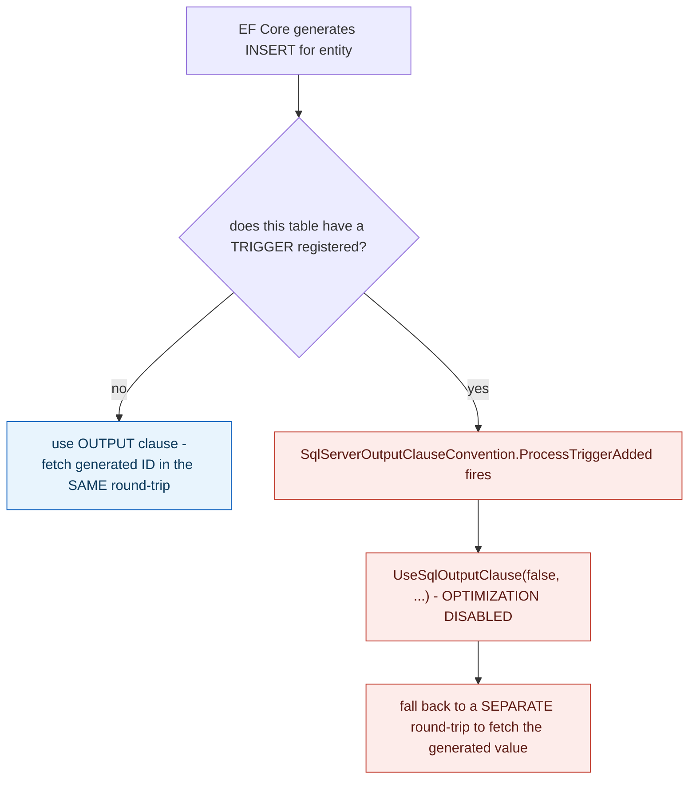

## 1. The Engineering Problem: a trigger's cost isn't limited to what its own logic does

Stored procedures and triggers push logic into the database itself, invisible to whatever application code just thinks it's running a plain `INSERT`. The usual concern raised about this is business-logic discoverability — a rule hidden in a trigger is harder to find than one in application code. But there's a sharper, more concrete cost that has nothing to do with discoverability at all: a trigger's mere *existence* on a table can force the database engine itself to disable optimizations that would otherwise apply — independent of what the trigger's own logic actually does, and often invisible to anyone who doesn't already know the specific database-engine restriction involved.

---

## 2. The Technical Solution: SQL Server disallows a real optimization the moment a trigger exists, and EF Core has to detect and work around it

SQL Server's `OUTPUT` clause lets an `INSERT` or `UPDATE` statement return generated values — an auto-incrementing ID, say — in the *same* round-trip as the write itself, a real performance win EF Core relies on by default when saving new entities. But SQL Server has a hard restriction: the `OUTPUT` clause cannot be combined with a table that has `AFTER` triggers defined on it, because a trigger could itself modify further rows during the same statement, making what `OUTPUT` would report ambiguous. EF Core's `SqlServerOutputClauseConvention` exists specifically to detect this collision: the moment a trigger is registered on an entity, the convention disables the `OUTPUT` clause optimization for that entity's table — automatically, silently, before any query is ever generated.



This happens purely because a trigger is *present* — regardless of whether that trigger's logic is a one-line audit-log insert or a complex cascading business rule. Adding a trigger to a table for a completely unrelated reason (say, maintaining an `updated_at` timestamp) silently costs every future `INSERT` against that table an extra round-trip to fetch its generated ID, and nothing in ordinary application code would surface that connection.

---

## 3. The clean example (concept in isolation)

```csharp
public class OutputClauseConvention : ITriggerAddedConvention
{
    public void ProcessTriggerAdded(IConventionTriggerBuilder triggerBuilder, ...)
    {
        var entityType = triggerBuilder.Metadata.EntityType;
        // a trigger now exists on this table -> the database WON'T allow OUTPUT anymore
        entityType.UseSqlOutputClause(false, tableIdentifier);
    }
}
// every future INSERT against this table now needs a SEPARATE round-trip
// to fetch its generated ID, purely because a trigger exists - not because of what it DOES
```

---

## 4. Production reality (from `dotnet/efcore`)

```csharp
// src/EFCore.SqlServer/Metadata/Conventions/SqlServerOutputClauseConvention.cs
/// <summary>
///     A convention that configures tables with triggers to not use the OUTPUT clause when saving changes.
/// </summary>
public class SqlServerOutputClauseConvention : ITriggerAddedConvention, ITriggerRemovedConvention
{
    public virtual void ProcessTriggerAdded(
        IConventionTriggerBuilder triggerBuilder, IConventionContext<IConventionTriggerBuilder> context)
    {
        var trigger = triggerBuilder.Metadata;
        var entityType = trigger.EntityType;
        var triggerTableIdentifier = StoreObjectIdentifier.Table(trigger.GetTableName(), trigger.GetTableSchema());

        entityType.UseSqlOutputClause(false, triggerTableIdentifier);
    }

    public virtual void ProcessTriggerRemoved(
        IConventionEntityTypeBuilder entityTypeBuilder, IConventionTrigger trigger, ...)
    {
        var entityType = entityTypeBuilder.Metadata;
        var triggerTableIdentifier = StoreObjectIdentifier.Table(trigger.GetTableName(), trigger.GetTableSchema());

        if (!entityType.GetDeclaredTriggers()
                .Any(t => t.GetTableName() == trigger.GetTableName() && t.GetTableSchema() == trigger.GetTableSchema()))
        {
            entityType.UseSqlOutputClause(null, triggerTableIdentifier);   // re-enable if LAST trigger removed
        }
    }
}
```

What this teaches that a hello-world can't:

- **The convention triggers purely on `ITriggerAddedConvention` — a structural, model-level event ("a trigger now exists here") — not on any inspection of what the trigger's SQL body actually contains.** EF Core doesn't (and can't, in general) analyze a trigger's logic to decide whether the `OUTPUT` conflict actually matters for this specific trigger; the restriction applies unconditionally to *any* trigger's presence, so the workaround has to apply unconditionally too.
- **`ProcessTriggerRemoved` explicitly re-enables the `OUTPUT` clause, but only after checking `GetDeclaredTriggers()` finds *no other* trigger still registered on that same table.** A table can have multiple triggers; removing one doesn't restore the optimization unless it was genuinely the last one — the convention tracks this correctly rather than naively re-enabling `OUTPUT` the moment any single trigger is removed.
- **This entire mechanism is invisible from ordinary application code.** A developer adding a trigger via a raw migration script, entirely outside EF Core's own model-building APIs, wouldn't trigger this convention at all — EF Core only knows to disable `OUTPUT` for triggers it's explicitly told about through its own `HasTrigger` configuration. A trigger added out-of-band, directly in the database, can silently reintroduce the exact SQL Server restriction this convention exists to work around, without EF Core ever finding out.

Known-stale fact: triggers are sometimes treated as effectively free — invisible side effects whose only cost is whatever their own logic does when they fire. This real EF Core convention demonstrates a trigger's cost can extend well beyond its own logic: SQL Server's actual restriction on combining `OUTPUT` with triggered tables means adding *any* trigger — regardless of what it does — forces a real, measurable change to how every future write against that table has to be executed. Modern practice increasingly avoids triggers not purely for code-organization reasons, but because their true cost includes engine-level restrictions and interactions that aren't visible from reading the trigger's own definition alone.

---

## Source

- **Concept:** Stored procedures & triggers (and why they're now often avoided)
- **Domain:** databases
- **Repo:** [dotnet/efcore](https://github.com/dotnet/efcore) → [`src/EFCore.SqlServer/Metadata/Conventions/SqlServerOutputClauseConvention.cs`](https://github.com/dotnet/efcore/blob/main/src/EFCore.SqlServer/Metadata/Conventions/SqlServerOutputClauseConvention.cs) — the real, actively maintained Entity Framework Core SQL Server provider source.
